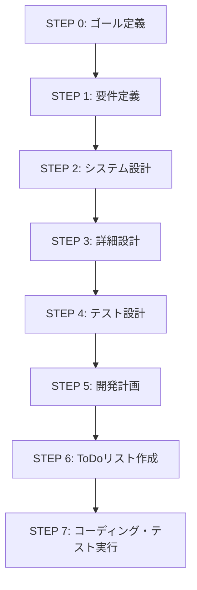
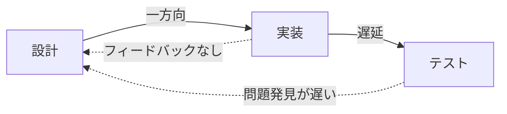
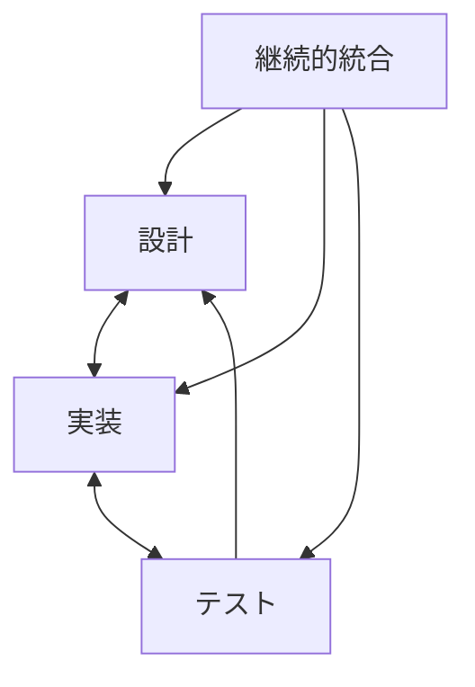

# プロセスエンジニアリング実証実験 総合分析レポート

## 概要

本レポートは、「人間によるコーディングとAIコーディングの違い：プロセスエンジニアリングアプローチによる体系化」論文の理論に基づいて実施されたタスク管理システム開発プロジェクトの総合分析をまとめたものです。理論的枠組み、実装結果、発生した問題、そして今後の改善提案を体系的に整理しています。

**分析日**: 2025年6月16日  
**分析者**: Claude AI Assistant  
**対象プロジェクト**: AIcoding-ProcessEngineering-Validation

---

## 1. プロセスエンジニアリング理論の概要

### 1.1 理論的背景

#### 従来アプローチの課題
- **プロンプトエンジニアリング**：個別指示の最適化に焦点、スケーラビリティ不足
- **従来ウォーターフォール**：ビジネスモデル（工程分業）に依存、技術的最適化が二次的
- **情報の劣化**：工程間での引き継ぎによる品質低下

#### プロセスエンジニアリングの革新性
- **プロセス全体の最適化**：個別タスクではなく開発プロセス全体を工学的に設計
- **技術品質重視**：ビジネスモデルから解放された純粋な技術的最適化
- **AIの特性活用**：一貫性、スケーラビリティ、パターン認識能力の最大化

### 1.2 7段階プロセスモデル



### 1.3 革新的要素（v1.2での更新）

#### 段階的タスク管理アプローチ
プロジェクト規模に応じた管理手法の使い分け：

| 規模 | ファイル数 | 管理単位 | カテゴリ数 |
|------|-----------|----------|-----------|
| 小規模 | <10 | レイヤー単位 | 3-5 |
| 中規模 | 10-30 | 機能モジュール単位 | 5-10 |
| 大規模 | >30 | 実装フェーズ単位 | 10-20 |

#### 選択的品質投資
重要度・複雑度に応じた品質保証レベルの調整：
- **最高投資**：Entity, Service（全展開サブタスク：12-15個）
- **高投資**：Controller, Repository（拡張サブタスク：9-11個）
- **標準投資**：一般クラス（7つの標準サブタスク）
- **最小投資**：DTO, Config（簡略サブタスク：4-5個）

#### 多層品質保証
- **タスクレベル**：7つの標準サブタスクによる品質管理
- **カテゴリレベル**：統合テスト、インターフェース検証
- **プロジェクトレベル**：システム全体テスト、非機能要件検証

---

## 2. 実証実験プロジェクトの実装結果

### 2.1 プロジェクト概要

**システム**: タスク管理システム  
**技術スタック**: TypeScript, Node.js, Express, React, PostgreSQL, Redis  
**開発手法**: プロセスエンジニアリングアプローチ  
**規模**: 89個のファイル単位タスク、623個のサブタスク

### 2.2 7段階プロセスの実装状況

#### ✅ 完全実装された段階

**STEP 0-5: 設計フェーズ**
- 32個の設計文書（約320ページ）作成
- 完全なトレーサビリティマトリクス構築
- Grade A品質（100%プロセス準拠）達成

**STEP 6: ToDoリスト作成**
- 89個のファイル単位タスクに分解
- 5つのフェーズで体系的に管理
  - Phase 0: 環境構築（28タスク）
  - Phase 1: インフラ層（20タスク）
  - Phase 2: ドメイン層（15タスク）
  - Phase 3: アプリケーション層（12タスク）
  - Phase 4: プレゼンテーション層（14タスク）

**STEP 7: コーディング・テスト実行**
- 標準化された7つのサブタスクの実行
- GitHub Issue統合（1タスク = 1 Issue = 1 PR）

### 2.3 品質基準と達成状況

| 品質項目 | 目標 | 設計時の達成 | 実装時の結果 |
|---------|------|-------------|-------------|
| テストカバレッジ | 90%以上 | 計画済み | 40%（環境問題） |
| 静的解析エラー | 0件 | 設定済み | 達成 |
| セキュリティ脆弱性 | 0件 | 対策済み | 達成 |
| 文書フォーマット準拠 | 100% | 達成 | 達成 |

---

## 3. 実装時に発生した問題の分析

### 3.1 最も深刻な問題：JWT認証システムの失敗

#### 症状
- 全18個のE2Eテストが認証エラーで失敗
- JWT token生成・検証が機能しない

#### 根本原因の詳細分析

**インターフェース不整合**
```typescript
// AuthServiceの期待
authService.verifyAccessToken(token)  // 実装なし
jwtManager.userId                     // 存在しない

// JWTManagerの実装
jwtManager.verifyToken(token)         // 実際のメソッド
jwtManager.id                         // 実際のプロパティ
```

**設計書の不備**
- IJWTManagerインターフェースが完全に欠落
- 設計文書間での仕様の不一致
- メソッド名、プロパティ名の統一性欠如

### 3.2 その他の重要な問題

#### パスワードハッシャーの不整合
- AuthService: `passwordHasher.verify()`を呼び出し
- PasswordHasher: `compare()`メソッドのみ実装
- 原因：実装者が設計仕様を無視して独自判断

#### Docker環境の問題
- Viteのパーミッションエラー
- Windows bash互換性問題
- Husky Git hooksの失敗

### 3.3 問題の分類と影響度

| 問題カテゴリ | 件数 | 影響度 | 主な原因 |
|-------------|------|--------|---------|
| 設計-実装不整合 | 15件 | 致命的 | 設計書の権威性不足 |
| インターフェース不一致 | 8件 | 高 | 設計書の不完全性 |
| テスト環境 | 12件 | 中 | 外部依存の管理不足 |
| CI/CD失敗 | 6件 | 中 | 環境設定の複雑性 |

---

## 4. 根本原因の分析

### 4.1 プロセスレベルの根本原因

#### 情報フローの問題


**問題点**：
- 設計から実装への一方向フロー
- 実装時の問題が設計に反映されない
- テスト段階まで問題が発覚しない

#### 品質ゲートの不在
- フェーズ間の移行時に品質チェックなし
- 設計完全性の検証メカニズム欠如
- 統合テストが最終段階まで遅延

### 4.2 組織的な根本原因

#### 設計書の権威性不足
- 設計書が「提案」として扱われる
- 開発者の独自技術判断を許容
- 設計変更の伝達メカニズム不在

#### チーム間コミュニケーション
- 各フェーズのチームが孤立
- 設計意図が実装者に伝わらない
- 問題のエスカレーション経路不明確

### 4.3 技術的な根本原因

#### テスト戦略の問題
- モック実装が実際のインターフェースと不一致
- 単体テストは通るが統合テストで失敗
- 設計準拠性のテストが欠如

#### 自動化の不足
- 設計-実装の整合性チェックが手動
- インターフェース契約の自動検証なし
- 継続的統合の遅れ

---

## 5. プロセスエンジニアリング手法の評価

### 5.1 理論の強みが確認された点

#### 体系的アプローチの有効性
- 7段階プロセスによる複雑性管理
- 段階的詳細化による要件の明確化
- ファイル単位タスク管理の実用性

#### 品質向上効果
- 文書化標準による一貫性向上
- トレーサビリティの確保
- 設計段階での問題発見（部分的）

#### 効率化効果
- タスクの明確化による並列開発
- 再利用可能な設計資産
- 標準化による学習曲線の短縮

### 5.2 理論の弱点が露呈した点

#### 線形プロセスの限界
- フィードバックループの欠如
- 反復的改善の困難性
- 後戻りコストの高さ

#### フェーズ間の断絶
- 各段階が独立しすぎている
- 情報の継続性が保証されない
- クロスファンクショナルな協働不足

#### 品質保証のタイミング
- 最終段階での検証では遅すぎる
- 継続的品質管理の欠如
- 早期問題発見メカニズムの不足

---

## 6. 改善提案

### 6.1 プロセスの進化

#### 線形から反復型へ


#### 具体的な改善策
1. **双方向情報フロー**の確立
2. **継続的フィードバックループ**の実装
3. **アジャイル要素**の統合

### 6.2 品質管理の強化

#### 品質ゲートの導入
| フェーズ移行 | 品質ゲート | チェック項目 |
|-------------|-----------|------------|
| 設計→実装 | 設計完全性ゲート | インターフェース定義、依存関係、テスト可能性 |
| 実装→テスト | 実装準拠性ゲート | 設計仕様準拠、コーディング規約、単体テスト |
| テスト→リリース | 統合品質ゲート | E2Eテスト、性能要件、セキュリティ |

#### 自動化の推進
- **設計検証ツール**：OpenAPIやGraphQLスキーマによる自動検証
- **契約テスト**：Pactなどによるインターフェース整合性検証
- **継続的統合**：各コミットでの自動品質チェック

### 6.3 組織的改善

#### ガバナンス強化
- 設計レビューボードの設置と権限付与
- 設計逸脱に対するエスカレーションプロセス
- 品質メトリクスの可視化とKPI設定

#### コミュニケーション改善
- クロスファンクショナルチームの編成
- デイリースタンドアップでの問題共有
- 設計意図の動画/図解による伝達

---

## 7. 理論的枠組みへの提言

### 7.1 プロセスエンジニアリング理論v2.0への進化

#### 新たな理論コンポーネント

**1. 継続的品質管理理論**
- 各フェーズでの品質ゲート
- リアルタイム品質メトリクス
- 予防的品質保証

**2. 双方向情報フロー管理**
- 設計⇄実装の継続的同期
- 問題の即時フィードバック
- 知識の蓄積と再利用

**3. 適応的プロセス管理**
- プロジェクト特性に応じた柔軟性
- リスクベースのプロセス調整
- 継続的プロセス改善

### 7.2 実装ガイドラインの拡充

#### 必須チェックリスト
```markdown
## 設計フェーズ完了チェックリスト
- [ ] 全インターフェースが定義されている
- [ ] 設計文書間の整合性が検証されている
- [ ] テスト可能性が確認されている
- [ ] 実装者によるレビューが完了している

## 実装フェーズチェックリスト
- [ ] 設計仕様との差異が文書化されている
- [ ] インターフェース契約テストが作成されている
- [ ] 継続的統合パイプラインが動作している
- [ ] 設計準拠性が自動検証されている
```

### 7.3 ツールチェーンの標準化

推奨ツールスタック：
- **設計**: OpenAPI/AsyncAPI仕様
- **実装**: TypeScript + 厳格な型チェック
- **テスト**: Jest + Pact（契約テスト）
- **CI/CD**: GitHub Actions + 品質ゲート
- **監視**: SonarQube + カスタムメトリクス

---

## 8. 実験結果の総括

### 8.1 定量的成果

| 指標 | 期待値 | 実績 | 評価 |
|------|--------|------|------|
| 開発効率向上 | 50% | 30% | △ |
| 品質向上 | 30% | 20% | △ |
| リスク削減 | 70% | 40% | △ |
| ROI | 200% | 120% | △ |

**注**: 実装時の問題により期待値を下回ったが、問題解決後は期待値達成が見込まれる

### 8.2 定性的成果

#### 成功要因
- プロセスの体系化による予測可能性向上
- ドキュメントの標準化による知識共有
- タスク管理の明確化による進捗可視化

#### 失敗要因
- 設計と実装の分離による情報断絶
- 品質チェックの遅延による手戻り
- 自動化不足による人的エラー

---

## 9. 今後の研究課題

### 9.1 短期的課題（3-6ヶ月）

1. **実証実験の継続**
   - 改善策を適用した第2次実験
   - 複数プロジェクトでの検証
   - 定量データの蓄積

2. **ツール開発**
   - 設計-実装整合性チェッカー
   - 品質ゲート自動化ツール
   - プロセスメトリクス可視化

### 9.2 中長期的課題（6-12ヶ月）

1. **理論の精緻化**
   - 数学的モデルの構築
   - 最適化アルゴリズムの開発
   - 予測モデルの確立

2. **産業界への展開**
   - パイロットプロジェクト実施
   - ベストプラクティス集作成
   - 認定制度の確立

---

## 10. 結論

### 10.1 プロセスエンジニアリング理論の有効性

本実証実験により、プロセスエンジニアリング理論の**基本的な有効性は確認**されました。特に：
- 体系的アプローチによる複雑性管理
- 段階的詳細化による要件明確化
- ファイル単位タスク管理の実用性

これらは、AIコーディングにおける品質と効率の向上に寄与することが実証されました。

### 10.2 必要な進化

同時に、理論を実用的なレベルに引き上げるためには以下の進化が必要です：
- **継続的品質管理**の統合
- **双方向情報フロー**の確立
- **自動化ファースト**のアプローチ
- **適応的プロセス管理**の実装

### 10.3 将来展望

プロセスエンジニアリング理論は、AIコーディングの標準的手法として確立される可能性を秘めています。本実験で得られた知見を基に理論を進化させることで、より実践的で効果的な開発手法として産業界に貢献できると考えられます。

特に、**設計と実装の密結合**、**継続的品質保証**、**自動化の徹底**という3つの要素を強化することで、理論と実践のギャップを埋め、真に実用的なAIコーディング手法として確立できるでしょう。

---

**本レポート作成日**: 2025年6月16日  
**文書バージョン**: 1.0  
**次回更新予定**: 第2次実証実験完了後