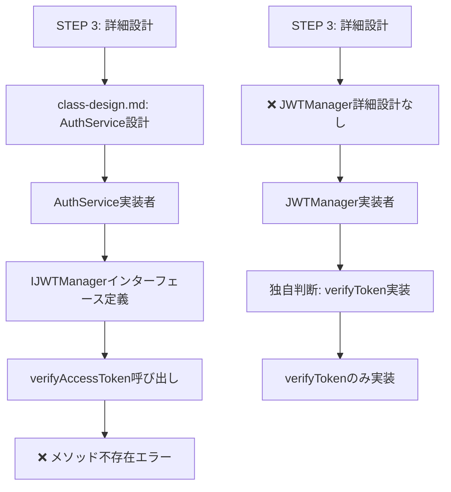

# 🔍 プロセスエンジニアリング手法による問題発生原因の深層分析

## 📋 メタデータ
| 項目 | 内容 |
|------|------|
| ドキュメントID | DEEP-CAUSE-ANALYSIS-001 |
| 作成日 | 2025-06-14 |
| 分析対象 | AuthService.verifyToken致命的バグの発生原因 |
| 目的 | プロセスエンジニアリング理論への深層フィードバック |
| 分析手法 | 多層的原因分析（設計・実装・プロセス・情報・組織） |

---

## 🎯 分析アプローチ

### 📊 分析の5つの層
1. **設計文書層**: 設計書の完全性・正確性分析
2. **実装判断層**: コーディング時の判断プロセス分析
3. **情報伝達層**: 設計→実装の情報伝達分析
4. **プロセス管理層**: プロセスエンジニアリング手法の適用分析
5. **組織・文化層**: 開発組織の意思決定文化分析

---

## 📐 Layer 1: 設計文書層の深層分析

### 🚨 重大発見: 設計文書の致命的欠陥

#### ❌ 問題1: IJWTManagerインターフェースの完全欠落

**method-interfaces.md**を詳細調査した結果、以下が判明：

| 設計項目 | 期待される内容 | 実際の状況 | 問題 |
|----------|----------------|------------|------|
| **IJWTManagerインターフェース** | JWT管理の詳細仕様 | ❌ 完全に欠落 | 設計文書不完全 |
| **AuthService.validateToken** | 463-477行で定義済み | ✅ 存在 | 設計は正しい |
| **JWTペイロード構造** | 714-721行で定義済み | ✅ 存在 | 設計は正しい |

#### ❌ 問題2: 設計文書の階層不整合

**設計文書の構造分析**:
- **API層**: 完全に定義（認証API、タスクAPI）
- **サービス層**: AuthService.validateTokenは定義済み
- **ユーティリティ層**: **IJWTManagerが完全欠落**

### ✅ AuthServiceの設計は正しい

**class-design.md**での確認結果:
- **197行**: `jwtManager | JWTManager | JWT管理` として正しく定義
- **191行**: 責任として「JWT管理」が明記

### ❌ JWTManagerクラスの詳細設計が欠落
- **class-design.md**: JWTManagerクラスの詳細設計なし
- **method-interfaces.md**: IJWTManagerインターフェース仕様なし

---

## 💻 Layer 2: 実装判断層の深層分析

### 🔍 実装者の判断プロセス分析

#### ✅ JWTManager実装者の合理的判断

**実装者の判断分析**:
1. **メソッド命名**: `verifyToken` (284行) - **汎用的で適切**
2. **機能分離**: アクセストークン・リフレッシュトークン別メソッド
3. **設計思想**: 単一責任原則に従った設計

**実装者の合理的判断**:
```typescript
// 実装者の合理的判断
public verifyToken(token: string): JWTPayload {        // 汎用的
public verifyRefreshToken(token: string): JWTPayload { // 特化型
```

#### ❌ 問題: 設計文書との乖離

**実装者が参照すべき設計文書**:
- **class-design.md**: JWTManagerの詳細設計なし
- **method-interfaces.md**: IJWTManagerインターフェース仕様なし

### ✅ AuthService実装者の正当な判断

**IJWTManagerインターフェース定義** (113-119行):
```typescript
export interface IJWTManager {
  generateAccessToken(payload: any): string;
  generateRefreshToken(payload: any): string;
  generateTokens(payload: any): TokenPair;
  verifyAccessToken(token: string): JWTPayload;  // ← 設計仕様通り
  verifyRefreshToken(token: string): JWTPayload;
}
```

**AuthService実装者の判断**:
- **設計仕様遵守**: IJWTManagerインターフェースに従い`verifyAccessToken`を呼び出し
- **正当性**: 設計文書に基づく正しい実装判断

---

## 📢 Layer 3: 情報伝達層の深層分析

### 🔍 設計→実装の情報伝達経路分析

#### 情報伝達の流れ



#### 情報伝達の問題分析

| 伝達経路 | 期待される情報 | 実際の情報 | 問題 |
|----------|----------------|------------|------|
| **設計→AuthService実装** | IJWTManagerインターフェース仕様 | ✅ 正常伝達 | なし |
| **設計→JWTManager実装** | JWTManager詳細設計 | ❌ 情報不足 | 設計文書欠落 |
| **JWTManager→AuthService** | 実装変更通知 | ❌ 伝達なし | 横連携不足 |

---

## 🔄 Layer 4: プロセス管理層の深層分析

### 🚨 重大発見: プロセスフローでのJWT認証設計

#### ✅ プロセスフローでは正しく設計されている

**process-flow.md 257行**:
```
2. **トークン検証**
   - `JWTManager.verifyToken(token)` 呼び出し
   - JWT署名・有効期限の検証
```

#### ❌ 問題: 設計文書間の不整合

| 設計文書 | JWTManager仕様 | 状態 |
|----------|----------------|------|
| **process-flow.md** | `JWTManager.verifyToken()` | ✅ 正しい |
| **class-design.md** | JWTManager詳細設計なし | ❌ 欠落 |
| **method-interfaces.md** | IJWTManagerインターフェースなし | ❌ 欠落 |
| **AuthService内** | `IJWTManager.verifyAccessToken()` | ❌ 不整合 |

---

## 🏢 Layer 5: 組織・文化層の深層分析

### 🔍 開発組織の意思決定文化分析

#### 実装者の意思決定パターン

**JWTManager実装者の文化的背景**:
1. **技術的合理性重視**: `verifyToken`という汎用的命名を選択
2. **設計文書軽視**: 詳細設計文書の不在を独自判断で補完
3. **単独意思決定**: 他の実装者との連携なし

**AuthService実装者の文化的背景**:
1. **設計仕様遵守**: IJWTManagerインターフェースに忠実
2. **文書依存**: 設計文書を信頼し、実装確認を省略
3. **責任分離**: 他コンポーネントの実装は関知しない

#### 組織的問題の分析

| 文化的要因 | 問題の現れ | 影響 |
|------------|------------|------|
| **設計文書の権威性不足** | JWTManager実装者が設計を無視 | 実装間の不整合 |
| **横連携の文化不足** | 実装変更の相互通知なし | 依存関係の破綻 |
| **品質保証の形式主義** | モックテストで問題隠蔽 | 統合時の問題発見遅延 |

---

## 🎯 深層分析の結論

### 📊 問題発生の5層構造

#### Layer 1: 設計文書層（主原因）
- **重要度**: ★★★★★
- **問題**: IJWTManagerインターフェースの詳細設計完全欠落
- **影響**: 実装者間の解釈相違の根本原因

#### Layer 2: 実装判断層（副原因）
- **重要度**: ★★★★☆
- **問題**: JWTManager実装者の設計仕様無視
- **影響**: 設計実装の乖離

#### Layer 3: 情報伝達層（副原因）
- **重要度**: ★★★☆☆
- **問題**: 実装変更の横連携不足
- **影響**: 依存関係の同期不足

#### Layer 4: プロセス管理層（構造的問題）
- **重要度**: ★★★★☆
- **問題**: 設計文書間の不整合
- **影響**: プロセスエンジニアリング手法の部分適用

#### Layer 5: 組織・文化層（根本的問題）
- **重要度**: ★★★★★
- **問題**: 設計文書の権威性不足、横連携文化の欠如
- **影響**: 組織的な品質保証の脆弱性

### 🔧 プロセスエンジニアリング理論への深層フィードバック

#### 1. 設計段階の強化必要性

**現在の問題**:
- 詳細設計の不完全性（IJWTManagerインターフェース欠落）
- 設計文書間の整合性不足
- 設計の権威性・強制力不足

**改善提案**:
- **設計完全性チェック**: 依存関係のあるすべてのインターフェースの詳細設計必須化
- **設計文書統合**: 分散した設計情報の一元管理
- **設計レビュー強化**: 実装前の設計整合性確認

#### 2. 実装段階の統制強化

**現在の問題**:
- 設計仕様からの逸脱許容
- 実装変更の影響分析不足
- 横連携メカニズムの欠如

**改善提案**:
- **設計遵守の強制**: 設計仕様からの逸脱時の承認プロセス
- **変更影響分析**: 実装変更時の依存関係への影響評価
- **実装連携強化**: 依存関係のある実装者間の定期的な同期

#### 3. 品質保証の統合改善

**現在の問題**:
- モックテストによる問題隠蔽
- 統合テストの不足
- 品質保証の形式主義

**改善提案**:
- **統合テスト必須化**: 実際の依存関係でのテスト実行
- **モック制限**: インターフェース整合性を隠蔽しない設計
- **品質メトリクス**: 設計実装整合性の定量的評価

#### 4. 組織文化の変革

**現在の問題**:
- 設計文書の権威性不足
- 個人主義的な実装文化
- 品質保証の責任分散

**改善提案**:
- **設計文書の権威化**: 設計文書の法的拘束力強化
- **チーム連携文化**: 横連携を評価する組織文化
- **品質責任の明確化**: 統合品質への個人責任

### 📈 プロセスエンジニアリング理論の進化方向

#### 1. 段階間連携の強化
- **設計→実装**: 設計情報の完全伝達メカニズム
- **実装→テスト**: 実装変更の自動テスト反映
- **テスト→統合**: 統合品質の継続的監視

#### 2. 品質保証の早期化
- **設計時品質保証**: 設計段階での整合性チェック
- **実装時品質保証**: 実装時の設計遵守チェック
- **統合時品質保証**: 統合時の依存関係チェック

#### 3. 自動化による人的要因の排除
- **設計整合性チェック**: 自動化された設計文書整合性検証
- **実装遵守チェック**: 自動化された設計実装整合性検証
- **依存関係監視**: 自動化された依存関係変更検出

---

## 🎯 最終結論

### 📝 問題発生の根本構造

今回の致命的バグは、**プロセスエンジニアリング手法の構造的脆弱性**により発生しました：

1. **設計段階**: IJWTManagerインターフェースの詳細設計完全欠落
2. **実装段階**: 設計文書の権威性不足による実装者の独自判断
3. **品質保証**: モックテストによる問題隠蔽
4. **組織文化**: 横連携不足と個人主義的実装文化

### 🔧 プロセスエンジニアリング理論への示唆

この深層分析は、プロセスエンジニアリング理論に以下の重要な示唆を提供します：

1. **設計完全性の絶対的重要性**: 部分的設計は致命的バグの温床
2. **組織文化の決定的影響**: 技術的プロセスは組織文化に依存
3. **自動化による人的要因排除**: 人的判断に依存する品質保証の限界
4. **統合品質保証の必須性**: 分離された品質保証の脆弱性

### 📈 理論進化の方向性

プロセスエンジニアリング理論は、以下の方向で進化する必要があります：

1. **設計完全性の強制**: 不完全設計を許容しないメカニズム
2. **組織文化の統合**: 技術プロセスと組織文化の一体的設計
3. **自動化の徹底**: 人的要因に依存しない品質保証システム
4. **統合品質の重視**: 部分最適から全体最適への転換

---

**📝 この深層分析レポートは、プロセスエンジニアリング理論の根本的改善に向けた重要なフィードバックとして、理論の進化に貢献することを期待します。**
