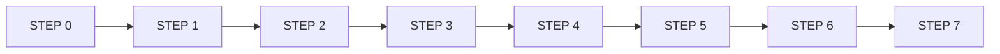
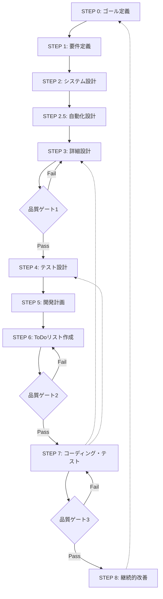

# プロセス定義アップデート分析レポート v1.3

## 概要

本レポートは、実証実験で明らかになった問題点と改善提案を基に、プロセスエンジニアリング定義v1.2をv1.3へアップデートするための詳細な分析と具体的な改善案を提示します。

**作成日**: 2025年6月16日  
**分析者**: Claude AI Assistant  
**対象**: AIコーディング開発プロセス体系化ドキュメント v1.2 → v1.3

---

## 1. 現行プロセス（v1.2）の問題点マッピング

### 1.1 構造的問題の分析

#### 現行の線形フロー


**問題点**：
- 一方向のみの情報フロー
- 後戻りコストが極めて高い
- 問題発見が遅延する構造

#### 品質チェックポイントの不在
- フェーズ間の移行時に品質確認なし
- 最終段階（STEP 7）まで統合テストなし
- 設計準拠性の検証メカニズムなし

### 1.2 プロセス別問題点マッピング

| STEP | 現行プロセス | 発生した問題 | 根本原因 |
|------|------------|-------------|----------|
| STEP 3 | 詳細設計 | IJWTManagerインターフェース欠落 | インターフェース管理の分散 |
| STEP 6 | ToDoリスト作成 | タスクと設計の紐付け弱い | 手動プロセスによる漏れ |
| STEP 7 | コーディング・テスト | 設計と実装の不整合 | 設計準拠チェックなし |

---

## 2. フロー改善案

### 2.1 双方向フィードバックループの導入

#### 改善後のフロー（v1.3）


### 2.2 品質ゲートの定義

#### 品質ゲート1：設計完全性チェック
```yaml
quality_gate_1:
  name: "設計完全性チェック"
  location: "STEP 3 → STEP 4"
  criteria:
    - interface_completeness: 100%
    - design_consistency: 100%
    - testability_score: >= 80%
    - review_approval: required
  automation:
    - OpenAPI spec validation
    - Design document lint
    - Dependency check
```

#### 品質ゲート2：タスク整合性チェック
```yaml
quality_gate_2:
  name: "タスク整合性チェック"
  location: "STEP 6 → STEP 7"
  criteria:
    - task_coverage: 100%
    - design_task_mapping: 100%
    - subtask_definition: complete
    - issue_creation: automated
```

#### 品質ゲート3：統合品質チェック
```yaml
quality_gate_3:
  name: "統合品質チェック"
  location: "STEP 7 → リリース"
  criteria:
    - unit_test_coverage: >= 90%
    - integration_test_pass: 100%
    - e2e_test_pass: 100%
    - performance_baseline: met
    - security_scan: pass
```

### 2.6 プロセス自動化戦略

#### 2.6.1 タスク管理の自動化

##### GitHub Projects中心のアプローチ
```yaml
automated_task_management:
  philosophy:
    - "適切な粒度の維持": "ファイル単位でのIssue作成"
    - "階層的管理": "サブタスクはチェックリストで表現"
    - "自動化と可視性": "GitHub Projectsの機能を最大活用"
  
  implementation:
    issue_generation:
      - source: "設計ドキュメント"
      - trigger: "設計レビュー完了時"
      - format: "TSK-{COMPONENT}-{SEQ}"
      - content: "自動生成されたチェックリスト付き"
    
    progress_tracking:
      - primary: "GitHub Projects カスタムフィールド"
      - calculation: "チェックリスト完了率ベース"
      - update: "リアルタイム自動更新"
      - visualization: "プロジェクトボード"
    
    integration:
      - ci_cd: "GitHub Actions連携"
      - notifications: "進捗変更時の自動通知"
      - reporting: "週次進捗レポート自動生成"
```

##### 自動化の利点
- **Issue管理の簡素化**: 過度な細分化を避け、管理負荷を軽減
- **進捗の透明性**: リアルタイムで全体像を把握
- **チーム協働**: GitHub標準機能による協力体制

---

## 3. プロセス改善案

### 3.1 STEP 3: 詳細設計の改善

#### 現行プロセスの問題
- インターフェース定義が分散
- 設計レビューが形式的
- 実装者の参加不足

#### 改善案：インターフェース中心設計
```typescript
// 新規追加：インターフェース定義書（必須）
interface DesignArtifacts {
  // 3.1 インターフェース定義（新規）
  interfaceDefinitions: {
    file: "interfaces/all-interfaces.ts",
    validation: "tsc --noEmit",
    coverage: "100% of all public APIs"
  },
  
  // 3.2 クラス設計表（既存）
  classDesigns: ClassDesignTable[],
  
  // 3.3 設計レビューチェックリスト（新規）
  reviewChecklist: {
    interfaceCompleteness: boolean,
    implementationFeasibility: boolean,
    testabilityAssessment: boolean,
    performanceConsiderations: boolean
  }
}
```

### 3.2 STEP 6: ToDoリスト作成の自動化

#### 現行プロセスの問題
- 手動でのタスク作成による漏れ
- 設計とタスクの紐付けが弱い
- Issue作成が後回し

#### 改善案：GitHub Projects統合型タスク管理
```yaml
task_management_policy:
  core_principles:
    - file_level_granularity: "GitHub Issueはファイル単位で作成"
    - subtask_management: "サブタスクはIssue内のチェックリストで管理"
    - progress_tracking: "GitHub Projectsのカスタムフィールドで進捗管理"
  
  automation_strategy:
    issue_creation:
      - trigger: "設計ドキュメント完成時"
      - granularity: "1ファイル = 1 Issue"
      - naming: "TSK-{LAYER}-{NUMBER} 形式"
    
    subtask_generation:
      - location: "Issue本文のチェックリスト"
      - automation: "テンプレートからの自動生成"
      - tracking: "チェックボックスの完了状態"
    
    progress_calculation:
      - method: "GitHub Projects カスタムフィールド"
      - formula: "チェックリスト完了率から自動計算"
      - visualization: "プロジェクトダッシュボード"
```

### 3.3 STEP 7: コーディング・テストの強化

#### 改善案：継続的設計準拠性検証
```yaml
coding_process_v1.3:
  subtasks:
    1_design_understanding:
      - review_interface_definitions
      - verify_design_assumptions
      - confirm_with_designer  # 新規：設計者確認
    
    2_coding:
      - implement_interface_first  # 新規：インターフェース優先
      - write_implementation
      - add_design_compliance_comments  # 新規：設計準拠コメント
    
    3_compliance_check:  # 新規サブタスク
      - run_interface_tests
      - verify_method_signatures
      - check_design_constraints
    
    4_test_coding:
      - unit_tests
      - integration_tests  # 必須化
      - contract_tests     # 新規：契約テスト
```

---

## 4. 新規プロセスの追加

### 4.1 STEP 2.5: 自動化設計（新規）

#### 目的
実装前に自動化戦略を明確化し、品質保証の自動化を計画

#### プロセス定義
```yaml
step_2.5_automation_design:
  inputs:
    - system_architecture
    - tech_stack_decisions
  
  activities:
    - identify_automation_points
    - design_ci_cd_pipeline
    - plan_quality_gates
    - setup_monitoring_strategy
  
  outputs:
    - automation_strategy_document
    - ci_cd_configuration
    - quality_metrics_definition
    - monitoring_dashboard_spec
```

### 4.2 STEP 8: 継続的改善（新規）

#### 目的
プロジェクト完了後の振り返りとプロセス改善

#### プロセス定義
```yaml
step_8_continuous_improvement:
  inputs:
    - project_metrics
    - problem_reports
    - team_feedback
  
  activities:
    - retrospective_meeting
    - metrics_analysis
    - process_gap_analysis
    - improvement_planning
  
  outputs:
    - lessons_learned_report
    - process_update_proposal
    - best_practices_documentation
    - next_iteration_plan
```

---

## 5. 既存ドキュメントのアップデート

### 5.1 更新が必要なドキュメント一覧

| ドキュメント | 更新内容 | 優先度 |
|-------------|---------|--------|
| ai-coding-development-process-v1.2-part1.md | フロー図更新、品質ゲート追加 | 高 |
| step3-interfaces-template.md | インターフェース中心設計テンプレート | 高 |
| step6-todo-list-template.md | 自動生成セクション追加 | 高 |
| step7-progress-template.md | リアルタイム監視セクション | 中 |

### 5.2 テンプレート更新例

#### メソッドインターフェースリスト（更新版）
```markdown
## メソッドインターフェースリスト v1.3

### メタデータ
| 項目 | 内容 |
|------|------|
| ドキュメントID | INT-001 |
| 自動検証 | ✅ 有効 |
| 契約テスト | ✅ 必須 |
| 設計準拠性 | 🔄 継続監視 |

### インターフェース定義
\`\`\`typescript
// 自動生成マーカー: DO NOT EDIT MANUALLY
// Source: design/interfaces/IJWTManager.ts
// Last sync: 2025-06-16T10:30:00Z

export interface IJWTManager {
  generateToken(payload: JWTPayload): Promise<string>;
  verifyToken(token: string): Promise<JWTPayload>;
  refreshToken(token: string): Promise<string>;
}

// 契約テスト参照: tests/contracts/jwt-manager.contract.ts
\`\`\`

### 実装追跡
| メソッド | 実装状態 | テスト状態 | 設計準拠 |
|---------|---------|-----------|----------|
| generateToken | ✅ | ✅ | ✅ |
| verifyToken | ✅ | ✅ | ✅ |
| refreshToken | 🔄 | ⏳ | - |
```

---

## 6. 新規ドキュメントの追加

### 6.1 自動化戦略ドキュメント（新規）

```markdown
# 自動化戦略ドキュメント

## 1. 自動化ポイント
### 1.1 設計フェーズ
- OpenAPI仕様の自動生成
- インターフェース整合性チェック
- 設計ドキュメントの相互参照検証

### 1.2 実装フェーズ
- コード生成（ボイラープレート）
- 設計準拠性の継続的検証
- テストコードの自動生成

### 1.3 品質保証フェーズ
- 自動テスト実行
- カバレッジレポート
- パフォーマンス測定

## 2. CI/CDパイプライン設計
\`\`\`yaml
name: Quality Assurance Pipeline
on: [push, pull_request]

jobs:
  design-compliance:
    runs-on: ubuntu-latest
    steps:
      - name: Check interface consistency
        run: npm run check:interfaces
      
      - name: Validate against design docs
        run: npm run validate:design
\`\`\`
```

### 6.2 設計・実装整合性レポート（新規）

```markdown
# 設計・実装整合性レポート

## 実行日時: 2025-06-16 10:00:00

## サマリー
- 総インターフェース数: 45
- 整合性スコア: 89%
- 不整合検出: 5件

## 不整合詳細
### 1. JWTManager
- 設計: verifyAccessToken()
- 実装: verifyToken()
- 影響: AuthService呼び出しエラー
- 修正状況: PR #123で対応中

[自動生成・1時間ごとに更新]
```

---

## 7. 管理手法の変更

### 7.1 タスク管理の進化

#### 現行：ファイル単位タスク管理
```
手動作成 → チェックリスト → Issue作成（後日）
```

#### 改善後：GitHub Projects統合管理
```
設計解析 → ファイル単位Issue生成 → GitHub Projects登録 → カスタムフィールドで進捗追跡
```

#### GitHub Projects活用方針
- **Issue粒度**: ファイル単位を維持（過度な細分化を避ける）
- **サブタスク**: Issue内チェックリストで管理
- **進捗管理**: Projectsカスタムフィールドで自動計算
- **可視化**: リアルタイムダッシュボード活用

### 7.2 品質管理の進化

#### 現行：事後的品質確認
```
実装完了 → テスト → 品質問題発見 → 修正
```

#### 改善後：予防的品質管理
```
設計時点で品質定義 → 継続的監視 → 即時アラート → 予防的対応
```

### 7.3 進捗管理ダッシュボード（新規）

#### GitHub Projects統合ダッシュボード
```yaml
progress_dashboard_design:
  data_source: "GitHub Projects API"
  
  core_metrics:
    - issue_completion_rate: "完了Issue数 / 総Issue数"
    - subtask_progress: "チェックリスト完了率の平均"
    - velocity: "週あたり完了Issue数"
    - blockers: "ブロック状態のIssue数"
  
  custom_fields:
    - progress_percentage: "0-100%（自動計算）"
    - priority: "High/Medium/Low"
    - estimated_hours: "見積もり工数"
    - actual_hours: "実績工数"
    - component: "Backend/Frontend/Infra"
  
  views:
    - kanban_board: "進捗状態別表示"
    - timeline_view: "ガントチャート形式"
    - metrics_dashboard: "KPI一覧"
    - burndown_chart: "進捗グラフ"
  
  automation:
    - progress_calculation: "チェックリスト状態から自動更新"
    - status_sync: "Issue状態とProject状態の同期"
    - alerts: "遅延やブロッカーの自動通知"
```

---

## 8. 実装優先順位と段階的導入計画

### 8.1 Phase 1: 基礎的改善（1-2ヶ月）

#### 優先度：高
1. **品質ゲート1の実装**
   - 設計完全性チェックの自動化
   - インターフェース検証ツール導入

2. **STEP 3の改善**
   - インターフェース定義書テンプレート
   - 設計レビューチェックリスト

3. **基本的な自動化**
   - GitHub Issue自動作成（ファイル単位）
   - GitHub Projects統合設定
   - 基本的なCI/CDパイプライン

### 8.2 Phase 2: 拡張改善（3-4ヶ月）

#### 優先度：中
1. **STEP 2.5の追加**
   - 自動化戦略ドキュメント
   - 品質メトリクス定義

2. **タスク管理自動化**
   - GitHub Projectsカスタムフィールド設定
   - チェックリストからの進捗率自動計算
   - プロジェクトダッシュボード構築

3. **継続的品質監視**
   - リアルタイムアラート
   - 設計準拠性監視

### 8.3 Phase 3: 完全統合（5-6ヶ月）

#### 優先度：低-中
1. **STEP 8の追加**
   - 継続的改善プロセス
   - 知識ベース構築

2. **AI支援機能**
   - 問題予測システム
   - 自動改善提案

3. **最適化**
   - プロセス最適化
   - 完全自動化

---

## 9. 期待される効果と成功指標

### 9.1 定量的指標

| 指標 | 現状 | 目標（6ヶ月後） | 測定方法 |
|------|------|----------------|----------|
| 設計・実装不整合率 | 15件/プロジェクト | 1件以下 | 自動検証ツール |
| 品質問題発見タイミング | 統合テスト時 | コーディング時 | Issue作成時刻 |
| タスク作成時間 | 30分/タスク | 3分/タスク | 自動化率 |
| テストカバレッジ | 40% | 90% | Jest/NYC |
| CI/CD成功率 | 60% | 95% | GitHub Actions |

### 9.2 定性的指標

- **開発者体験の向上**
  - 設計意図の明確な伝達
  - 早期問題発見による手戻り削減
  - 自動化による作業負荷軽減

- **品質文化の確立**
  - 設計準拠の意識向上
  - 継続的改善の習慣化
  - チーム間コミュニケーション改善

---

## 10. リスクと対策

### 10.1 導入リスク

| リスク | 可能性 | 影響 | 対策 |
|--------|--------|------|------|
| 学習曲線による初期生産性低下 | 高 | 中 | 段階的導入、トレーニング提供 |
| 既存プロジェクトとの互換性 | 中 | 高 | 移行ガイドライン作成 |
| ツール導入コスト | 中 | 中 | OSSツール優先使用 |
| 組織の抵抗 | 中 | 高 | 成功事例の早期創出 |

### 10.2 技術的課題

- **自動化の限界**
  - 全ての設計判断を自動化できない
  - → 人間のレビューとの適切なバランス

- **パフォーマンスへの影響**
  - 品質チェックによるビルド時間増加
  - → 並列実行、キャッシュ活用

---

## 11. 実装例：品質ゲート実装

### 11.1 GitHub Actionsでの品質ゲート

```yaml
name: Design Compliance Gate

on:
  pull_request:
    types: [opened, synchronize]

jobs:
  design-compliance:
    runs-on: ubuntu-latest
    steps:
      - uses: actions/checkout@v3
      
      - name: Setup Node.js
        uses: actions/setup-node@v3
        with:
          node-version: '18'
          
      - name: Install dependencies
        run: npm ci
        
      - name: Extract interfaces from design docs
        run: |
          node scripts/extract-design-interfaces.js
          
      - name: Compare with implementation
        run: |
          npx ts-node scripts/compare-design-implementation.ts
          
      - name: Generate compliance report
        run: |
          node scripts/generate-compliance-report.js > compliance-report.md
          
      - name: Comment PR
        uses: actions/github-script@v6
        with:
          script: |
            const report = require('fs').readFileSync('compliance-report.md', 'utf8');
            github.rest.issues.createComment({
              issue_number: context.issue.number,
              owner: context.repo.owner,
              repo: context.repo.repo,
              body: report
            });
            
      - name: Fail if non-compliant
        run: |
          if [ -f "compliance-errors.json" ]; then
            echo "Design compliance errors found!"
            cat compliance-errors.json
            exit 1
          fi
```

### 11.2 設計準拠性チェックスクリプト

```typescript
// scripts/compare-design-implementation.ts
import { glob } from 'glob';
import { parse } from '@typescript-eslint/parser';

interface ComplianceError {
  file: string;
  designInterface: string;
  implementationInterface: string;
  differences: string[];
}

async function checkDesignCompliance(): Promise<ComplianceError[]> {
  const errors: ComplianceError[] = [];
  
  // 1. Load design interfaces
  const designInterfaces = await loadDesignInterfaces();
  
  // 2. Load implementation files
  const implFiles = await glob('src/**/*.ts');
  
  // 3. Compare each implementation with design
  for (const file of implFiles) {
    const ast = parse(await fs.readFile(file, 'utf8'));
    const implemented = extractInterfaces(ast);
    
    for (const [name, design] of designInterfaces) {
      if (implemented.has(name)) {
        const diff = compareInterfaces(design, implemented.get(name));
        if (diff.length > 0) {
          errors.push({
            file,
            designInterface: name,
            implementationInterface: implemented.get(name),
            differences: diff
          });
        }
      }
    }
  }
  
  // 4. Save errors if any
  if (errors.length > 0) {
    await fs.writeFile(
      'compliance-errors.json',
      JSON.stringify(errors, null, 2)
    );
  }
  
  return errors;
}
```

---

## 12. 結論と次のステップ

### 12.1 プロセス定義v1.3の核心

1. **双方向フィードバックループ**による情報流通の改善
2. **品質ゲート**による早期問題発見
3. **自動化**による人的エラーの削減
4. **継続的改善**による進化的アプローチ

### 12.2 実装に向けたアクションアイテム

#### 即時対応（1週間以内）
- [ ] 品質ゲート1の仕様確定
- [ ] インターフェーステンプレート作成
- [ ] 自動化ツールの選定

#### 短期対応（1ヶ月以内）
- [ ] パイロットプロジェクトの選定
- [ ] CI/CDパイプライン構築
- [ ] チームトレーニング計画

#### 中期対応（3ヶ月以内）
- [ ] 全プロジェクトへの展開
- [ ] 効果測定と調整
- [ ] ベストプラクティス文書化

### 12.3 成功への鍵

- **段階的導入**：一度に全てを変えない
- **測定と改善**：データに基づく意思決定
- **チームの巻き込み**：全員が価値を理解
- **継続的な進化**：固定化せず常に改善

本アップデートにより、プロセスエンジニアリング手法はより実践的で、問題を早期に発見・解決できる堅牢なフレームワークへと進化します。