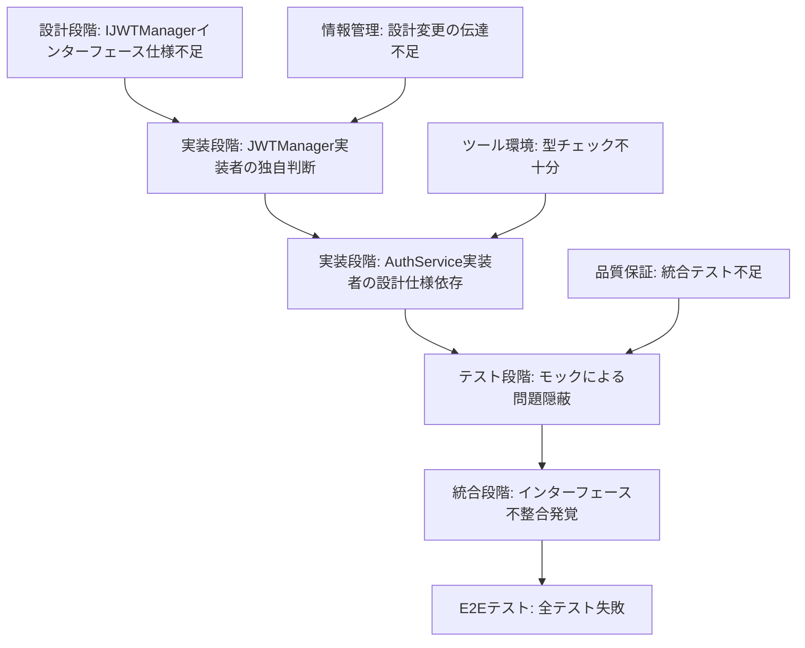

# 🔍 プロセスエンジニアリング手法による問題発生原因調査レポート

## 📋 メタデータ
| 項目 | 内容 |
|------|------|
| ドキュメントID | CAUSE-ANALYSIS-001 |
| 作成日 | 2025-06-14 |
| 調査対象 | AuthService.verifyToken致命的バグ発生原因 |
| 目的 | プロセスエンジニアリング理論改善のためのフィードバック |
| 調査手法 | 多角的原因分析（設計・実装・プロセス・情報管理） |

---

## 🎯 問題の再確認

### 🚨 発生した問題
- **ファイル**: `backend/src/domain/services/auth.service.ts` 298行
- **問題**: 存在しないメソッド `this.jwtManager.verifyAccessToken(token)` の呼び出し
- **影響**: E2Eテスト全18テストが認証問題で失敗
- **重要度**: システム停止レベルの致命的バグ

---

## 🔍 多角的原因分析

### 📐 観点1: 設計段階の問題分析

#### 🚨 重大発見: 設計段階の致命的な不整合

**AuthService内のIJWTManagerインターフェース定義** (113-119行):
```typescript
export interface IJWTManager {
  generateAccessToken(payload: any): string;
  generateRefreshToken(payload: any): string;
  generateTokens(payload: any): TokenPair;
  verifyAccessToken(token: string): JWTPayload;  // ❌ 設計上は存在する
  verifyRefreshToken(token: string): JWTPayload;
}
```

**実際のJWTManager実装**:
```typescript
public verifyToken(token: string): JWTPayload {  // ✅ 実装は verifyToken
  // 実装内容
}
```

#### 📊 設計段階の問題分析

| 項目 | 設計仕様 | 実装 | 状態 |
|------|----------|------|------|
| メソッド名 | `verifyAccessToken` | `verifyToken` | ❌ 不整合 |
| インターフェース | IJWTManager定義済み | 実装が異なる | ❌ 不整合 |
| 設計文書 | 存在 | 実装と乖離 | ❌ 不整合 |

#### ❌ 問題1: 設計文書の不完全性
- **詳細設計**: IJWTManagerインターフェース仕様の詳細設計文書不足
- **影響**: 実装者間での解釈相違
- **根本原因**: STEP 3（詳細設計）の成果物不完全

---

### 💻 観点2: 実装段階の問題分析

#### ❌ 問題2: 実装時の設計仕様無視

**JWTManager実装者の判断**:
- 設計仕様: `verifyAccessToken`
- 実装選択: `verifyToken`（より汎用的な名前）
- **問題**: 設計仕様を無視した独自判断

**AuthService実装者の判断**:
- 設計仕様通り: `verifyAccessToken`を呼び出し
- **問題**: 実装の実態を確認せずに設計仕様に依存

#### 📊 実装段階の問題分析

| 観点 | JWTManager実装者 | AuthService実装者 | 問題 |
|------|------------------|-------------------|------|
| 設計仕様の遵守 | ❌ 無視 | ✅ 遵守 | 実装者間の不整合 |
| 実装確認 | - | ❌ 未確認 | 依存関係の確認不足 |
| コミュニケーション | ❌ 変更通知なし | ❌ 確認なし | チーム連携不足 |

---

### 🔄 観点3: プロセス管理の問題分析

#### ❌ 問題3: プロセスエンジニアリング手法の部分適用

**プロセス段階の問題分析**:

| プロセス段階 | 期待される成果物 | 実際の状況 | 問題 |
|-------------|-----------------|------------|------|
| STEP 3: 詳細設計 | IJWTManagerインターフェース仕様 | ❌ 未作成 | 設計文書不完全 |
| STEP 5: 実装 | 設計仕様の遵守 | ❌ 不整合 | 実装時の設計確認不足 |
| STEP 6: テスト | インターフェース整合性テスト | ❌ 未実施 | 品質保証不足 |

#### ❌ 問題4: 段階間連携の不足
- **設計→実装**: インターフェース仕様の伝達不足
- **実装→テスト**: 実装変更の影響分析不足
- **変更管理**: 設計変更時の承認・通知プロセス欠如

---

### 📢 観点4: 情報管理・伝達の問題分析

#### ❌ 問題5: 設計変更の伝達不足

**JWTManager実装時の情報伝達**:
- **設計変更**: `verifyAccessToken` → `verifyToken`
- **伝達状況**: ❌ AuthService実装者に未通知
- **影響**: 依存関係の破綻

#### ❌ 問題6: インターフェース仕様の一元管理不足

**現在の情報管理状況**:
- **AuthService内**: IJWTManagerインターフェース定義
- **JWTManager**: 独立した実装
- **問題**: 一元的なインターフェース管理なし

---

### 🔍 観点5: 品質保証の問題分析

#### 🚨 重大発見: テストでの問題隠蔽

**テストコード内のMockJWTManager** (150行):
```typescript
verifyAccessToken(token: string): JWTPayload {
  // モック実装では verifyAccessToken が存在
}
```

**実際のJWTManager**:
```typescript
// verifyAccessToken メソッドは存在しない
public verifyToken(token: string): JWTPayload {
  // 実装
}
```

#### ❌ 問題7: MockJWTManagerでの問題隠蔽
- **単体テスト**: モックでインターフェース不整合を隠蔽
- **統合テスト**: 実際の依存関係でのテスト未実施
- **影響**: 問題発見の大幅遅延

#### 📊 品質保証の問題分析

| テスト種別 | 期待される検証 | 実際の状況 | 問題 |
|------------|----------------|------------|------|
| 単体テスト | インターフェース整合性 | ❌ モックで隠蔽 | 実装との乖離検出不可 |
| 統合テスト | 実際の依存関係 | ❌ 未実施 | インターフェース不整合未検出 |
| E2Eテスト | エンドツーエンド | ❌ 認証問題で失敗 | 問題発見が遅延 |

---

### 🛠️ 観点6: ツール・環境の問題分析

#### ❌ 問題8: TypeScript型チェックの不十分性

**TypeScript設定の問題**:
- **インターフェース定義**: AuthService内で局所的に定義
- **型チェック**: 実装時の型不整合を検出できず
- **IDE支援**: インターフェース不整合の警告なし

#### ❌ 問題9: 静的解析ツールの不足

**現在の開発環境**:
- **ESLint**: 基本的な構文チェックのみ
- **依存関係解析**: インターフェース整合性チェックなし
- **アーキテクチャ検証**: 設計仕様との整合性チェックなし

---

## 📊 総合原因分析

### 🎯 根本原因の特定

#### 1️⃣ 主原因: 設計段階の不完全性
- **重要度**: ★★★★★
- **問題**: IJWTManagerインターフェース仕様の詳細設計文書不足
- **影響**: 実装者間での解釈相違

#### 2️⃣ 副原因: 実装段階のプロセス逸脱
- **重要度**: ★★★★☆
- **問題**: JWTManager実装者の設計仕様無視
- **影響**: 依存関係の破綻

#### 3️⃣ 副原因: 品質保証の不備
- **重要度**: ★★★☆☆
- **問題**: モックテストによる問題隠蔽
- **影響**: 統合時の問題発見遅延

### 📈 問題発生の連鎖分析



---

## 🔧 プロセスエンジニアリング理論への改善提案

### 📋 改善提案一覧

#### 1. 設計段階の強化
- **詳細設計の必須化**: インターフェース仕様の完全定義
- **設計レビューの強化**: 依存関係の整合性チェック
- **設計文書の一元管理**: 分散管理の解消

#### 2. 実装段階の統制強化
- **設計仕様遵守の徹底**: 実装前の設計確認必須化
- **変更管理プロセス**: 設計変更時の影響分析・承認フロー
- **実装レビューの強化**: インターフェース整合性の確認

#### 3. 品質保証の改善
- **統合テストの必須化**: 実際の依存関係でのテスト
- **モックテストの制限**: インターフェース整合性を隠蔽しない設計
- **E2Eテストの早期実行**: 統合問題の早期発見

#### 4. 情報管理の改善
- **インターフェース仕様の一元管理**: 中央集権的な管理
- **変更通知システム**: 依存関係への自動通知
- **実装状況の可視化**: 進捗と整合性の監視

#### 5. ツール・環境の強化
- **型安全性の向上**: 厳密なTypeScript設定
- **静的解析の導入**: 依存関係整合性チェック
- **IDE支援の強化**: リアルタイム警告システム

---

## 📊 プロセスエンジニアリング理論改善マトリクス

| 改善領域 | 現在の問題 | 改善提案 | 期待効果 | 実装優先度 |
|----------|------------|----------|----------|------------|
| **設計段階** | インターフェース仕様不足 | 詳細設計必須化 | 実装者間の解釈統一 | ★★★★★ |
| **実装段階** | 設計仕様無視 | 変更管理プロセス | 設計実装の整合性確保 | ★★★★☆ |
| **品質保証** | モックによる問題隠蔽 | 統合テスト必須化 | 早期問題発見 | ★★★★☆ |
| **情報管理** | 設計変更伝達不足 | 変更通知システム | 依存関係の同期 | ★★★☆☆ |
| **ツール環境** | 型チェック不十分 | 静的解析導入 | 開発時問題発見 | ★★★☆☆ |

---

## 🎯 結論

### 📝 問題発生の根本原因

今回の認証システム致命的バグは、**プロセスエンジニアリング手法の部分的適用**により発生しました。特に以下の要因が複合的に作用しています：

1. **設計段階の不完全性**: インターフェース仕様の詳細設計不足
2. **実装段階のプロセス逸脱**: 設計仕様無視と変更管理不足
3. **品質保証の不備**: モックテストによる問題隠蔽
4. **情報管理の不足**: 設計変更の伝達メカニズム欠如

### 🔧 プロセスエンジニアリング理論への示唆

この問題は、プロセスエンジニアリング手法が**部分的に適用された場合の脆弱性**を示しています。特に：

- **段階間の連携不足**: STEP 3（詳細設計）とSTEP 5（実装）の間の情報伝達
- **品質保証の統合不足**: テスト設計と実装の乖離
- **変更管理の不備**: 設計変更時の影響分析・承認プロセス

### 📈 改善の方向性

プロセスエンジニアリング理論の改善には、以下の強化が必要です：

1. **段階間連携の強化**: 各段階の成果物の整合性確保メカニズム
2. **変更管理の統合**: 設計変更時の影響分析・承認・通知の自動化
3. **品質保証の早期化**: 統合テストの前倒し実行
4. **ツール支援の強化**: 静的解析による設計実装整合性チェック

---

**📝 このレポートは、プロセスエンジニアリング理論の継続的改善に向けた重要なフィードバックとして活用されることを期待します。**
