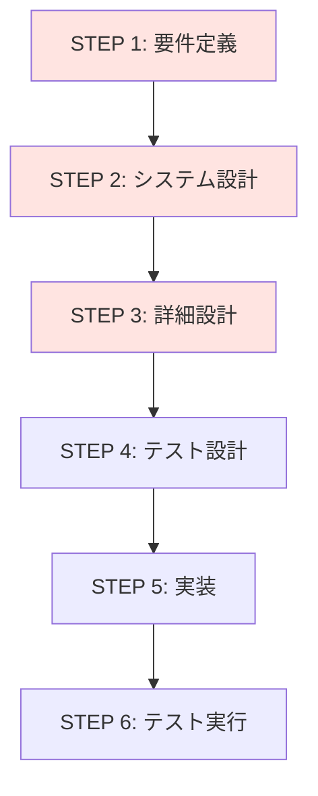
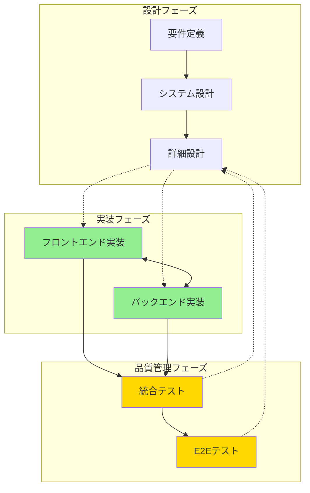
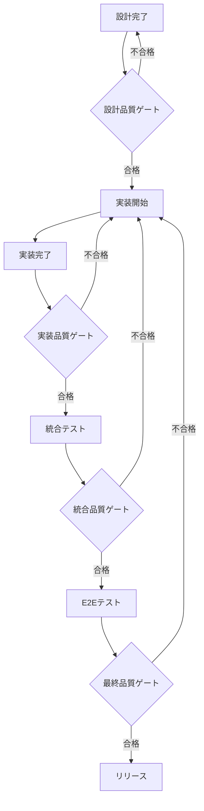
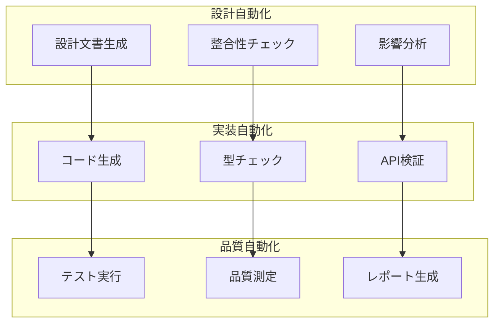
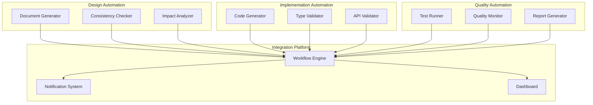

# プロセスエンジニアリング理論改善材料レポート

## 📊 メタデータ
| 項目 | 内容 |
|------|------|
| ドキュメントID | PE-IMPROVEMENT-001 |
| 作成日 | 2025-06-15 |
| 対象事例 | E2E認証エラー根本原因分析 |
| 改善対象 | プロセスエンジニアリング理論・手法 |
| 優先度 | 最高（理論的基盤の改善） |

---

## 🎯 エグゼクティブサマリー

### 事例概要
タスク管理システム開発において、E2E認証テストが100%失敗する問題が発生。技術的調査の結果、**フロントエンドとバックエンドのレスポンス形式不一致**が直接原因だったが、深層分析により**開発プロセスの構造的欠陥**が根本原因であることが判明。

### 理論への示唆
現行のプロセスエンジニアリング理論は**技術的品質管理に重点**を置いているが、**プロセス間の情報連携と整合性確保**の観点が不十分。本事例は理論の改善点を明確に示している。

### 改善提案
1. **プロセス間連携の強化**: 設計・実装・テスト間の情報共有メカニズム
2. **自動化による品質保証**: 人的ミスを防ぐ自動化ツールの体系化
3. **継続的整合性確認**: 各段階での整合性チェックポイント設定

---

## 🔍 事例の詳細分析

### 問題の表面的症状
```
E2Eテスト実行結果: 0/10 成功 (100%失敗)
エラー内容: 401 Unauthorized (認証エラー)
影響範囲: 全機能テスト不可
```

### 技術的根本原因
```typescript
// 設計文書の定義
interface LoginResponse {
  data: {
    user: User;
    tokens: {           // ← tokensオブジェクト
      accessToken: string;
      refreshToken: string;
    };
  };
}

// フロントエンド実装（設計準拠）
const response = await apiClient.post<{
  user: User;
  tokens: TokenPair;  // ← 設計文書に従って実装
}>('/auth/login', credentials);

// バックエンド実装（設計無視）
const response: LoginResponse = {
  user: { ... },
  accessToken: authResult.accessToken,    // ← 直接フィールド
  refreshToken: authResult.refreshToken,  // ← 設計文書を無視
  expiresIn: authResult.expiresIn
};
```

### プロセス的根本原因
1. **設計文書の実装拘束力不足**: 設計文書が実装に反映されない
2. **フロントエンド・バックエンド間の連携不足**: 仕様確認プロセス不在
3. **統合テストの実行タイミング遅延**: 最終段階まで統合確認なし
4. **品質ゲートの不在**: 各段階での品質確認基準なし

---

## 📊 現行プロセスエンジニアリング理論の問題点

### 1. プロセス間連携の軽視

#### 現行理論の問題


#### 改善が必要な点
- **情報の一方向流れ**: 前段階から後段階への情報伝達のみ
- **フィードバックループ不足**: 実装段階での設計への影響反映なし
- **横断的連携不足**: 並行作業間の情報共有メカニズム不在

### 2. 品質管理の段階的不備

#### 現行理論の品質管理
```
STEP 4: テスト設計 → STEP 6: テスト実行
（実装完了後にテスト実行）
```

#### 問題点
- **統合テストの遅延**: 実装完了まで統合確認なし
- **品質ゲート不在**: 各段階での品質基準なし
- **継続的品質管理不足**: 段階的品質向上メカニズム不在

### 3. 自動化の体系的不足

#### 現行理論の自動化観点
- **コーディング自動化**: AIによるコード生成に重点
- **テスト自動化**: テストケース実行の自動化
- **文書自動化**: 文書生成の自動化

#### 不足している観点
- **整合性チェック自動化**: 設計・実装間の整合性確認
- **プロセス連携自動化**: プロセス間の情報共有自動化
- **品質監視自動化**: 継続的品質監視システム

---

## 🎯 プロセスエンジニアリング理論の改善提案

### 1. プロセス間連携強化理論

#### 改善された理論モデル


#### 新理論の特徴
1. **双方向情報流**: 設計↔実装間の双方向情報共有
2. **横断的連携**: フロントエンド↔バックエンド間の直接連携
3. **継続的フィードバック**: テスト結果の設計への反映

### 2. 継続的品質管理理論

#### 品質ゲートの体系化


#### 品質基準の定義
| 段階 | 品質基準 | 測定方法 | 合格基準 |
|------|----------|----------|----------|
| **設計** | 整合性、完全性 | レビュー、チェックリスト | 100%準拠 |
| **実装** | 型整合性、API準拠 | 自動チェック、単体テスト | エラー0件 |
| **統合** | インターフェース整合性 | 統合テスト | 成功率100% |
| **E2E** | 機能完全性 | E2Eテスト | 成功率95%以上 |

### 3. 自動化統合理論

#### 自動化の体系化


#### 自動化ツールの統合
1. **設計段階**: 設計文書の自動整合性チェック
2. **実装段階**: 型定義の自動共有・検証
3. **品質段階**: 継続的テスト実行・品質監視

---

## 📋 理論改善の具体的提案

### 1. プロセス定義の拡張

#### 現行の7段階プロセス
```
STEP 0: ゴール定義
STEP 1: 要件定義
STEP 2: システム設計
STEP 3: 詳細設計
STEP 4: テスト設計
STEP 5: 実装
STEP 6: テスト実行
```

#### 改善された統合プロセス
```
STEP 0: ゴール定義
STEP 1: 要件定義 + 品質基準設定
STEP 2: システム設計 + 統合戦略定義
STEP 3: 詳細設計 + インターフェース仕様統一
STEP 4: テスト設計 + 継続的品質計画
STEP 5: 実装 + 継続的統合
STEP 6: 品質保証 + 継続的改善
STEP 7: リリース + 運用監視
```

### 2. 品質管理の強化

#### 新しい品質管理フレームワーク
```typescript
interface QualityGate {
  stage: ProcessStage;
  criteria: QualityCriteria[];
  automationTools: AutomationTool[];
  feedbackMechanism: FeedbackLoop;
}

interface QualityCriteria {
  metric: string;
  threshold: number;
  measurement: MeasurementMethod;
  automation: boolean;
}
```

#### 品質メトリクスの体系化
1. **設計品質**: 整合性、完全性、トレーサビリティ
2. **実装品質**: 型安全性、API準拠、テストカバレッジ
3. **統合品質**: インターフェース整合性、パフォーマンス
4. **運用品質**: 可用性、保守性、拡張性

### 3. 自動化ツールチェーンの定義

#### 統合自動化プラットフォーム


---

## 🎯 実装ガイドライン

### 1. 段階的導入計画

#### Phase 1: 基盤整備（1-2週間）
1. **品質ゲート定義**: 各段階の品質基準設定
2. **自動化ツール導入**: 基本的な自動化ツール設定
3. **プロセス文書更新**: 改善されたプロセス定義文書作成

#### Phase 2: プロセス統合（2-3週間）
1. **プロセス間連携**: 双方向情報共有メカニズム構築
2. **継続的品質管理**: 品質監視システム導入
3. **フィードバックループ**: 改善サイクル確立

#### Phase 3: 最適化・改善（継続的）
1. **メトリクス分析**: 品質データの継続的分析
2. **プロセス改善**: データに基づくプロセス最適化
3. **ツール進化**: 自動化ツールの継続的改善

### 2. 成功指標の定義

#### 定量的指標
- **品質向上**: バグ発生率50%削減
- **効率向上**: 開発サイクル時間30%短縮
- **自動化率**: 品質チェック自動化率90%以上

#### 定性的指標
- **開発者満足度**: プロセスの使いやすさ向上
- **品質安定性**: 予期しない問題の発生率削減
- **保守性**: システムの長期保守性向上

---

## 📊 理論改善の期待効果

### 1. 直接的効果
- **品質向上**: 設計・実装・テストの整合性確保
- **効率向上**: 自動化による作業効率化
- **リスク削減**: 早期問題発見による修正コスト削減

### 2. 間接的効果
- **開発文化改善**: 品質第一の開発文化醸成
- **技術力向上**: 体系的な品質管理による技術力向上
- **競争力強化**: 高品質システムによる競争力強化

### 3. 長期的効果
- **持続可能性**: 継続的改善による長期的品質維持
- **拡張性**: 新技術・手法への適応能力向上
- **イノベーション**: 品質基盤上でのイノベーション創出

---

## 🎯 結論と提言

### 本事例から得られた重要な知見
1. **技術的問題の背後にプロセス問題**: 表面的な技術問題の根本原因はプロセスの構造的欠陥
2. **プロセス間連携の重要性**: 設計・実装・テスト間の情報共有と整合性確保が必須
3. **継続的品質管理の必要性**: 各段階での品質チェックと改善サイクルが重要

### プロセスエンジニアリング理論への提言
1. **理論の拡張**: プロセス間連携と継続的品質管理の理論的基盤強化
2. **実践的ガイドライン**: 具体的な実装方法と成功指標の提供
3. **自動化の体系化**: 包括的な自動化ツールチェーンの定義

### 今後の研究課題
1. **大規模システムへの適用**: 複雑なシステムでの理論検証
2. **異なる技術スタックでの検証**: 多様な技術環境での適用性確認
3. **組織文化との統合**: 開発組織の文化変革との統合方法

**本事例は、プロセスエンジニアリング理論の実践的価値と改善の必要性を明確に示している。理論の継続的発展により、より効果的で持続可能な開発プロセスの実現が期待される。**

---

**作成日**: 2025-06-15  
**文書ID**: PE-IMPROVEMENT-001  
**関連文書**: E2E認証エラー根本原因分析レポート、プロセスエンジニアリング理論文書  
**次回更新予定**: 理論改善実装後の効果検証時
