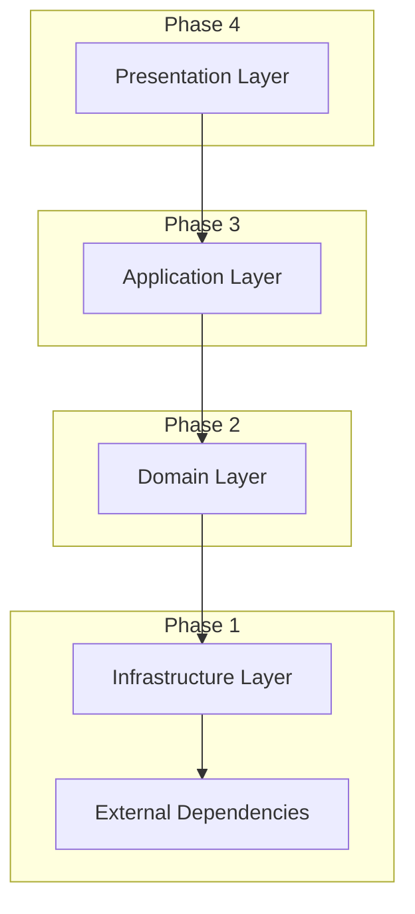

# 実装計画書

## メタデータ
| 項目 | 内容 |
|------|------|
| ドキュメントID | IMPL-PLAN-001 |
| 関連文書 | CLASS-001, FLOW-001, TEST-CASES-001 |
| 作成日 | 2025-01-28 |
| 最終更新日 | 2025-01-28 |
| 作成者 | Augment Agent |

## 1. 実装戦略概要

### 1.1 基本方針
- **TDD（テスト駆動開発）**: テスト作成 → 実装 → リファクタリング
- **依存関係順実装**: 下位レイヤーから上位レイヤーへ
- **ファイル単位管理**: 各ファイルに7つの標準サブタスクを適用
- **継続的品質管理**: 各段階で品質ゲートを設定

### 1.2 実装フェーズ（環境セットアップ含む）
| フェーズ | 対象 | 期間 | 成果物 |
|----------|-----|------|--------|
| **Phase 0** | 環境セットアップ | 1日 | Docker環境、DB設定、CI/CD、クロスプラットフォームスクリプト |
| **Phase 1** | Infrastructure Layer | 2日 | DB接続、基本ユーティリティ、マイグレーション |
| **Phase 2** | Domain Layer | 3日 | エンティティ、サービス |
| **Phase 3** | Application Layer | 2日 | コントローラー、ミドルウェア |
| **Phase 4** | Presentation Layer | 3日 | React コンポーネント |
| **Phase 5** | Integration & Deployment | 2日 | 結合テスト、E2E、デプロイ |

## 2. 依存関係マトリクス

### 2.1 レイヤー間依存関係


### 2.2 ファイル実装順序

#### Phase 0: 環境セットアップ
| 順序 | ファイル名 | 依存関係 | 優先度 |
|------|------------|----------|--------|
| 0 | .gitignore | なし | 最高 |
| 1 | docker-compose.dev.yml | なし | 最高 |
| 2 | docker-compose.test.yml | なし | 最高 |
| 3 | docker-compose.yml | なし | 最高 |
| 4 | backend/Dockerfile | なし | 最高 |
| 5 | frontend/Dockerfile | なし | 最高 |
| 6 | backend/prisma/schema.prisma | なし | 最高 |
| 7 | scripts/cross-platform/setup-dev.js | なし | 最高 |
| 8 | scripts/linux/setup-dev.sh | なし | 高 |
| 9 | scripts/windows/setup-dev.bat | なし | 高 |
| 10 | .github/workflows/ci.yml | なし | 高 |
| 11 | backend/.env.example | なし | 高 |
| 12 | frontend/.env.example | なし | 高 |
| 13 | Makefile | なし | 中 |

#### Phase 1: Infrastructure Layer
| 順序 | ファイル名 | 依存関係 | 優先度 |
|------|------------|----------|--------|
| 1 | database-connection.ts | なし | 最高 |
| 2 | logger.ts | なし | 高 |
| 3 | error-handler.ts | logger | 高 |
| 4 | password-hasher.ts | なし | 最高 |
| 5 | jwt-manager.ts | なし | 最高 |
| 6 | cache-service.ts | database-connection | 中 |
| 7 | user-repository.ts | database-connection, error-handler | 最高 |
| 8 | task-repository.ts | database-connection, error-handler | 最高 |

#### Phase 2: Domain Layer
| 順序 | ファイル名 | 依存関係 | 優先度 |
|------|------------|----------|--------|
| 9 | user.entity.ts | password-hasher | 最高 |
| 10 | task.entity.ts | なし | 最高 |
| 11 | category.entity.ts | なし | 高 |
| 12 | auth-service.ts | user-repository, jwt-manager | 最高 |
| 13 | task-service.ts | task-repository, user-repository | 最高 |
| 14 | user-service.ts | user-repository | 高 |

#### Phase 3: Application Layer
| 順序 | ファイル名 | 依存関係 | 優先度 |
|------|------------|----------|--------|
| 15 | zod-validator.ts | なし | 高 |
| 16 | response-builder.ts | なし | 高 |
| 17 | auth-middleware.ts | auth-service | 最高 |
| 18 | auth-controller.ts | auth-service, zod-validator | 最高 |
| 19 | task-controller.ts | task-service, zod-validator | 最高 |
| 20 | user-controller.ts | user-service, zod-validator | 中 |

#### Phase 4: Presentation Layer
| 順序 | ファイル名 | 依存関係 | 優先度 |
|------|------------|----------|--------|
| 21 | api-client.ts | なし | 最高 |
| 22 | auth-context.tsx | api-client | 最高 |
| 23 | auth-form.tsx | auth-context | 最高 |
| 24 | task-list.tsx | api-client | 最高 |
| 25 | task-form.tsx | api-client | 最高 |
| 26 | dashboard.tsx | api-client | 中 |
| 27 | app.tsx | 全コンポーネント | 高 |

## 3. 7つの標準サブタスク

各ファイルに対して以下のサブタスクを実行：

### 3.1 サブタスク定義
| ID | サブタスク名 | 内容 | 成果物 |
|----|-------------|------|--------|
| **TSK-001** | テストケース作成 | 単体テストの実装 | *.test.ts |
| **TSK-002** | インターフェース定義 | 型定義・インターフェース | *.types.ts |
| **TSK-003** | 基本実装 | 主要機能の実装 | *.ts/*.tsx |
| **TSK-004** | エラーハンドリング | 例外処理の実装 | エラー処理コード |
| **TSK-005** | バリデーション | 入力値検証の実装 | バリデーション処理 |
| **TSK-006** | テスト実行・修正 | テスト実行と不具合修正 | 修正コード |
| **TSK-007** | ドキュメント更新 | コメント・README更新 | ドキュメント |

### 3.2 品質ゲート
各サブタスク完了時の品質基準：

| サブタスク | 品質基準 | 確認方法 |
|------------|----------|----------|
| TSK-001 | テストカバレッジ95%以上 | Jest coverage |
| TSK-002 | TypeScript型エラー0件 | tsc --noEmit |
| TSK-003 | ESLint警告0件 | eslint --fix |
| TSK-004 | エラーハンドリング100% | 手動確認 |
| TSK-005 | バリデーション100% | テスト確認 |
| TSK-006 | 全テスト成功 | npm test |
| TSK-007 | ドキュメント完成度100% | レビュー |

## 4. 実装環境セットアップ

### 4.1 完全なプロジェクト構造
```
task-management-system/
├── backend/
│   ├── src/
│   │   ├── controllers/
│   │   ├── services/
│   │   ├── repositories/
│   │   ├── entities/
│   │   ├── middleware/
│   │   ├── utils/
│   │   └── types/
│   ├── tests/
│   │   ├── unit/
│   │   ├── integration/
│   │   └── fixtures/
│   ├── prisma/
│   │   ├── migrations/
│   │   ├── seeds/
│   │   └── schema.prisma
│   ├── scripts/
│   │   ├── linux/
│   │   │   ├── setup.sh
│   │   │   ├── test.sh
│   │   │   └── deploy.sh
│   │   ├── windows/
│   │   │   ├── setup.bat
│   │   │   ├── test.bat
│   │   │   └── deploy.bat
│   │   └── cross-platform/
│   │       ├── setup.js
│   │       ├── test.js
│   │       └── deploy.js
│   ├── config/
│   │   ├── database.ts
│   │   ├── redis.ts
│   │   └── environment.ts
│   ├── Dockerfile
│   ├── .dockerignore
│   ├── docker-compose.yml
│   ├── package.json
│   ├── tsconfig.json
│   ├── jest.config.js
│   └── .env.example
├── frontend/
│   ├── src/
│   │   ├── components/
│   │   ├── contexts/
│   │   ├── hooks/
│   │   ├── services/
│   │   ├── utils/
│   │   └── types/
│   ├── tests/
│   │   ├── unit/
│   │   ├── integration/
│   │   └── e2e/
│   ├── public/
│   ├── scripts/
│   │   ├── linux/
│   │   │   ├── build.sh
│   │   │   └── test.sh
│   │   ├── windows/
│   │   │   ├── build.bat
│   │   │   └── test.bat
│   │   └── cross-platform/
│   │       ├── build.js
│   │       └── test.js
│   ├── Dockerfile
│   ├── .dockerignore
│   ├── package.json
│   ├── tsconfig.json
│   ├── vite.config.ts
│   ├── jest.config.js
│   └── .env.example
├── infrastructure/
│   ├── docker/
│   │   ├── postgres/
│   │   │   ├── Dockerfile
│   │   │   └── init.sql
│   │   ├── redis/
│   │   │   └── redis.conf
│   │   └── nginx/
│   │       ├── Dockerfile
│   │       └── nginx.conf
│   ├── k8s/
│   │   ├── deployment.yaml
│   │   ├── service.yaml
│   │   └── ingress.yaml
│   └── terraform/
│       ├── main.tf
│       └── variables.tf
├── scripts/
│   ├── linux/
│   │   ├── setup-dev.sh
│   │   ├── run-tests.sh
│   │   ├── deploy.sh
│   │   └── backup.sh
│   ├── windows/
│   │   ├── setup-dev.bat
│   │   ├── run-tests.bat
│   │   ├── deploy.bat
│   │   └── backup.bat
│   └── cross-platform/
│       ├── setup-dev.js
│       ├── run-tests.js
│       ├── deploy.js
│       └── backup.js
├── .github/
│   └── workflows/
│       ├── ci.yml
│       ├── cd.yml
│       └── test.yml
├── docker-compose.yml
├── docker-compose.dev.yml
├── docker-compose.test.yml
├── Makefile
├── .gitignore
├── README.md
└── docs/
```

### 4.2 技術スタック確認（Docker環境含む）
| 分類 | 技術 | バージョン | 用途 |
|------|------|-----------|------|
| **Backend** | Node.js | 18.x | ランタイム |
| **Backend** | TypeScript | 5.x | 型安全性 |
| **Backend** | Express | 4.x | Webフレームワーク |
| **Backend** | Prisma | 5.x | ORM・マイグレーション |
| **Backend** | PostgreSQL | 15.x | データベース |
| **Backend** | Redis | 7.x | キャッシュ |
| **Backend** | Jest | 29.x | テストフレームワーク |
| **Frontend** | React | 18.x | UIフレームワーク |
| **Frontend** | TypeScript | 5.x | 型安全性 |
| **Frontend** | Vite | 5.x | ビルドツール |
| **Frontend** | React Testing Library | 14.x | テストライブラリ |
| **Frontend** | Playwright | 1.x | E2Eテスト |
| **Infrastructure** | Docker | 24.x | コンテナ化 |
| **Infrastructure** | Docker Compose | 2.x | 複数コンテナ管理 |
| **Infrastructure** | Nginx | 1.25.x | リバースプロキシ |
| **DevOps** | GitHub Actions | - | CI/CD |
| **DevOps** | ESLint | 8.x | 静的解析 |
| **DevOps** | Prettier | 3.x | コードフォーマット |

### 4.3 環境別構成
| 環境 | 構成 | 用途 | Docker Compose |
|------|------|------|----------------|
| **Development** | ローカル開発 | 開発・デバッグ | docker-compose.dev.yml |
| **Test** | テスト専用 | 自動テスト実行 | docker-compose.test.yml |
| **Staging** | 本番相当 | 結合・E2Eテスト | docker-compose.yml |
| **Production** | 本番環境 | 実運用 | Kubernetes/Docker Swarm |

### 4.4 クロスプラットフォーム対応
| プラットフォーム | スクリプト形式 | 実行方法 | 特徴 |
|------------------|----------------|----------|------|
| **Linux/macOS** | .sh | `bash scripts/linux/setup-dev.sh` | Unix系標準 |
| **Windows** | .bat | `scripts\windows\setup-dev.bat` | Windows標準 |
| **Cross-Platform** | .js | `node scripts/cross-platform/setup-dev.js` | Node.js実行 |

#### 4.4.1 スクリプト選択指針
- **開発環境**: 各OS標準のスクリプトを使用
- **CI/CD環境**: Cross-Platform（Node.js）スクリプトを使用
- **本番環境**: Linux/Docker環境のスクリプトを使用

#### 4.4.2 package.jsonスクリプト統一
```json
{
  "scripts": {
    "setup": "node scripts/cross-platform/setup-dev.js",
    "test": "node scripts/cross-platform/run-tests.js",
    "build": "node scripts/cross-platform/build.js",
    "deploy": "node scripts/cross-platform/deploy.js"
  }
}
```

## 5. 実装タスク管理

### 5.1 タスクID体系
- **ファイル単位**: TSK-{Phase}-{順序}-{ファイル名}-{サブタスク}
- **例**: TSK-1-001-database-connection-001 (Phase1, 1番目, database-connection.ts, テストケース作成)

### 5.2 進捗管理
| Phase | 総タスク数 | 完了タスク数 | 進捗率 | ステータス |
|-------|------------|-------------|--------|------------|
| Phase 0 | 28タスク (14ファイル × 2サブタスク) | 0 | 0% | 未開始 |
| Phase 1 | 56タスク (8ファイル × 7サブタスク) | 0 | 0% | 未開始 |
| Phase 2 | 42タスク (6ファイル × 7サブタスク) | 0 | 0% | 未開始 |
| Phase 3 | 42タスク (6ファイル × 7サブタスク) | 0 | 0% | 未開始 |
| Phase 4 | 49タスク (7ファイル × 7サブタスク) | 0 | 0% | 未開始 |
| Phase 5 | 21タスク (結合・E2E) | 0 | 0% | 未開始 |
| **合計** | **238タスク** | **0** | **0%** | **準備完了** |

#### Phase 0 サブタスク（環境セットアップ用）
| ID | サブタスク名 | 内容 | 成果物 |
|----|-------------|------|--------|
| **TSK-001** | 設定ファイル作成 | Docker、CI/CD設定 | 設定ファイル |
| **TSK-002** | 動作確認 | 環境起動・接続確認 | 動作確認レポート |

## 6. リスク管理

### 6.1 技術リスク
| リスク | 影響度 | 発生確率 | 対策 |
|--------|--------|----------|------|
| 依存関係の循環 | 高 | 中 | 設計レビュー強化 |
| パフォーマンス問題 | 中 | 中 | 早期パフォーマンステスト |
| セキュリティ脆弱性 | 高 | 低 | セキュリティテスト強化 |

### 6.2 スケジュールリスク
| リスク | 影響度 | 発生確率 | 対策 |
|--------|--------|----------|------|
| 実装遅延 | 中 | 中 | バッファ時間確保 |
| テスト不具合多発 | 高 | 中 | TDD徹底 |
| 要件変更 | 中 | 低 | 変更管理プロセス |

## 7. 完了確認
- [x] 実装順序が依存関係に基づいて決定されている
- [x] 7つの標準サブタスクが定義されている
- [x] 品質ゲートが各段階で設定されている
- [x] タスク管理体系が確立されている
- [x] 技術スタックが確認されている
- [x] プロジェクト構造が設計されている
- [x] リスク管理が計画されている
- [x] TDD実装準備が完了している
