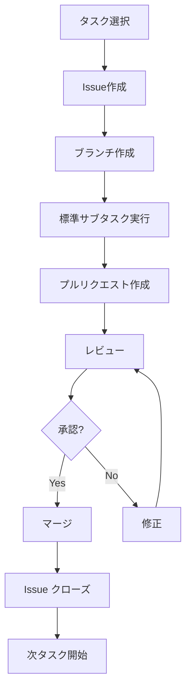

# タスク管理表

## メタデータ
| 項目 | 内容 |
|------|------|
| ドキュメントID | MGMT-001 |
| 関連文書 | TASK-001, CLASS-001, IMPL-PLAN-001 |
| 作成日 | 2025-01-28 |
| 最終更新日 | 2025-01-28 |
| 作成者 | Augment Agent |

## 概要

本文書は、STEP 6「ToDoリスト作成」の第二段階として、ファイル単位タスクリストに基づくタスク管理方針と実行プロセスを定義します。

**重要**: プロセスエンジニアリング手法における Issue駆動開発と7つの標準サブタスクによる品質保証を実現します。

## 参照文書
- `docs/project-specific/step6-todo-list/file-unit-task-list.md` - ファイル単位タスクリスト
- `docs/templates/step6-task-management-template.md` - タスク管理テンプレート
- `docs/templates/step6-todo-creation-guide.md` - 作成手順書

## 1. タスク管理方針

### 1.1 管理原則
- **Issue駆動開発**: 1タスク = 1Issue = 1プルリクエスト
- **標準サブタスク**: 各タスクで7つの標準サブタスクを必須実行
- **品質ゲート**: 自動チェックによる品質保証
- **トレーサビリティ**: 要件から実装まで完全な追跡可能性

### 1.2 ワークフロー



## 2. Issue管理

### 2.1 Issue作成テンプレート
```markdown
## 概要
[TSK-XXX-XXX-FileName] ファイル名の実装

## 実装対象
- **ファイル**: src/[layer]/[filename].ts
- **クラス/関数**: [実装対象の詳細]
- **レイヤー**: [Environment/Infrastructure/Domain/Application/Presentation]

## 実装仕様
### メソッド一覧
- method1(): [機能説明]
- method2(): [機能説明]

### 依存関係
- **参照するクラス**: [クラス一覧]
- **提供するインターフェース**: [IF一覧]
- **依存タスク**: [前提となるタスクID]

## 参照文書
- **詳細設計書**: docs/project-specific/step3-detailed-design/class-design.md
- **インターフェース仕様書**: docs/project-specific/step3-detailed-design/method-interfaces.md
- **テストケース定義書**: docs/project-specific/step4-test-design/test-cases.md

## テスト要件
- [ ] 正常系テスト（主要パス）
- [ ] 異常系テスト（エラーハンドリング）
- [ ] 境界値テスト（限界値）
- [ ] 統合テスト（依存関係）

## 完了条件
- [ ] 実装完了（全メソッド実装）
- [ ] 単体テスト90%以上カバレッジ
- [ ] コーディング規約準拠（ESLint エラー0件）
- [ ] 静的解析クリア（TypeScript エラー0件）
- [ ] レビュー完了（承認済み）
- [ ] ドキュメント更新完了

## 関連情報
- **設計書**: [リンク]
- **依存タスク**: [タスクID]
- **見積時間**: Xh
```

### 2.2 ラベル管理
| ラベル | 用途 | 色 | 説明 |
|--------|------|-----|------|
| **feature** | 新機能実装 | 緑 | 新規機能の実装タスク |
| **enhancement** | 改善 | 青 | 既存機能の改善 |
| **bug** | バグ修正 | 赤 | 不具合修正 |
| **documentation** | ドキュメント | 黄 | ドキュメント更新 |
| **layer:environment** | 環境設定 | 黒 | 環境セットアップ |
| **layer:infrastructure** | インフラ層 | グレー | データアクセス・外部連携 |
| **layer:domain** | ドメイン層 | 茶 | ビジネスロジック |
| **layer:application** | アプリケーション層 | オレンジ | API・制御層 |
| **layer:presentation** | プレゼンテーション層 | 紫 | フロントエンド関連 |
| **priority:high** | 高優先度 | 赤 | 最優先で実装 |
| **priority:medium** | 中優先度 | 黄 | 通常優先度 |
| **priority:low** | 低優先度 | 緑 | 後回し可能 |
| **phase:0** | Phase 0 | 黒 | 環境セットアップ |
| **phase:1** | Phase 1 | 青 | Infrastructure Layer |
| **phase:2** | Phase 2 | 緑 | Domain Layer |
| **phase:3** | Phase 3 | オレンジ | Application Layer |
| **phase:4** | Phase 4 | 紫 | Presentation Layer |

## 3. 7つの標準サブタスク管理

### 3.1 標準サブタスク定義
各タスクで以下のサブタスクを必須実行：

#### 1. 仕様確認・設計理解
- [ ] 詳細設計書の理解
- [ ] 依存関係の確認
- [ ] インターフェース仕様の確認
- [ ] 例外処理方針の理解
- [ ] テストケースの確認

#### 2. コーディング
- [ ] クラス・メソッドの実装
- [ ] コーディング規約の遵守
- [ ] エラーハンドリングの実装
- [ ] ログ出力の実装

#### 3. テストコーディング
- [ ] 正常系テストの実装
- [ ] 異常系テストの実装
- [ ] 境界値テストの実装
- [ ] モック・スタブの実装

#### 4. 単体テスト実行
- [ ] 全テストケースの実行
- [ ] カバレッジ90%以上の確認
- [ ] パフォーマンス要件の確認
- [ ] メモリリークの確認

#### 5. リポジトリコミット
- [ ] コミットメッセージ規約の遵守
- [ ] 関連Issueの紐付け
- [ ] 適切な粒度でのコミット
- [ ] コンフリクトの解決

#### 6. ToDoチェック
- [ ] 全サブタスクの完了確認
- [ ] 品質基準の達成確認
- [ ] ドキュメントの更新
- [ ] 次タスクへの影響確認

#### 7. Issueクローズ
- [ ] 完了条件の全項目達成
- [ ] レビュー結果の反映
- [ ] 関連ドキュメントの更新
- [ ] ステークホルダーへの報告

### 3.2 品質チェックポイント
| チェック項目 | 基準 | 自動化 | ツール |
|-------------|------|--------|-------|
| **コーディング規約** | ESLint エラー0件 | ○ | ESLint |
| **型チェック** | TypeScript エラー0件 | ○ | tsc --noEmit |
| **テストカバレッジ** | 90%以上 | ○ | Jest Coverage |
| **セキュリティ** | 脆弱性0件 | ○ | npm audit |
| **ビルド** | 成功 | ○ | CI/CD |
| **パフォーマンス** | 応答時間基準内 | ○ | Lighthouse |

## 4. 進捗管理

### 4.1 ステータス定義
| ステータス | 説明 | 次のアクション | GitHub Label |
|------------|------|----------------|--------------|
| **未着手** | タスク未開始 | 着手準備 | status:todo |
| **進行中** | 実装作業中 | 継続実装 | status:in-progress |
| **レビュー待ち** | 実装完了、レビュー依頼中 | レビュー実施 | status:review |
| **修正中** | レビュー指摘事項対応中 | 修正完了 | status:fixing |
| **完了** | 全作業完了 | 次タスク着手 | status:done |

### 4.2 進捗トラッキング
| Phase | 総タスク数 | 完了タスク数 | 進捗率 | ステータス |
|-------|------------|-------------|--------|------------|
| **Phase 0** | 28 | 0 | 0% | 未開始 |
| **Phase 1** | 20 | 0 | 0% | 未開始 |
| **Phase 2** | 15 | 0 | 0% | 未開始 |
| **Phase 3** | 12 | 0 | 0% | 未開始 |
| **Phase 4** | 14 | 0 | 0% | 未開始 |
| **合計** | **89** | **0** | **0%** | **準備完了** |

### 4.3 分割ファイル管理
| Phase | 詳細ファイル | 管理対象 | 作成状況 |
|-------|-------------|----------|----------|
| Phase 0 | `phase0-environment-tasks.md` | 環境セットアップ（28タスク） | ✅ 作成済み |
| Phase 1 | `phase1-infrastructure-tasks.md` | Infrastructure Layer（20タスク） | ✅ 作成済み |
| Phase 2 | `phase2-domain-tasks.md` | Domain Layer（15タスク） | ✅ 作成済み |
| Phase 3 | `phase3-application-tasks.md` | Application Layer（12タスク） | ✅ 作成済み |
| Phase 4 | `phase4-presentation-tasks.md` | Presentation Layer（14タスク） | ✅ 作成済み |

### 4.4 全Phase完了確認
- ✅ **Phase 0**: 環境セットアップ（28タスク）- 完了
- ✅ **Phase 1**: Infrastructure Layer（20タスク）- 完了
- ✅ **Phase 2**: Domain Layer（15タスク）- 完了
- ✅ **Phase 3**: Application Layer（12タスク）- 完了
- ✅ **Phase 4**: Presentation Layer（14タスク）- 完了
- ✅ **総計**: **89タスク** - **全て定義完了**

## 5. コミットメッセージ規約

### 5.1 基本形式
```
{type}(#{issue_number}): {概要}

{詳細説明}

Closes #{issue_number}
```

### 5.2 タイプ定義
| タイプ | 用途 | 例 |
|--------|------|-----|
| **feat** | 新機能実装 | feat(#001): Userエンティティの実装 |
| **fix** | バグ修正 | fix(#002): パスワードハッシュ化の修正 |
| **test** | テストコード追加 | test(#003): AuthServiceのテスト追加 |
| **refactor** | リファクタリング | refactor(#004): TaskServiceの最適化 |
| **docs** | ドキュメント更新 | docs(#005): README更新 |
| **style** | コードフォーマット | style(#006): ESLint修正 |
| **chore** | 環境設定・ビルド | chore(#007): Docker設定追加 |

## 6. リスク管理

### 6.1 技術リスク
| リスクID | 内容 | 影響度 | 発生確率 | 対策 |
|----------|------|--------|----------|------|
| R-001 | 依存関係の循環 | 高 | 中 | 設計レビュー強化 |
| R-002 | パフォーマンス問題 | 中 | 中 | 早期パフォーマンステスト |
| R-003 | セキュリティ脆弱性 | 高 | 低 | セキュリティテスト強化 |

### 6.2 スケジュールリスク
| リスクID | 内容 | 影響度 | 発生確率 | 対策 |
|----------|------|--------|----------|------|
| R-004 | 実装遅延 | 中 | 中 | バッファ時間確保 |
| R-005 | テスト不具合多発 | 高 | 中 | TDD徹底 |
| R-006 | 要件変更 | 中 | 低 | 変更管理プロセス |

## 7. 完了確認
- [x] Issue管理プロセスが定義されている
- [x] 標準サブタスクが明確に定義されている
- [x] 品質チェックポイントが設定されている
- [x] ワークフローが明確である
- [x] 進捗管理方法が確立されている（89タスク対応）
- [x] リスク管理が計画されている
- [x] ラベル管理が体系化されている
- [x] コミットメッセージ規約が定義されている
- [x] トレーサビリティが確保されている
- [x] ファイル分割によるタスク管理が計画されている
- [x] Phase 0詳細タスクリストが作成済み
- [x] 大規模プロジェクト対応の管理体制が確立されている
