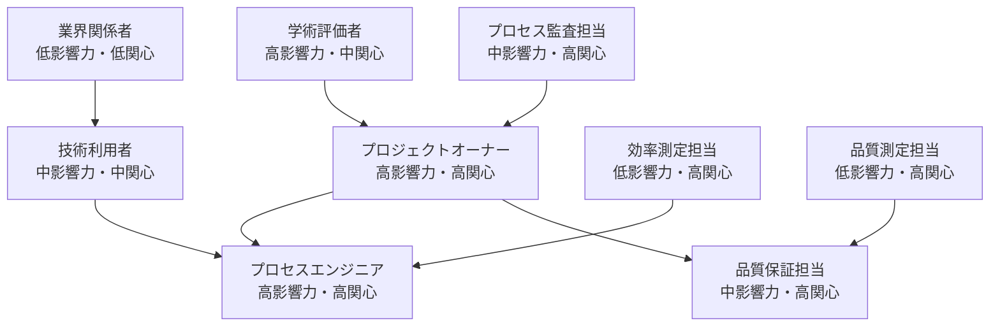

# ステークホルダー一覧

## メタデータ
| 項目 | 内容 |
|------|------|
| ドキュメントID | STAKE-001 |
| 関連文書 | GOAL-001 |
| 作成日 | 2025-01-28 |
| 最終更新日 | 2025-01-28 |
| 作成者 | プロセスエンジニア |

## 1. ステークホルダー分類

### 1.1 プライマリステークホルダー
| 役割 | 氏名/組織 | 責任範囲 | 期待事項 | 連絡先 |
|------|-----------|----------|----------|--------|
| プロジェクトオーナー | 横井利和 | 論文研究・実証実験統括 | プロセスエンジニアリング手法の完全な検証 | yokoi@innovative-solutions.co.jp |
| プロセスエンジニア | AI開発チーム | 開発プロセス実行・品質管理 | 7段階プロセスの厳密な実行と効果測定 | 開発環境内 |
| 品質保証担当 | 自動化システム | 品質基準監視・測定 | 90%以上の品質基準達成と継続監視 | 自動化レポート |

### 1.2 セカンダリステークホルダー
| 役割 | 氏名/組織 | 影響度 | 関与レベル | 連絡先 |
|------|-----------|--------|------------|--------|
| 学術評価者 | 研究コミュニティ | 高 | 結果評価・査読 | 論文投稿時 |
| 技術利用者 | ソフトウェア開発者 | 中 | 手法利用・フィードバック | 公開時 |
| 業界関係者 | IT企業・開発チーム | 中 | 実用性評価・導入検討 | 公開後 |

### 1.3 実証実験固有ステークホルダー
| 役割 | 責任範囲 | 期待事項 | 測定対象 |
|------|----------|----------|----------|
| 効率測定担当 | 開発時間・工数測定 | 正確な時間記録・分析 | 各STEP実行時間、タスク管理時間 |
| 品質測定担当 | コード品質・システム品質評価 | 定量的品質指標の収集 | テストカバレッジ、バグ密度、性能指標 |
| プロセス監査担当 | プロセス準拠性監視 | ルール遵守の確認・記録 | プロセス逸脱検出、文書品質確認 |

## 2. コミュニケーション計画

### 2.1 定期報告
| ステークホルダー | 頻度 | 方法 | 内容 |
|------------------|------|------|------|
| プロジェクトオーナー | 各STEP完了時 | 文書レポート | STEP成果物・品質指標・所要時間 |
| 品質保証担当 | リアルタイム | 自動化レポート | 品質メトリクス・アラート・傾向分析 |
| 効率測定担当 | 日次 | 進捗ログ | 実行時間・タスク完了状況・効率指標 |

### 2.2 課題・例外報告
| 状況 | 報告先 | 方法 | 対応要件 |
|------|--------|------|----------|
| プロセス逸脱 | プロジェクトオーナー | 即時アラート | 24時間以内の対応策決定 |
| 品質基準未達 | 品質保証担当 | 自動通知 | 即座の修正措置 |
| スケジュール遅延 | 全ステークホルダー | 状況報告 | リスク評価・対応計画 |

### 2.3 成果共有
| 成果物 | 対象ステークホルダー | 共有方法 | タイミング |
|--------|-------------------|----------|-----------|
| STEP成果物 | プロジェクトオーナー | 文書ファイル | 各STEP完了時 |
| 品質分析レポート | 全関係者 | 総合レポート | プロジェクト完了時 |
| 実証実験データ | 学術評価者 | 論文・データセット | 論文執筆時 |
| 手法ガイド | 技術利用者 | 公開ドキュメント | 実用化段階 |

## 3. 利害関係分析

### 3.1 影響力マップ

### 3.2 期待事項と懸念事項
| ステークホルダー | 期待事項 | 懸念事項 | 対応策 |
|------------------|----------|----------|--------|
| プロジェクトオーナー | 論文の理論実証 | 実験の失敗・データ不足 | 厳密なプロセス実行・詳細記録 |
| 学術評価者 | 新規性・再現性 | 手法の有効性疑問 | 比較実験・統計的検証 |
| 技術利用者 | 実用的な手法 | 複雑すぎる・学習コスト高 | 詳細ガイド・段階的導入 |
| 業界関係者 | ROI・効率性 | コスト対効果の不明確性 | 定量的効果測定・事例提示 |

## 4. リスク管理

### 4.1 ステークホルダーリスク
| リスク | 影響度 | 発生確率 | 対応策 | 責任者 |
|--------|--------|----------|--------|--------|
| プロセス理解不足 | 高 | 中 | 詳細ドキュメント・トレーニング | プロセスエンジニア |
| 期待値ギャップ | 中 | 中 | 定期コミュニケーション・調整 | プロジェクトオーナー |
| 技術的課題 | 高 | 低 | 技術検証・代替案準備 | プロセスエンジニア |
| 時間超過 | 中 | 中 | 進捗監視・早期警告 | 効率測定担当 |

## 5. 完了確認
- [x] 全ステークホルダーが特定されている
- [x] 役割と責任が明確に定義されている
- [x] コミュニケーション計画が策定されている
- [x] 実証実験固有の関係者が含まれている
- [x] 利害関係分析が完了している
- [x] リスク管理計画が策定されている 