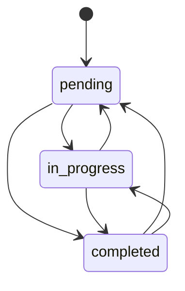
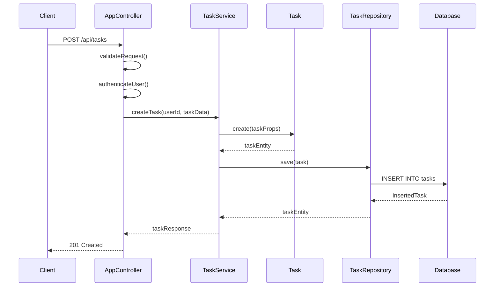

# コンポーネント設計書

## メタデータ
| 項目 | 内容 |
|------|------|
| ドキュメントID | COMP-001 |
| 関連文書 | ARCH-001, REQ-001, UC-001 |
| 作成日 | 2025-01-28 |
| 最終更新日 | 2025-01-28 |
| 作成者 | プロセスエンジニア |

## 1. コンポーネント一覧

| コンポーネントID | ファイル名 | レイヤー | 行数目安 | 責任 | 依存関係 |
|-----------------|------------|----------|----------|------|----------|
| COMP-001 | app.ts | Configuration | 50-80行 | アプリケーション起動・設定 | AppController.ts |
| COMP-002 | AppController.ts | Presentation | 200-250行 | REST API・認証・バリデーション | UserService.ts, TaskService.ts |
| COMP-003 | User.ts | Domain | 80-120行 | ユーザードメインエンティティ | なし |
| COMP-004 | Task.ts | Domain | 120-160行 | タスクドメインエンティティ | なし |
| COMP-005 | UserService.ts | Application | 180-220行 | ユーザービジネスロジック | User.ts, UserRepository.ts |
| COMP-006 | TaskService.ts | Application | 250-300行 | タスクビジネスロジック | Task.ts, TaskRepository.ts |
| COMP-007 | UserRepository.ts | Infrastructure | 120-150行 | ユーザーデータアクセス | User.ts |
| COMP-008 | TaskRepository.ts | Infrastructure | 150-180行 | タスクデータアクセス | Task.ts |

## 2. コンポーネント詳細設計

### COMP-001: app.ts

#### 基本情報
- **ファイルパス**: src/app.ts
- **レイヤー**: Configuration Layer
- **責任**: Express.jsアプリケーションの初期化、設定、起動
- **設計原則**: 単一責任原則、設定の外部化

#### 主要機能
| 機能名 | 説明 | 実装メソッド |
|--------|------|-------------|
| アプリケーション初期化 | Express.jsアプリケーションインスタンス作成 | createApp() |
| ミドルウェア設定 | CORS、JSON Parser、認証等の設定 | setupMiddleware() |
| ルーティング設定 | API エンドポイントの登録 | setupRoutes() |
| データベース接続 | SQLite データベース接続確立 | connectDatabase() |
| サーバー起動 | HTTP サーバーの起動 | startServer() |

#### インターフェース設計
```typescript
interface AppConfig {
  port: number;
  dbPath: string;
  jwtSecret: string;
  corsOrigin: string[];
}

interface DatabaseConnection {
  db: Database;
  connect(): Promise<void>;
  disconnect(): Promise<void>;
  migrate(): Promise<void>;
}
```

#### 主要メソッド
| メソッド名 | 引数 | 戻り値 | 説明 |
|------------|------|--------|------|
| createApp | config: AppConfig | Express | Expressアプリケーション作成 |
| setupMiddleware | app: Express | void | ミドルウェア設定 |
| setupRoutes | app: Express | void | ルーティング設定 |
| connectDatabase | dbPath: string | Promise<Database> | データベース接続 |
| startServer | app: Express, port: number | Promise<Server> | サーバー起動 |

#### 設定管理
| 設定項目 | 環境変数 | デフォルト値 | 説明 |
|----------|----------|-------------|------|
| ポート番号 | PORT | 3000 | HTTP サーバーポート |
| データベースパス | DB_PATH | ./database.sqlite | SQLite ファイルパス |
| JWT シークレット | JWT_SECRET | 自動生成 | JWT トークン署名キー |
| CORS オリジン | CORS_ORIGIN | http://localhost:3000 | 許可するオリジン |

### COMP-002: AppController.ts

#### 基本情報
- **ファイルパス**: src/controllers/AppController.ts
- **レイヤー**: Presentation Layer
- **責任**: HTTP リクエスト処理、認証、バリデーション、レスポンス生成
- **設計原則**: 薄いコントローラー、責任分離

#### REST API エンドポイント
| エンドポイント | メソッド | 機能 | 認証 | 対応ユースケース |
|---------------|---------|------|------|------------------|
| /api/auth/register | POST | ユーザー登録 | なし | UC-001 |
| /api/auth/login | POST | ユーザーログイン | なし | UC-002 |
| /api/users/profile | GET | プロフィール取得 | 必須 | UC-003 |
| /api/users/profile | PUT | プロフィール更新 | 必須 | UC-003 |
| /api/tasks | GET | タスク一覧取得 | 必須 | UC-005 |
| /api/tasks | POST | タスク作成 | 必須 | UC-004 |
| /api/tasks/:id | GET | タスク詳細取得 | 必須 | UC-005 |
| /api/tasks/:id | PUT | タスク更新 | 必須 | UC-006 |
| /api/tasks/:id | DELETE | タスク削除 | 必須 | UC-007 |

#### 主要メソッド
| メソッド名 | HTTP | パス | 説明 | 関連サービス |
|------------|------|------|------|-------------|
| registerUser | POST | /api/auth/register | ユーザー登録処理 | UserService.register |
| loginUser | POST | /api/auth/login | ログイン処理 | UserService.login |
| getUserProfile | GET | /api/users/profile | プロフィール取得 | UserService.getProfile |
| updateUserProfile | PUT | /api/users/profile | プロフィール更新 | UserService.updateProfile |
| getTasks | GET | /api/tasks | タスク一覧取得 | TaskService.getTasks |
| createTask | POST | /api/tasks | タスク作成 | TaskService.createTask |
| getTask | GET | /api/tasks/:id | タスク詳細取得 | TaskService.getTask |
| updateTask | PUT | /api/tasks/:id | タスク更新 | TaskService.updateTask |
| deleteTask | DELETE | /api/tasks/:id | タスク削除 | TaskService.deleteTask |

#### バリデーション設計
| 項目 | バリデーションルール | エラーメッセージ |
|------|---------------------|------------------|
| メールアドレス | 形式チェック、必須 | "有効なメールアドレスを入力してください" |
| パスワード | 8文字以上、必須 | "パスワードは8文字以上で入力してください" |
| タスク名 | 200文字以下、必須 | "タスク名は必須で200文字以下です" |
| 優先度 | enum値チェック | "優先度は low, medium, high のいずれかです" |

#### 認証ミドルウェア
```typescript
interface AuthRequest extends Request {
  user?: {
    id: number;
    email: string;
  };
}

interface JWTPayload {
  userId: number;
  email: string;
  iat: number;
  exp: number;
}
```

### COMP-003: User.ts

#### 基本情報
- **ファイルパス**: src/domain/User.ts
- **レイヤー**: Domain Layer
- **責任**: ユーザードメインエンティティ、ビジネスルール、バリデーション
- **設計原則**: 不変性、ドメイン不変条件の保証

#### エンティティ設計
```typescript
interface UserProps {
  id?: number;
  name: string;
  email: string;
  passwordHash: string;
  createdAt?: Date;
  updatedAt?: Date;
}

interface UserValidationError {
  field: string;
  message: string;
}
```

#### 主要メソッド
| メソッド名 | 引数 | 戻り値 | 説明 |
|------------|------|--------|------|
| create | props: Omit<UserProps, 'id'> | User | 新規ユーザー作成 |
| validateEmail | email: string | boolean | メールアドレス検証 |
| validatePassword | password: string | boolean | パスワード強度検証 |
| updateProfile | name: string, email: string | User | プロフィール更新 |
| isValidForRegistration | - | ValidationResult | 登録可能性検証 |
| toJSON | - | UserJSON | JSON シリアライゼーション |

#### ビジネスルール
| ルール名 | 条件 | 例外 |
|----------|------|------|
| メール一意性 | メールアドレスは重複不可 | DuplicateEmailError |
| パスワード強度 | 8文字以上の英数字 | WeakPasswordError |
| 名前必須 | 名前は1文字以上100文字以下 | InvalidNameError |
| メール形式 | RFC5322準拠の形式 | InvalidEmailError |

#### 不変条件
- ユーザーIDは一度設定されたら変更不可
- メールアドレスは有効な形式であること
- パスワードハッシュは必須
- 作成日時は自動設定

### COMP-004: Task.ts

#### 基本情報
- **ファイルパス**: src/domain/Task.ts
- **レイヤー**: Domain Layer
- **責任**: タスクドメインエンティティ、状態管理、ビジネスルール
- **設計原則**: 状態機械、不変性

#### エンティティ設計
```typescript
enum TaskStatus {
  PENDING = 'pending',
  IN_PROGRESS = 'in_progress',
  COMPLETED = 'completed'
}

enum TaskPriority {
  LOW = 'low',
  MEDIUM = 'medium',
  HIGH = 'high'
}

interface TaskProps {
  id?: number;
  userId: number;
  title: string;
  description?: string;
  status: TaskStatus;
  priority: TaskPriority;
  category?: string;
  createdAt?: Date;
  updatedAt?: Date;
}
```

#### 主要メソッド
| メソッド名 | 引数 | 戻り値 | 説明 |
|------------|------|--------|------|
| create | props: Omit<TaskProps, 'id'> | Task | 新規タスク作成 |
| updateTitle | title: string | Task | タイトル更新 |
| updateDescription | description: string | Task | 説明更新 |
| changePriority | priority: TaskPriority | Task | 優先度変更 |
| changeStatus | status: TaskStatus | Task | 状態変更 |
| setCategory | category: string | Task | カテゴリ設定 |
| canTransitionTo | newStatus: TaskStatus | boolean | 状態遷移可能性判定 |
| isOwner | userId: number | boolean | 所有者判定 |

#### 状態遷移図


#### ビジネスルール
| ルール名 | 条件 | 制約 |
|----------|------|------|
| タイトル必須 | タイトルは1文字以上200文字以下 | 必須項目 |
| 所有者制限 | タスクは作成者のみ編集可能 | 権限チェック |
| 状態遷移 | 全状態間の遷移が可能 | 状態機械 |
| 優先度設定 | LOW/MEDIUM/HIGH のみ | enum制約 |
| カテゴリ制限 | 50文字以下の文字列 | 長さ制限 |

### COMP-005: UserService.ts

#### 基本情報
- **ファイルパス**: src/services/UserService.ts
- **レイヤー**: Application Layer
- **責任**: ユーザー関連ユースケース実行、認証ロジック、トランザクション管理
- **設計原則**: ユースケース中心設計、トランザクション境界

#### 主要メソッド
| メソッド名 | 引数 | 戻り値 | 対応UC | トランザクション |
|------------|------|--------|--------|-----------------|
| register | RegisterRequest | Promise<AuthResult> | UC-001 | あり |
| login | LoginRequest | Promise<AuthResult> | UC-002 | なし |
| getProfile | userId: number | Promise<UserProfile> | UC-003 | なし |
| updateProfile | userId: number, UpdateRequest | Promise<UserProfile> | UC-003 | あり |
| validateCredentials | email: string, password: string | Promise<User> | - | なし |
| generateToken | user: User | string | - | なし |

#### インターフェース設計
```typescript
interface RegisterRequest {
  name: string;
  email: string;
  password: string;
}

interface LoginRequest {
  email: string;
  password: string;
}

interface UpdateProfileRequest {
  name?: string;
  email?: string;
}

interface AuthResult {
  user: UserProfile;
  token: string;
}

interface UserProfile {
  id: number;
  name: string;
  email: string;
  createdAt: Date;
}
```

#### エラーハンドリング
| エラー型 | 発生条件 | HTTPステータス | メッセージ |
|----------|----------|---------------|------------|
| DuplicateEmailError | メール重複 | 409 | "このメールアドレスは既に使用されています" |
| InvalidCredentialsError | 認証失敗 | 401 | "メールアドレスまたはパスワードが正しくありません" |
| UserNotFoundError | ユーザー不存在 | 404 | "ユーザーが見つかりません" |
| ValidationError | 入力値エラー | 400 | "入力値が無効です" |

#### トランザクション管理
| メソッド | トランザクション範囲 | ロールバック条件 |
|----------|---------------------|-----------------|
| register | ユーザー作成 | バリデーションエラー、DB制約違反 |
| updateProfile | プロフィール更新 | バリデーションエラー、メール重複 |

### COMP-006: TaskService.ts

#### 基本情報
- **ファイルパス**: src/services/TaskService.ts
- **レイヤー**: Application Layer
- **責任**: タスク関連ユースケース実行、ビジネスロジック、権限制御
- **設計原則**: ユースケース中心設計、権限による制御

#### 主要メソッド
| メソッド名 | 引数 | 戻り値 | 対応UC | 権限チェック |
|------------|------|--------|--------|-------------|
| createTask | userId: number, CreateTaskRequest | Promise<TaskResponse> | UC-004 | なし |
| getTasks | userId: number, filters?: TaskFilters | Promise<TaskListResponse> | UC-005 | 所有者のみ |
| getTask | userId: number, taskId: number | Promise<TaskResponse> | UC-005 | 所有者のみ |
| updateTask | userId: number, taskId: number, UpdateTaskRequest | Promise<TaskResponse> | UC-006 | 所有者のみ |
| deleteTask | userId: number, taskId: number | Promise<void> | UC-007 | 所有者のみ |
| changeTaskStatus | userId: number, taskId: number, status: TaskStatus | Promise<TaskResponse> | UC-008 | 所有者のみ |
| getCategories | userId: number | Promise<string[]> | UC-009 | 所有者のみ |
| updateCategory | userId: number, oldCategory: string, newCategory: string | Promise<void> | UC-009 | 所有者のみ |

#### インターフェース設計
```typescript
interface CreateTaskRequest {
  title: string;
  description?: string;
  priority: TaskPriority;
  category?: string;
}

interface UpdateTaskRequest {
  title?: string;
  description?: string;
  priority?: TaskPriority;
  category?: string;
}

interface TaskFilters {
  status?: TaskStatus;
  priority?: TaskPriority;
  category?: string;
  sortBy?: 'title' | 'priority' | 'createdAt' | 'updatedAt';
  sortOrder?: 'asc' | 'desc';
  limit?: number;
  offset?: number;
}

interface TaskResponse {
  id: number;
  title: string;
  description?: string;
  status: TaskStatus;
  priority: TaskPriority;
  category?: string;
  createdAt: Date;
  updatedAt: Date;
}

interface TaskListResponse {
  tasks: TaskResponse[];
  total: number;
  page: number;
  limit: number;
}
```

#### 権限制御設計
| 操作 | 権限チェック方法 | エラー条件 |
|------|-----------------|------------|
| タスク参照 | タスク所有者のみ | 他人のタスクアクセス |
| タスク更新 | タスク所有者のみ | 他人のタスク更新 |
| タスク削除 | タスク所有者のみ | 他人のタスク削除 |
| カテゴリ管理 | ユーザーのカテゴリのみ | 他人のカテゴリ操作 |

### COMP-007: UserRepository.ts

#### 基本情報
- **ファイルパス**: src/repositories/UserRepository.ts
- **レイヤー**: Infrastructure Layer
- **責任**: ユーザーデータの永続化、SQLクエリ実行、データマッピング
- **設計原則**: Repository パターン、データマッパー

#### 主要メソッド
| メソッド名 | 引数 | 戻り値 | SQL操作 | 説明 |
|------------|------|--------|---------|------|
| save | user: User | Promise<User> | INSERT/UPDATE | ユーザー保存 |
| findById | id: number | Promise<User \| null> | SELECT | ID検索 |
| findByEmail | email: string | Promise<User \| null> | SELECT | メール検索 |
| update | id: number, updates: Partial<UserProps> | Promise<User> | UPDATE | ユーザー更新 |
| delete | id: number | Promise<void> | DELETE | ユーザー削除 |
| exists | email: string | Promise<boolean> | SELECT COUNT | 存在確認 |

#### データベーススキーマ
```sql
CREATE TABLE users (
  id INTEGER PRIMARY KEY AUTOINCREMENT,
  name VARCHAR(100) NOT NULL,
  email VARCHAR(255) UNIQUE NOT NULL,
  password_hash VARCHAR(255) NOT NULL,
  created_at DATETIME DEFAULT CURRENT_TIMESTAMP,
  updated_at DATETIME DEFAULT CURRENT_TIMESTAMP
);

CREATE INDEX idx_users_email ON users(email);
CREATE INDEX idx_users_created_at ON users(created_at);
```

#### データマッピング
| ドメイン属性 | データベース列 | 変換処理 |
|-------------|---------------|----------|
| id | id | そのまま |
| name | name | そのまま |
| email | email | 小文字変換 |
| passwordHash | password_hash | そのまま |
| createdAt | created_at | Date オブジェクト変換 |
| updatedAt | updated_at | Date オブジェクト変換 |

#### クエリ最適化
| 操作 | インデックス | 最適化手法 |
|------|-------------|-----------|
| メール検索 | idx_users_email | UNIQUE制約活用 |
| 作成日ソート | idx_users_created_at | インデックススキャン |
| 存在確認 | idx_users_email | COUNT最適化 |

### COMP-008: TaskRepository.ts

#### 基本情報
- **ファイルパス**: src/repositories/TaskRepository.ts
- **レイヤー**: Infrastructure Layer
- **責任**: タスクデータの永続化、複雑なクエリ実行、検索機能
- **設計原則**: Repository パターン、クエリ最適化

#### 主要メソッド
| メソッド名 | 引数 | 戻り値 | SQL操作 | 説明 |
|------------|------|--------|---------|------|
| save | task: Task | Promise<Task> | INSERT/UPDATE | タスク保存 |
| findById | id: number | Promise<Task \| null> | SELECT | ID検索 |
| findByUserId | userId: number, filters?: TaskFilters | Promise<Task[]> | SELECT | ユーザー別検索 |
| update | id: number, updates: Partial<TaskProps> | Promise<Task> | UPDATE | タスク更新 |
| delete | id: number | Promise<void> | DELETE | タスク削除 |
| findByCategory | userId: number, category: string | Promise<Task[]> | SELECT | カテゴリ別検索 |
| getCategories | userId: number | Promise<string[]> | SELECT DISTINCT | カテゴリ一覧取得 |
| countByUserId | userId: number, filters?: TaskFilters | Promise<number> | SELECT COUNT | 件数取得 |
| updateCategory | userId: number, oldCategory: string, newCategory: string | Promise<void> | UPDATE | カテゴリ一括更新 |

#### データベーススキーマ
```sql
CREATE TABLE tasks (
  id INTEGER PRIMARY KEY AUTOINCREMENT,
  user_id INTEGER NOT NULL,
  title VARCHAR(200) NOT NULL,
  description TEXT,
  status VARCHAR(20) NOT NULL DEFAULT 'pending',
  priority VARCHAR(10) NOT NULL DEFAULT 'medium',
  category VARCHAR(50),
  created_at DATETIME DEFAULT CURRENT_TIMESTAMP,
  updated_at DATETIME DEFAULT CURRENT_TIMESTAMP,
  FOREIGN KEY (user_id) REFERENCES users(id) ON DELETE CASCADE
);

CREATE INDEX idx_tasks_user_id ON tasks(user_id);
CREATE INDEX idx_tasks_status ON tasks(status);
CREATE INDEX idx_tasks_priority ON tasks(priority);
CREATE INDEX idx_tasks_category ON tasks(category);
CREATE INDEX idx_tasks_created_at ON tasks(created_at);
CREATE INDEX idx_tasks_user_status ON tasks(user_id, status);
```

#### 複雑クエリ実装
| クエリ種別 | 説明 | 最適化手法 |
|------------|------|-----------|
| フィルタ検索 | 状態・優先度・カテゴリでの絞り込み | 複合インデックス使用 |
| ソート処理 | 作成日・更新日・優先度でのソート | インデックスでカバー |
| ページネーション | LIMIT/OFFSET によるページング | 効率的カウントクエリ |
| カテゴリ集計 | ユーザー別カテゴリ一覧 | DISTINCT最適化 |

## 3. コンポーネント間の相互作用図



## 4. 完了確認
- [x] 全8コンポーネントが明確に定義されている
- [x] 各コンポーネントの責任が単一で明確である
- [x] インターフェース設計が完全に定義されている
- [x] メソッド仕様が詳細に記述されている
- [x] 依存関係が適切に設計されている
- [x] エラーハンドリングが考慮されている
- [x] データベーススキーマが最適化されている
- [x] 行数配分が制約内で設計されている
- [x] STEP 1要求仕様との完全対応が確保されている
- [x] セキュリティ・パフォーマンス要件が統合されている
- [x] 全ユースケースがコンポーネントにマッピングされている
- [x] 実証実験要件が満たされている 