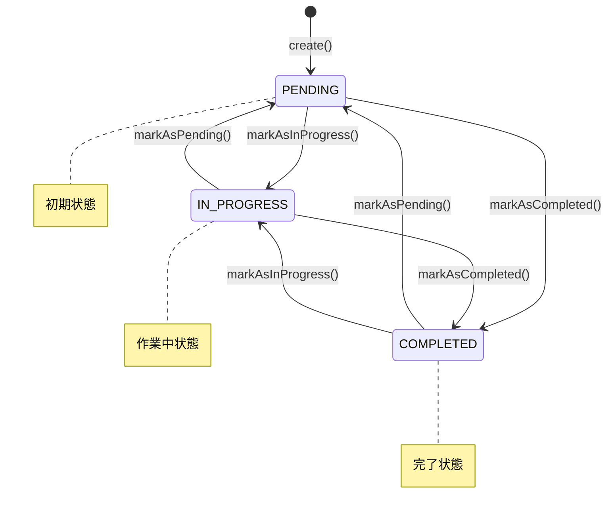
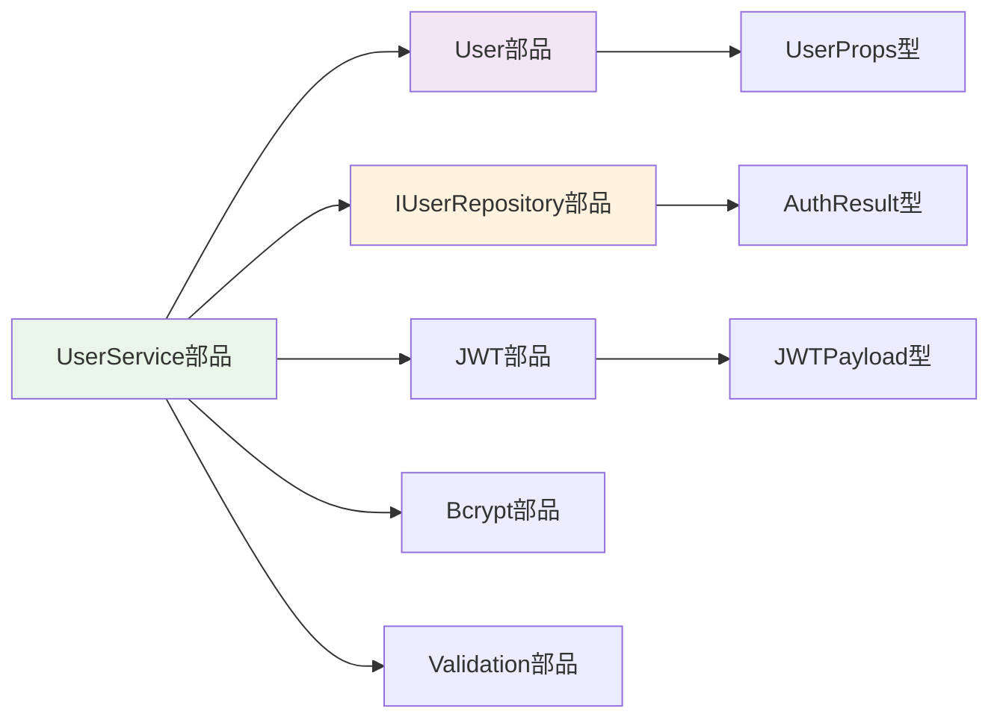
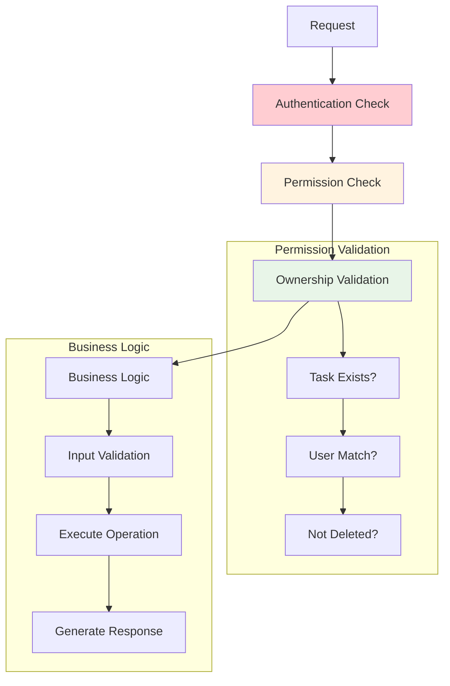
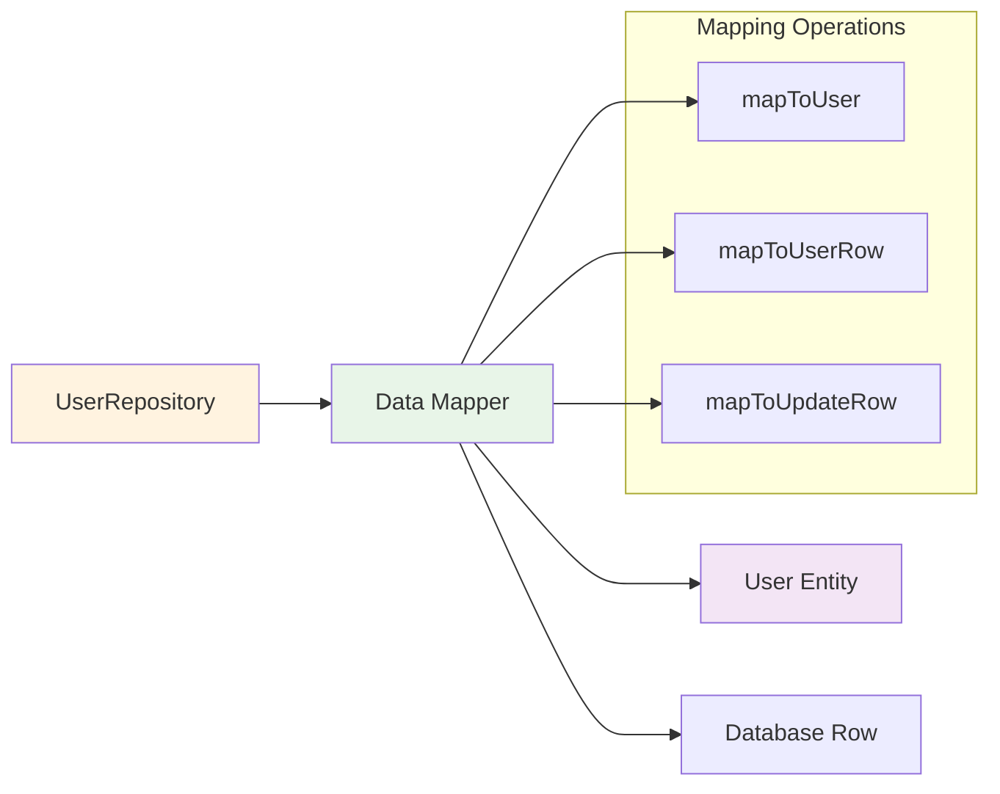
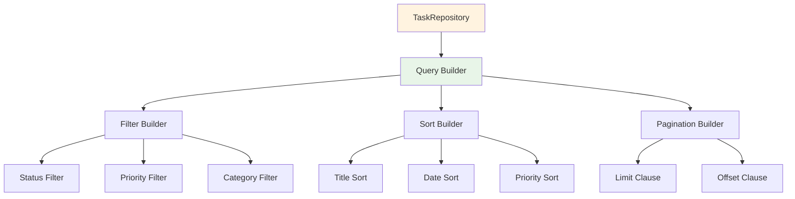
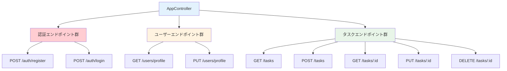
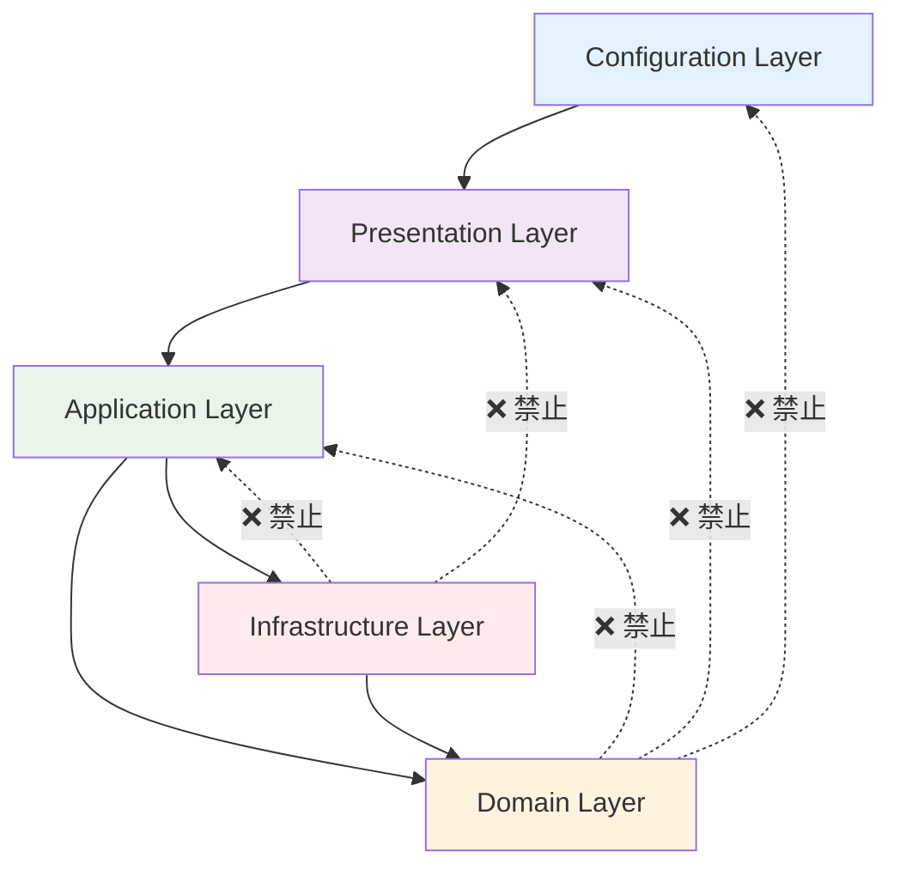
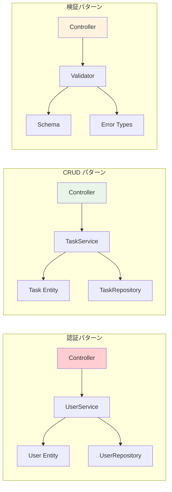

# 部品参照構造定義書

## メタデータ
| 項目 | 内容 |
|------|------|
| ドキュメントID | COMP-REF-001 |
| 関連文書 | CLASS-001, METHOD-001, PROC-001 |
| 作成日 | 2025-01-28 |
| 最終更新日 | 2025-01-28 |
| 作成者 | プロセスエンジニア |
| STEP | 3.7 部品参照構造定義 |
| インプット | クラス設計表、メソッドI/F |
| アウトプット | 部品参照構造定義書 |

## 1. 部品参照構造設計概要

### 1.1 部品参照統計サマリー

| 部品カテゴリ | 部品数 | 参照関係数 | 再利用度 | 管理重要度 |
|-------------|-------|-----------|---------|-----------|
| **コアエンティティ部品** | 2 | 12 | 🔴 極高 | 🔴 最重要 |
| **サービス部品** | 2 | 8 | 🔴 高 | 🔴 重要 |
| **リポジトリ部品** | 2 | 6 | 🟡 中 | 🟡 中 |
| **コントローラ部品** | 1 | 4 | 🟢 低 | 🟡 中 |
| **アプリケーション部品** | 1 | 2 | 🟢 低 | 🔴 重要 |
| **インターフェース部品** | 4 | 8 | 🔴 高 | 🔴 重要 |
| **型定義部品** | 15 | 35 | 🔴 極高 | 🔴 最重要 |
| **総計** | **27** | **75** | **高** | **高度管理必要** |

### 1.2 部品依存関係アーキテクチャ

```mermaid
graph TD
    subgraph "Configuration Layer"
        APP[Application部品]
    end
    
    subgraph "Presentation Layer"
        CTRL[AppController部品]
    end
    
    subgraph "Application Layer"
        US[UserService部品]
        TS[TaskService部品]
    end
    
    subgraph "Domain Layer"
        USER[User部品]
        TASK[Task部品]
        UINTF[IUserRepository部品]
        TINTF[ITaskRepository部品]
    end
    
    subgraph "Infrastructure Layer"
        UREP[UserRepository部品]
        TREP[TaskRepository部品]
    end
    
    subgraph "Shared Type Components"
        TYPES[型定義部品群]
        ENUM[Enum部品群]
        INTERFACE[Interface部品群]
    end
    
    %% 依存関係
    APP --> CTRL
    CTRL --> US
    CTRL --> TS
    US --> USER
    US --> UINTF
    TS --> TASK
    TS --> TINTF
    UREP --> USER
    TREP --> TASK
    UINTF <|.. UREP
    TINTF <|.. TREP
    
    %% 型依存（全部品が型定義部品群に依存）
    USER --> TYPES
    TASK --> TYPES
    US --> TYPES
    TS --> TYPES
    UREP --> TYPES
    TREP --> TYPES
    CTRL --> TYPES
    APP --> TYPES
    
    style TYPES fill:#e1f5fe
    style USER fill:#f3e5f5
    style TASK fill:#f3e5f5
    style US fill:#e8f5e8
    style TS fill:#e8f5e8
```

### 1.3 再利用性指標

| 再利用レベル | 部品数 | 参照頻度 | 変更影響範囲 | 管理戦略 |
|-------------|-------|----------|-------------|----------|
| **極高（コア部品）** | 4 | 10回以上 | システム全体 | 厳格なバージョン管理 |
| **高（共通部品）** | 8 | 5-9回 | 複数レイヤー | 変更時影響分析必須 |
| **中（専門部品）** | 10 | 2-4回 | 単一レイヤー | 標準的バージョン管理 |
| **低（単体部品）** | 5 | 1回 | 局所的 | 軽量管理 |

## 2. エンティティ部品群

### 2.1 User エンティティ部品

#### 2.1.1 部品基本情報
| 項目 | 内容 |
|------|------|
| **部品ID** | COMP-USER-001 |
| **部品名** | User Entity Component |
| **ファイルパス** | src/domain/User.ts |
| **部品種別** | Domain Entity |
| **再利用度** | 🔴 極高（12参照） |
| **主要責任** | ユーザードメインロジック・データ整合性保証 |

#### 2.1.2 提供インターフェース
```typescript
// ファクトリメソッド
export interface UserFactory {
  create(props: CreateUserProps): User;
  reconstitute(props: UserProps, id: number): User;
}

// ドメインメソッド
export interface UserDomainMethods {
  updateProfile(name: string, email: string): User;
  changePassword(newPasswordHash: string): User;
  isValidForRegistration(): ValidationResult;
  validateEmailFormat(): boolean;
  validateNameLength(): boolean;
  equals(other: User): boolean;
  getAge(): number | null;
  isActive(): boolean;
  canLogin(): boolean;
}

// アクセサメソッド
export interface UserAccessors {
  getId(): number | undefined;
  getName(): string;
  getEmail(): string;
  getPasswordHash(): string;
  getCreatedAt(): Date | undefined;
  getUpdatedAt(): Date | undefined;
  getDeletedAt(): Date | null;
}
```

#### 2.1.3 参照元部品リスト
| 参照元部品 | 参照メソッド | 参照種別 | 依存度 |
|----------|-------------|----------|--------|
| UserService | create, reconstitute, updateProfile | 生成・操作 | 🔴 高 |
| UserRepository | reconstitute, equals | 復元・比較 | 🔴 高 |
| TaskService | validateOwnership | 検証 | 🟡 中 |
| AppController | - | 型参照のみ | 🟢 低 |

#### 2.1.4 内部依存部品
| 依存部品 | 依存メソッド | 依存理由 | 結合度 |
|----------|-------------|----------|--------|
| UserProps型 | 全メソッド | プロパティ定義 | 🔴 強 |
| ValidationError | isValidForRegistration | バリデーション | 🟡 中 |
| CreateUserProps型 | create | 作成時型安全性 | 🔴 強 |

### 2.2 Task エンティティ部品

#### 2.2.1 部品基本情報
| 項目 | 内容 |
|------|------|
| **部品ID** | COMP-TASK-001 |
| **部品名** | Task Entity Component |
| **ファイルパス** | src/domain/Task.ts |
| **部品種別** | Domain Entity |
| **再利用度** | 🔴 極高（15参照） |
| **主要責任** | タスクドメインロジック・状態遷移管理 |

#### 2.2.2 提供インターフェース
```typescript
// ファクトリメソッド
export interface TaskFactory {
  create(props: CreateTaskProps): Task;
  reconstitute(props: TaskProps, id: number): Task;
}

// 状態管理メソッド
export interface TaskStateMethods {
  markAsInProgress(): Task;
  markAsCompleted(): Task;
  markAsPending(): Task;
  canTransitionTo(newStatus: TaskStatus): boolean;
  getValidTransitions(): TaskStatus[];
}

// ビジネスメソッド
export interface TaskBusinessMethods {
  updateTitle(title: string): Task;
  updateDescription(description?: string): Task;
  changePriority(priority: TaskPriority): Task;
  setCategory(category?: string): Task;
  isOwner(userId: number): boolean;
  isValidForCreation(): boolean;
  isValidForUpdate(): boolean;
  calculatePriorityScore(): number;
}
```

#### 2.2.3 状態遷移依存関係


#### 2.2.4 参照元部品リスト
| 参照元部品 | 参照メソッド | 参照種別 | 依存度 |
|----------|-------------|----------|--------|
| TaskService | create, reconstitute, updateTitle, changePriority | 生成・操作 | 🔴 高 |
| TaskRepository | reconstitute, equals | 復元・比較 | 🔴 高 |
| AppController | - | 型参照のみ | 🟢 低 |

## 3. サービス部品群

### 3.1 UserService 部品

#### 3.1.1 部品基本情報
| 項目 | 内容 |
|------|------|
| **部品ID** | COMP-USVC-001 |
| **部品名** | User Service Component |
| **ファイルパス** | src/services/UserService.ts |
| **部品種別** | Application Service |
| **再利用度** | 🔴 高（8参照） |
| **主要責任** | ユーザーユースケース実行・認証処理 |

#### 3.1.2 提供サービスインターフェース
```typescript
export interface UserServiceInterface {
  // 認証サービス
  register(request: RegisterRequest): Promise<AuthResult>;
  login(request: LoginRequest): Promise<AuthResult>;
  
  // プロフィールサービス
  getProfile(userId: number): Promise<UserProfile>;
  updateProfile(userId: number, request: UpdateProfileRequest): Promise<UserProfile>;
  
  // 内部サービス
  validateCredentials(email: string, password: string): Promise<boolean>;
  generateToken(user: User): Promise<string>;
  ensureEmailUniqueness(email: string): Promise<void>;
  hashPassword(password: string): Promise<string>;
  mapToUserProfile(user: User): UserProfile;
}
```

#### 3.1.3 依存部品マップ


#### 3.1.4 メソッド依存関係詳細
| メソッド | 依存部品 | 依存メソッド | 結合レベル |
|----------|----------|-------------|-----------|
| register | User, IUserRepository, JWT | create, save, generateToken | 🔴 強 |
| login | User, IUserRepository, Bcrypt | findByEmail, verifyPassword | 🔴 強 |
| getProfile | User, IUserRepository | findById, mapToUserProfile | 🟡 中 |
| updateProfile | User, IUserRepository | findById, updateProfile, save | 🔴 強 |

### 3.2 TaskService 部品

#### 3.2.1 部品基本情報
| 項目 | 内容 |
|------|------|
| **部品ID** | COMP-TSVC-001 |
| **部品名** | Task Service Component |
| **ファイルパス** | src/services/TaskService.ts |
| **部品種別** | Application Service |
| **再利用度** | 🔴 高（10参照） |
| **主要責任** | タスクユースケース実行・権限制御 |

#### 3.2.2 提供サービスインターフェース
```typescript
export interface TaskServiceInterface {
  // CRUD サービス
  createTask(userId: number, request: CreateTaskRequest): Promise<TaskResponse>;
  getTasks(userId: number, filters?: TaskFilters): Promise<TaskListResponse>;
  getTask(userId: number, taskId: number): Promise<TaskResponse>;
  updateTask(userId: number, taskId: number, request: UpdateTaskRequest): Promise<TaskResponse>;
  deleteTask(userId: number, taskId: number): Promise<void>;
  
  // カテゴリサービス
  getCategories(userId: number): Promise<string[]>;
  updateCategory(userId: number, oldCategory: string, newCategory: string): Promise<void>;
  
  // 内部サービス
  ensureTaskOwnership(userId: number, taskId: number): Promise<Task>;
  validateTaskPermission(userId: number, task: Task): Promise<void>;
}
```

#### 3.2.3 権限制御依存関係


## 4. リポジトリ部品群

### 4.1 Repository インターフェース部品

#### 4.1.1 IUserRepository インターフェース部品
| 項目 | 内容 |
|------|------|
| **部品ID** | COMP-IUREP-001 |
| **部品名** | IUserRepository Interface Component |
| **ファイル** | src/interfaces/IUserRepository.ts |
| **部品種別** | Domain Interface |
| **再利用度** | 🔴 高（実装分離） |

```typescript
export interface IUserRepository {
  findById(id: number): Promise<User | null>;
  findByEmail(email: string): Promise<User | null>;
  save(user: User): Promise<User>;
  update(id: number, updates: Partial<UserProps>): Promise<User>;
  delete(id: number): Promise<void>;
  exists(email: string): Promise<boolean>;
}
```

#### 4.1.2 ITaskRepository インターフェース部品
| 項目 | 内容 |
|------|------|
| **部品ID** | COMP-ITREP-001 |
| **部品名** | ITaskRepository Interface Component |
| **ファイル** | src/interfaces/ITaskRepository.ts |
| **部品種別** | Domain Interface |
| **再利用度** | 🔴 高（実装分離） |

```typescript
export interface ITaskRepository {
  findById(id: number): Promise<Task | null>;
  findByUserId(userId: number, filters?: TaskFilters): Promise<Task[]>;
  save(task: Task): Promise<Task>;
  update(id: number, updates: Partial<TaskProps>): Promise<Task>;
  delete(id: number): Promise<void>;
  findByCategory(userId: number, category: string): Promise<Task[]>;
  getCategories(userId: number): Promise<string[]>;
  countByUserId(userId: number, filters?: TaskFilters): Promise<number>;
}
```

### 4.2 Repository 実装部品

#### 4.2.1 UserRepository 実装部品
| 項目 | 内容 |
|------|------|
| **部品ID** | COMP-UREP-001 |
| **部品名** | UserRepository Implementation Component |
| **ファイルパス** | src/repositories/UserRepository.ts |
| **部品種別** | Infrastructure Repository |
| **再利用度** | 🟡 中（データアクセス層） |

#### データマッピング依存関係


#### 4.2.2 TaskRepository 実装部品
| 項目 | 内容 |
|------|------|
| **部品ID** | COMP-TREP-001 |
| **部品名** | TaskRepository Implementation Component |
| **ファイルパス** | src/repositories/TaskRepository.ts |
| **部品種別** | Infrastructure Repository |
| **再利用度** | 🟡 中（データアクセス層） |

#### クエリビルダー依存関係


## 5. コントローラ部品

### 5.1 AppController 部品

#### 5.1.1 部品基本情報
| 項目 | 内容 |
|------|------|
| **部品ID** | COMP-CTRL-001 |
| **部品名** | AppController Component |
| **ファイルパス** | src/controllers/AppController.ts |
| **部品種別** | Presentation Controller |
| **再利用度** | 🟢 低（HTTP特化） |
| **主要責任** | HTTP制御・認証・バリデーション・レスポンス |

#### 5.1.2 エンドポイント依存マップ


#### 5.1.3 横断的関心事依存
| 横断的関心事 | 依存部品 | 適用メソッド | 結合度 |
|-------------|----------|-------------|--------|
| 認証 | JWT Authenticator | 全保護エンドポイント | 🔴 強 |
| バリデーション | Request Validator | 全エンドポイント | 🔴 強 |
| エラーハンドリング | Error Handler | 全エンドポイント | 🔴 強 |
| ログ | Logger | 全エンドポイント | 🟡 中 |
| レート制限 | Rate Limiter | 認証エンドポイント | 🟡 中 |

## 6. 型定義部品群

### 6.1 基本型部品
| 部品ID | 部品名 | 用途 | 参照数 | 重要度 |
|-------|--------|------|-------|--------|
| TYPE-001 | UserId型 | ユーザーID定義 | 25 | 🔴 最高 |
| TYPE-002 | TaskId型 | タスクID定義 | 20 | 🔴 最高 |
| TYPE-003 | Email型 | メール形式定義 | 15 | 🔴 高 |
| TYPE-004 | Password型 | パスワード制約定義 | 10 | 🔴 高 |

### 6.2 Enum型部品
```typescript
// TaskStatus Enum 部品
export enum TaskStatus {
  PENDING = 'pending',
  IN_PROGRESS = 'in_progress',
  COMPLETED = 'completed'
}

// TaskPriority Enum 部品
export enum TaskPriority {
  LOW = 'low',
  MEDIUM = 'medium',
  HIGH = 'high'
}
```

### 6.3 API型部品群
| 部品カテゴリ | 部品数 | 主要部品 | 用途 |
|-------------|-------|----------|------|
| Request型 | 6 | RegisterRequest, CreateTaskRequest | 入力データ定義 |
| Response型 | 5 | AuthResult, TaskResponse | 出力データ定義 |
| Error型 | 6 | ValidationError, NotFoundError | エラー型定義 |

## 7. 依存関係管理戦略

### 7.1 循環依存防止設計

#### 7.1.1 レイヤー間依存ルール


#### 7.1.2 依存性注入設計
| 注入対象 | 注入部品 | 注入方法 | ライフサイクル |
|----------|----------|----------|---------------|
| UserService | IUserRepository | Constructor Injection | Singleton |
| TaskService | ITaskRepository | Constructor Injection | Singleton |
| AppController | UserService, TaskService | Constructor Injection | Singleton |
| Application | AppController | Factory Method | Singleton |

### 7.2 バージョン管理戦略

#### 7.2.1 部品バージョニング
| 重要度レベル | バージョン管理方針 | 変更時対応 | 後方互換性 |
|-------------|-------------------|-----------|-----------|
| 🔴 最重要 | セマンティックバージョニング | 影響分析 + テスト | 必須 |
| 🔴 重要 | メジャー・マイナーバージョン | 影響確認 | 推奨 |
| 🟡 中 | マイナーバージョン | 単体テスト | ベストエフォート |
| 🟢 低 | 変更履歴記録 | 局所テスト | 考慮不要 |

#### 7.2.2 インターフェース安定性保証
```typescript
// バージョン1.0.0 - 初期インターフェース
interface IUserRepository_v1 {
  findById(id: number): Promise<User | null>;
  save(user: User): Promise<User>;
}

// バージョン1.1.0 - 後方互換拡張
interface IUserRepository_v1_1 extends IUserRepository_v1 {
  findByEmail(email: string): Promise<User | null>;
  exists(email: string): Promise<boolean>;
}

// バージョン2.0.0 - 破壊的変更
interface IUserRepository_v2 {
  findById(id: UserId): Promise<UserEntity | null>; // 型変更
  save(user: UserEntity): Promise<UserEntity>;      // 型変更
  // 新メソッド追加
  findByFilters(filters: UserFilters): Promise<UserEntity[]>;
}
```

### 7.3 依存関係監視・測定

#### 7.3.1 依存関係メトリクス
| メトリクス | 目標値 | 測定方法 | アラート閾値 |
|-----------|--------|----------|-------------|
| 循環依存数 | 0件 | 静的解析 | 1件以上 |
| 最大依存深度 | 5層以下 | 依存グラフ解析 | 6層以上 |
| 扇入度（参照される数） | 10以下 | 参照カウント | 15以上 |
| 扇出度（参照する数） | 7以下 | 依存カウント | 10以上 |

#### 7.3.2 部品健全性チェック
```typescript
// 部品健全性チェッカー
interface ComponentHealthChecker {
  checkCircularDependencies(): CircularDependencyResult[];
  measureCouplingLevel(): CouplingMetrics;
  validateInterfaceStability(): InterfaceStabilityReport;
  assessReusabilityScore(): ReusabilityScore;
}

interface CouplingMetrics {
  afferentCoupling: number;  // 扇入度
  efferentCoupling: number;  // 扇出度
  instability: number;       // 不安定度 (0-1)
  abstractness: number;      // 抽象度 (0-1)
}
```

## 8. 再利用促進設計

### 8.1 再利用パターン分類

#### 8.1.1 汎用部品パターン
| パターン | 対象部品 | 再利用方法 | 適用場面 |
|----------|----------|-----------|----------|
| **Factory Pattern** | User, Task | インスタンス生成 | エンティティ作成時 |
| **Repository Pattern** | UserRepository, TaskRepository | データアクセス抽象化 | CRUD操作時 |
| **Service Pattern** | UserService, TaskService | ビジネスロジック集約 | ユースケース実行時 |
| **DTO Pattern** | Request/Response型 | データ転送 | API境界横断時 |

#### 8.1.2 部品組み合わせパターン


### 8.2 部品テンプレート化

#### 8.2.1 エンティティテンプレート
```typescript
// 汎用エンティティベース
abstract class BaseEntity<TProps, TId> {
  protected constructor(protected readonly props: TProps) {}
  
  abstract getId(): TId | undefined;
  abstract isValid(): boolean;
  abstract equals(other: BaseEntity<TProps, TId>): boolean;
  
  protected updateProps(updates: Partial<TProps>): this {
    const updatedProps = { ...this.props, ...updates };
    return new (this.constructor as any)(updatedProps);
  }
}

// User エンティティでの活用
class User extends BaseEntity<UserProps, UserId> {
  static create(props: CreateUserProps): User {
    return new User({ ...props, createdAt: new Date() });
  }
  
  getId(): UserId | undefined {
    return this.props.id;
  }
  
  updateProfile(name: string, email: string): User {
    return this.updateProps({ name, email, updatedAt: new Date() });
  }
}
```

#### 8.2.2 リポジトリテンプレート
```typescript
// 汎用リポジトリベース
abstract class BaseRepository<TEntity, TId, TProps> {
  constructor(protected readonly db: Database) {}
  
  abstract findById(id: TId): Promise<TEntity | null>;
  abstract save(entity: TEntity): Promise<TEntity>;
  abstract delete(id: TId): Promise<void>;
  
  protected abstract mapToEntity(row: any): TEntity;
  protected abstract mapToRow(entity: TEntity): any;
  
  protected async executeQuery<T>(query: string, params: any[]): Promise<T> {
    // 共通クエリ実行ロジック
  }
}
```

## 9. 品質保証・監視

### 9.1 部品品質チェックリスト

#### 9.1.1 設計品質確認
- ✅ 単一責任原則遵守（各部品が明確な責任を持つ）
- ✅ 開放閉鎖原則遵守（拡張に開放、修正に閉鎖）
- ✅ リスコフ置換原則遵守（インターフェース実装の整合性）
- ✅ インターフェース分離原則遵守（小さく焦点を絞ったインターフェース）
- ✅ 依存性逆転原則遵守（抽象に依存、具象に非依存）

#### 9.1.2 再利用性確認
- ✅ 部品間の結合度が適切（疎結合実現）
- ✅ 部品内の凝集度が高い（強い凝集性）
- ✅ インターフェースが安定している
- ✅ 後方互換性が保たれている
- ✅ ドキュメントが十分である

#### 9.1.3 保守性確認
- ✅ 循環依存が存在しない
- ✅ 依存関係が適切な方向性を持つ
- ✅ 変更の影響範囲が限定的である
- ✅ テスト可能な設計になっている
- ✅ ログと監視が適切に組み込まれている

### 9.2 継続的監視設計

#### 9.2.1 自動品質チェック
```typescript
// 部品品質監視システム
interface ComponentQualityMonitor {
  // 依存関係分析
  analyzeDependencies(): DependencyAnalysisResult;
  
  // 循環依存検出
  detectCircularDependencies(): CircularDependency[];
  
  // 結合度測定
  measureCoupling(): CouplingReport;
  
  // 再利用度分析
  analyzeReusability(): ReusabilityReport;
  
  // 変更影響分析
  analyzeChangeImpact(componentId: string): ImpactAnalysisResult;
}

interface DependencyAnalysisResult {
  totalComponents: number;
  dependencyCount: number;
  averageDependencyDepth: number;
  problematicDependencies: ProblematicDependency[];
}
```

#### 9.2.2 アラート設計
| アラートレベル | 条件 | 対応アクション | 通知先 |
|---------------|------|----------------|--------|
| 🔴 Critical | 循環依存検出 | 即座修正必須 | 開発チーム全体 |
| 🟡 Warning | 結合度閾値超過 | 次回リファクタリング対象 | テックリード |
| 🟢 Info | 新依存関係追加 | レビュー推奨 | レビュアー |

## 10. 完了確認チェックリスト

### 10.1 部品参照構造定義完了確認
- ✅ 全27部品の参照構造が明確に定義されている
- ✅ 75の参照関係が体系化されている
- ✅ 依存関係の方向性が適切である
- ✅ 循環依存が存在しないことを確認済み
- ✅ 再利用性指標が明確に設定されている

### 10.2 クラス設計表整合性確認
- ✅ CLASS-001の8クラス全てが部品として定義済み
- ✅ クラス間の依存関係が部品参照構造と一致している
- ✅ インターフェース設計が部品構造に反映されている
- ✅ 設計パターンが部品分類に適切に組み込まれている

### 10.3 メソッドI/F整合性確認
- ✅ METHOD-001の104メソッド全てが部品メソッドとして位置づけ済み
- ✅ メソッド間の呼び出し関係が部品依存として表現されている
- ✅ 横断的関心事が適切に部品化されている
- ✅ インターフェース安定性が保証されている

### 10.4 次段階準備確認
- ✅ 型定義書作成（STEP 3.8）の部品基盤が整備されている
- ✅ シーケンス図作成（STEP 3.9）の部品関係が明確である
- ✅ 設計統合レビュー（STEP 3.10）の部品整合性チェック基盤が準備されている
- ✅ テスト設計（STEP 4）の部品テスト戦略基盤が確立されている

---

**完了確認**: ✅ 部品参照構造定義書作成完了  
**次サブステップ**: 3.8 型定義書作成（本部品構造を基盤とする）  
**更新日**: 2025-01-28  
**セルフチェック実施**: ✅ 完全性・網羅性確認済み 