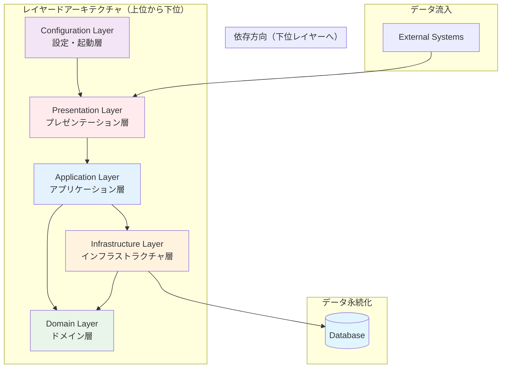
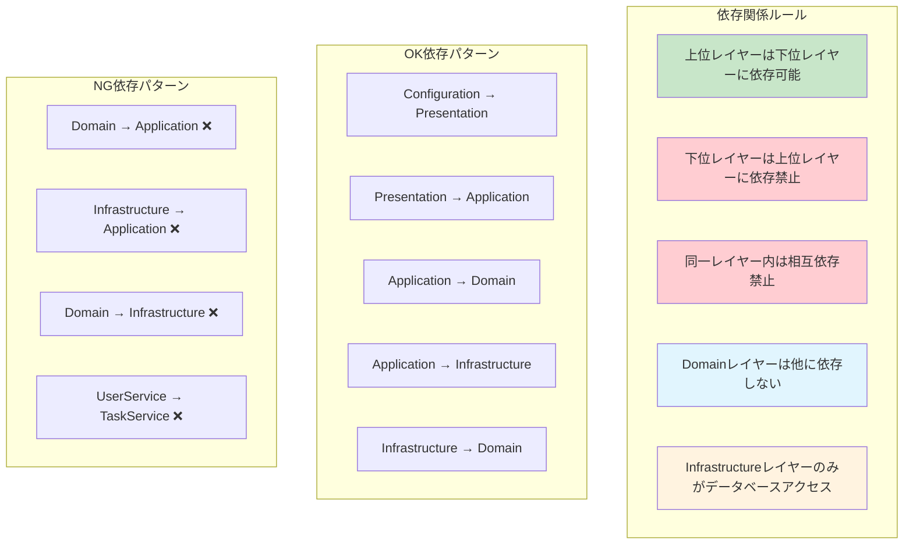
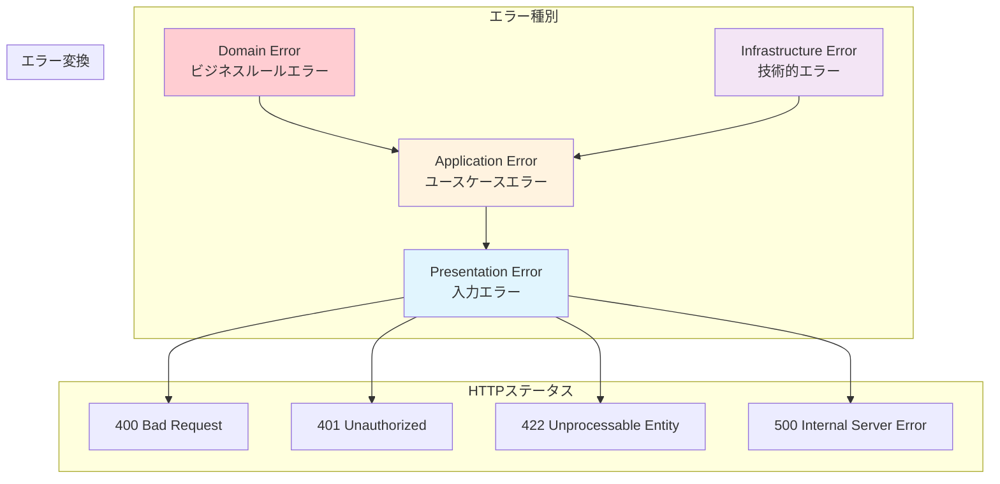

# レイヤー構成マップ

## メタデータ
| 項目 | 内容 |
|------|------|
| ドキュメントID | LAYER-001 |
| 関連文書 | ARCH-001, COMP-001, REQ-001 |
| 作成日 | 2025-01-28 |
| 最終更新日 | 2025-01-28 |
| 作成者 | プロセスエンジニア |
| STEP | 3.1 レイヤー構造定義 |
| インプット | システム構成図、技術選定・依存関係定義書 |
| アウトプット | レイヤー構成マップ |

## 1. レイヤードアーキテクチャ詳細構造

### 1.1 5層レイヤー設計



### 1.2 レイヤー責任マトリックス

| レイヤー | 責任範囲 | 含むもの | 含まないもの | 依存方向 |
|----------|----------|----------|-------------|----------|
| **Configuration** | アプリケーション起動・設定・DI | Express設定、ミドルウェア、起動処理、環境設定 | ビジネスロジック、データアクセス | → Presentation |
| **Presentation** | HTTP通信・認証・バリデーション | REST API、ルーティング、認証ミドルウェア、入力検証 | ビジネスルール、データ永続化 | → Application |
| **Application** | ユースケース実行・トランザクション | ビジネスユースケース、トランザクション管理、調整処理 | UI制御、データ実装詳細 | → Domain, Infrastructure |
| **Domain** | ビジネスルール・エンティティ | ドメインエンティティ、ビジネスルール、不変条件 | UI、データベース、外部システム | → なし（Pure） |
| **Infrastructure** | データアクセス・外部リソース | リポジトリ実装、データマッピング、外部API | ビジネスロジック、UI制御 | → Domain |

### 1.3 ファイル配置マッピング

| レイヤー | ファイル | ディレクトリ構造 | 行数目安 | 命名規則 |
|----------|----------|------------------|----------|----------|
| Configuration | app.ts | src/app.ts | 50-80行 | app.ts（固定） |
| Presentation | AppController.ts | src/controllers/AppController.ts | 200-250行 | *Controller.ts |
| Application | UserService.ts, TaskService.ts | src/services/*.ts | 180-220行, 250-300行 | *Service.ts |
| Domain | User.ts, Task.ts | src/domain/*.ts | 80-120行, 120-160行 | Entity名.ts |
| Infrastructure | UserRepository.ts, TaskRepository.ts | src/repositories/*.ts | 120-150行, 150-180行 | *Repository.ts |

## 2. レイヤー間の依存関係設計

### 2.1 依存関係ルール



### 2.2 インターフェース分離設計

| インターフェース | 定義場所 | 実装場所 | 目的 |
|-----------------|----------|----------|------|
| IUserRepository | Domain Layer | Infrastructure Layer | データアクセス抽象化 |
| ITaskRepository | Domain Layer | Infrastructure Layer | データアクセス抽象化 |
| IPasswordHasher | Application Layer | Infrastructure Layer | パスワードハッシュ化抽象化 |
| IJWTService | Application Layer | Infrastructure Layer | JWT処理抽象化 |

```typescript
// Domain Layer（抽象定義）
interface IUserRepository {
  findById(id: number): Promise<User | null>;
  findByEmail(email: string): Promise<User | null>;
  create(user: User): Promise<User>;
  update(user: User): Promise<User>;
  delete(id: number): Promise<void>;
}

// Infrastructure Layer（具象実装）
class UserRepository implements IUserRepository {
  // SQLite具体実装
}
```

## 3. レイヤー別設計詳細

### 3.1 Configuration Layer（app.ts）

#### 責任と役割
- **主責任**: アプリケーション全体の起動・設定・依存性注入
- **副責任**: 環境設定管理、ミドルウェア構成、エラーハンドリング設定

#### 設計パターン適用
| パターン名 | 適用箇所 | 効果 |
|------------|----------|------|
| Factory Pattern | アプリケーション作成 | 設定に応じた適切なインスタンス生成 |
| Dependency Injection | サービス注入 | テスタビリティ向上、疎結合実現 |
| Configuration Pattern | 環境設定管理 | 環境別設定の外部化 |

#### 主要コンポーネント
```typescript
class AppFactory {
  static create(config: AppConfig): Express {
    // Express アプリケーション作成
    // ミドルウェア設定
    // ルーティング設定
    // エラーハンドリング設定
  }
}

interface AppConfig {
  port: number;
  dbPath: string;
  jwtSecret: string;
  corsOrigin: string[];
  logLevel: 'debug' | 'info' | 'warn' | 'error';
}
```

### 3.2 Presentation Layer（AppController.ts）

#### 責任と役割
- **主責任**: HTTP通信制御、認証・認可、入力バリデーション
- **副責任**: レスポンス整形、エラー応答、APIドキュメンテーション

#### 設計パターン適用
| パターン名 | 適用箇所 | 効果 |
|------------|----------|------|
| Controller Pattern | リクエスト処理 | 責任分離、テストアビリティ |
| Decorator Pattern | 認証・バリデーション | 横断的関心事の分離 |
| DTO Pattern | データ転送 | レイヤー間データ整合性 |

#### RESTful API設計原則
| 原則 | 適用方法 | 例 |
|------|----------|---|
| リソース指向 | 名詞を使ったエンドポイント | /api/users, /api/tasks |
| HTTP動詞活用 | 操作に応じた適切な動詞 | GET（取得）, POST（作成）, PUT（更新）, DELETE（削除） |
| ステートレス | セッション状態を保持しない | JWT トークンベース認証 |
| 階層構造 | リソース階層の表現 | /api/users/:id/tasks |

### 3.3 Application Layer（UserService.ts, TaskService.ts）

#### 責任と役割
- **主責任**: ユースケース実行、ビジネスフロー制御、トランザクション管理
- **副責任**: ドメインオブジェクト調整、外部サービス連携

#### 設計パターン適用
| パターン名 | 適用箇所 | 効果 |
|------------|----------|------|
| Service Layer Pattern | ビジネスロジック集約 | 責任明確化、再利用性向上 |
| Transaction Script Pattern | 単純なビジネスフロー | 実装簡素化、理解しやすさ |
| Command Pattern | 操作の抽象化 | Undo機能、ログ記録 |

#### トランザクション境界設計
```typescript
interface TransactionManager {
  begin(): Promise<void>;
  commit(): Promise<void>;
  rollback(): Promise<void>;
  execute<T>(operation: () => Promise<T>): Promise<T>;
}

// 使用例
class UserService {
  async registerUser(userData: CreateUserRequest): Promise<User> {
    return this.transactionManager.execute(async () => {
      // 1. ユーザー作成
      const user = User.create(userData);
      // 2. 重複チェック
      await this.validateUserUniqueness(user);
      // 3. 永続化
      return await this.userRepository.create(user);
    });
  }
}
```

### 3.4 Domain Layer（User.ts, Task.ts）

#### 責任と役割
- **主責任**: ビジネスルール実装、不変条件保証、ドメイン知識表現
- **副責任**: エンティティライフサイクル管理、ドメインイベント発行

#### 設計パターン適用
| パターン名 | 適用箇所 | 効果 |
|------------|----------|------|
| Domain Model Pattern | ビジネスルール集約 | 業務知識の集中管理 |
| Value Object Pattern | 値の表現 | 不変性、型安全性 |
| Factory Pattern | エンティティ作成 | 複雑な作成ロジックの隠蔽 |

#### 不変条件設計
```typescript
class User {
  private constructor(private props: UserProps) {
    this.validate();
  }
  
  private validate(): void {
    if (!this.props.email || !this.isValidEmail(this.props.email)) {
      throw new InvalidEmailError();
    }
    if (!this.props.name || this.props.name.length > 100) {
      throw new InvalidNameError();
    }
    // その他の不変条件チェック
  }
  
  static create(props: CreateUserProps): User {
    return new User({
      ...props,
      id: undefined, // 新規作成時はundefined
      createdAt: new Date(),
      updatedAt: new Date()
    });
  }
}
```

### 3.5 Infrastructure Layer（UserRepository.ts, TaskRepository.ts）

#### 責任と役割
- **主責任**: データ永続化、外部システム連携、技術的実装詳細
- **副責任**: データマッピング、クエリ最適化、接続管理

#### 設計パターン適用
| パターン名 | 適用箇所 | 効果 |
|------------|----------|------|
| Repository Pattern | データアクセス抽象化 | テストアビリティ、技術独立性 |
| Data Mapper Pattern | O/Rマッピング | ドメインモデル純粋性保持 |
| Unit of Work Pattern | トランザクション管理 | 整合性保証、パフォーマンス向上 |

#### データアクセス設計
```typescript
class UserRepository implements IUserRepository {
  constructor(private db: Database) {}
  
  async findById(id: number): Promise<User | null> {
    const query = `
      SELECT id, name, email, password_hash, created_at, updated_at 
      FROM users 
      WHERE id = ? AND deleted_at IS NULL
    `;
    const row = await this.db.get(query, [id]);
    return row ? this.mapToUser(row) : null;
  }
  
  private mapToUser(row: any): User {
    return User.reconstitute({
      id: row.id,
      name: row.name,
      email: row.email,
      passwordHash: row.password_hash,
      createdAt: new Date(row.created_at),
      updatedAt: new Date(row.updated_at)
    });
  }
}
```

## 4. 層間通信プロトコル

### 4.1 データ転送オブジェクト（DTO）設計

```typescript
// Presentation → Application
interface CreateUserRequest {
  name: string;
  email: string;
  password: string;
}

interface UserResponse {
  id: number;
  name: string;
  email: string;
  createdAt: string;
}

// Application → Infrastructure
interface UserPersistenceModel {
  id?: number;
  name: string;
  email: string;
  password_hash: string;
  created_at: Date;
  updated_at: Date;
  deleted_at?: Date;
}
```

### 4.2 エラー伝播設計



## 5. 品質属性実現方式

### 5.1 保守性実現
| 手法 | 適用レイヤー | 効果 |
|------|-------------|------|
| 単一責任原則 | 全レイヤー | 変更影響範囲の局所化 |
| 依存性逆転 | Application ↔ Infrastructure | 技術変更への対応力向上 |
| インターフェース分離 | Domain ↔ Infrastructure | 契約ベース開発 |

### 5.2 テスタビリティ実現
| 手法 | 適用レイヤー | 効果 |
|------|-------------|------|
| 依存性注入 | Application, Infrastructure | モック可能性 |
| Pure Function | Domain | 副作用なしテスト |
| Repository パターン | Infrastructure | データアクセステスト分離 |

### 5.3 パフォーマンス実現
| 手法 | 適用レイヤー | 効果 |
|------|-------------|------|
| 遅延読み込み | Infrastructure | 必要時のみデータ取得 |
| 接続プール | Infrastructure | データベース接続効率化 |
| キャッシュ | Application | 重複処理削減 |

## 6. 完了確認チェックリスト

### 6.1 設計完了確認
- [ ] 5層のレイヤー責任が明確に定義されている
- [ ] 8ファイルが適切なレイヤーに配置されている
- [ ] 依存関係ルールが設計に反映されている
- [ ] インターフェース分離原則が適用されている
- [ ] 各レイヤーの設計パターンが適切に選択されている

### 6.2 制約遵守確認
- [ ] 8ファイル構成が維持されている
- [ ] 行数配分が1000-1500行範囲内
- [ ] TypeScript + Express.js + SQLite技術スタック準拠
- [ ] RESTful API設計原則準拠

### 6.3 品質要件確認
- [ ] 保守性を高める設計となっている
- [ ] テスタビリティが確保されている
- [ ] パフォーマンス要件が考慮されている
- [ ] セキュリティ要件が各レイヤーに組み込まれている

### 6.4 次段階準備確認
- [ ] クラス設計の基盤が整備されている
- [ ] インターフェース設計の指針が明確
- [ ] データフロー設計の前提が確立されている
- [ ] 依存関係制約が明確に定義されている

---

**完了確認**: ✅ レイヤー構成マップ作成完了
**次サブステップ**: 3.2 クラス定義（本レイヤー構成を基盤とする）
**更新日**: 2025-01-28 