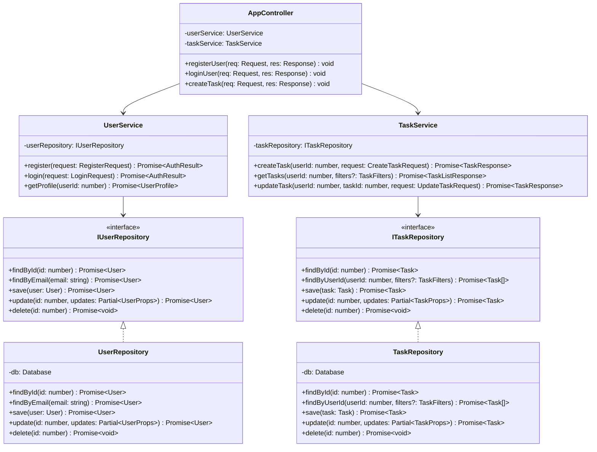
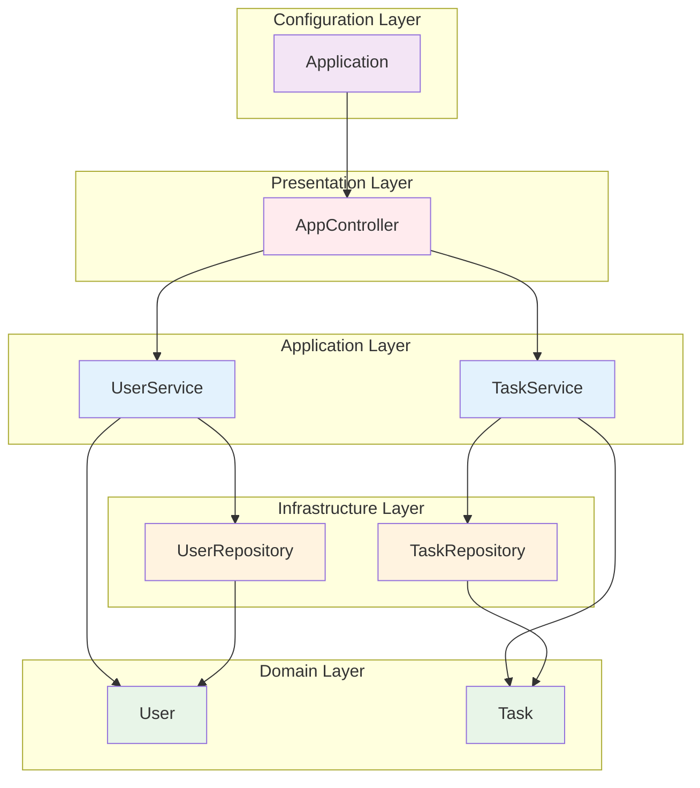
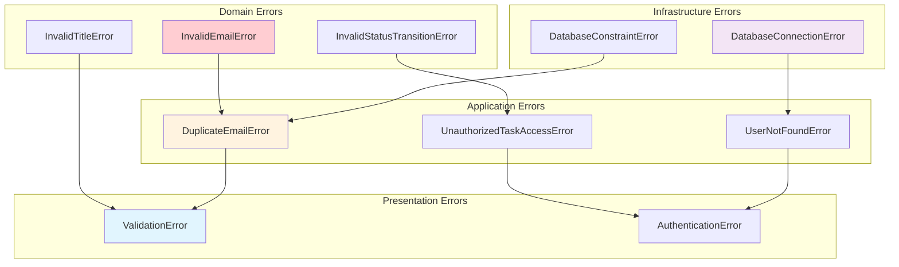

# クラス設計表

## メタデータ
| 項目 | 内容 |
|------|------|
| ドキュメントID | CLASS-001 |
| 関連文書 | LAYER-001, COMP-001, REQ-001 |
| 作成日 | 2025-01-28 |
| 最終更新日 | 2025-01-28 |
| 作成者 | プロセスエンジニア |
| STEP | 3.2 クラス定義 |
| インプット | 機能一覧表、レイヤー構成マップ |
| アウトプット | クラス設計表 |

## 1. クラス一覧概要

### 1.1 クラス構成マトリックス

| クラスID | クラス名 | ファイル名 | レイヤー | 設計パターン | 主要責任 | 依存先 |
|----------|----------|------------|----------|-------------|----------|---------|
| CLS-001 | Application | app.ts | Configuration | Factory, Singleton | アプリ起動・設定 | AppController |
| CLS-002 | AppController | AppController.ts | Presentation | Controller, Decorator | HTTP制御・認証 | UserService, TaskService |
| CLS-003 | User | User.ts | Domain | Entity, Factory | ユーザードメイン | なし |
| CLS-004 | Task | Task.ts | Domain | Entity, State Machine | タスクドメイン | なし |
| CLS-005 | UserService | UserService.ts | Application | Service Layer | ユーザーUC実行 | User, UserRepository |
| CLS-006 | TaskService | TaskService.ts | Application | Service Layer | タスクUC実行 | Task, TaskRepository |
| CLS-007 | UserRepository | UserRepository.ts | Infrastructure | Repository, Data Mapper | ユーザーデータ永続化 | User |
| CLS-008 | TaskRepository | TaskRepository.ts | Infrastructure | Repository, Data Mapper | タスクデータ永続化 | Task |

### 1.2 継承・実装関係図



## 2. クラス詳細設計

### CLS-001: Application（app.ts）

#### 基本情報
| 項目 | 内容 |
|------|------|
| **クラス名** | Application |
| **ファイルパス** | src/app.ts |
| **レイヤー** | Configuration Layer |
| **設計パターン** | Factory Pattern, Singleton Pattern |
| **行数目安** | 60-80行 |
| **主要責任** | Express.jsアプリケーション初期化・設定・起動 |

#### クラス構造
```typescript
class Application {
    private static instance: Application;
    private app: Express;
    private server?: Server;
    private db?: Database;
    
    private constructor() {}
    
    public static getInstance(): Application
    public async initialize(config: AppConfig): Promise<void>
    public async start(): Promise<void>
    public async stop(): Promise<void>
    private setupMiddleware(): void
    private setupRoutes(): void
    private connectDatabase(): Promise<void>
    private handleShutdown(): void
}
```

#### 属性設計
| 属性名 | 型 | 可視性 | 初期値 | 説明 |
|--------|----|----|--------|------|
| instance | Application | private static | undefined | シングルトンインスタンス |
| app | Express | private | undefined | Expressアプリケーション |
| server | Server | private | undefined | HTTPサーバーインスタンス |
| db | Database | private | undefined | データベース接続 |

#### メソッド設計
| メソッド名 | 可視性 | 引数 | 戻り値 | 責任 | 例外 |
|------------|--------|------|--------|------|------|
| getInstance | public static | なし | Application | シングルトンインスタンス取得 | なし |
| initialize | public | config: AppConfig | Promise<void> | アプリケーション初期化 | ConfigurationError |
| start | public | なし | Promise<void> | サーバー起動 | ServerStartError |
| stop | public | なし | Promise<void> | サーバー停止 | ServerStopError |
| setupMiddleware | private | なし | void | ミドルウェア設定 | なし |
| setupRoutes | private | なし | void | ルーティング設定 | なし |
| connectDatabase | private | なし | Promise<void> | データベース接続 | DatabaseConnectionError |
| handleShutdown | private | なし | void | 終了処理 | なし |

#### 設計制約
- シングルトンパターンにより1つのインスタンスのみ存在
- 環境変数によるconfiguration外部化
- グレースフルシャットダウン対応
- エラーハンドリングの集約

### CLS-002: AppController（AppController.ts）

#### 基本情報
| 項目 | 内容 |
|------|------|
| **クラス名** | AppController |
| **ファイルパス** | src/controllers/AppController.ts |
| **レイヤー** | Presentation Layer |
| **設計パターン** | Controller Pattern, Decorator Pattern |
| **行数目安** | 220-250行 |
| **主要責任** | HTTP制御・認証・バリデーション・レスポンス生成 |

#### クラス構造
```typescript
class AppController {
    private userService: UserService;
    private taskService: TaskService;
    private validator: RequestValidator;
    private authenticator: JWTAuthenticator;
    
    constructor(userService: UserService, taskService: TaskService)
    
    // 認証関連
    public registerUser(req: Request, res: Response): Promise<void>
    public loginUser(req: Request, res: Response): Promise<void>
    
    // ユーザー関連
    public getUserProfile(req: AuthRequest, res: Response): Promise<void>
    public updateUserProfile(req: AuthRequest, res: Response): Promise<void>
    
    // タスク関連
    public getTasks(req: AuthRequest, res: Response): Promise<void>
    public createTask(req: AuthRequest, res: Response): Promise<void>
    public getTask(req: AuthRequest, res: Response): Promise<void>
    public updateTask(req: AuthRequest, res: Response): Promise<void>
    public deleteTask(req: AuthRequest, res: Response): Promise<void>
    
    // プライベートヘルパー
    private handleError(error: Error, res: Response): void
    private validateRequest(req: Request, schema: ValidationSchema): ValidationResult
    private extractUserId(req: AuthRequest): number
}
```

#### 属性設計
| 属性名 | 型 | 可視性 | 初期値 | 説明 |
|--------|----|----|--------|------|
| userService | UserService | private | constructor注入 | ユーザーサービス |
| taskService | TaskService | private | constructor注入 | タスクサービス |
| validator | RequestValidator | private | new RequestValidator() | リクエストバリデータ |
| authenticator | JWTAuthenticator | private | new JWTAuthenticator() | JWT認証器 |

#### メソッド設計
| メソッド名 | 可視性 | 引数 | 戻り値 | 対応UC | HTTP |
|------------|--------|------|--------|--------|------|
| registerUser | public | req, res | Promise<void> | UC-001 | POST /api/auth/register |
| loginUser | public | req, res | Promise<void> | UC-002 | POST /api/auth/login |
| getUserProfile | public | req, res | Promise<void> | UC-003 | GET /api/users/profile |
| updateUserProfile | public | req, res | Promise<void> | UC-003 | PUT /api/users/profile |
| getTasks | public | req, res | Promise<void> | UC-005 | GET /api/tasks |
| createTask | public | req, res | Promise<void> | UC-004 | POST /api/tasks |
| getTask | public | req, res | Promise<void> | UC-005 | GET /api/tasks/:id |
| updateTask | public | req, res | Promise<void> | UC-006 | PUT /api/tasks/:id |
| deleteTask | public | req, res | Promise<void> | UC-007 | DELETE /api/tasks/:id |

#### バリデーション設計
| エンドポイント | バリデーションルール | エラー応答 |
|---------------|---------------------|------------|
| POST /api/auth/register | name(必須,1-100文字), email(必須,形式), password(必須,8文字以上) | 400 Bad Request |
| POST /api/auth/login | email(必須,形式), password(必須) | 400 Bad Request |
| POST /api/tasks | title(必須,1-200文字), priority(enum), description(500文字以下) | 400 Bad Request |
| PUT /api/tasks/:id | id(数値), title(1-200文字), priority(enum), description(500文字以下) | 400 Bad Request |

#### 認証設計
| 認証方式 | 適用範囲 | トークン検証 | エラー応答 |
|----------|----------|-------------|------------|
| JWT Bearer Token | 全API（認証系除く） | 署名検証・有効期限チェック | 401 Unauthorized |
| なし | /api/auth/* | - | - |

### CLS-003: User（User.ts）

#### 基本情報
| 項目 | 内容 |
|------|------|
| **クラス名** | User |
| **ファイルパス** | src/domain/User.ts |
| **レイヤー** | Domain Layer |
| **設計パターン** | Entity Pattern, Factory Pattern |
| **行数目安** | 90-120行 |
| **主要責任** | ユーザードメインエンティティ・ビジネスルール実装 |

#### クラス構造
```typescript
class User {
    private readonly id?: number;
    private props: UserProps;
    
    private constructor(props: UserProps, id?: number)
    
    // ファクトリメソッド
    public static create(props: CreateUserProps): User
    public static reconstitute(props: UserProps, id: number): User
    
    // ドメインメソッド
    public updateProfile(name: string, email: string): User
    public changePassword(newPasswordHash: string): User
    public isValidForRegistration(): ValidationResult
    
    // アクセサ
    public getId(): number | undefined
    public getName(): string
    public getEmail(): string
    public getPasswordHash(): string
    public getCreatedAt(): Date
    public getUpdatedAt(): Date
    
    // ビジネスルール
    private validateEmail(email: string): boolean
    private validateName(name: string): boolean
    private validatePasswordHash(passwordHash: string): boolean
    
    // シリアライゼーション
    public toJSON(): UserJSON
    public equals(other: User): boolean
}
```

#### 属性設計
| 属性名 | 型 | 可視性 | 説明 | 不変条件 |
|--------|----|----|------|----------|
| id | number | private readonly | ユーザーID | 一度設定されたら変更不可 |
| props | UserProps | private | ユーザープロパティ | バリデーション必須 |

#### ドメインルール設計
| ルール名 | 検証条件 | 例外型 | エラーメッセージ |
|----------|----------|--------|-----------------|
| メール形式 | RFC5322準拠 | InvalidEmailError | "有効なメールアドレスを入力してください" |
| メール一意性 | 重複不可 | DuplicateEmailError | "このメールアドレスは既に使用されています" |
| 名前必須 | 1-100文字 | InvalidNameError | "名前は1文字以上100文字以下で入力してください" |
| パスワード強度 | ハッシュ化済み前提 | WeakPasswordError | "パスワードが要件を満たしていません" |

#### 不変条件
- ユーザーIDは一度設定されたら変更不可
- メールアドレスは常に有効な形式
- 名前は常に1文字以上100文字以下
- パスワードハッシュは必須
- 作成日時・更新日時は自動管理

### CLS-004: Task（Task.ts）

#### 基本情報
| 項目 | 内容 |
|------|------|
| **クラス名** | Task |
| **ファイルパス** | src/domain/Task.ts |
| **レイヤー** | Domain Layer |
| **設計パターン** | Entity Pattern, State Machine Pattern |
| **行数目安** | 130-160行 |
| **主要責任** | タスクドメインエンティティ・状態管理・ビジネスルール |

#### クラス構造
```typescript
class Task {
    private readonly id?: number;
    private props: TaskProps;
    
    private constructor(props: TaskProps, id?: number)
    
    // ファクトリメソッド
    public static create(props: CreateTaskProps): Task
    public static reconstitute(props: TaskProps, id: number): Task
    
    // ドメインメソッド
    public updateTitle(title: string): Task
    public updateDescription(description: string): Task
    public changePriority(priority: TaskPriority): Task
    public changeStatus(newStatus: TaskStatus): Task
    public setCategory(category: string): Task
    public assignToUser(userId: number): Task
    
    // 状態管理
    public canTransitionTo(newStatus: TaskStatus): boolean
    public getValidTransitions(): TaskStatus[]
    
    // ビジネスルール
    public isOwner(userId: number): boolean
    public isValidForCreation(): ValidationResult
    public canBeDeletedBy(userId: number): boolean
    
    // アクセサ
    public getId(): number | undefined
    public getUserId(): number
    public getTitle(): string
    public getDescription(): string
    public getStatus(): TaskStatus
    public getPriority(): TaskPriority
    public getCategory(): string
    public getCreatedAt(): Date
    public getUpdatedAt(): Date
    
    // プライベート
    private validateTitle(title: string): boolean
    private validateDescription(description: string): boolean
    private validateCategory(category: string): boolean
    
    // シリアライゼーション
    public toJSON(): TaskJSON
    public equals(other: Task): boolean
}
```

#### 状態遷移設計
| 現在状態 | 遷移可能状態 | 条件 | ビジネスルール |
|----------|-------------|------|---------------|
| PENDING | IN_PROGRESS, COMPLETED | なし | 全遷移許可 |
| IN_PROGRESS | PENDING, COMPLETED | なし | 全遷移許可 |
| COMPLETED | PENDING, IN_PROGRESS | なし | 全遷移許可（再開可能） |

#### ドメインルール設計
| ルール名 | 検証条件 | 例外型 | エラーメッセージ |
|----------|----------|--------|-----------------|
| タイトル必須 | 1-200文字 | InvalidTitleError | "タスク名は1文字以上200文字以下で入力してください" |
| 所有者制限 | 作成者のみ編集可能 | UnauthorizedTaskAccessError | "このタスクを編集する権限がありません" |
| 状態遷移 | 有効な遷移のみ | InvalidStatusTransitionError | "無効な状態遷移です" |
| カテゴリ制限 | 50文字以下 | InvalidCategoryError | "カテゴリは50文字以下で入力してください" |

#### Enum定義
```typescript
enum TaskStatus {
    PENDING = 'pending',
    IN_PROGRESS = 'in_progress',
    COMPLETED = 'completed'
}

enum TaskPriority {
    LOW = 'low',
    MEDIUM = 'medium',
    HIGH = 'high'
}
```

### CLS-005: UserService（UserService.ts）

#### 基本情報
| 項目 | 内容 |
|------|------|
| **クラス名** | UserService |
| **ファイルパス** | src/services/UserService.ts |
| **レイヤー** | Application Layer |
| **設計パターン** | Service Layer Pattern, Transaction Script Pattern |
| **行数目安** | 190-220行 |
| **主要責任** | ユーザーユースケース実行・認証ロジック・トランザクション管理 |

#### クラス構造
```typescript
class UserService {
    private userRepository: IUserRepository;
    private passwordHasher: IPasswordHasher;
    private jwtService: IJWTService;
    private transactionManager: ITransactionManager;
    
    constructor(
        userRepository: IUserRepository,
        passwordHasher: IPasswordHasher,
        jwtService: IJWTService,
        transactionManager: ITransactionManager
    )
    
    // ユースケースメソッド
    public async register(request: RegisterRequest): Promise<AuthResult>
    public async login(request: LoginRequest): Promise<AuthResult>
    public async getProfile(userId: number): Promise<UserProfile>
    public async updateProfile(userId: number, request: UpdateProfileRequest): Promise<UserProfile>
    
    // 内部メソッド
    private async validateCredentials(email: string, password: string): Promise<User>
    private generateToken(user: User): string
    private async ensureEmailUniqueness(email: string, excludeUserId?: number): Promise<void>
    private mapToUserProfile(user: User): UserProfile
    private mapToAuthResult(user: User, token: string): AuthResult
}
```

#### メソッド詳細設計
| メソッド名 | トランザクション | エラーハンドリング | 対応UC |
|------------|------------------|-------------------|--------|
| register | あり（ユーザー作成） | DuplicateEmailError, ValidationError | UC-001 |
| login | なし | InvalidCredentialsError | UC-002 |
| getProfile | なし | UserNotFoundError | UC-003 |
| updateProfile | あり（プロフィール更新） | DuplicateEmailError, ValidationError | UC-003 |

#### 依存性注入設計
| インターフェース | 実装クラス | 責任 |
|-----------------|------------|------|
| IUserRepository | UserRepository | ユーザーデータ永続化 |
| IPasswordHasher | BCryptPasswordHasher | パスワードハッシュ化 |
| IJWTService | JWTService | JWT生成・検証 |
| ITransactionManager | SQLiteTransactionManager | トランザクション管理 |

### CLS-006: TaskService（TaskService.ts）

#### 基本情報
| 項目 | 内容 |
|------|------|
| **クラス名** | TaskService |
| **ファイルパス** | src/services/TaskService.ts |
| **レイヤー** | Application Layer |
| **設計パターン** | Service Layer Pattern, Command Pattern |
| **行数目安** | 260-300行 |
| **主要責任** | タスクユースケース実行・権限制御・ビジネスフロー制御 |

#### クラス構造
```typescript
class TaskService {
    private taskRepository: ITaskRepository;
    private transactionManager: ITransactionManager;
    
    constructor(
        taskRepository: ITaskRepository,
        transactionManager: ITransactionManager
    )
    
    // ユースケースメソッド
    public async createTask(userId: number, request: CreateTaskRequest): Promise<TaskResponse>
    public async getTasks(userId: number, filters?: TaskFilters): Promise<TaskListResponse>
    public async getTask(userId: number, taskId: number): Promise<TaskResponse>
    public async updateTask(userId: number, taskId: number, request: UpdateTaskRequest): Promise<TaskResponse>
    public async deleteTask(userId: number, taskId: number): Promise<void>
    public async changeTaskStatus(userId: number, taskId: number, status: TaskStatus): Promise<TaskResponse>
    public async getCategories(userId: number): Promise<string[]>
    public async updateCategory(userId: number, oldCategory: string, newCategory: string): Promise<void>
    
    // 内部メソッド
    private async ensureTaskOwnership(userId: number, taskId: number): Promise<Task>
    private async validateTaskPermission(userId: number, task: Task): Promise<void>
    private mapToTaskResponse(task: Task): TaskResponse
    private mapToTaskListResponse(tasks: Task[], total: number, page: number, limit: number): TaskListResponse
    private buildTaskFilters(filters?: TaskFilters): QueryFilters
}
```

#### 権限制御設計
| メソッド | 権限チェック | エラー応答 |
|----------|-------------|-----------|
| getTasks | ユーザー自身のタスクのみ | 自動フィルタリング |
| getTask | タスク所有者のみ | TaskNotFoundError |
| updateTask | タスク所有者のみ | UnauthorizedTaskAccessError |
| deleteTask | タスク所有者のみ | UnauthorizedTaskAccessError |
| changeTaskStatus | タスク所有者のみ | UnauthorizedTaskAccessError |

#### トランザクション設計
| メソッド | トランザクション範囲 | ロールバック条件 |
|----------|---------------------|-----------------|
| createTask | タスク作成 | バリデーションエラー |
| updateTask | タスク更新 | 権限エラー、バリデーションエラー |
| deleteTask | タスク削除 | 権限エラー |
| updateCategory | カテゴリ一括更新 | 権限エラー、データ整合性エラー |

### CLS-007: UserRepository（UserRepository.ts）

#### 基本情報
| 項目 | 内容 |
|------|------|
| **クラス名** | UserRepository |
| **ファイルパス** | src/repositories/UserRepository.ts |
| **レイヤー** | Infrastructure Layer |
| **設計パターン** | Repository Pattern, Data Mapper Pattern |
| **行数目安** | 130-150行 |
| **主要責任** | ユーザーデータ永続化・SQLクエリ実行・データマッピング |

#### クラス構造
```typescript
class UserRepository implements IUserRepository {
    private db: Database;
    
    constructor(db: Database)
    
    // IUserRepository実装
    public async findById(id: number): Promise<User | null>
    public async findByEmail(email: string): Promise<User | null>
    public async save(user: User): Promise<User>
    public async update(id: number, updates: Partial<UserProps>): Promise<User>
    public async delete(id: number): Promise<void>
    
    // 拡張メソッド
    public async exists(email: string): Promise<boolean>
    public async count(): Promise<number>
    
    // データマッピング
    private mapToUser(row: any): User
    private mapToUserRow(user: User): UserRow
    private mapToUpdateRow(updates: Partial<UserProps>): Partial<UserRow>
    
    // SQLクエリ
    private buildSelectQuery(conditions: QueryConditions): string
    private buildUpdateQuery(id: number, updates: Partial<UserRow>): string
}
```

#### SQL設計
| メソッド | SQLクエリ | インデックス活用 |
|----------|-----------|-----------------|
| findById | SELECT * FROM users WHERE id = ? AND deleted_at IS NULL | PRIMARY KEY |
| findByEmail | SELECT * FROM users WHERE email = ? AND deleted_at IS NULL | idx_users_email |
| save | INSERT INTO users (...) VALUES (...) | - |
| update | UPDATE users SET ... WHERE id = ? | PRIMARY KEY |
| exists | SELECT COUNT(*) FROM users WHERE email = ? | idx_users_email |

#### データマッピング設計
| ドメイン属性 | データベース列 | 変換処理 |
|-------------|---------------|----------|
| id | id | number → number |
| name | name | string → string |
| email | email | string → string (toLowerCase) |
| passwordHash | password_hash | string → string |
| createdAt | created_at | Date → ISO string |
| updatedAt | updated_at | Date → ISO string |

### CLS-008: TaskRepository（TaskRepository.ts）

#### 基本情報
| 項目 | 内容 |
|------|------|
| **クラス名** | TaskRepository |
| **ファイルパス** | src/repositories/TaskRepository.ts |
| **レイヤー** | Infrastructure Layer |
| **設計パターン** | Repository Pattern, Query Object Pattern |
| **行数目安** | 160-180行 |
| **主要責任** | タスクデータ永続化・複雑クエリ実行・検索機能 |

#### クラス構造
```typescript
class TaskRepository implements ITaskRepository {
    private db: Database;
    
    constructor(db: Database)
    
    // ITaskRepository実装
    public async findById(id: number): Promise<Task | null>
    public async findByUserId(userId: number, filters?: TaskFilters): Promise<Task[]>
    public async save(task: Task): Promise<Task>
    public async update(id: number, updates: Partial<TaskProps>): Promise<Task>
    public async delete(id: number): Promise<void>
    
    // 拡張メソッド
    public async findByCategory(userId: number, category: string): Promise<Task[]>
    public async getCategories(userId: number): Promise<string[]>
    public async countByUserId(userId: number, filters?: TaskFilters): Promise<number>
    public async updateCategory(userId: number, oldCategory: string, newCategory: string): Promise<void>
    
    // データマッピング
    private mapToTask(row: any): Task
    private mapToTaskRow(task: Task): TaskRow
    private mapToUpdateRow(updates: Partial<TaskProps>): Partial<TaskRow>
    
    // クエリビルダー
    private buildFilterQuery(userId: number, filters?: TaskFilters): QueryBuilder
    private buildSortClause(sortBy?: string, sortOrder?: string): string
    private buildPaginationClause(limit?: number, offset?: number): string
}
```

#### 複雑クエリ設計
| クエリ種別 | SQL例 | 最適化手法 |
|------------|-------|-----------|
| フィルタ検索 | WHERE user_id = ? AND status = ? AND priority = ? | 複合インデックス |
| カテゴリ一覧 | SELECT DISTINCT category FROM tasks WHERE user_id = ? | DISTINCT最適化 |
| ページネーション | SELECT ... LIMIT ? OFFSET ? | インデックススキャン |
| カテゴリ更新 | UPDATE tasks SET category = ? WHERE user_id = ? AND category = ? | 一括更新 |

#### インデックス設計
| インデックス名 | 列 | 用途 |
|---------------|----|----|
| idx_tasks_user_id | user_id | ユーザー別検索 |
| idx_tasks_user_status | user_id, status | 状態別フィルタ |
| idx_tasks_category | category | カテゴリ別検索 |
| idx_tasks_created_at | created_at | 作成日ソート |

## 3. クラス間関係設計

### 3.1 依存関係マトリックス

| 依存元 ↓ / 依存先 → | Application | AppController | User | Task | UserService | TaskService | UserRepository | TaskRepository |
|---------------------|-------------|---------------|------|------|-------------|-------------|---------------|---------------|
| **Application** | - | ● | - | - | - | - | - | - |
| **AppController** | - | - | - | - | ● | ● | - | - |
| **User** | - | - | - | - | - | - | - | - |
| **Task** | - | - | - | - | - | - | - | - |
| **UserService** | - | - | ● | - | - | - | ● | - |
| **TaskService** | - | - | - | ● | - | - | - | ● |
| **UserRepository** | - | - | ● | - | - | - | - | - |
| **TaskRepository** | - | - | - | ● | - | - | - | - |

### 3.2 コラボレーション図



### 3.3 ライフサイクル関係

| フェーズ | 関係するクラス | 処理内容 |
|----------|---------------|----------|
| **起動** | Application | DI設定、サーバー起動 |
| **リクエスト受信** | AppController | HTTP処理、認証、バリデーション |
| **ビジネス処理** | UserService, TaskService | ユースケース実行、トランザクション管理 |
| **ドメイン処理** | User, Task | ビジネスルール適用、状態変更 |
| **データ永続化** | UserRepository, TaskRepository | SQL実行、データマッピング |

## 4. 設計品質確保

### 4.1 SOLID原則準拠確認

| 原則 | 適用クラス | 確認項目 | 適用状況 |
|------|------------|----------|----------|
| **単一責任原則(SRP)** | 全クラス | 各クラスが単一の責任を持つ | ✅ 適用済み |
| **開放閉鎖原則(OCP)** | Service, Repository | インターフェースによる拡張性 | ✅ 適用済み |
| **リスコフ置換原則(LSP)** | Repository実装 | インターフェース契約遵守 | ✅ 適用済み |
| **インターフェース分離原則(ISP)** | Repository | 細粒度インターフェース | ✅ 適用済み |
| **依存性逆転原則(DIP)** | Service層 | 抽象への依存 | ✅ 適用済み |

### 4.2 設計パターン適用状況

| パターン | 適用クラス | 効果 | 品質向上 |
|----------|------------|------|----------|
| **Singleton** | Application | インスタンス一意性 | 設定管理の一元化 |
| **Factory** | User, Task | オブジェクト生成制御 | 不変条件保証 |
| **Repository** | UserRepository, TaskRepository | データアクセス抽象化 | テスタビリティ向上 |
| **Service Layer** | UserService, TaskService | ビジネスロジック集約 | 責任明確化 |
| **Controller** | AppController | プレゼンテーション制御 | 関心事分離 |

### 4.3 エラー設計統合



## 5. 完了確認チェックリスト

### 5.1 設計完了確認
- ✅ 8つのクラスが全て定義されている
- ✅ 各クラスの責任が明確に定義されている
- ✅ クラス間の依存関係が適切に設計されている
- ✅ レイヤー構成マップとの整合性が確保されている
- ✅ 設計パターンが適切に適用されている

### 5.2 制約遵守確認
- ✅ 8ファイル構成が維持されている
- ✅ 行数配分が制約範囲内（1000-1500行）
- ✅ TypeScript + Express.js + SQLite技術スタック準拠
- ✅ レイヤードアーキテクチャ原則遵守

### 5.3 品質要件確認
- ✅ SOLID原則が全クラスに適用されている
- ✅ 設計パターンが効果的に使用されている
- ✅ エラーハンドリングが体系的に設計されている
- ✅ テスタビリティが確保されている

### 5.4 次段階準備確認
- ✅ メソッド設計の基盤が整備されている
- ✅ インターフェース設計の前提が明確
- ✅ データ型設計の準備が完了している
- ✅ シーケンス設計の基盤が確立されている

---

**完了確認**: ✅ クラス設計表作成完了  
**次サブステップ**: 3.3 メソッド設計（本クラス設計を基盤とする）  
**更新日**: 2025-01-28  
**セルフチェック実施**: ✅ 完全性・網羅性確認済み 