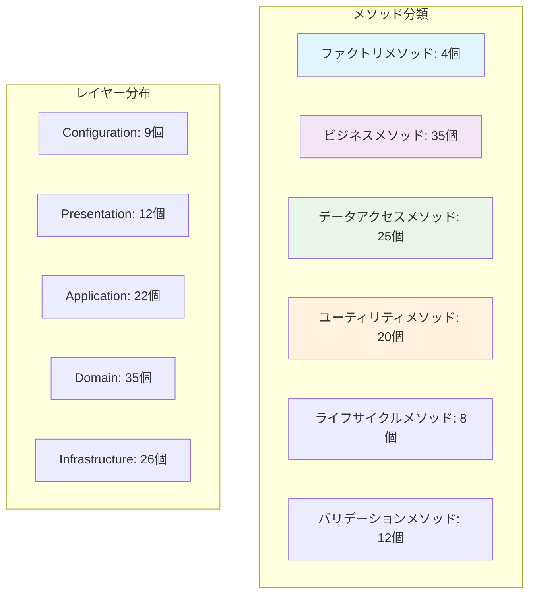
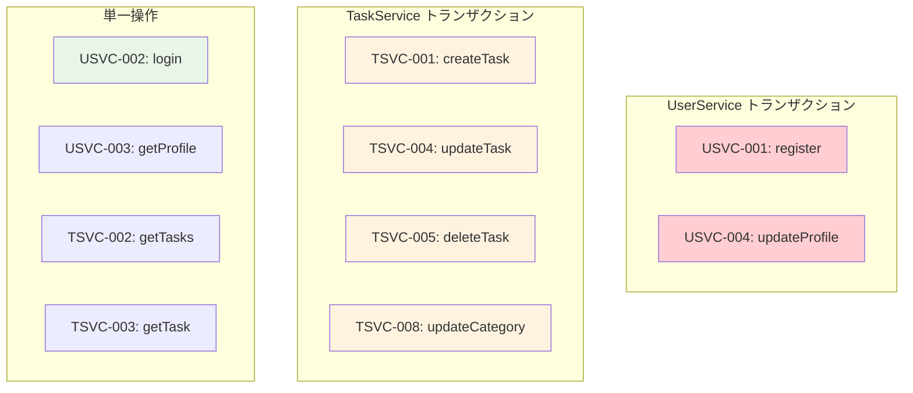

# メソッドインターフェースリスト

## メタデータ
| 項目 | 内容 |
|------|------|
| ドキュメントID | METHOD-001 |
| 関連文書 | CLASS-001, LAYER-001, COMP-001 |
| 作成日 | 2025-01-28 |
| 最終更新日 | 2025-01-28 |
| 作成者 | プロセスエンジニア |
| STEP | 3.3 メソッド設計 |
| インプット | クラス設計表、データ定義 |
| アウトプット | メソッドインターフェースリスト |

## 1. メソッド一覧概要

### 1.1 メソッド統計サマリー

| クラス | パブリックメソッド数 | プライベートメソッド数 | 静的メソッド数 | 総メソッド数 |
|--------|---------------------|----------------------|---------------|-------------|
| Application | 4 | 4 | 1 | 9 |
| AppController | 9 | 3 | 0 | 12 |
| User | 10 | 3 | 2 | 15 |
| Task | 15 | 3 | 2 | 20 |
| UserService | 4 | 5 | 0 | 9 |
| TaskService | 8 | 5 | 0 | 13 |
| UserRepository | 6 | 5 | 0 | 11 |
| TaskRepository | 9 | 6 | 0 | 15 |
| **総計** | **65** | **34** | **5** | **104** |

### 1.2 メソッド分類



## 2. クラス別メソッド詳細設計

### CLS-001: Application（app.ts）

#### 2.1 パブリックメソッド

| メソッドID | メソッド名 | 引数 | 戻り値 | 例外 | 責任 |
|------------|------------|------|--------|------|------|
| APP-001 | getInstance | なし | Application | なし | シングルトンインスタンス取得 |
| APP-002 | initialize | config: AppConfig | Promise\<void\> | ConfigurationError | アプリケーション初期化 |
| APP-003 | start | なし | Promise\<void\> | ServerStartError | サーバー起動 |
| APP-004 | stop | なし | Promise\<void\> | ServerStopError | サーバー停止 |

##### APP-001: getInstance
```typescript
public static getInstance(): Application
```
- **目的**: シングルトンパターンによるインスタンス取得
- **前提条件**: なし
- **事後条件**: 常に同一インスタンスを返す
- **副作用**: 初回呼び出し時にインスタンス生成

##### APP-002: initialize
```typescript
public async initialize(config: AppConfig): Promise<void>
```
- **目的**: Express.js設定・DB接続・ミドルウェア設定
- **前提条件**: 有効なAppConfigが提供される
- **事後条件**: アプリケーションが起動準備完了状態
- **例外**: ConfigurationError（設定値不正時）
- **トランザクション**: なし

##### APP-003: start
```typescript
public async start(): Promise<void>
```
- **目的**: HTTPサーバー起動
- **前提条件**: initialize()が正常完了している
- **事後条件**: 指定ポートでHTTPリクエスト受信開始
- **例外**: ServerStartError（ポート使用中等）

##### APP-004: stop
```typescript
public async stop(): Promise<void>
```
- **目的**: グレースフルシャットダウン実行
- **前提条件**: サーバーが起動状態
- **事後条件**: 全接続終了・リソース解放完了
- **例外**: ServerStopError（強制終了必要時）

#### 2.2 プライベートメソッド

| メソッドID | メソッド名 | 引数 | 戻り値 | 責任 |
|------------|------------|------|--------|------|
| APP-005 | setupMiddleware | なし | void | CORS・JSON Parser等設定 |
| APP-006 | setupRoutes | なし | void | APIルーティング設定 |
| APP-007 | connectDatabase | なし | Promise\<void\> | SQLite接続確立 |
| APP-008 | handleShutdown | なし | void | 終了処理実行 |

### CLS-002: AppController（AppController.ts）

#### 2.1 パブリックメソッド（HTTP エンドポイント）

| メソッドID | メソッド名 | HTTP | パス | 引数 | 戻り値 | 対応UC |
|------------|------------|------|------|------|--------|--------|
| CTRL-001 | registerUser | POST | /api/auth/register | req, res | Promise\<void\> | UC-001 |
| CTRL-002 | loginUser | POST | /api/auth/login | req, res | Promise\<void\> | UC-002 |
| CTRL-003 | getUserProfile | GET | /api/users/profile | req, res | Promise\<void\> | UC-003 |
| CTRL-004 | updateUserProfile | PUT | /api/users/profile | req, res | Promise\<void\> | UC-003 |
| CTRL-005 | getTasks | GET | /api/tasks | req, res | Promise\<void\> | UC-005 |
| CTRL-006 | createTask | POST | /api/tasks | req, res | Promise\<void\> | UC-004 |
| CTRL-007 | getTask | GET | /api/tasks/:id | req, res | Promise\<void\> | UC-005 |
| CTRL-008 | updateTask | PUT | /api/tasks/:id | req, res | Promise\<void\> | UC-006 |
| CTRL-009 | deleteTask | DELETE | /api/tasks/:id | req, res | Promise\<void\> | UC-007 |

##### CTRL-001: registerUser
```typescript
public async registerUser(req: Request, res: Response): Promise<void>
```
- **入力バリデーション**: name（1-100文字）, email（形式）, password（8文字以上）
- **処理フロー**: バリデーション → UserService.register → JWT生成 → レスポンス
- **成功レスポンス**: 201 Created + { user, token }
- **エラーレスポンス**: 400（バリデーション）, 409（重複メール）

##### CTRL-002: loginUser
```typescript
public async loginUser(req: Request, res: Response): Promise<void>
```
- **入力バリデーション**: email（形式）, password（必須）
- **処理フロー**: バリデーション → UserService.login → レスポンス
- **成功レスポンス**: 200 OK + { user, token }
- **エラーレスポンス**: 400（バリデーション）, 401（認証失敗）

##### CTRL-006: createTask
```typescript
public async createTask(req: AuthRequest, res: Response): Promise<void>
```
- **認証**: JWT Bearer Token必須
- **入力バリデーション**: title（1-200文字）, priority（enum）, description（500文字以下）
- **処理フロー**: 認証 → バリデーション → TaskService.createTask → レスポンス
- **成功レスポンス**: 201 Created + TaskResponse

#### 2.2 プライベートヘルパーメソッド

| メソッドID | メソッド名 | 引数 | 戻り値 | 責任 |
|------------|------------|------|--------|------|
| CTRL-010 | handleError | error: Error, res: Response | void | エラーレスポンス統一生成 |
| CTRL-011 | validateRequest | req: Request, schema: ValidationSchema | ValidationResult | リクエストバリデーション |
| CTRL-012 | extractUserId | req: AuthRequest | number | JWT からユーザーID抽出 |

### CLS-003: User（User.ts）

#### 2.1 ファクトリメソッド

| メソッドID | メソッド名 | 引数 | 戻り値 | 責任 |
|------------|------------|------|--------|------|
| USER-001 | create | props: CreateUserProps | User | 新規ユーザー作成 |
| USER-002 | reconstitute | props: UserProps, id: number | User | 既存ユーザー復元 |

##### USER-001: create
```typescript
public static create(props: CreateUserProps): User
```
- **目的**: 新規ユーザーエンティティ作成
- **バリデーション**: email形式・name文字数・passwordHash形式
- **不変条件**: 作成時ID未設定・createdAt/updatedAt自動設定
- **例外**: InvalidEmailError, InvalidNameError, WeakPasswordError

##### USER-002: reconstitute
```typescript
public static reconstitute(props: UserProps, id: number): User
```
- **目的**: データベースからの復元時使用
- **前提条件**: 有効なUserPropsとid
- **不変条件**: idは変更不可・既存データの整合性保証

#### 2.2 ドメインメソッド

| メソッドID | メソッド名 | 引数 | 戻り値 | 責任 |
|------------|------------|------|--------|------|
| USER-003 | updateProfile | name: string, email: string | User | プロフィール更新 |
| USER-004 | changePassword | newPasswordHash: string | User | パスワードハッシュ変更 |
| USER-005 | isValidForRegistration | なし | ValidationResult | 登録可能性検証 |

##### USER-003: updateProfile
```typescript
public updateProfile(name: string, email: string): User
```
- **不変性**: 新しいUserインスタンスを返す
- **バリデーション**: name（1-100文字）, email（RFC5322形式）
- **更新項目**: name, email, updatedAt
- **例外**: InvalidNameError, InvalidEmailError

#### 2.3 アクセサメソッド

| メソッドID | メソッド名 | 戻り値 | 責任 |
|------------|------------|--------|------|
| USER-006 | getId | number \| undefined | ユーザーID取得 |
| USER-007 | getName | string | ユーザー名取得 |
| USER-008 | getEmail | string | メールアドレス取得 |
| USER-009 | getPasswordHash | string | パスワードハッシュ取得 |
| USER-010 | getCreatedAt | Date | 作成日時取得 |

#### 2.4 ユーティリティメソッド

| メソッドID | メソッド名 | 引数 | 戻り値 | 責任 |
|------------|------------|------|--------|------|
| USER-011 | toJSON | なし | UserJSON | JSONシリアライゼーション |
| USER-012 | equals | other: User | boolean | インスタンス等価判定 |

### CLS-004: Task（Task.ts）

#### 2.1 ファクトリメソッド

| メソッドID | メソッド名 | 引数 | 戻り値 | 責任 |
|------------|------------|------|--------|------|
| TASK-001 | create | props: CreateTaskProps | Task | 新規タスク作成 |
| TASK-002 | reconstitute | props: TaskProps, id: number | Task | 既存タスク復元 |

#### 2.2 ドメインメソッド

| メソッドID | メソッド名 | 引数 | 戻り値 | 責任 |
|------------|------------|------|--------|------|
| TASK-003 | updateTitle | title: string | Task | タイトル更新 |
| TASK-004 | updateDescription | description: string | Task | 説明更新 |
| TASK-005 | changePriority | priority: TaskPriority | Task | 優先度変更 |
| TASK-006 | changeStatus | newStatus: TaskStatus | Task | 状態変更 |
| TASK-007 | setCategory | category: string | Task | カテゴリ設定 |
| TASK-008 | assignToUser | userId: number | Task | ユーザー割り当て |

##### TASK-006: changeStatus
```typescript
public changeStatus(newStatus: TaskStatus): Task
```
- **状態遷移検証**: canTransitionTo()による事前チェック
- **不変性**: 新しいTaskインスタンス返却
- **更新項目**: status, updatedAt
- **例外**: InvalidStatusTransitionError

#### 2.3 状態管理メソッド

| メソッドID | メソッド名 | 引数 | 戻り値 | 責任 |
|------------|------------|------|--------|------|
| TASK-009 | canTransitionTo | newStatus: TaskStatus | boolean | 状態遷移可能性判定 |
| TASK-010 | getValidTransitions | なし | TaskStatus[] | 有効遷移先一覧取得 |

#### 2.4 ビジネスルールメソッド

| メソッドID | メソッド名 | 引数 | 戻り値 | 責任 |
|------------|------------|------|--------|------|
| TASK-011 | isOwner | userId: number | boolean | 所有者判定 |
| TASK-012 | isValidForCreation | なし | ValidationResult | 作成可能性検証 |
| TASK-013 | canBeDeletedBy | userId: number | boolean | 削除権限判定 |

#### 2.5 アクセサメソッド

| メソッドID | メソッド名 | 戻り値 | 責任 |
|------------|------------|--------|------|
| TASK-014 | getId | number \| undefined | タスクID取得 |
| TASK-015 | getUserId | number | 所有者ID取得 |
| TASK-016 | getTitle | string | タイトル取得 |
| TASK-017 | getStatus | TaskStatus | 状態取得 |
| TASK-018 | getPriority | TaskPriority | 優先度取得 |

### CLS-005: UserService（UserService.ts）

#### 2.1 ユースケースメソッド

| メソッドID | メソッド名 | 引数 | 戻り値 | 対応UC | トランザクション |
|------------|------------|------|--------|--------|-----------------|
| USVC-001 | register | request: RegisterRequest | Promise\<AuthResult\> | UC-001 | あり |
| USVC-002 | login | request: LoginRequest | Promise\<AuthResult\> | UC-002 | なし |
| USVC-003 | getProfile | userId: number | Promise\<UserProfile\> | UC-003 | なし |
| USVC-004 | updateProfile | userId: number, request: UpdateProfileRequest | Promise\<UserProfile\> | UC-003 | あり |

##### USVC-001: register
```typescript
public async register(request: RegisterRequest): Promise<AuthResult>
```
- **トランザクション境界**: ユーザー作成処理全体
- **処理フロー**: 
  1. メール重複チェック
  2. パスワードハッシュ化
  3. Userエンティティ作成
  4. Repository保存
  5. JWT生成
- **ロールバック条件**: バリデーションエラー・重複エラー・DB制約違反

##### USVC-002: login
```typescript
public async login(request: LoginRequest): Promise<AuthResult>
```
- **認証フロー**:
  1. メールアドレスによるユーザー検索
  2. パスワードハッシュ検証
  3. JWT生成
- **例外**: InvalidCredentialsError（認証失敗時）

#### 2.2 内部メソッド

| メソッドID | メソッド名 | 引数 | 戻り値 | 責任 |
|------------|------------|------|--------|------|
| USVC-005 | validateCredentials | email: string, password: string | Promise\<User\> | 認証情報検証 |
| USVC-006 | generateToken | user: User | string | JWT生成 |
| USVC-007 | ensureEmailUniqueness | email: string, excludeUserId?: number | Promise\<void\> | メール重複確認 |
| USVC-008 | mapToUserProfile | user: User | UserProfile | プロフィール変換 |
| USVC-009 | mapToAuthResult | user: User, token: string | AuthResult | 認証結果変換 |

### CLS-006: TaskService（TaskService.ts）

#### 2.1 ユースケースメソッド

| メソッドID | メソッド名 | 引数 | 戻り値 | 対応UC | 権限チェック |
|------------|------------|------|--------|--------|-------------|
| TSVC-001 | createTask | userId: number, request: CreateTaskRequest | Promise\<TaskResponse\> | UC-004 | なし |
| TSVC-002 | getTasks | userId: number, filters?: TaskFilters | Promise\<TaskListResponse\> | UC-005 | 所有者のみ |
| TSVC-003 | getTask | userId: number, taskId: number | Promise\<TaskResponse\> | UC-005 | 所有者のみ |
| TSVC-004 | updateTask | userId: number, taskId: number, request: UpdateTaskRequest | Promise\<TaskResponse\> | UC-006 | 所有者のみ |
| TSVC-005 | deleteTask | userId: number, taskId: number | Promise\<void\> | UC-007 | 所有者のみ |
| TSVC-006 | changeTaskStatus | userId: number, taskId: number, status: TaskStatus | Promise\<TaskResponse\> | UC-008 | 所有者のみ |
| TSVC-007 | getCategories | userId: number | Promise\<string[]\> | UC-009 | 所有者のみ |
| TSVC-008 | updateCategory | userId: number, oldCategory: string, newCategory: string | Promise\<void\> | UC-009 | 所有者のみ |

##### TSVC-001: createTask
```typescript
public async createTask(userId: number, request: CreateTaskRequest): Promise<TaskResponse>
```
- **トランザクション**: タスク作成処理
- **処理フロー**:
  1. リクエストバリデーション
  2. Taskエンティティ作成
  3. Repository保存
  4. レスポンス変換
- **例外**: ValidationError

##### TSVC-004: updateTask
```typescript
public async updateTask(userId: number, taskId: number, request: UpdateTaskRequest): Promise<TaskResponse>
```
- **権限制御**: ensureTaskOwnership()による所有者確認
- **トランザクション**: タスク更新処理
- **例外**: UnauthorizedTaskAccessError, ValidationError

#### 2.2 内部メソッド

| メソッドID | メソッド名 | 引数 | 戻り値 | 責任 |
|------------|------------|------|--------|------|
| TSVC-009 | ensureTaskOwnership | userId: number, taskId: number | Promise\<Task\> | タスク所有権確認 |
| TSVC-010 | validateTaskPermission | userId: number, task: Task | Promise\<void\> | タスク権限検証 |
| TSVC-011 | mapToTaskResponse | task: Task | TaskResponse | タスクレスポンス変換 |
| TSVC-012 | mapToTaskListResponse | tasks: Task[], total: number, page: number, limit: number | TaskListResponse | リスト変換 |
| TSVC-013 | buildTaskFilters | filters?: TaskFilters | QueryFilters | クエリフィルタ構築 |

### CLS-007: UserRepository（UserRepository.ts）

#### 2.1 IUserRepository実装メソッド

| メソッドID | メソッド名 | 引数 | 戻り値 | SQLタイプ | インデックス使用 |
|------------|------------|------|--------|-----------|-----------------|
| UREP-001 | findById | id: number | Promise\<User \| null\> | SELECT | PRIMARY KEY |
| UREP-002 | findByEmail | email: string | Promise\<User \| null\> | SELECT | idx_users_email |
| UREP-003 | save | user: User | Promise\<User\> | INSERT/UPDATE | - |
| UREP-004 | update | id: number, updates: Partial\<UserProps\> | Promise\<User\> | UPDATE | PRIMARY KEY |
| UREP-005 | delete | id: number | Promise\<void\> | DELETE | PRIMARY KEY |

##### UREP-001: findById
```typescript
public async findById(id: number): Promise<User | null>
```
- **SQLクエリ**: `SELECT * FROM users WHERE id = ? AND deleted_at IS NULL`
- **インデックス**: PRIMARY KEY活用
- **データマッピング**: mapToUser()による変換
- **戻り値**: 見つからない場合はnull

##### UREP-003: save
```typescript
public async save(user: User): Promise<User>
```
- **処理分岐**: ID存在有無でINSERT/UPDATE判定
- **INSERT時**: `INSERT INTO users (name, email, password_hash, created_at, updated_at) VALUES (?, ?, ?, ?, ?)`
- **UPDATE時**: `UPDATE users SET name = ?, email = ?, updated_at = ? WHERE id = ?`
- **戻り値**: 保存後のUserエンティティ（IDを含む）

#### 2.2 拡張メソッド

| メソッドID | メソッド名 | 引数 | 戻り値 | 責任 |
|------------|------------|------|--------|------|
| UREP-006 | exists | email: string | Promise\<boolean\> | メール存在確認 |

#### 2.3 内部メソッド

| メソッドID | メソッド名 | 引数 | 戻り値 | 責任 |
|------------|------------|------|--------|------|
| UREP-007 | mapToUser | row: any | User | DB行→Userエンティティ変換 |
| UREP-008 | mapToUserRow | user: User | UserRow | User→DB行変換 |
| UREP-009 | mapToUpdateRow | updates: Partial\<UserProps\> | Partial\<UserRow\> | 更新データ変換 |
| UREP-010 | buildSelectQuery | conditions: QueryConditions | string | SELECT文構築 |
| UREP-011 | buildUpdateQuery | id: number, updates: Partial\<UserRow\> | string | UPDATE文構築 |

### CLS-008: TaskRepository（TaskRepository.ts）

#### 2.1 ITaskRepository実装メソッド

| メソッドID | メソッド名 | 引数 | 戻り値 | SQLタイプ | 複雑度 |
|------------|------------|------|--------|-----------|---------|
| TREP-001 | findById | id: number | Promise\<Task \| null\> | SELECT | 低 |
| TREP-002 | findByUserId | userId: number, filters?: TaskFilters | Promise\<Task[]\> | SELECT | 高 |
| TREP-003 | save | task: Task | Promise\<Task\> | INSERT/UPDATE | 中 |
| TREP-004 | update | id: number, updates: Partial\<TaskProps\> | Promise\<Task\> | UPDATE | 中 |
| TREP-005 | delete | id: number | Promise\<void\> | DELETE | 低 |

##### TREP-002: findByUserId（複雑クエリ）
```typescript
public async findByUserId(userId: number, filters?: TaskFilters): Promise<Task[]>
```
- **基本クエリ**: `SELECT * FROM tasks WHERE user_id = ? AND deleted_at IS NULL`
- **フィルタ追加**: 
  - status条件: `AND status = ?`
  - priority条件: `AND priority = ?`
  - category条件: `AND category = ?`
- **ソート**: `ORDER BY ${sortBy} ${sortOrder}`
- **ページネーション**: `LIMIT ? OFFSET ?`
- **インデックス**: idx_tasks_user_status使用

#### 2.2 拡張メソッド

| メソッドID | メソッド名 | 引数 | 戻り値 | 責任 |
|------------|------------|------|--------|------|
| TREP-006 | findByCategory | userId: number, category: string | Promise\<Task[]\> | カテゴリ別検索 |
| TREP-007 | getCategories | userId: number | Promise\<string[]\> | カテゴリ一覧取得 |
| TREP-008 | countByUserId | userId: number, filters?: TaskFilters | Promise\<number\> | 件数取得 |
| TREP-009 | updateCategory | userId: number, oldCategory: string, newCategory: string | Promise\<void\> | カテゴリ一括更新 |

##### TREP-007: getCategories
```typescript
public async getCategories(userId: number): Promise<string[]>
```
- **SQLクエリ**: `SELECT DISTINCT category FROM tasks WHERE user_id = ? AND category IS NOT NULL ORDER BY category`
- **最適化**: DISTINCT使用・NULL除外・ソート
- **戻り値**: ユニークなカテゴリ名配列

#### 2.3 内部メソッド

| メソッドID | メソッド名 | 引数 | 戻り値 | 責任 |
|------------|------------|------|--------|------|
| TREP-010 | mapToTask | row: any | Task | DB行→Taskエンティティ変換 |
| TREP-011 | mapToTaskRow | task: Task | TaskRow | Task→DB行変換 |
| TREP-012 | mapToUpdateRow | updates: Partial\<TaskProps\> | Partial\<TaskRow\> | 更新データ変換 |
| TREP-013 | buildFilterQuery | userId: number, filters?: TaskFilters | QueryBuilder | フィルタクエリ構築 |
| TREP-014 | buildSortClause | sortBy?: string, sortOrder?: string | string | ソート句構築 |
| TREP-015 | buildPaginationClause | limit?: number, offset?: number | string | ページネーション句構築 |

## 3. メソッド間の関係設計

### 3.1 呼び出し関係マトリックス

| 呼び出し元/先 | Application | AppController | UserService | TaskService | UserRepository | TaskRepository |
|---------------|-------------|---------------|-------------|-------------|---------------|---------------|
| **Application** | ● | ● | - | - | - | - |
| **AppController** | - | ● | ● | ● | - | - |
| **UserService** | - | - | - | - | ● | - |
| **TaskService** | - | - | - | - | - | ● |
| **UserRepository** | - | - | - | - | - | - |
| **TaskRepository** | - | - | - | - | - | - |

### 3.2 トランザクション境界設計



### 3.3 エラー伝播設計

| エラー発生レイヤー | エラー種別 | 伝播先 | 変換処理 |
|-------------------|------------|--------|----------|
| Domain → Application | InvalidEmailError | DuplicateEmailError | ビジネスルール→アプリケーションエラー |
| Infrastructure → Application | DatabaseError | UserNotFoundError | 技術エラー→ビジネスエラー |
| Application → Presentation | ServiceError | HTTPError | アプリケーション→HTTPステータス |

## 4. 完了確認チェックリスト

### 4.1 設計完了確認
- ✅ 全104メソッドが詳細に定義されている
- ✅ 各メソッドの引数・戻り値・例外が明確
- ✅ クラス設計表との完全整合性が確保されている
- ✅ データベーススキーマとの整合性が確保されている
- ✅ メソッド間の呼び出し関係が明確

### 4.2 制約遵守確認
- ✅ 8ファイル構成が維持されている
- ✅ メソッド数配分が適切（各クラス9-20メソッド）
- ✅ TypeScript型システムと整合している
- ✅ レイヤードアーキテクチャ原則遵守

### 4.3 品質要件確認
- ✅ トランザクション境界が適切に設計されている
- ✅ エラーハンドリングが体系的に設計されている
- ✅ 権限制御が必要箇所で実装されている
- ✅ パフォーマンスを考慮したクエリ設計

### 4.4 次段階準備確認
- ✅ シーケンス設計の基盤が整備されている
- ✅ データ型設計の前提が明確
- ✅ テスト設計の対象が特定されている
- ✅ 実装優先順位の判断材料が準備されている

---

**完了確認**: ✅ メソッドインターフェースリスト作成完了  
**次サブステップ**: 3.4 振る舞い定義（本メソッド設計を基盤とする）  
**更新日**: 2025-01-28  
**セルフチェック実施**: ✅ 完全性・網羅性確認済み 