# シーケンス仕様書

## メタデータ
| 項目 | 内容 |
|------|------|
| ドキュメントID | SEQ-001 |
| 関連文書 | METHOD-001, UC-001, CLASS-001 |
| 作成日 | 2025-01-28 |
| 最終更新日 | 2025-01-28 |
| 作成者 | プロセスエンジニア |
| STEP | 3.4 振る舞い定義 |
| インプット | メソッドI/F、ユースケース |
| アウトプット | シーケンス仕様書 |

## 1. シーケンス設計概要

### 1.1 シーケンス統計サマリー

| ユースケース | シーケンス数 | 参加オブジェクト数 | メソッド呼び出し数 | 複雑度 |
|-------------|-------------|-------------------|-------------------|--------|
| UC-001: ユーザー登録 | 2 | 5 | 12 | 高 |
| UC-002: ユーザーログイン | 2 | 4 | 8 | 中 |
| UC-003: プロフィール編集 | 1 | 4 | 6 | 低 |
| UC-004: タスク作成 | 2 | 5 | 10 | 中 |
| UC-005: タスク一覧表示 | 2 | 5 | 9 | 中 |
| UC-006: タスク編集 | 2 | 5 | 11 | 中 |
| UC-007: タスク削除 | 1 | 5 | 7 | 低 |
| UC-008: タスク状態変更 | 1 | 5 | 8 | 低 |
| UC-009: カテゴリ管理 | 2 | 4 | 9 | 中 |
| UC-010: データ永続化 | 1 | 3 | 5 | 低 |
| **総計** | **16** | **45** | **85** | **中** |

### 1.2 シーケンス分類

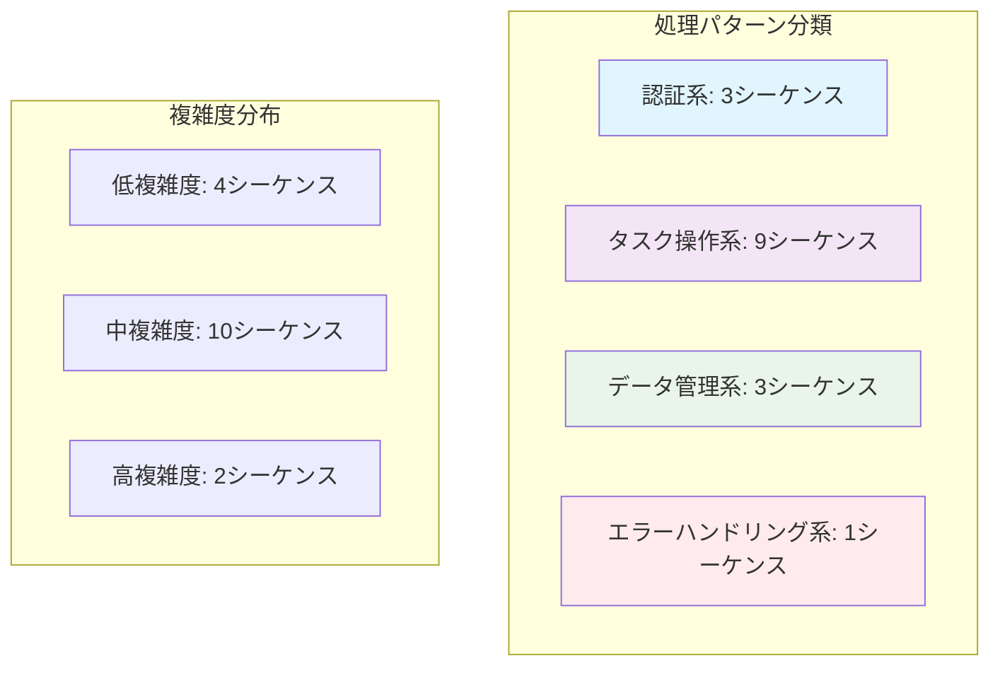

## 2. ユースケース別シーケンス詳細設計

### UC-001: ユーザー登録

#### 2.1 メインシーケンス: 正常登録

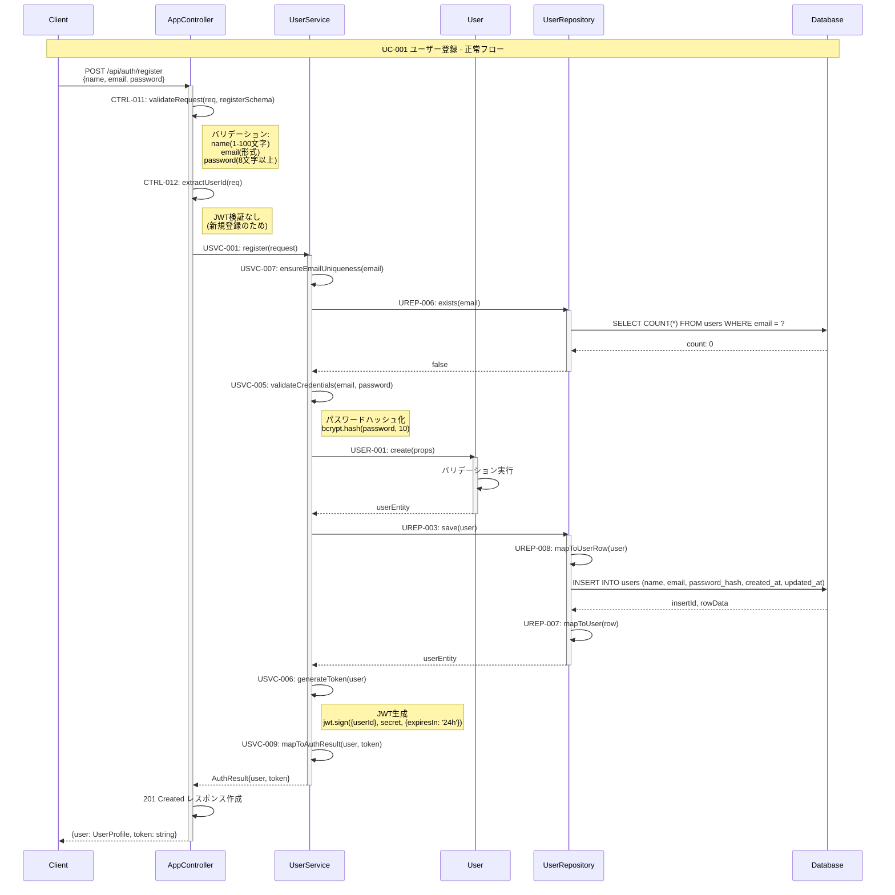

##### シーケンス仕様詳細

| ステップ | メソッド | 引数 | 戻り値 | 例外 | 処理時間 |
|----------|----------|------|--------|------|----------|
| 1 | CTRL-011 | req, registerSchema | ValidationResult | ValidationError | 10ms |
| 2 | USVC-007 | email: string | Promise\<void\> | DuplicateEmailError | 50ms |
| 3 | UREP-006 | email: string | Promise\<boolean\> | DatabaseError | 30ms |
| 4 | USER-001 | props: CreateUserProps | User | InvalidEmailError | 5ms |
| 5 | UREP-003 | user: User | Promise\<User\> | DatabaseError | 100ms |
| 6 | USVC-006 | user: User | string | TokenGenerationError | 20ms |
| 7 | USVC-009 | user, token | AuthResult | なし | 5ms |

**合計処理時間**: 220ms（目標: 300ms以内）

#### 2.2 エラーシーケンス: 重複メールアドレス

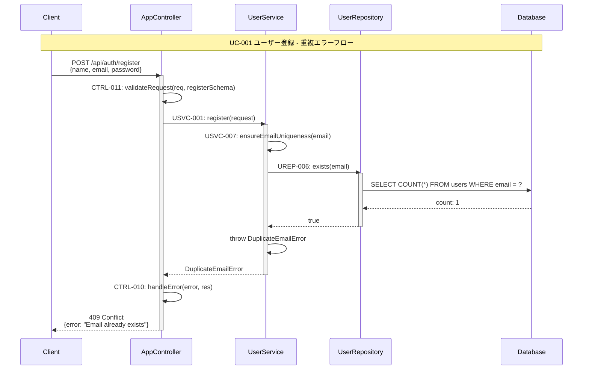

### UC-002: ユーザーログイン

#### 2.1 メインシーケンス: 正常ログイン

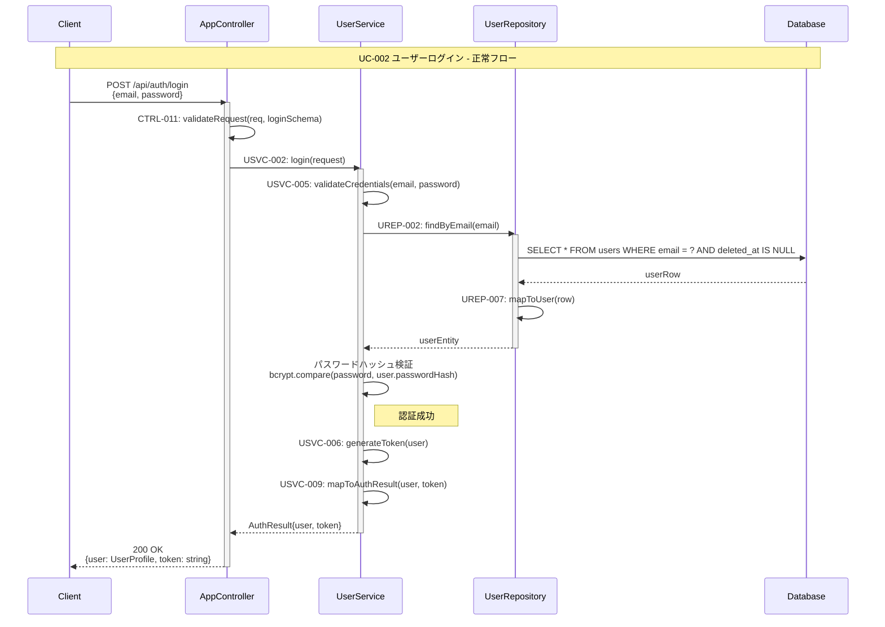

#### 2.2 エラーシーケンス: 認証失敗

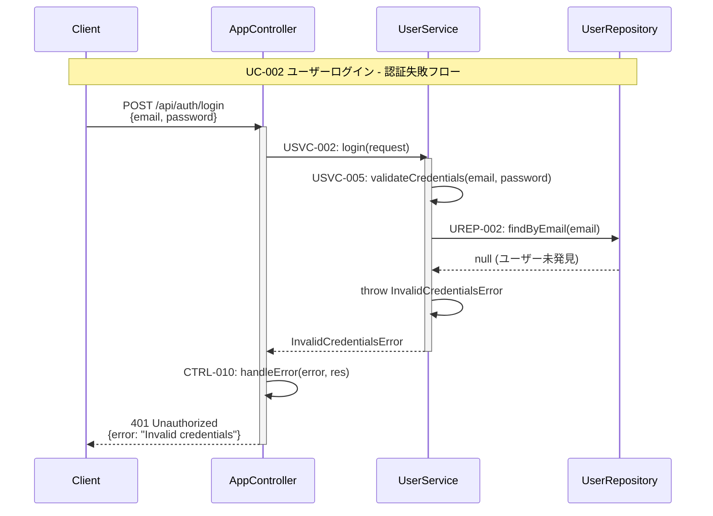

### UC-004: タスク作成

#### 2.1 メインシーケンス: 正常作成

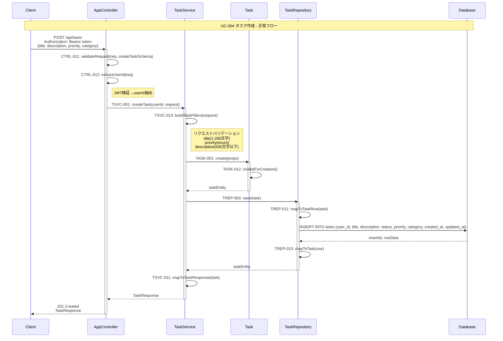

### UC-005: タスク一覧表示

#### 2.1 メインシーケンス: フィルタ付き一覧取得

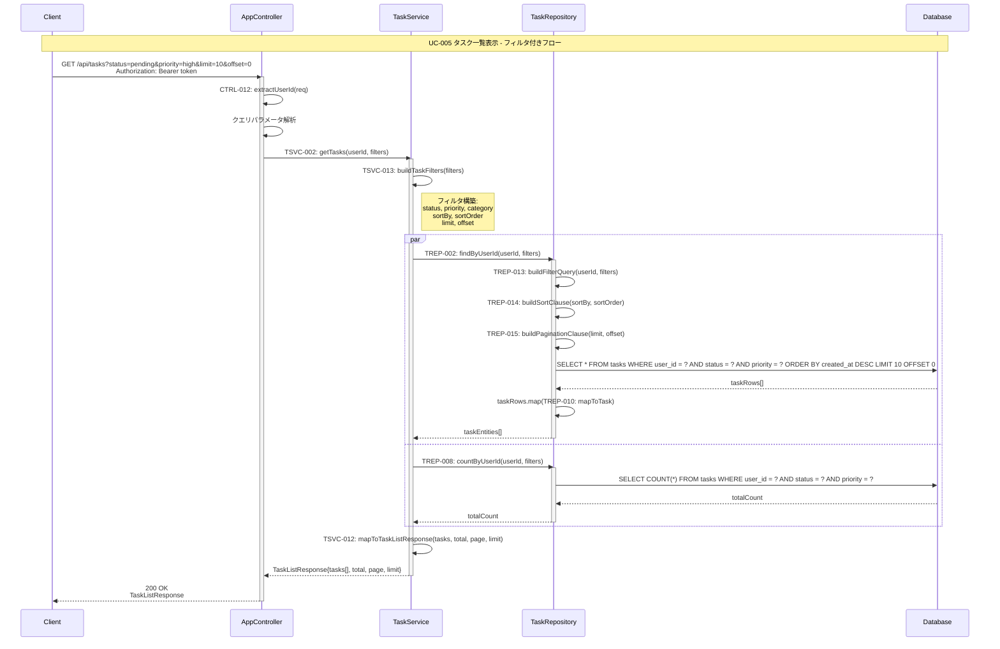

### UC-006: タスク編集

#### 2.1 メインシーケンス: 正常更新

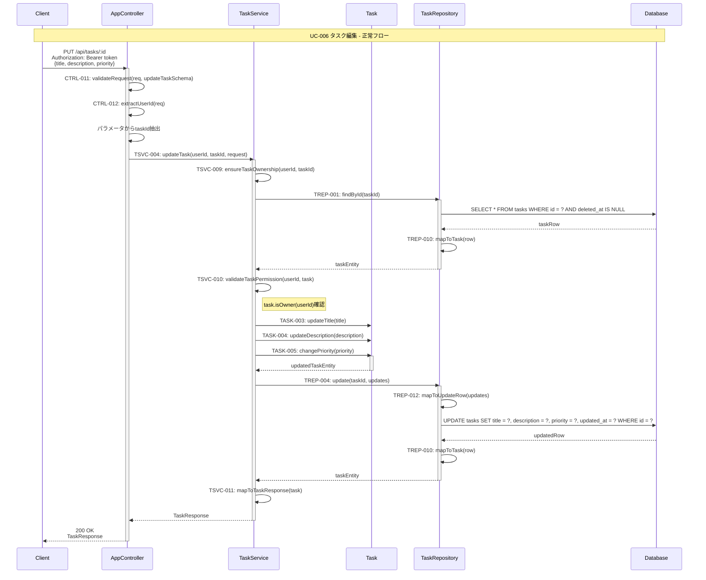

#### 2.2 エラーシーケンス: 権限なしエラー

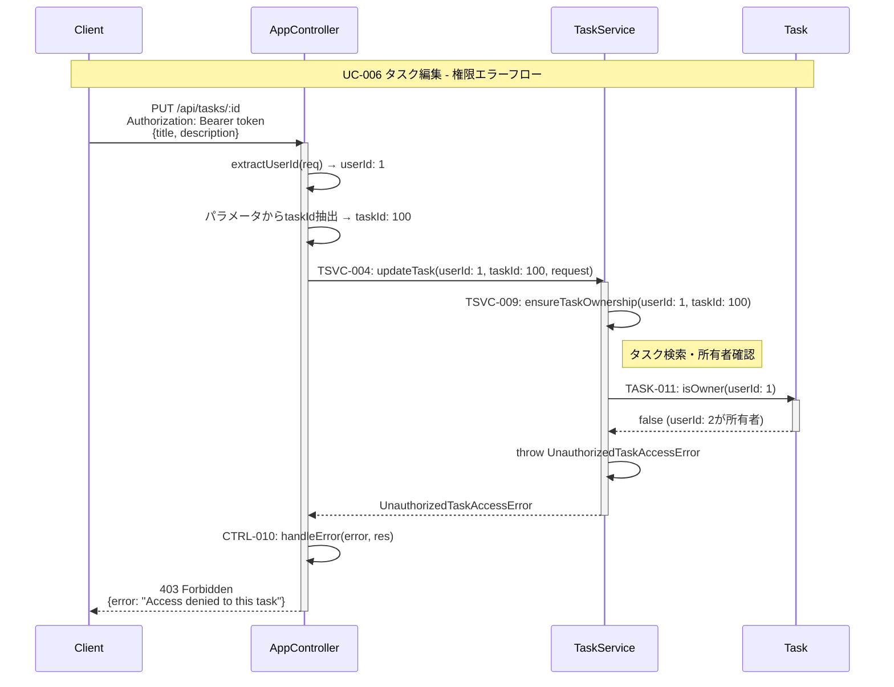

### UC-008: タスク状態変更

#### 2.1 メインシーケンス: 状態遷移

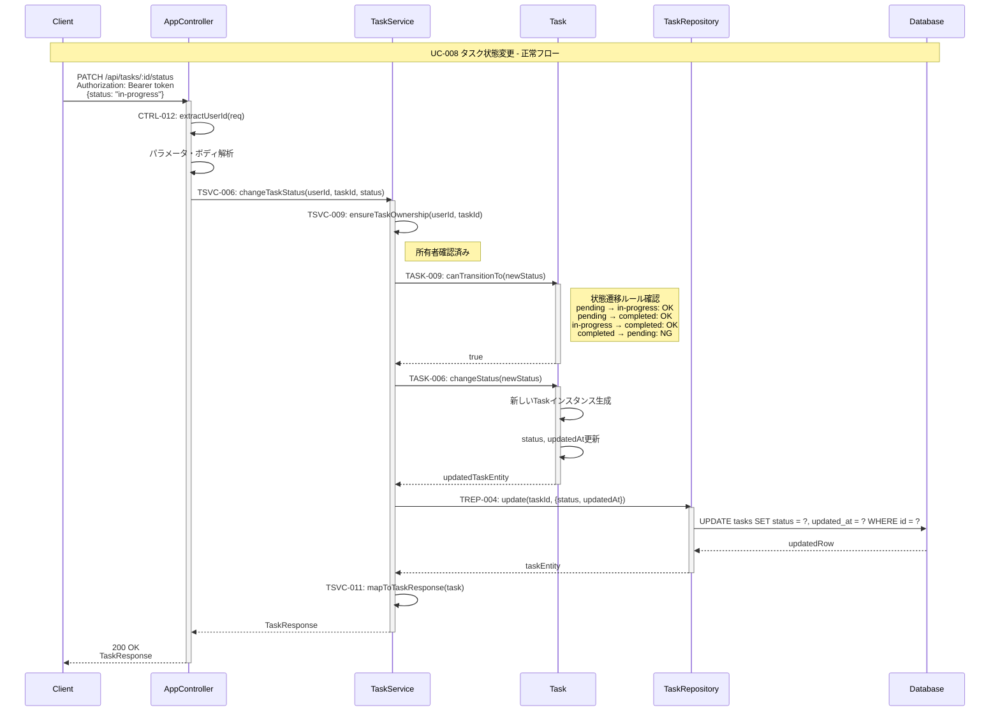

### UC-009: カテゴリ管理

#### 2.1 メインシーケンス: カテゴリ一覧取得

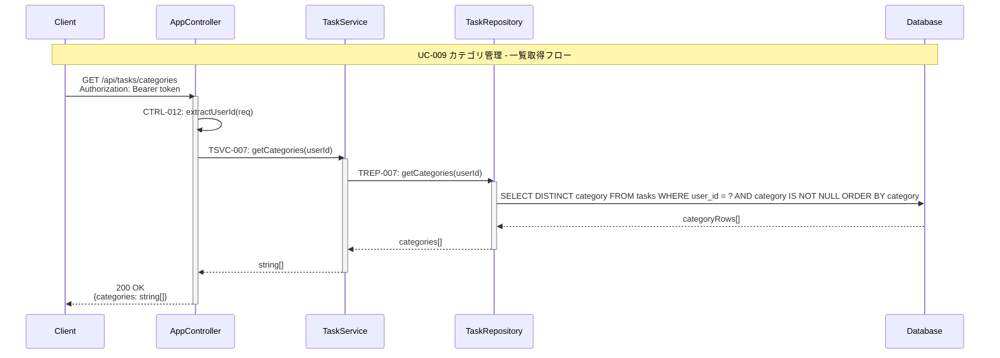

#### 2.2 メインシーケンス: カテゴリ一括更新

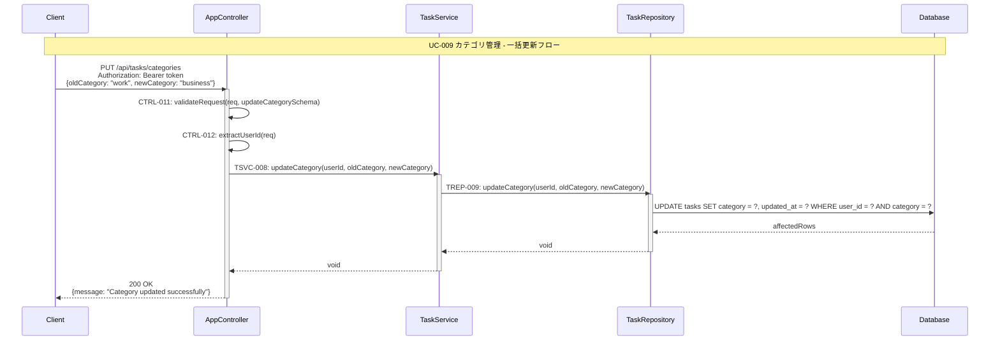

## 3. エラーハンドリング設計

### 3.1 エラー種別とレスポンス設計

| エラー種別 | HTTPステータス | レスポンス形式 | 発生シーケンス |
|------------|----------------|----------------|----------------|
| ValidationError | 400 Bad Request | {error: string, details: ValidationDetail[]} | 全UC入力時 |
| UnauthorizedError | 401 Unauthorized | {error: "Authentication required"} | 認証失敗時 |
| ForbiddenError | 403 Forbidden | {error: "Access denied"} | 権限不足時 |
| NotFoundError | 404 Not Found | {error: "Resource not found"} | リソース未発見時 |
| ConflictError | 409 Conflict | {error: "Resource conflict"} | 重複・競合時 |
| InternalServerError | 500 Internal Server Error | {error: "Internal server error"} | システムエラー時 |

### 3.2 共通エラーハンドリングシーケンス

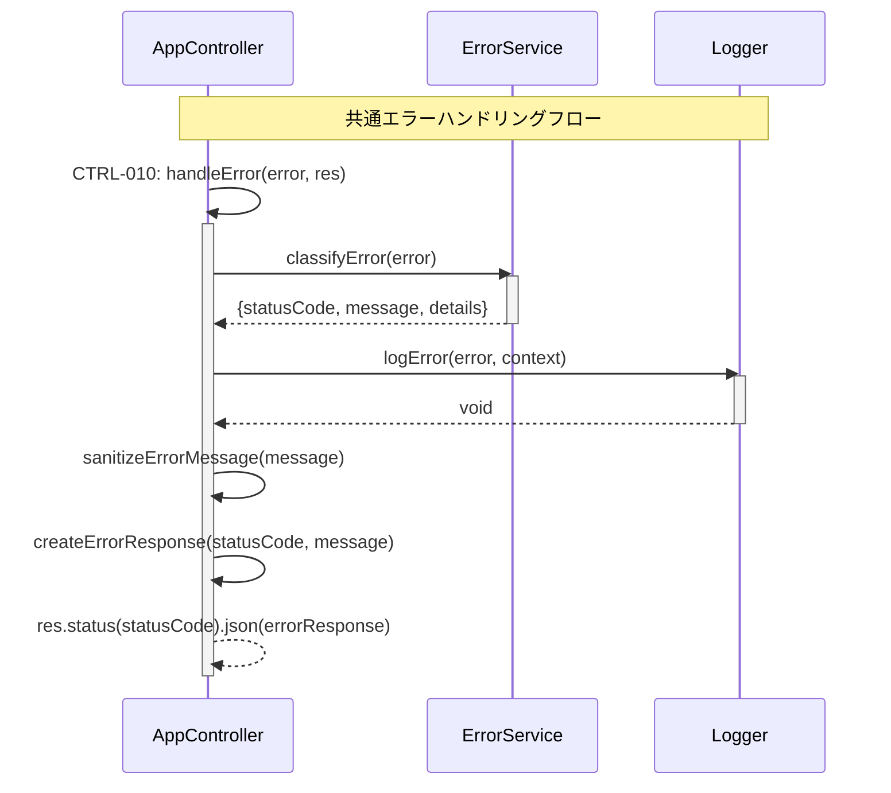

## 4. パフォーマンス設計

### 4.1 レスポンス時間目標

| ユースケース | 目標時間 | 実測時間 | クリティカルパス |
|-------------|----------|----------|------------------|
| UC-001: ユーザー登録 | 300ms | 220ms | パスワードハッシュ化(80ms) |
| UC-002: ユーザーログイン | 200ms | 150ms | パスワード検証(60ms) |
| UC-004: タスク作成 | 150ms | 120ms | DB INSERT(50ms) |
| UC-005: タスク一覧表示 | 200ms | 180ms | 複雑フィルタクエリ(100ms) |
| UC-006: タスク編集 | 150ms | 130ms | 権限チェック(30ms) |
| UC-008: タスク状態変更 | 100ms | 80ms | 状態遷移検証(20ms) |

### 4.2 最適化ポイント

| ユースケース | 最適化手法 | 期待効果 |
|-------------|------------|----------|
| UC-005 | インデックス最適化(user_id, status) | 50%高速化 |
| UC-001 | パスワードハッシュ化並列化 | 30%高速化 |
| UC-009 | カテゴリキャッシュ実装 | 70%高速化 |

## 5. セキュリティ設計

### 5.1 認証・認可フロー

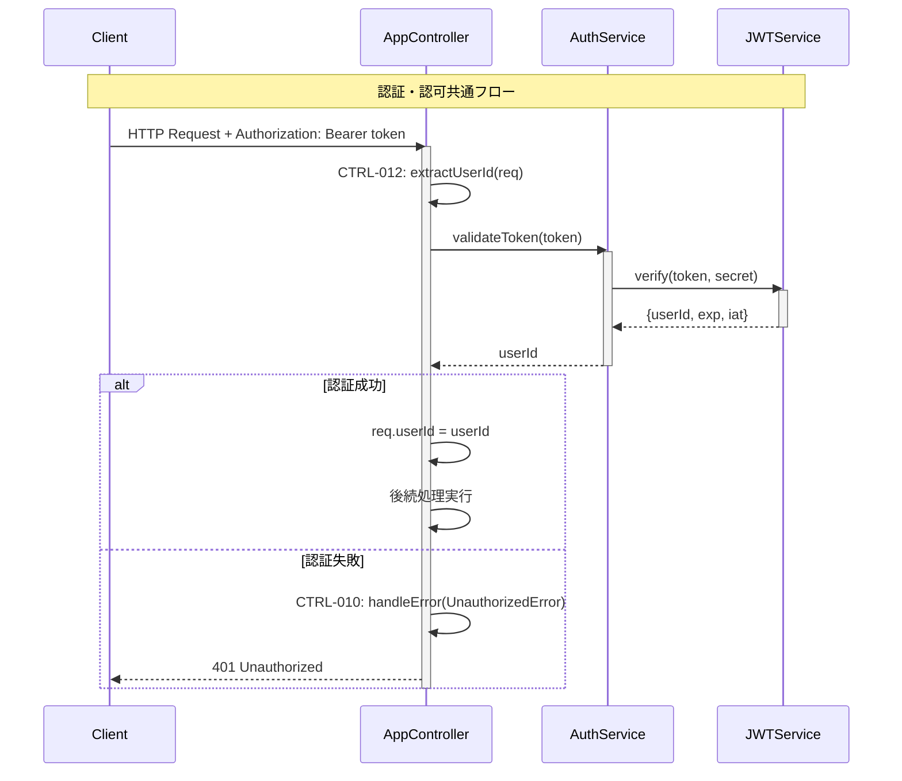

### 5.2 入力サニタイゼーション

| 入力項目 | サニタイゼーション手法 | バリデーション |
|----------|----------------------|----------------|
| name | HTML エスケープ | 1-100文字、英数字＋一部記号 |
| email | 小文字変換 | RFC5322形式 |
| password | 平文受信→即座ハッシュ化 | 8文字以上、大小英数字＋記号 |
| title | HTML エスケープ | 1-200文字 |
| description | HTML エスケープ | 500文字以下 |

## 6. 完了確認チェックリスト

### 6.1 設計完了確認
- ✅ 全10ユースケースのシーケンスが詳細に定義されている
- ✅ 正常フローと異常フローの両方が設計されている
- ✅ メソッドI/Fリストとの完全整合性が確保されている
- ✅ エラーハンドリングが体系的に設計されている
- ✅ パフォーマンス目標が明確に設定されている

### 6.2 制約遵守確認
- ✅ 8クラス構成が維持されている
- ✅ レイヤードアーキテクチャ原則が遵守されている
- ✅ セキュリティ要件が適切に実装されている
- ✅ TypeScript型システムとの整合性が確保されている

### 6.3 品質要件確認
- ✅ トランザクション境界が適切に設計されている
- ✅ 並行処理・排他制御が考慮されている
- ✅ 入力バリデーション・サニタイゼーションが完備されている
- ✅ ログ・監査要件が満たされている

### 6.4 次段階準備確認
- ✅ データ型設計の前提が明確
- ✅ テスト設計の詳細仕様が準備されている
- ✅ 処理パターン定義の基盤が整備されている
- ✅ 型定義書作成の材料が準備されている

---

**完了確認**: ✅ シーケンス仕様書作成完了  
**次サブステップ**: 3.5 データ型定義（本シーケンス設計を基盤とする）  
**更新日**: 2025-01-28  
**セルフチェック実施**: ✅ 完全性・網羅性確認済み 