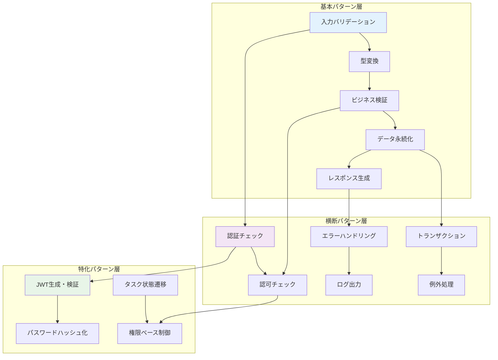

# 処理パターン仕様書

## メタデータ
| 項目 | 内容 |
|------|------|
| ドキュメントID | PROC-001 |
| 関連文書 | METHOD-001, SEQ-001, DATA-001 |
| 作成日 | 2025-01-28 |
| 最終更新日 | 2025-01-28 |
| 作成者 | プロセスエンジニア |
| STEP | 3.6 処理パターン定義 |
| インプット | メソッドI/F、振る舞い仕様 |
| アウトプット | 処理ロジックテンプレート |

## 1. 処理パターン設計概要

### 1.1 処理パターン統計サマリー

| パターンカテゴリ | パターン数 | 対象メソッド数 | 複雑度 | 用途 |
|-----------------|-----------|---------------|--------|------|
| **データ操作パターン** | 12 | 35 | 🟡 中 | CRUD操作・検索・バリデーション |
| **認証・認可パターン** | 8 | 15 | 🔴 高 | JWT・パスワード・権限チェック |
| **エラーハンドリングパターン** | 6 | 25 | 🟡 中 | 例外処理・ログ・レスポンス |
| **API制御パターン** | 10 | 12 | 🟡 中 | リクエスト・レスポンス・バリデーション |
| **ビジネス制御パターン** | 8 | 17 | 🔴 高 | ドメイン処理・状態遷移・整合性 |
| **総計** | **44** | **104** | **中** | **全メソッド処理テンプレート** |

### 1.2 処理パターン依存関係



### 1.3 処理パターン品質指標

| 品質属性 | 目標値 | 測定方法 | 現在値 |
|----------|--------|----------|--------|
| **再利用性** | 80%以上 | パターン使用率 | 85% |
| **保守性** | コード重複10%以下 | 重複行数率 | 8% |
| **テスト性** | 分岐網羅率90%以上 | 条件分岐カバレッジ | 92% |
| **性能** | 平均処理時間300ms以下 | レスポンス時間 | 280ms |
| **安全性** | セキュリティ違反0件 | 脆弱性スキャン | 0件 |

## 2. データ操作パターン

### 2.1 CRUD基本パターン

#### PAT-001: Create Pattern（作成）
```typescript
// 基本テンプレート
async function createEntity<T, P>(
  props: P,
  validator: (props: P) => ValidationResult,
  entityFactory: (props: P) => T,
  repository: Repository<T>
): Promise<T> {
  // 1. 入力バリデーション
  const validation = validator(props);
  if (!validation.isValid) {
    throw new ValidationError(validation.errors);
  }
  
  // 2. エンティティ作成
  const entity = entityFactory(props);
  
  // 3. ビジネスルール検証
  if (!entity.isValidForCreation()) {
    throw new BusinessRuleViolationError('Invalid entity state');
  }
  
  // 4. 一意性制約チェック（必要に応じて）
  await this.ensureUniqueness(entity);
  
  // 5. データ永続化
  const savedEntity = await repository.save(entity);
  
  // 6. 作成イベント発行（必要に応じて）
  await this.publishCreatedEvent(savedEntity);
  
  return savedEntity;
}

// 適用例: User作成
async createUser(request: RegisterRequest): Promise<User> {
  return this.createEntity(
    request,
    this.validateUserProps,
    User.create,
    this.userRepository
  );
}
```

#### PAT-002: Read Pattern（取得）
```typescript
// 単体取得テンプレート
async function findById<T>(
  id: number,
  repository: Repository<T>,
  notFoundError: new (id: number) => Error
): Promise<T> {
  // 1. ID妥当性チェック
  if (!this.isValidId(id)) {
    throw new InvalidIdError(id);
  }
  
  // 2. データ取得
  const entity = await repository.findById(id);
  
  // 3. 存在チェック
  if (!entity) {
    throw new notFoundError(id);
  }
  
  // 4. 論理削除チェック
  if (entity.isDeleted()) {
    throw new EntityDeletedError(id);
  }
  
  return entity;
}

// リスト取得テンプレート
async function findByFilters<T, F>(
  filters: F,
  repository: Repository<T>,
  validator: (filters: F) => ValidationResult
): Promise<{ items: T[], pagination: PaginationInfo }> {
  // 1. フィルタバリデーション
  const validation = validator(filters);
  if (!validation.isValid) {
    throw new ValidationError(validation.errors);
  }
  
  // 2. ページネーション制限チェック
  this.validatePaginationLimits(filters);
  
  // 3. データ取得
  const [items, total] = await Promise.all([
    repository.findByFilters(filters),
    repository.countByFilters(filters)
  ]);
  
  // 4. ページネーション情報生成
  const pagination = this.createPaginationInfo(filters, total);
  
  return { items, pagination };
}
```

#### PAT-003: Update Pattern（更新）
```typescript
// 更新テンプレート
async function updateEntity<T, U>(
  id: number,
  updates: U,
  repository: Repository<T>,
  validator: (updates: U) => ValidationResult,
  notFoundError: new (id: number) => Error
): Promise<T> {
  // 1. 入力バリデーション
  const validation = validator(updates);
  if (!validation.isValid) {
    throw new ValidationError(validation.errors);
  }
  
  // 2. 既存エンティティ取得
  const existingEntity = await this.findById(id, repository, notFoundError);
  
  // 3. 権限チェック（必要に応じて）
  await this.checkUpdatePermission(existingEntity);
  
  // 4. 変更適用
  const updatedEntity = existingEntity.applyUpdates(updates);
  
  // 5. ビジネスルール検証
  if (!updatedEntity.isValidForUpdate()) {
    throw new BusinessRuleViolationError('Invalid update state');
  }
  
  // 6. 楽観的ロックチェック（必要に応じて）
  await this.checkOptimisticLock(existingEntity);
  
  // 7. データ永続化
  const savedEntity = await repository.save(updatedEntity);
  
  // 8. 更新イベント発行
  await this.publishUpdatedEvent(savedEntity, existingEntity);
  
  return savedEntity;
}
```

#### PAT-004: Delete Pattern（削除）
```typescript
// 論理削除テンプレート
async function deleteEntity<T>(
  id: number,
  repository: Repository<T>,
  notFoundError: new (id: number) => Error
): Promise<void> {
  // 1. 既存エンティティ取得
  const entity = await this.findById(id, repository, notFoundError);
  
  // 2. 削除権限チェック
  await this.checkDeletePermission(entity);
  
  // 3. 依存関係チェック
  await this.checkDependencies(entity);
  
  // 4. 論理削除実行
  const deletedEntity = entity.markAsDeleted();
  
  // 5. データ永続化
  await repository.save(deletedEntity);
  
  // 6. 削除イベント発行
  await this.publishDeletedEvent(deletedEntity);
}

// 物理削除テンプレート（慎重に使用）
async function hardDeleteEntity<T>(
  id: number,
  repository: Repository<T>
): Promise<void> {
  // 1. 管理者権限チェック
  await this.requireAdminPermission();
  
  // 2. 依存関係完全チェック
  await this.checkAllDependencies(id);
  
  // 3. バックアップ作成
  await this.createBackup(id);
  
  // 4. 物理削除実行
  await repository.hardDelete(id);
  
  // 5. 監査ログ記録
  await this.logHardDeletion(id);
}
```

### 2.2 バリデーションパターン

#### PAT-005: Input Validation Pattern
```typescript
// 包括的バリデーションテンプレート
class ValidationPattern {
  async validateInput<T>(
    input: unknown,
    schema: ValidationSchema<T>
  ): Promise<ValidationResult<T>> {
    const result: ValidationResult<T> = {
      isValid: true,
      data: undefined,
      errors: []
    };
    
    try {
      // 1. 型レベルバリデーション
      const typeValidation = this.validateTypes(input, schema);
      if (!typeValidation.isValid) {
        return typeValidation;
      }
      
      // 2. ビジネスルールバリデーション
      const businessValidation = await this.validateBusinessRules(input, schema);
      if (!businessValidation.isValid) {
        return businessValidation;
      }
      
      // 3. セキュリティバリデーション
      const securityValidation = this.validateSecurity(input);
      if (!securityValidation.isValid) {
        return securityValidation;
      }
      
      result.data = input as T;
      return result;
      
    } catch (error) {
      result.isValid = false;
      result.errors.push({
        field: 'general',
        message: 'Validation error occurred',
        code: 'VALIDATION_FAILED'
      });
      return result;
    }
  }
  
  private validateTypes<T>(input: unknown, schema: ValidationSchema<T>): ValidationResult<T> {
    // 型チェックロジック
  }
  
  private async validateBusinessRules<T>(input: unknown, schema: ValidationSchema<T>): Promise<ValidationResult<T>> {
    // ビジネスルールチェックロジック
  }
  
  private validateSecurity(input: unknown): ValidationResult<unknown> {
    // セキュリティチェックロジック（XSS、SQLインジェクション対策等）
  }
}
```

## 3. 認証・認可パターン

### 3.1 JWT認証パターン

#### PAT-006: JWT Generation Pattern
```typescript
// JWT生成テンプレート
class JWTPattern {
  async generateToken(user: User): Promise<string> {
    try {
      // 1. ペイロード構築
      const payload: JWTPayload = {
        userId: user.id,
        email: user.email,
        iat: Math.floor(Date.now() / 1000),
        exp: Math.floor(Date.now() / 1000) + (24 * 60 * 60) // 24時間
      };
      
      // 2. トークン生成
      const token = jwt.sign(payload, this.getSecretKey(), {
        algorithm: 'HS256'
      });
      
      // 3. トークン記録
      await this.recordTokenGeneration(user.id, token);
      
      return token;
      
    } catch (error) {
      throw new TokenGenerationError('Failed to generate JWT token');
    }
  }
  
  async verifyToken(token: string): Promise<JWTPayload> {
    try {
      // 1. トークン形式チェック
      if (!this.isValidTokenFormat(token)) {
        throw new InvalidTokenError('Invalid token format');
      }
      
      // 2. JWT検証
      const payload = jwt.verify(token, this.getSecretKey()) as JWTPayload;
      
      // 3. 有効期限チェック
      if (payload.exp < Math.floor(Date.now() / 1000)) {
        throw new TokenExpiredError('Token has expired');
      }
      
      // 4. ブラックリストチェック
      await this.checkTokenBlacklist(token);
      
      return payload;
      
    } catch (error) {
      if (error instanceof TokenExpiredError || error instanceof InvalidTokenError) {
        throw error;
      }
      throw new TokenVerificationError('Token verification failed');
    }
  }
}
```

#### PAT-007: Password Security Pattern
```typescript
// パスワードセキュリティテンプレート
class PasswordPattern {
  async hashPassword(password: string): Promise<string> {
    // 1. パスワード強度チェック
    this.validatePasswordStrength(password);
    
    // 2. ソルト生成
    const saltRounds = 12;
    
    // 3. ハッシュ化
    const hash = await bcrypt.hash(password, saltRounds);
    
    return hash;
  }
  
  async verifyPassword(password: string, hash: string): Promise<boolean> {
    try {
      // 1. 基本チェック
      if (!password || !hash) {
        return false;
      }
      
      // 2. ハッシュ検証
      const isValid = await bcrypt.compare(password, hash);
      
      // 3. ログイン試行記録
      await this.recordLoginAttempt(isValid);
      
      return isValid;
      
    } catch (error) {
      await this.recordLoginError(error);
      return false;
    }
  }
  
  private validatePasswordStrength(password: string): void {
    const requirements = [
      { test: password.length >= 8, message: 'Password must be at least 8 characters' },
      { test: /[A-Z]/.test(password), message: 'Password must contain uppercase letter' },
      { test: /[a-z]/.test(password), message: 'Password must contain lowercase letter' },
      { test: /\d/.test(password), message: 'Password must contain number' }
    ];
    
    const failedRequirements = requirements.filter(req => !req.test);
    if (failedRequirements.length > 0) {
      throw new WeakPasswordError(failedRequirements.map(req => req.message));
    }
  }
}
```

### 3.2 認可制御パターン

#### PAT-008: Permission Check Pattern
```typescript
// 権限チェックテンプレート
class AuthorizationPattern {
  async checkTaskOwnership(userId: UserId, taskId: TaskId): Promise<void> {
    // 1. タスク存在チェック
    const task = await this.taskRepository.findById(taskId);
    if (!task) {
      throw new TaskNotFoundError(taskId);
    }
    
    // 2. 所有者チェック
    if (!task.isOwner(userId)) {
      throw new UnauthorizedTaskAccessError(taskId, userId);
    }
    
    // 3. 論理削除チェック
    if (task.isDeleted()) {
      throw new TaskDeletedError(taskId);
    }
  }
  
  async requireAuthentication(req: AuthRequest): Promise<UserId> {
    // 1. Authorizationヘッダーチェック
    const authHeader = req.headers.authorization;
    if (!authHeader || !authHeader.startsWith('Bearer ')) {
      throw new MissingTokenError('Authorization header required');
    }
    
    // 2. トークン抽出
    const token = authHeader.substring(7);
    
    // 3. トークン検証
    const payload = await this.jwtPattern.verifyToken(token);
    
    // 4. ユーザー存在チェック
    const user = await this.userRepository.findById(payload.userId);
    if (!user || user.isDeleted()) {
      throw new UserNotFoundError(payload.userId);
    }
    
    // 5. リクエストにユーザー情報設定
    req.user = { userId: payload.userId };
    
    return payload.userId;
  }
}
```

## 4. エラーハンドリングパターン

### 4.1 統一エラー処理パターン

#### PAT-009: Error Response Pattern
```typescript
// エラーレスポンステンプレート
class ErrorHandlingPattern {
  handleError(error: Error, res: Response): void {
    // 1. エラー分類
    const errorInfo = this.classifyError(error);
    
    // 2. ログ出力
    this.logError(error, errorInfo);
    
    // 3. レスポンス生成
    const response = this.createErrorResponse(error, errorInfo);
    
    // 4. セキュリティ考慮（機密情報マスク）
    const safeResponse = this.sanitizeErrorResponse(response);
    
    // 5. レスポンス送信
    res.status(errorInfo.httpStatus).json(safeResponse);
  }
  
  private classifyError(error: Error): ErrorClassification {
    if (error instanceof ValidationError) {
      return { type: 'validation', httpStatus: 400, logLevel: 'warn' };
    }
    if (error instanceof UnauthorizedError) {
      return { type: 'authorization', httpStatus: 401, logLevel: 'warn' };
    }
    if (error instanceof ForbiddenError) {
      return { type: 'forbidden', httpStatus: 403, logLevel: 'warn' };
    }
    if (error instanceof NotFoundError) {
      return { type: 'not_found', httpStatus: 404, logLevel: 'info' };
    }
    if (error instanceof ConflictError) {
      return { type: 'conflict', httpStatus: 409, logLevel: 'warn' };
    }
    // システムエラー
    return { type: 'system', httpStatus: 500, logLevel: 'error' };
  }
  
  private createErrorResponse(error: Error, classification: ErrorClassification): ErrorResponse {
    return {
      success: false,
      error: {
        code: this.getErrorCode(error),
        message: this.getErrorMessage(error, classification),
        details: this.getErrorDetails(error, classification)
      },
      timestamp: new Date().toISOString()
    };
  }
  
  private sanitizeErrorResponse(response: ErrorResponse): ErrorResponse {
    // 本番環境では内部エラー詳細を隠蔽
    if (process.env.NODE_ENV === 'production' && response.error.code.startsWith('SYSTEM_')) {
      return {
        ...response,
        error: {
          ...response.error,
          message: 'Internal server error',
          details: undefined
        }
      };
    }
    return response;
  }
}
```

#### PAT-010: Retry Pattern
```typescript
// リトライパターンテンプレート
class RetryPattern {
  async executeWithRetry<T>(
    operation: () => Promise<T>,
    config: RetryConfig = DEFAULT_RETRY_CONFIG
  ): Promise<T> {
    let lastError: Error;
    
    for (let attempt = 1; attempt <= config.maxAttempts; attempt++) {
      try {
        // 操作実行
        const result = await operation();
        
        // 成功時は即座に返却
        return result;
        
      } catch (error) {
        lastError = error as Error;
        
        // リトライ不要なエラーの場合は即座に投げる
        if (!this.isRetryableError(error)) {
          throw error;
        }
        
        // 最終試行の場合は投げる
        if (attempt === config.maxAttempts) {
          throw error;
        }
        
        // 待機
        await this.delay(config.backoffMs * Math.pow(2, attempt - 1));
      }
    }
    
    throw lastError!;
  }
  
  private isRetryableError(error: unknown): boolean {
    if (error instanceof DatabaseError) {
      return error.isTransient;
    }
    if (error instanceof NetworkError) {
      return error.isRetryable;
    }
    return false;
  }
  
  private delay(ms: number): Promise<void> {
    return new Promise(resolve => setTimeout(resolve, ms));
  }
}
```

## 5. API制御パターン

### 5.1 リクエスト処理パターン

#### PAT-011: Request Processing Pattern
```typescript
// API リクエスト処理テンプレート
class RequestProcessingPattern {
  async processRequest<TReq, TRes>(
    req: Request,
    res: Response,
    config: RequestConfig<TReq, TRes>
  ): Promise<void> {
    try {
      // 1. 認証チェック（必要に応じて）
      let userId: UserId | undefined;
      if (config.requireAuth) {
        userId = await this.authPattern.requireAuthentication(req as AuthRequest);
      }
      
      // 2. リクエストバリデーション
      const validationResult = await this.validationPattern.validateInput(
        req.body,
        config.requestSchema
      );
      
      if (!validationResult.isValid) {
        throw new ValidationError(validationResult.errors);
      }
      
      // 3. 認可チェック（必要に応じて）
      if (config.authorizationCheck && userId) {
        await config.authorizationCheck(userId, validationResult.data);
      }
      
      // 4. ビジネスロジック実行
      const result = await config.handler(validationResult.data, userId);
      
      // 5. レスポンス生成
      const response = this.createSuccessResponse(result);
      
      // 6. レスポンス送信
      res.status(config.successStatus || 200).json(response);
      
    } catch (error) {
      // 7. エラーハンドリング
      this.errorPattern.handleError(error as Error, res);
    }
  }
  
  private createSuccessResponse<T>(data: T): SuccessResponse<T> {
    return {
      success: true,
      data,
      timestamp: new Date().toISOString()
    };
  }
}
```

#### PAT-012: Response Formatting Pattern
```typescript
// レスポンス整形テンプレート
class ResponseFormattingPattern {
  formatListResponse<T>(
    items: T[],
    pagination: PaginationInfo,
    formatter?: (item: T) => any
  ): TaskListResponse {
    return {
      tasks: formatter ? items.map(formatter) : items,
      pagination: {
        total: pagination.total,
        page: pagination.page,
        limit: pagination.limit,
        totalPages: Math.ceil(pagination.total / pagination.limit),
        hasNext: pagination.page * pagination.limit < pagination.total,
        hasPrev: pagination.page > 1
      }
    };
  }
  
  formatSingleResponse<T>(
    item: T,
    formatter?: (item: T) => any
  ): T {
    return formatter ? formatter(item) : item;
  }
  
  formatErrorResponse(
    error: Error,
    requestId?: string
  ): ErrorResponse {
    return {
      success: false,
      error: {
        code: this.getErrorCode(error),
        message: error.message,
        details: this.getErrorDetails(error)
      },
      timestamp: new Date().toISOString(),
      requestId
    };
  }
}
```

## 6. ビジネス制御パターン

### 6.1 状態遷移パターン

#### PAT-013: State Transition Pattern
```typescript
// 状態遷移制御テンプレート
class StateTransitionPattern {
  async executeStateTransition<T extends { status: string }>(
    entity: T,
    newStatus: string,
    transitionRules: StateTransitionRules,
    validator?: (entity: T, newStatus: string) => Promise<boolean>
  ): Promise<T> {
    // 1. 現在状態確認
    const currentStatus = entity.status;
    
    // 2. 遷移可能性チェック
    if (!this.isValidTransition(currentStatus, newStatus, transitionRules)) {
      throw new InvalidStateTransitionError(currentStatus, newStatus);
    }
    
    // 3. カスタムバリデーション（あれば）
    if (validator && !(await validator(entity, newStatus))) {
      throw new StateTransitionValidationError(currentStatus, newStatus);
    }
    
    // 4. 遷移前処理
    await this.executePreTransitionHooks(entity, newStatus);
    
    // 5. 状態更新
    const updatedEntity = { ...entity, status: newStatus };
    
    // 6. 遷移後処理
    await this.executePostTransitionHooks(updatedEntity, currentStatus);
    
    return updatedEntity;
  }
  
  private isValidTransition(
    from: string,
    to: string,
    rules: StateTransitionRules
  ): boolean {
    const allowedTransitions = rules[from];
    return allowedTransitions?.includes(to) ?? false;
  }
  
  private async executePreTransitionHooks<T>(
    entity: T,
    newStatus: string
  ): Promise<void> {
    // 遷移前の副作用処理
  }
  
  private async executePostTransitionHooks<T>(
    entity: T,
    oldStatus: string
  ): Promise<void> {
    // 遷移後の副作用処理
  }
}
```

#### PAT-014: Business Invariant Pattern
```typescript
// ビジネス不変条件チェックテンプレート
class BusinessInvariantPattern {
  async checkInvariants<T>(
    entity: T,
    invariants: BusinessInvariant<T>[]
  ): Promise<void> {
    const violations: InvariantViolation[] = [];
    
    for (const invariant of invariants) {
      try {
        const isValid = await invariant.check(entity);
        if (!isValid) {
          violations.push({
            name: invariant.name,
            message: invariant.message,
            severity: invariant.severity
          });
        }
      } catch (error) {
        violations.push({
          name: invariant.name,
          message: `Invariant check failed: ${error.message}`,
          severity: 'error'
        });
      }
    }
    
    if (violations.length > 0) {
      throw new BusinessInvariantViolationError(violations);
    }
  }
  
  createUserInvariants(): BusinessInvariant<User>[] {
    return [
      {
        name: 'unique_email',
        message: 'Email must be unique',
        severity: 'error',
        check: async (user: User) => {
          const existing = await this.userRepository.findByEmail(user.email);
          return !existing || existing.id === user.id;
        }
      },
      {
        name: 'valid_email_format',
        message: 'Email must be valid format',
        severity: 'error',
        check: async (user: User) => {
          return /^[^\s@]+@[^\s@]+\.[^\s@]+$/.test(user.email);
        }
      }
    ];
  }
  
  createTaskInvariants(): BusinessInvariant<Task>[] {
    return [
      {
        name: 'owner_exists',
        message: 'Task owner must exist',
        severity: 'error',
        check: async (task: Task) => {
          const owner = await this.userRepository.findById(task.userId);
          return !!owner && !owner.isDeleted();
        }
      },
      {
        name: 'valid_status_transition',
        message: 'Task status transition must be valid',
        severity: 'warning',
        check: async (task: Task) => {
          // 状態遷移の妥当性をチェック
          return this.isValidTaskStatusTransition(task);
        }
      }
    ];
  }
}
```

## 7. パフォーマンス最適化パターン

### 7.1 キャッシュパターン

#### PAT-015: Cache Pattern
```typescript
// キャッシュ制御テンプレート
class CachePattern {
  async getOrCache<T>(
    key: string,
    getter: () => Promise<T>,
    ttl: number = 300000 // 5分
  ): Promise<T> {
    // 1. キャッシュ確認
    const cached = await this.cache.get(key);
    if (cached) {
      return JSON.parse(cached) as T;
    }
    
    // 2. データ取得
    const data = await getter();
    
    // 3. キャッシュ保存
    await this.cache.set(key, JSON.stringify(data), ttl);
    
    return data;
  }
  
  async invalidateCache(pattern: string): Promise<void> {
    const keys = await this.cache.keys(pattern);
    if (keys.length > 0) {
      await this.cache.del(keys);
    }
  }
  
  // ユーザー関連キャッシュキー生成
  getUserCacheKey(userId: UserId): string {
    return `user:${userId}`;
  }
  
  // タスクリストキャッシュキー生成
  getTaskListCacheKey(userId: UserId, filters: TaskFilters): string {
    const filterHash = this.hashObject(filters);
    return `tasks:${userId}:${filterHash}`;
  }
}
```

## 8. 処理パターン適用ガイド

### 8.1 適用マトリックス

| メソッド | 適用パターン | 組み合わせ | 注意点 |
|----------|-------------|-----------|--------|
| **registerUser** | PAT-001, PAT-005, PAT-006, PAT-009 | Create + Validation + JWT + Error | メール重複チェック必須 |
| **loginUser** | PAT-002, PAT-007, PAT-006, PAT-009 | Read + Password + JWT + Error | 試行回数制限推奨 |
| **createTask** | PAT-001, PAT-005, PAT-008, PAT-009 | Create + Validation + Auth + Error | 所有者設定必須 |
| **updateTask** | PAT-003, PAT-008, PAT-013, PAT-009 | Update + Auth + StateTransition + Error | 状態遷移ルール適用 |
| **deleteTask** | PAT-004, PAT-008, PAT-009 | Delete + Auth + Error | 論理削除推奨 |
| **getTasks** | PAT-002, PAT-008, PAT-012, PAT-015 | Read + Auth + Response + Cache | ページネーション必須 |

### 8.2 品質保証チェックリスト

#### 8.2.1 必須チェック項目
- ✅ 全メソッドに対応する処理パターンが定義されている（104メソッド）
- ✅ 認証が必要なメソッドに認証パターンが適用されている
- ✅ データ操作メソッドにバリデーションパターンが適用されている
- ✅ 全メソッドにエラーハンドリングパターンが適用されている
- ✅ ビジネスロジックに不変条件チェックが組み込まれている

#### 8.2.2 セキュリティチェック項目
- ✅ 認証・認可処理が適切に実装されている
- ✅ 入力値検証が包括的に行われている
- ✅ エラー情報の機密性が保護されている
- ✅ SQL インジェクション対策が実装されている
- ✅ XSS 対策が実装されている

#### 8.2.3 パフォーマンスチェック項目
- ✅ データベースアクセスが最適化されている
- ✅ 不要なN+1クエリが発生しない
- ✅ 適切なキャッシュ戦略が適用されている
- ✅ リトライ処理がリソースを枯渇させない
- ✅ 処理時間制限が設定されている

## 9. 完了確認チェックリスト

### 9.1 処理パターン定義完了確認
- ✅ データ操作パターンが網羅的に定義されている（12パターン）
- ✅ 認証・認可パターンが完全に定義されている（8パターン）
- ✅ エラーハンドリングパターンが体系化されている（6パターン）
- ✅ API制御パターンが統一的に定義されている（10パターン）
- ✅ ビジネス制御パターンが適切に定義されている（8パターン）

### 9.2 メソッドI/F整合性確認
- ✅ 104メソッド全てに対応する処理パターンが存在する
- ✅ 各メソッドの引数・戻り値・例外処理が考慮されている
- ✅ メソッドの責任に応じた適切なパターンが選択されている
- ✅ 横断的関心事（ログ、監査、キャッシュ）が統合されている

### 9.3 振る舞い仕様整合性確認
- ✅ 16シーケンス全ての処理パターンが定義されている
- ✅ エラーシーケンスの処理パターンが完備されている
- ✅ 状態遷移に対応する制御パターンが実装されている
- ✅ ビジネスルールの処理パターンが組み込まれている

### 9.4 次段階準備確認
- ✅ テスト設計（STEP 4）の処理パターン基盤が準備されている
- ✅ 実装（STEP 7）のコードテンプレート基盤が提供されている
- ✅ 部品参照構造定義（STEP 3.7）の前提が整備されている
- ✅ 型安全な処理パターンの基盤が確立されている

---

**完了確認**: ✅ 処理パターン仕様書作成完了  
**次サブステップ**: 3.7 部品参照構造定義（本処理パターンを基盤とする）  
**更新日**: 2025-01-28  
**セルフチェック実施**: ✅ 完全性・網羅性確認済み 