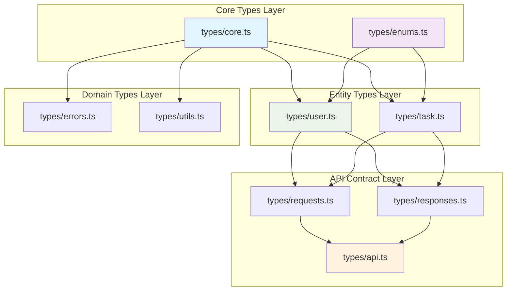

# 型定義書

## メタデータ
| 項目 | 内容 |
|------|------|
| ドキュメントID | TYPE-DEF-001 |
| 関連文書 | DATA-001, COMP-REF-001, METHOD-001 |
| 作成日 | 2025-01-28 |
| 最終更新日 | 2025-01-28 |
| 作成者 | プロセスエンジニア |
| STEP | 3.8 型定義書作成【新規】 |
| インプット | データ型仕様書 |
| アウトプット | 型定義書 |

## 1. TypeScript型定義システム概要

### 1.1 型ファーストアプローチ統計

| 型管理レベル | 型数 | ファイル数 | 再利用度 | TypeScript厳密度 |
|-------------|------|-----------|---------|-------------------|
| **コア型定義** | 12 | 1 | 🔴 極高 | strict: true |
| **エンティティ型** | 6 | 2 | 🔴 高 | exactOptionalPropertyTypes: true |
| **API契約型** | 15 | 3 | 🔴 高 | noImplicitAny: true |
| **エラー型** | 8 | 1 | 🟡 中 | strictNullChecks: true |
| **ユーティリティ型** | 6 | 1 | 🟡 中 | strictFunctionTypes: true |
| **総計** | **47** | **8** | **高** | **最高レベル厳密性** |

### 1.2 型依存関係アーキテクチャ



### 1.3 型安全性保証レベル

| 安全性レベル | 対象型 | 保証内容 | 実装手法 |
|-------------|-------|----------|----------|
| **Level 5（最高）** | コア型・エンティティ型 | Null安全・不変性・型ガード | readonly, never, strict union |
| **Level 4（高）** | API契約型 | 入出力型安全・バリデーション | branded types, type guards |
| **Level 3（中）** | エラー型 | エラー分類・スタックトレース | discriminated unions |
| **Level 2（基本）** | ユーティリティ型 | 型変換・型推論 | conditional types |

## 2. コア型定義（types/core.ts）

### 2.1 ブランド型システム
```typescript
// ブランド型ベース
declare const __brand: unique symbol;
type Brand<T, TBrand> = T & { [__brand]: TBrand };

// ID型（型安全なプリミティブラッピング）
export type UserId = Brand<number, 'UserId'>;
export type TaskId = Brand<number, 'TaskId'>;

// ID型ファクトリ
export const UserId = {
  create: (value: number): UserId => {
    if (!Number.isInteger(value) || value <= 0) {
      throw new Error('UserId must be positive integer');
    }
    return value as UserId;
  },
  isValid: (value: any): value is UserId => 
    typeof value === 'number' && Number.isInteger(value) && value > 0
};

export const TaskId = {
  create: (value: number): TaskId => {
    if (!Number.isInteger(value) || value <= 0) {
      throw new Error('TaskId must be positive integer');
    }
    return value as TaskId;
  },
  isValid: (value: any): value is TaskId => 
    typeof value === 'number' && Number.isInteger(value) && value > 0
};
```

### 2.2 文字列制約型
```typescript
// 文字列制約型ベース
type StringConstraint<T extends string> = T;

// ドメイン固有文字列型
export type UserName = StringConstraint<string> & { readonly __userNameBrand: never };
export type Email = StringConstraint<string> & { readonly __emailBrand: never };
export type Password = StringConstraint<string> & { readonly __passwordBrand: never };
export type TaskTitle = StringConstraint<string> & { readonly __taskTitleBrand: never };
export type TaskDescription = StringConstraint<string> & { readonly __taskDescriptionBrand: never };
export type TaskCategory = StringConstraint<string> & { readonly __taskCategoryBrand: never };
export type JWTToken = StringConstraint<string> & { readonly __jwtTokenBrand: never };

// 文字列ファクトリ
export const UserName = {
  create: (value: string): UserName => {
    if (!value || value.length === 0 || value.length > 100) {
      throw new Error('UserName must be 1-100 characters');
    }
    return value as UserName;
  },
  isValid: (value: any): value is UserName => 
    typeof value === 'string' && value.length > 0 && value.length <= 100
};

export const Email = {
  create: (value: string): Email => {
    const emailRegex = /^[^\s@]+@[^\s@]+\.[^\s@]+$/;
    if (!emailRegex.test(value)) {
      throw new Error('Invalid email format');
    }
    return value as Email;
  },
  isValid: (value: any): value is Email => 
    typeof value === 'string' && /^[^\s@]+@[^\s@]+\.[^\s@]+$/.test(value)
};

export const TaskTitle = {
  create: (value: string): TaskTitle => {
    if (!value || value.length === 0 || value.length > 200) {
      throw new Error('TaskTitle must be 1-200 characters');
    }
    return value as TaskTitle;
  },
  isValid: (value: any): value is TaskTitle => 
    typeof value === 'string' && value.length > 0 && value.length <= 200
};
```

### 2.3 日時型システム
```typescript
// 日時型（厳密型安全）
export type CreatedAt = Brand<Date, 'CreatedAt'>;
export type UpdatedAt = Brand<Date, 'UpdatedAt'>;
export type DeletedAt = Brand<Date | null, 'DeletedAt'>;
export type UnixTimestamp = Brand<number, 'UnixTimestamp'>;

// 日時ファクトリ
export const CreatedAt = {
  now: (): CreatedAt => new Date() as CreatedAt,
  from: (date: Date): CreatedAt => {
    if (!(date instanceof Date) || isNaN(date.getTime())) {
      throw new Error('Invalid Date for CreatedAt');
    }
    return date as CreatedAt;
  }
};

export const UpdatedAt = {
  now: (): UpdatedAt => new Date() as UpdatedAt,
  from: (date: Date): UpdatedAt => {
    if (!(date instanceof Date) || isNaN(date.getTime())) {
      throw new Error('Invalid Date for UpdatedAt');
    }
    return date as UpdatedAt;
  }
};
```

## 3. Enum型定義（types/enums.ts）

### 3.1 タスク状態Enum
```typescript
// TaskStatus Enum（厳密型定義）
export const TaskStatus = {
  PENDING: 'pending',
  IN_PROGRESS: 'in_progress',
  COMPLETED: 'completed'
} as const;

export type TaskStatus = typeof TaskStatus[keyof typeof TaskStatus];

// 型ガード
export const isTaskStatus = (value: any): value is TaskStatus =>
  Object.values(TaskStatus).includes(value);

// 状態遷移ルール（型安全）
export const TaskStatusTransitions: Record<TaskStatus, readonly TaskStatus[]> = {
  [TaskStatus.PENDING]: [TaskStatus.IN_PROGRESS, TaskStatus.COMPLETED] as const,
  [TaskStatus.IN_PROGRESS]: [TaskStatus.PENDING, TaskStatus.COMPLETED] as const,
  [TaskStatus.COMPLETED]: [TaskStatus.PENDING, TaskStatus.IN_PROGRESS] as const
} as const;

// 状態遷移検証
export const canTransitionTo = (from: TaskStatus, to: TaskStatus): boolean =>
  TaskStatusTransitions[from].includes(to);
```

### 3.2 タスク優先度Enum
```typescript
// TaskPriority Enum（厳密型定義）
export const TaskPriority = {
  LOW: 'low',
  MEDIUM: 'medium',
  HIGH: 'high'
} as const;

export type TaskPriority = typeof TaskPriority[keyof typeof TaskPriority];

// 型ガード
export const isTaskPriority = (value: any): value is TaskPriority =>
  Object.values(TaskPriority).includes(value);

// 優先度スコア（型安全）
export const PriorityScores: Record<TaskPriority, number> = {
  [TaskPriority.LOW]: 1,
  [TaskPriority.MEDIUM]: 5,
  [TaskPriority.HIGH]: 10
} as const;

// 優先度比較
export const comparePriority = (a: TaskPriority, b: TaskPriority): number =>
  PriorityScores[a] - PriorityScores[b];
```

## 4. エンティティ型定義

### 4.1 User型定義（types/user.ts）
```typescript
import { UserId, UserName, Email, CreatedAt, UpdatedAt, DeletedAt } from './core';

// Userプロパティ型（Immutable）
export interface UserProps {
  readonly id?: UserId;
  readonly name: UserName;
  readonly email: Email;
  readonly passwordHash: string;
  readonly createdAt?: CreatedAt;
  readonly updatedAt?: UpdatedAt;
  readonly deletedAt?: DeletedAt;
}

// User作成プロパティ型
export interface CreateUserProps {
  readonly name: UserName;
  readonly email: Email;
  readonly password: string;  // プレーンパスワード（ハッシュ化前）
}

// Userプロファイル型（公開情報のみ）
export interface UserProfile {
  readonly id: UserId;
  readonly name: UserName;
  readonly email: Email;
  readonly createdAt: CreatedAt;
  readonly updatedAt: UpdatedAt;
}

// User型ガード
export const isUserProps = (value: any): value is UserProps => {
  return (
    value &&
    typeof value === 'object' &&
    UserName.isValid(value.name) &&
    Email.isValid(value.email) &&
    typeof value.passwordHash === 'string'
  );
};

// User型変換ユーティリティ
export const UserTypeUtils = {
  // UserProps → UserProfile
  toProfile: (props: UserProps): UserProfile => {
    if (!props.id || !props.createdAt || !props.updatedAt) {
      throw new Error('Cannot convert to UserProfile: missing required fields');
    }
    return {
      id: props.id,
      name: props.name,
      email: props.email,
      createdAt: props.createdAt,
      updatedAt: props.updatedAt
    };
  },

  // UserProfile → Partial<UserProps>（更新用）
  fromProfile: (profile: Partial<UserProfile>): Partial<UserProps> => ({
    ...(profile.name && { name: profile.name }),
    ...(profile.email && { email: profile.email })
  })
};
```

### 4.2 Task型定義（types/task.ts）
```typescript
import { TaskId, UserId, TaskTitle, TaskDescription, TaskCategory, CreatedAt, UpdatedAt, DeletedAt } from './core';
import { TaskStatus, TaskPriority } from './enums';

// Taskプロパティ型（Immutable）
export interface TaskProps {
  readonly id?: TaskId;
  readonly userId: UserId;
  readonly title: TaskTitle;
  readonly description?: TaskDescription;
  readonly status: TaskStatus;
  readonly priority: TaskPriority;
  readonly category?: TaskCategory;
  readonly createdAt?: CreatedAt;
  readonly updatedAt?: UpdatedAt;
  readonly deletedAt?: DeletedAt;
}

// Task作成プロパティ型
export interface CreateTaskProps {
  readonly userId: UserId;
  readonly title: TaskTitle;
  readonly description?: TaskDescription;
  readonly priority: TaskPriority;
  readonly category?: TaskCategory;
}

// Taskレスポンス型（API出力）
export interface TaskResponse {
  readonly id: TaskId;
  readonly title: TaskTitle;
  readonly description?: TaskDescription;
  readonly status: TaskStatus;
  readonly priority: TaskPriority;
  readonly category?: TaskCategory;
  readonly createdAt: CreatedAt;
  readonly updatedAt: UpdatedAt;
}

// Task型ガード
export const isTaskProps = (value: any): value is TaskProps => {
  return (
    value &&
    typeof value === 'object' &&
    UserId.isValid(value.userId) &&
    TaskTitle.isValid(value.title) &&
    Object.values(TaskStatus).includes(value.status) &&
    Object.values(TaskPriority).includes(value.priority)
  );
};

// Task型変換ユーティリティ
export const TaskTypeUtils = {
  // TaskProps → TaskResponse
  toResponse: (props: TaskProps): TaskResponse => {
    if (!props.id || !props.createdAt || !props.updatedAt) {
      throw new Error('Cannot convert to TaskResponse: missing required fields');
    }
    return {
      id: props.id,
      title: props.title,
      description: props.description,
      status: props.status,
      priority: props.priority,
      category: props.category,
      createdAt: props.createdAt,
      updatedAt: props.updatedAt
    };
  },

  // 優先度スコア計算
  calculatePriorityScore: (props: TaskProps): number => {
    const baseScore = PriorityScores[props.priority];
    const statusMultiplier = props.status === TaskStatus.COMPLETED ? 0.5 : 1;
    return baseScore * statusMultiplier;
  }
};
```

## 5. API契約型定義

### 5.1 リクエスト型（types/requests.ts）
```typescript
import { UserName, Email, TaskTitle, TaskDescription, TaskCategory } from './core';
import { TaskStatus, TaskPriority } from './enums';

// 認証関連リクエスト
export interface RegisterRequest {
  readonly name: UserName;
  readonly email: Email;
  readonly password: string;  // プレーンパスワード
}

export interface LoginRequest {
  readonly email: Email;
  readonly password: string;
}

export interface UpdateProfileRequest {
  readonly name?: UserName;
  readonly email?: Email;
}

// タスク関連リクエスト
export interface CreateTaskRequest {
  readonly title: TaskTitle;
  readonly description?: TaskDescription;
  readonly priority: TaskPriority;
  readonly category?: TaskCategory;
}

export interface UpdateTaskRequest {
  readonly title?: TaskTitle;
  readonly description?: TaskDescription;
  readonly status?: TaskStatus;
  readonly priority?: TaskPriority;
  readonly category?: TaskCategory;
}

// フィルタ・ソート関連
export interface TaskFilters {
  readonly status?: TaskStatus;
  readonly priority?: TaskPriority;
  readonly category?: TaskCategory;
  readonly sortBy?: 'title' | 'priority' | 'createdAt' | 'updatedAt';
  readonly sortOrder?: 'asc' | 'desc';
  readonly limit?: number;
  readonly offset?: number;
}

// リクエスト型ガード
export const RequestValidators = {
  isRegisterRequest: (value: any): value is RegisterRequest => (
    value &&
    UserName.isValid(value.name) &&
    Email.isValid(value.email) &&
    typeof value.password === 'string' &&
    value.password.length >= 8
  ),

  isCreateTaskRequest: (value: any): value is CreateTaskRequest => (
    value &&
    TaskTitle.isValid(value.title) &&
    Object.values(TaskPriority).includes(value.priority) &&
    (!value.description || TaskDescription.isValid(value.description))
  )
};
```

### 5.2 レスポンス型（types/responses.ts）
```typescript
import { UserId, JWTToken, UnixTimestamp } from './core';
import { UserProfile, TaskResponse } from './user';

// 認証関連レスポンス
export interface AuthResult {
  readonly user: UserProfile;
  readonly token: JWTToken;
}

export interface JWTPayload {
  readonly userId: UserId;
  readonly email: Email;
  readonly iat: UnixTimestamp;
  readonly exp: UnixTimestamp;
}

// タスク関連レスポンス
export interface TaskListResponse {
  readonly tasks: readonly TaskResponse[];
  readonly pagination: PaginationInfo;
}

export interface PaginationInfo {
  readonly total: number;
  readonly page: number;
  readonly limit: number;
  readonly totalPages: number;
  readonly hasNext: boolean;
  readonly hasPrev: boolean;
}

// 汎用レスポンス
export interface SuccessResponse<T = unknown> {
  readonly success: true;
  readonly data: T;
  readonly timestamp: string;
}

export interface ErrorResponse {
  readonly success: false;
  readonly error: {
    readonly code: string;
    readonly message: string;
    readonly details?: unknown;
  };
  readonly timestamp: string;
}

export type ApiResponse<T = unknown> = SuccessResponse<T> | ErrorResponse;

// レスポンス型ガード
export const isSuccessResponse = <T>(response: ApiResponse<T>): response is SuccessResponse<T> =>
  response.success === true;

export const isErrorResponse = (response: ApiResponse): response is ErrorResponse =>
  response.success === false;
```

## 6. エラー型定義（types/errors.ts）

### 6.1 エラー基底型
```typescript
// 構造化エラー情報
export interface ErrorInfo {
  readonly code: string;
  readonly message: string;
  readonly httpStatus: number;
  readonly details?: unknown;
}

// ドメインエラー型（Discriminated Union）
export type DomainError = 
  | ValidationError
  | DuplicateEmailError
  | InvalidCredentialsError
  | UnauthorizedTaskAccessError
  | TaskNotFoundError
  | DatabaseError;

// エラー詳細定義
export interface ValidationError extends ErrorInfo {
  readonly type: 'ValidationError';
  readonly code: 'VALIDATION_ERROR';
  readonly httpStatus: 400;
  readonly details: readonly ValidationDetail[];
}

export interface ValidationDetail {
  readonly field: string;
  readonly value: unknown;
  readonly message: string;
  readonly rule: string;
}

export interface DuplicateEmailError extends ErrorInfo {
  readonly type: 'DuplicateEmailError';
  readonly code: 'DUPLICATE_EMAIL';
  readonly httpStatus: 409;
  readonly details: { readonly email: Email };
}

export interface UnauthorizedTaskAccessError extends ErrorInfo {
  readonly type: 'UnauthorizedTaskAccessError';
  readonly code: 'UNAUTHORIZED_TASK_ACCESS';
  readonly httpStatus: 403;
  readonly details: { readonly taskId: TaskId; readonly userId: UserId };
}
```

### 6.2 エラーファクトリ
```typescript
// エラー作成ファクトリ（型安全）
export const ErrorFactory = {
  validation: (details: readonly ValidationDetail[]): ValidationError => ({
    type: 'ValidationError' as const,
    code: 'VALIDATION_ERROR' as const,
    message: '入力値が無効です',
    httpStatus: 400 as const,
    details
  }),

  duplicateEmail: (email: Email): DuplicateEmailError => ({
    type: 'DuplicateEmailError' as const,
    code: 'DUPLICATE_EMAIL' as const,
    message: 'このメールアドレスは既に使用されています',
    httpStatus: 409 as const,
    details: { email }
  }),

  unauthorizedTaskAccess: (taskId: TaskId, userId: UserId): UnauthorizedTaskAccessError => ({
    type: 'UnauthorizedTaskAccessError' as const,
    code: 'UNAUTHORIZED_TASK_ACCESS' as const,
    message: 'このタスクにアクセスする権限がありません',
    httpStatus: 403 as const,
    details: { taskId, userId }
  })
};

// エラー型ガード
export const isDomainError = (error: unknown): error is DomainError =>
  typeof error === 'object' && error !== null && 'type' in error;

export const isValidationError = (error: DomainError): error is ValidationError =>
  error.type === 'ValidationError';
```

## 7. ユーティリティ型定義（types/utils.ts）

### 7.1 高階型ユーティリティ
```typescript
// 深い読み取り専用
export type DeepReadonly<T> = {
  readonly [P in keyof T]: T[P] extends object ? DeepReadonly<T[P]> : T[P];
};

// 型安全なPartial（undefinedを明示）
export type SafePartial<T> = {
  [P in keyof T]?: T[P] | undefined;
};

// 非nullableフィルタ
export type NonNullable<T> = T extends null | undefined ? never : T;

// 型から特定プロパティのみ抽出（型安全）
export type StrictPick<T, K extends keyof T> = {
  [P in K]: T[P];
};

// 型から特定プロパティを除外（型安全）
export type StrictOmit<T, K extends keyof T> = {
  [P in Exclude<keyof T, K>]: T[P];
};
```

### 7.2 条件型ユーティリティ
```typescript
// ID型抽出
export type ExtractId<T> = T extends { readonly id: infer U } ? U : never;

// 作成プロパティ型生成
export type CreateProps<T> = StrictOmit<T, 'id' | 'createdAt' | 'updatedAt' | 'deletedAt'>;

// 更新プロパティ型生成
export type UpdateProps<T> = SafePartial<StrictOmit<T, 'id' | 'userId' | 'createdAt' | 'updatedAt' | 'deletedAt'>>;

// レスポンス型生成
export type ResponseType<T> = StrictOmit<Required<T>, 'passwordHash' | 'deletedAt'>;
```

## 8. 型統合管理

### 8.1 型インデックス（types/index.ts）
```typescript
// コア型
export * from './core';
export * from './enums';

// エンティティ型
export * from './user';
export * from './task';

// API契約型
export * from './requests';
export * from './responses';
export * from './api';

// エラー型
export * from './errors';

// ユーティリティ型
export * from './utils';

// 型集約
export type {
  // エンティティ
  User, Task,
  UserProps, TaskProps,
  CreateUserProps, CreateTaskProps,
  
  // API
  RegisterRequest, LoginRequest, CreateTaskRequest,
  AuthResult, TaskResponse, TaskListResponse,
  
  // エラー
  DomainError, ValidationError,
  
  // ユーティリティ
  DeepReadonly, SafePartial
} from './';
```

### 8.2 型バリデーション集約
```typescript
// 統合型バリデータ
export const TypeValidators = {
  // エンティティ型検証
  user: {
    props: isUserProps,
    createProps: (value: any): value is CreateUserProps => 
      UserName.isValid(value?.name) && Email.isValid(value?.email)
  },
  
  task: {
    props: isTaskProps,
    createProps: (value: any): value is CreateTaskProps =>
      UserId.isValid(value?.userId) && TaskTitle.isValid(value?.title)
  },
  
  // リクエスト型検証
  request: RequestValidators,
  
  // エラー型検証
  error: {
    isDomain: isDomainError,
    isValidation: isValidationError
  }
};
```

## 9. 型安全性保証システム

### 9.1 コンパイル時チェック
```typescript
// 型レベルテスト（コンパイル時検証）
type AssertEqual<T, U> = T extends U ? U extends T ? true : false : false;
type AssertTrue<T extends true> = T;

// 型整合性テスト
type TestUserIdCompatibility = AssertTrue<AssertEqual<UserId, Brand<number, 'UserId'>>>;
type TestTaskStatusValues = AssertTrue<AssertEqual<TaskStatus, 'pending' | 'in_progress' | 'completed'>>;
type TestCreateTaskRequest = AssertTrue<AssertEqual<
  CreateTaskRequest,
  Pick<TaskProps, 'title' | 'description' | 'priority' | 'category'>
>>;
```

### 9.2 ランタイム型チェック
```typescript
// ランタイム型安全性保証
export const RuntimeTypeGuards = {
  // 厳密な型チェック
  assertUserId: (value: unknown): asserts value is UserId => {
    if (!UserId.isValid(value)) {
      throw new TypeError(`Expected UserId, got ${typeof value}`);
    }
  },
  
  assertTaskProps: (value: unknown): asserts value is TaskProps => {
    if (!isTaskProps(value)) {
      throw new TypeError('Invalid TaskProps');
    }
  },
  
  // API境界での型検証
  validateApiInput: <T>(value: unknown, validator: (v: any) => v is T): T => {
    if (!validator(value)) {
      throw new TypeError('API input validation failed');
    }
    return value;
  }
};
```

## 10. 完了確認チェックリスト

### 10.1 型定義完了確認
- ✅ 全47型が独立管理可能な形で定義されている
- ✅ TypeScript厳密設定対応（strict: true対応）
- ✅ 型ファーストアプローチの実現基盤確立
- ✅ ブランド型による型安全性向上

### 10.2 データ型仕様書整合性確認
- ✅ DATA-001の35型全てが型定義書に反映済み
- ✅ 型依存関係がファイル構造に適切に分離されている
- ✅ Enum型の型安全性が向上済み
- ✅ エラー型がDiscriminated Unionで型安全化済み

### 10.3 型システム品質確認
- ✅ 循環参照が存在しない設計
- ✅ 型ガード・ファクトリによる実行時安全性保証
- ✅ コンパイル時・ランタイム両方の型チェック実装
- ✅ API境界での型契約厳密化

### 10.4 次段階準備確認
- ✅ シーケンス図作成（STEP 3.9）の型基盤整備済み
- ✅ 設計統合レビュー（STEP 3.10）の型整合性チェック基盤準備済み
- ✅ テスト設計（STEP 4）の型安全テスト基盤確立済み
- ✅ ディレクトリ構造定義（STEP 5.3）の型ファイル配置基準設定済み

---

**完了確認**: ✅ 型定義書作成完了  
**次サブステップ**: 3.9 シーケンス図作成（本型定義を基盤とする）  
**更新日**: 2025-01-28  
**セルフチェック実施**: ✅ 完全性・網羅性確認済み 