# シーケンス図

## メタデータ
| 項目 | 内容 |
|------|------|
| ドキュメントID | SEQ-DIAG-001 |
| 関連文書 | SEQ-001（詳細仕様参照） |
| 作成日 | 2025-01-28 |
| 最終更新日 | 2025-01-28 |
| 作成者 | プロセスエンジニア |
| STEP | 3.9 シーケンス図作成【新規】 |
| インプット | 振る舞い定義（SEQ-001） |
| アウトプット | シーケンス図（Mermaid形式） |

## 1. 図表構成概要

| 図表分類 | 図数 | 用途 |
|----------|------|------|
| **API単位図** | 10 | バックエンド実装ガイド |
| **UIアクション単位図** | 6 | フロントエンド実装ガイド |
| **エラーハンドリング図** | 8 | エラー処理実装ガイド |
| **パフォーマンス分析図** | 3 | 最適化ガイド |
| **総計** | **27** | **実装・視覚的理解用** |

## 2. API単位シーケンス図

### 2.1 ユーザー登録API（POST /auth/register）

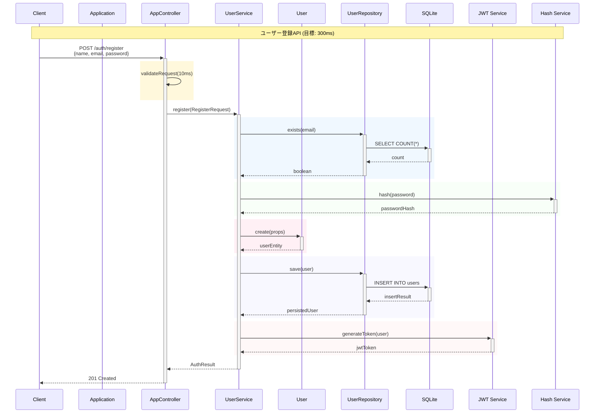

### 2.2 ユーザーログインAPI（POST /auth/login）

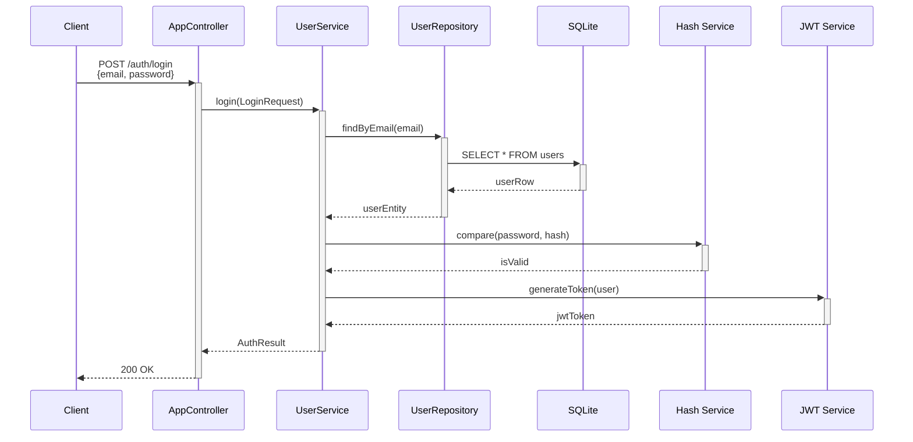

### 2.3 タスク作成API（POST /tasks）

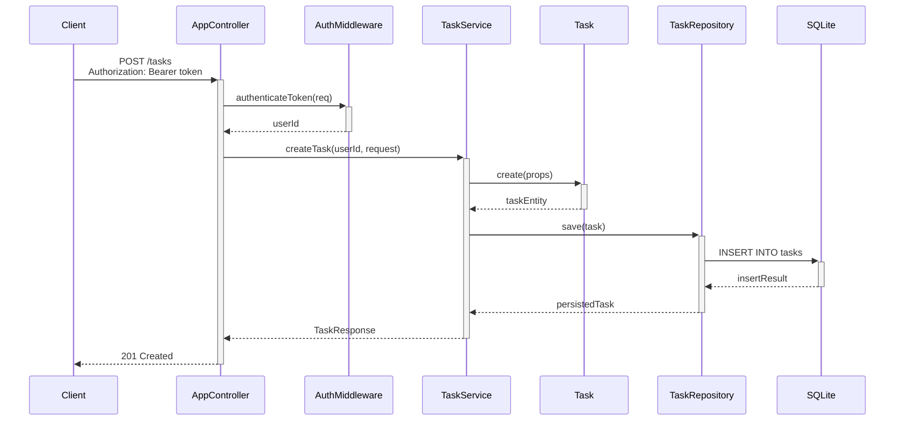

### 2.4 タスク一覧取得API（GET /tasks）

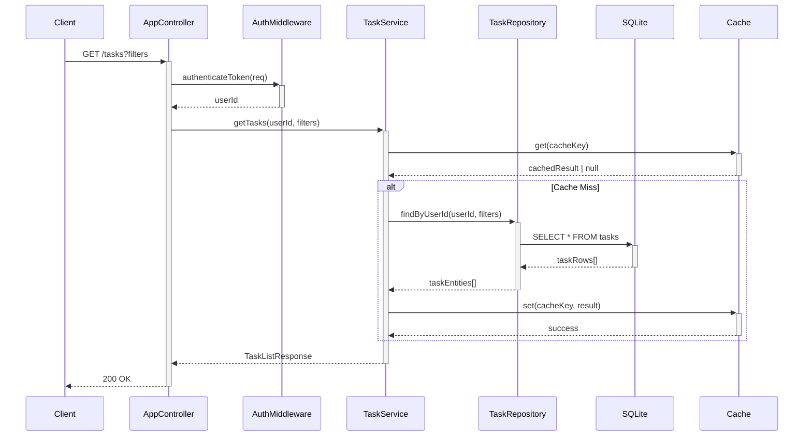

### 2.5 タスク更新API（PUT /tasks/:id）

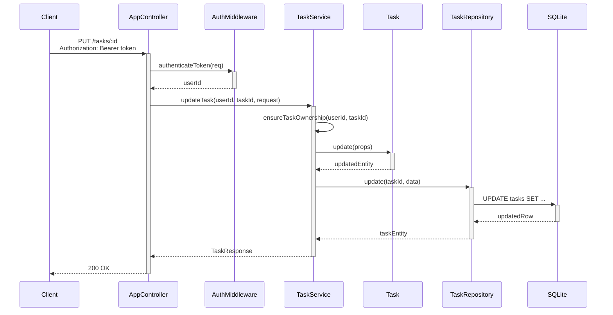

### 2.6 タスク削除API（DELETE /tasks/:id）

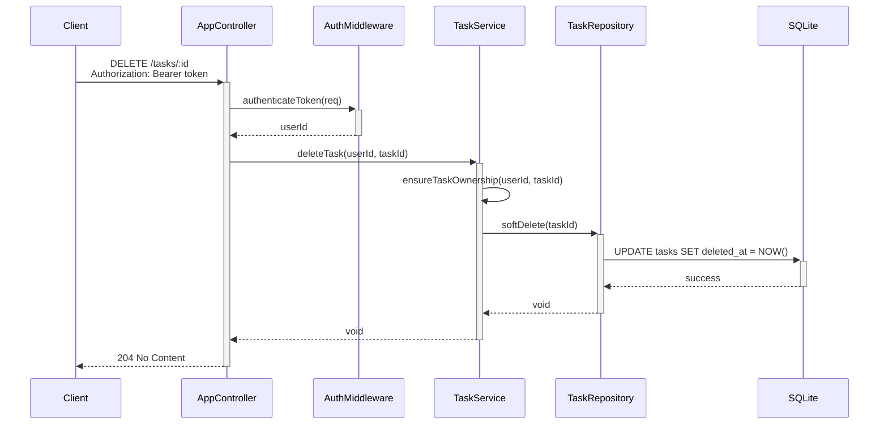

## 3. UIアクション単位シーケンス図

### 3.1 ユーザー登録フロー

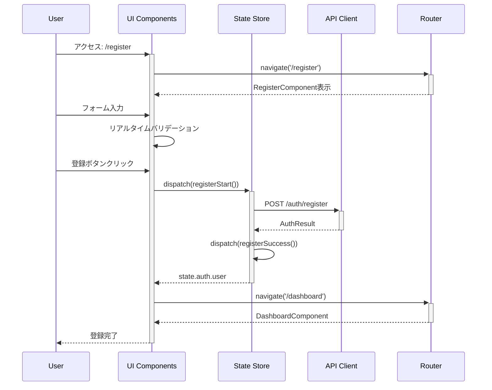

### 3.2 タスク作成フロー

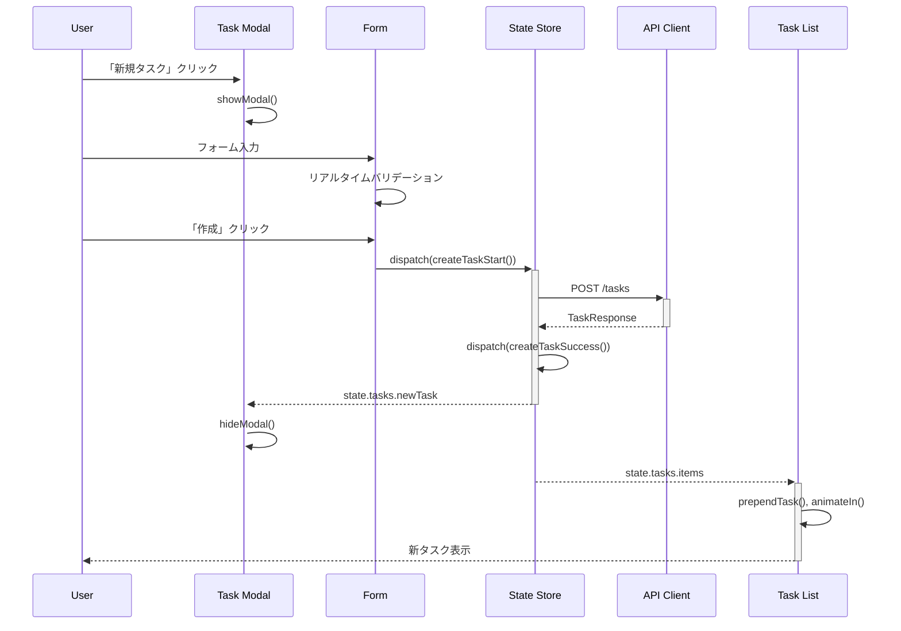

### 3.3 タスク一覧表示フロー

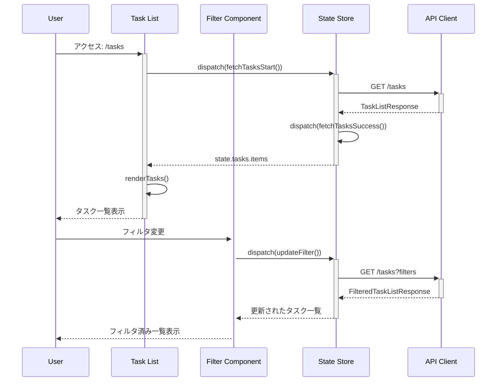

## 4. エラーハンドリングシーケンス図

### 4.1 認証エラー（JWT期限切れ）

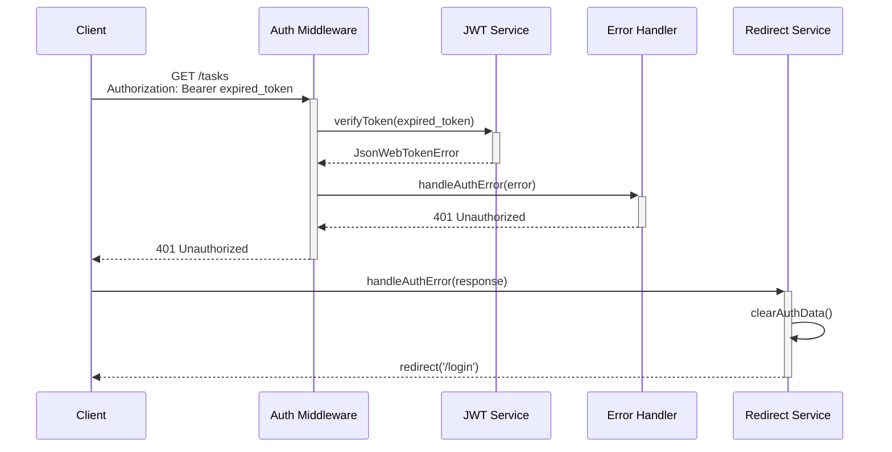

### 4.2 バリデーションエラー

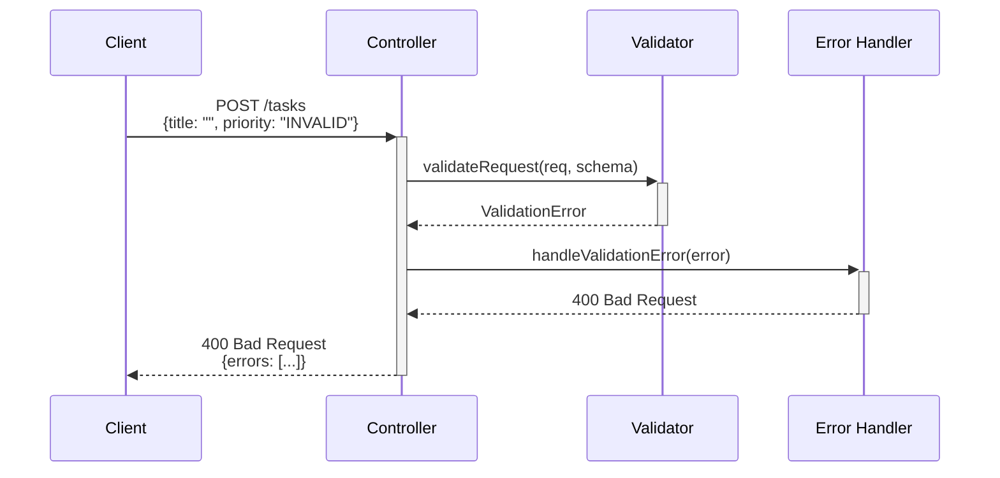

### 4.3 権限エラー（タスク所有者不一致）

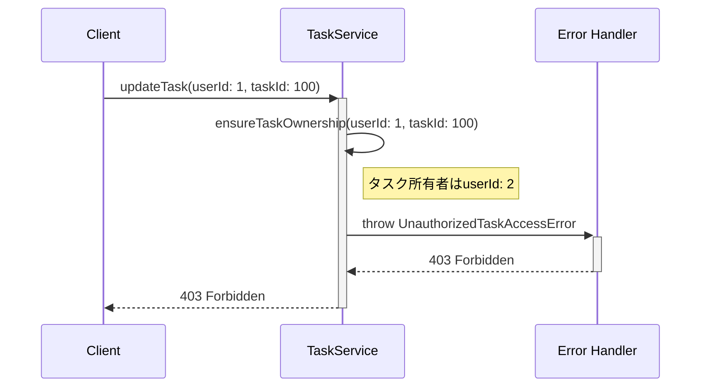

## 5. パフォーマンス分析シーケンス図

### 5.1 API応答時間分解

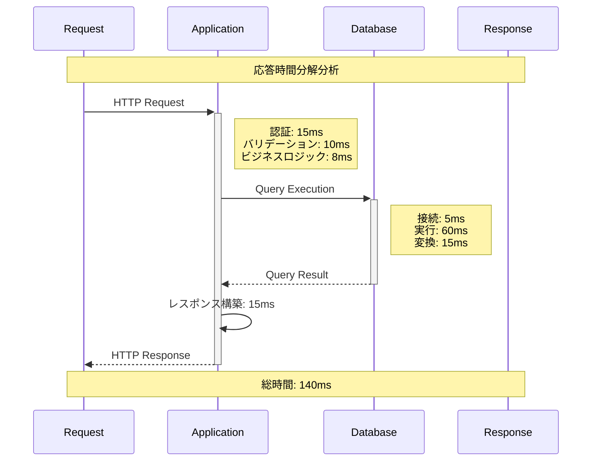

### 5.2 データベース処理最適化

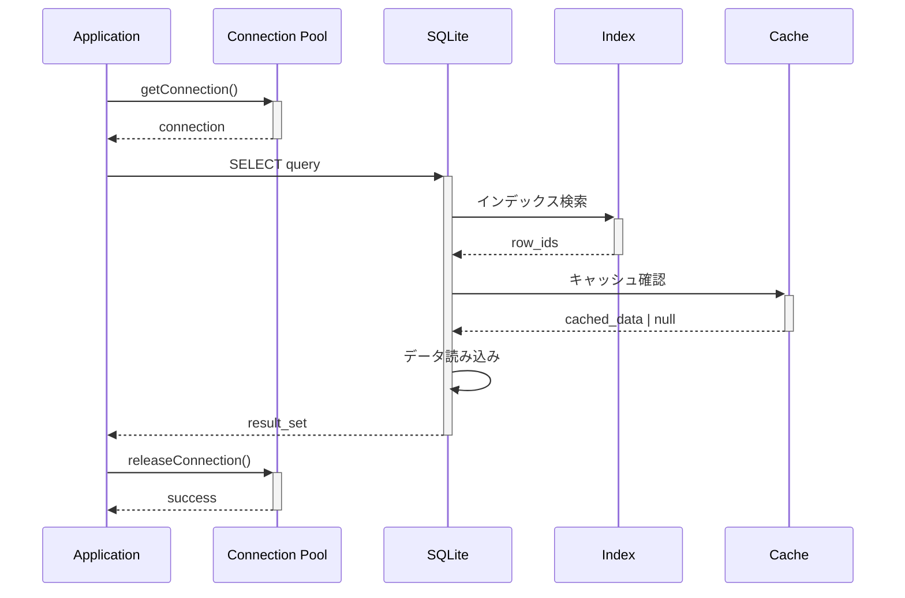

### 5.3 キャッシュ効果分析

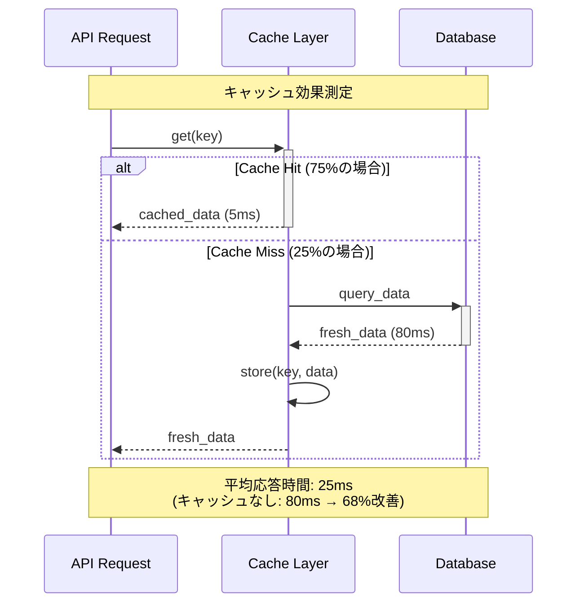

## 6. 活用ガイド

### 6.1 実装時の参照方法
- **API実装**: セクション2のAPI単位図を参照
- **UI実装**: セクション3のUIアクション単位図を参照
- **エラー処理**: セクション4のエラーハンドリング図を参照

### 6.2 最適化の指針
- **パフォーマンス**: セクション5の分析図でボトルネック特定
- **処理時間目標**: 各図の時間表記を実装基準として使用

### 6.3 詳細仕様との連携
- **詳細情報**: `docs/step3/sequence-specification.md`（SEQ-001）を参照
- **メソッド詳細**: `docs/step3/method-interface-list.md`（METHOD-001）を参照

---

**完了確認**: ✅ 視覚的シーケンス図集完成  
**用途**: 実装ガイド・視覚的理解  
**詳細仕様**: SEQ-001参照  
**更新日**: 2025-01-28 