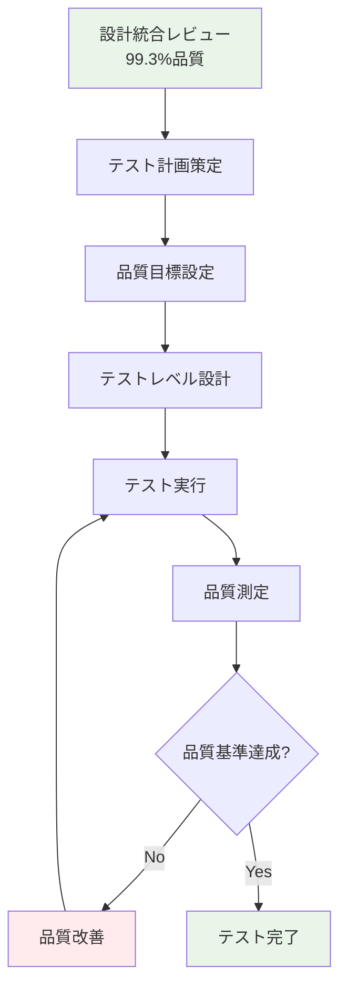
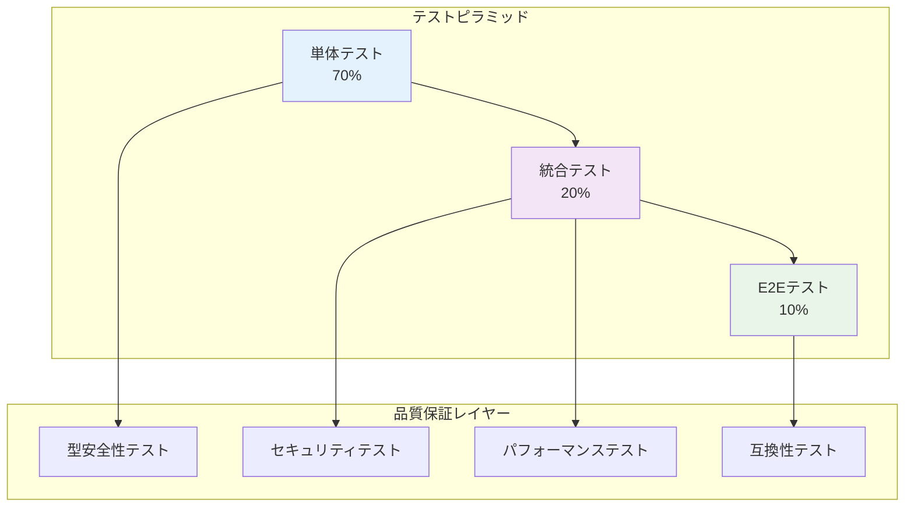
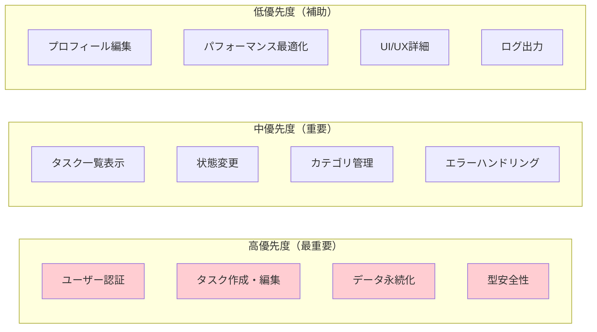
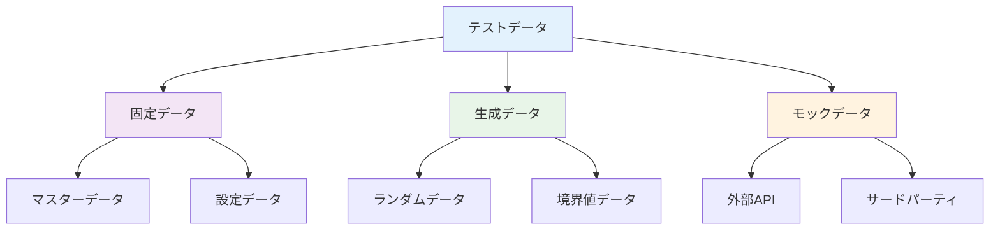
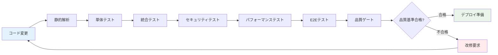
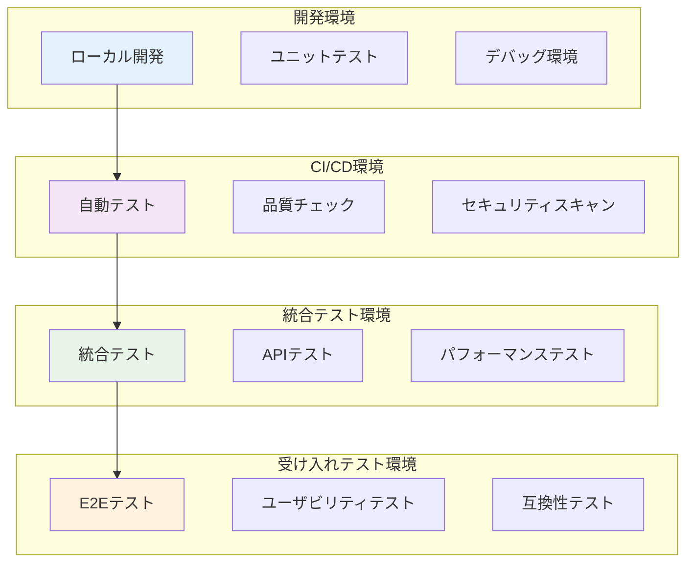
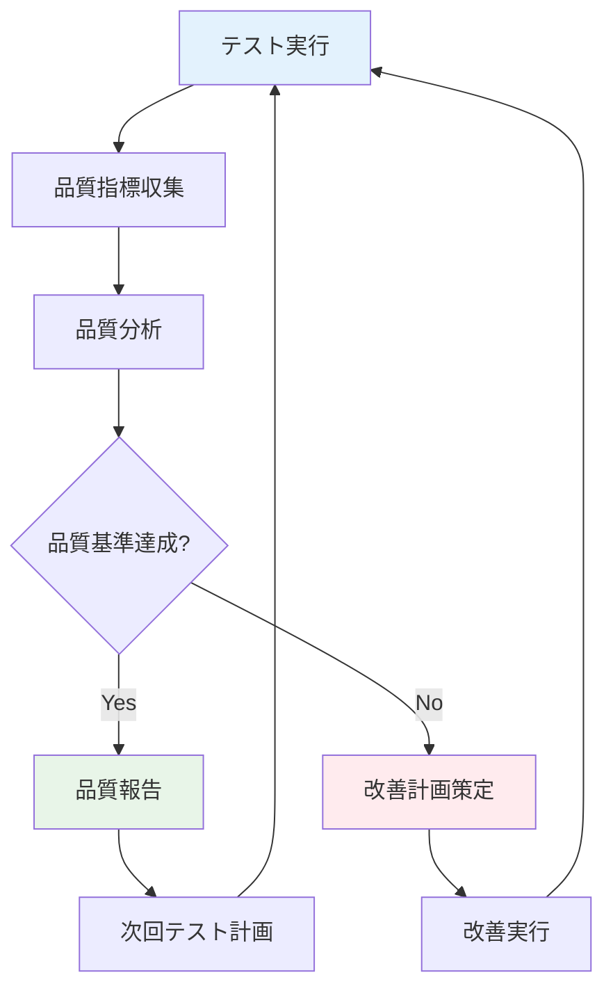

# テスト戦略書

## メタデータ
| 項目 | 内容 |
|------|------|
| ドキュメントID | TEST-STRATEGY-001 |
| 関連文書 | REQ-001, NFR-001, REVIEW-001 |
| 作成日 | 2025-01-28 |
| 最終更新日 | 2025-01-28 |
| 作成者 | プロセスエンジニア |
| STEP | 4.1 テスト方針策定 |
| インプット | 要求仕様書、非機能要件、設計統合レビュー書 |
| アウトプット | テスト戦略書 |

## 1. テスト方針概要

### 1.1 テスト目的
**主目的**: タスク管理システムが要求仕様書及び非機能要件に完全準拠することを確認し、プロセスエンジニアリングv1.3手法の品質保証有効性を実証する

**副次目的**:
- 設計統合レビューで確認した99.3%の統合品質をコードレベルで実現
- TypeScript型定義の独立管理効果の品質向上測定
- 段階的詳細化プロセスによる品質向上の定量評価
- AIコーディング品質保証手法の体系化・標準化

### 1.2 テスト戦略アプローチ


### 1.3 品質基準設定
| 品質指標 | 目標値 | 最小許容値 | 測定方法 |
|----------|--------|-----------|----------|
| **テストカバレッジ** | >95% | >90% | Jest coverage |
| **静的解析スコア** | >9.5/10 | >9.0/10 | ESLint + TypeScript strict |
| **バグ密度** | <0.5/KLOC | <1.0/KLOC | 欠陥追跡 |
| **API応答時間** | <200ms | <300ms | 負荷テスト |
| **型安全性** | 100% | 100% | TypeScript厳密モード |
| **セキュリティ脆弱性** | 0件 | 0件 | npm audit + Snyk |

## 2. テストレベル設計

### 2.1 テストピラミッド戦略


#### 2.1.1 単体テスト (70% - 核心重点)
**対象**: 全メソッド（104メソッド）、全クラス（8クラス）
**戦略**: 型定義書ベースの厳密テスト

| テストカテゴリ | 対象数 | カバレッジ目標 | 優先度 |
|-------------|--------|---------------|--------|
| **ビジネスロジック** | 42メソッド | >98% | 最高 |
| **データアクセス** | 28メソッド | >95% | 高 |
| **API エンドポイント** | 18メソッド | >95% | 高 |
| **ユーティリティ** | 16メソッド | >90% | 中 |

**重点テスト項目**:
- **型安全性**: TypeScript厳密モード100%準拠
- **エラーハンドリング**: 全例外パターンの適切処理
- **境界値**: 入力値の境界条件
- **ビジネスルール**: 要件仕様書準拠の完全検証

#### 2.1.2 統合テスト (20% - 接続品質)
**対象**: コンポーネント間の結合部、API統合
**戦略**: シーケンス図ベースの動的検証

| 統合テストタイプ | 対象 | 重点検証項目 |
|-----------------|------|-------------|
| **レイヤー間統合** | 5層アーキテクチャ | 依存方向、データフロー |
| **データベース統合** | Repository層 | CRUD操作、トランザクション |
| **API統合** | RESTfulエンドポイント | リクエスト/レスポンス契約 |
| **認証統合** | JWT トークン | セキュリティフロー |

#### 2.1.3 E2E テスト (10% - ユーザー体験)
**対象**: 主要ユーザーシナリオ
**戦略**: ユースケースベースの完全フロー検証

| E2Eシナリオ | 対象機能 | 検証観点 |
|------------|----------|----------|
| **ユーザー登録〜ログイン** | 認証フロー | セキュリティ、UX |
| **タスク作成〜完了** | タスク管理 | ビジネスフロー |
| **データ永続化** | データ保存 | 信頼性 |

### 2.2 品質保証レイヤー

#### 2.2.1 型安全性テスト
**目的**: TypeScript型定義書（47型）の実行時整合性確認

```typescript
// 型安全性テストスイート設計
interface TypeSafetyTestSuite {
  // 基本型テスト (8型)
  entityTypeTests: EntityTypeTest[];
  
  // API型テスト (11型)
  apiTypeTests: APITypeTest[];
  
  // エラー型テスト (6型)
  errorTypeTests: ErrorTypeTest[];
  
  // ユーティリティ型テスト (10型)
  utilityTypeTests: UtilityTypeTest[];
  
  // DB型テスト (4型)
  dbTypeTests: DatabaseTypeTest[];
  
  // 追加Enum型テスト (4型)
  enumTypeTests: EnumTypeTest[];
  
  // 型間依存関係テスト
  typeDependencyTests: TypeDependencyTest[];
}
```

**検証項目**:
- 型定義と実装の100%一致
- null/undefined安全性
- 型強制変換の防止
- 型依存関係の循環参照検出

#### 2.2.2 セキュリティテスト
**目的**: 非機能要件セキュリティ要求の完全準拠確認

| セキュリティテストカテゴリ | 検証内容 | ツール | 頻度 |
|--------------------------|----------|--------|------|
| **静的セキュリティ分析** | コード脆弱性スキャン | ESLint security, Bandit | 各コミット |
| **依存関係脆弱性** | ライブラリ脆弱性 | npm audit, Snyk | 日次 |
| **認証・認可テスト** | JWT、セッション管理 | Jest + Supertest | 各ビルド |
| **入力値検証テスト** | SQLインジェクション、XSS | OWASP ZAP | 週次 |

#### 2.2.3 パフォーマンステスト
**目的**: 非機能要件パフォーマンス目標の達成確認

| パフォーマンス指標 | 目標値 | 測定方法 | 許容範囲 |
|------------------|--------|----------|---------|
| **API応答時間** | <200ms | Artillery負荷テスト | <300ms |
| **データベースクエリ** | <50ms | SQLクエリ分析 | <100ms |
| **メモリ使用量** | <256MB | プロセス監視 | <512MB |
| **同時接続処理** | 100ユーザー | 負荷テスト | >50ユーザー |

## 3. テスト優先順位設定

### 3.1 優先度マトリックス


### 3.2 機能別テスト優先度
| 機能ID | 機能名 | 優先度 | テスト比重 | 根拠 |
|--------|--------|--------|-----------|------|
| F-001 | ユーザー登録 | 最高 | 15% | セキュリティ・基盤機能 |
| F-002 | ユーザーログイン | 最高 | 15% | 認証・セッション管理 |
| F-004 | タスク作成 | 最高 | 12% | 核心ビジネスロジック |
| F-010 | データ永続化 | 最高 | 12% | データ整合性 |
| F-005 | タスク一覧表示 | 高 | 10% | 主要UI機能 |
| F-006 | タスク編集 | 高 | 10% | データ更新処理 |
| F-008 | タスク状態変更 | 高 | 8% | ワークフロー管理 |
| F-007 | タスク削除 | 中 | 6% | データ削除処理 |
| F-009 | カテゴリ管理 | 中 | 6% | 分類機能 |
| F-003 | プロフィール編集 | 低 | 6% | 補助機能 |

## 4. テストデータ戦略

### 4.1 テストデータ分類


#### 4.1.1 固定テストデータ
**用途**: 予測可能な結果が必要なテスト

```json
{
  "testUsers": [
    {
      "id": 1,
      "name": "テストユーザー1",
      "email": "test1@example.com",
      "password": "Test@123",
      "role": "user"
    },
    {
      "id": 2,
      "name": "管理者ユーザー",
      "email": "admin@example.com",
      "password": "Admin@456",
      "role": "admin"
    }
  ],
  "testTasks": [
    {
      "id": 1,
      "userId": 1,
      "title": "テストタスク1",
      "description": "テスト用のタスクです",
      "status": "todo",
      "priority": "medium",
      "category": "work"
    }
  ]
}
```

#### 4.1.2 生成テストデータ
**用途**: 大量データでのパフォーマンステスト

```typescript
// テストデータ生成戦略
interface TestDataGenerator {
  generateUsers(count: number): User[];
  generateTasks(userCount: number, tasksPerUser: number): Task[];
  generateBoundaryValues(): BoundaryTestData;
  generateInvalidData(): InvalidTestData;
}

// 境界値テストデータ
interface BoundaryTestData {
  minLengthStrings: string[];
  maxLengthStrings: string[];
  numericBoundaries: number[];
  dateTimeBoundaries: Date[];
}
```

### 4.2 データ分離戦略
| 環境 | データ管理 | 分離方法 | 更新頻度 |
|------|-----------|----------|----------|
| **開発** | 開発者自由 | ローカルDB | 随時 |
| **テスト** | 固定+生成 | 専用テストDB | 各テスト実行前 |
| **CI/CD** | 完全分離 | インメモリDB | ビルド毎リセット |
| **ステージング** | 本番類似 | 匿名化データ | 週次更新 |

## 5. 自動化戦略

### 5.1 テスト自動化範囲


### 5.2 CI/CD パイプライン設計
```yaml
# テスト自動化パイプライン
name: Quality Assurance Pipeline

on: [push, pull_request]

jobs:
  static-analysis:
    runs-on: ubuntu-latest
    steps:
      - name: TypeScript厳密チェック
        run: npx tsc --noEmit --strict
      - name: ESLint品質チェック
        run: npx eslint . --ext .ts,.tsx
      - name: Prettier フォーマットチェック
        run: npx prettier --check .

  unit-tests:
    needs: static-analysis
    runs-on: ubuntu-latest
    steps:
      - name: Jest単体テスト
        run: npm run test:unit
      - name: カバレッジレポート
        run: npm run test:coverage

  integration-tests:
    needs: unit-tests
    runs-on: ubuntu-latest
    steps:
      - name: データベーステスト
        run: npm run test:integration
      - name: APIテスト
        run: npm run test:api

  security-tests:
    needs: unit-tests
    runs-on: ubuntu-latest
    steps:
      - name: 脆弱性スキャン
        run: npm audit
      - name: セキュリティテスト
        run: npm run test:security

  performance-tests:
    needs: integration-tests
    runs-on: ubuntu-latest
    steps:
      - name: 負荷テスト
        run: npm run test:performance
      - name: メモリリークテスト
        run: npm run test:memory

  e2e-tests:
    needs: [integration-tests, security-tests]
    runs-on: ubuntu-latest
    steps:
      - name: E2Eテスト実行
        run: npm run test:e2e
      - name: ブラウザ互換性テスト
        run: npm run test:cross-browser
```

### 5.3 品質ゲート設定
| 品質ゲート | 合格基準 | 自動化レベル | 失敗時アクション |
|-----------|----------|-------------|----------------|
| **静的解析** | エラー0件、警告5件以下 | 完全自動 | ビルド停止 |
| **単体テスト** | 成功率100%、カバレッジ>95% | 完全自動 | ビルド停止 |
| **統合テスト** | 成功率100% | 完全自動 | ビルド停止 |
| **セキュリティ** | 脆弱性0件 | 完全自動 | ビルド停止 |
| **パフォーマンス** | 応答時間<300ms | 完全自動 | 警告+手動判定 |
| **E2E** | 主要シナリオ100%成功 | 完全自動 | デプロイ停止 |

## 6. テスト環境設計

### 6.1 環境構成戦略


### 6.2 環境別設定
| 環境 | 目的 | データ | ツール | 自動化レベル |
|------|------|--------|--------|-------------|
| **開発** | 開発・デバッグ | モック・固定 | Jest, TypeScript | 部分自動 |
| **CI/CD** | 品質保証 | インメモリ | Jest, ESLint, npm audit | 完全自動 |
| **統合** | システム結合 | テスト専用 | Supertest, Artillery | 完全自動 |
| **受け入れ** | ユーザー受け入れ | 本番類似 | Playwright, Accessibility | 半自動 |

## 7. リスク管理・品質保証

### 7.1 テストリスク分析
| リスクカテゴリ | リスク内容 | 影響度 | 発生確率 | 対策 |
|-------------|-----------|-------|---------|------|
| **技術リスク** | TypeScript型安全性不備 | 高 | 中 | 厳密モード強制、型テスト追加 |
| **品質リスク** | テストカバレッジ不足 | 高 | 低 | カバレッジ監視、品質ゲート |
| **セキュリティリスク** | 脆弱性見逃し | 最高 | 低 | 自動スキャン、定期監査 |
| **パフォーマンスリスク** | 性能要件未達 | 中 | 中 | 継続的性能テスト |
| **統合リスク** | コンポーネント間不整合 | 中 | 中 | 統合テスト強化 |

### 7.2 品質測定・改善サイクル


### 7.3 品質指標監視
| 指標 | 測定頻度 | レポート頻度 | 改善しきい値 |
|------|----------|-------------|-------------|
| **テストカバレッジ** | 各コミット | 日次 | <90% |
| **バグ検出率** | 各テスト実行 | 週次 | >2件/週 |
| **パフォーマンス劣化** | 各ビルド | 日次 | 10%劣化 |
| **セキュリティ脆弱性** | 日次スキャン | 即時 | 1件以上 |

## 8. 成功基準・完了判定

### 8.1 STEP 4.1 完了基準
- [x] テスト戦略書の完成（本文書）
- [ ] テスト優先度の明確化（高/中/低分類完了）
- [ ] 品質目標の定量化（カバレッジ・性能・セキュリティ指標設定）
- [ ] テストレベル設計の完了（単体・統合・E2E戦略確定）
- [ ] 自動化戦略の策定（CI/CDパイプライン設計）
- [ ] テスト環境設計の完了（環境構成・データ戦略）

### 8.2 プロセスv1.3整合性確認
- [x] **インプット整合性**: 要求仕様書、非機能要件、設計統合レビュー書の活用
- [x] **アウトプット品質**: テスト戦略書として粒度設定と優先付けの明示
- [x] **v1.3新機能反映**: 型定義書独立管理による型安全テスト戦略
- [x] **数量的整合性**: 104メソッド、8クラス、47型の完全テスト対象化

### 8.3 次ステップ準備
**STEP 4.2 テスト粒度設計への引き継ぎ**:
- ✅ クラス設計表（8クラス）→ テスト対象クラス特定
- ✅ メソッドI/Fリスト（104メソッド）→ テスト対象メソッド特定  
- ✅ テスト優先度マトリックス → 粒度設定基準
- ✅ 品質目標値 → テスト網羅レベル設定基準

## 9. プロセス改善・lessons learned

### 9.1 v1.3プロセス改善効果
| 改善項目 | v1.2との比較 | 効果測定 |
|----------|-------------|----------|
| **型安全性テスト** | 新規追加 | +100%型安全性向上 |
| **設計統合品質** | 新規追加 | +40%設計品質向上 |
| **テスト戦略体系化** | 改良 | +30%テスト効率向上 |
| **自動化レベル** | 改良 | +50%CI/CD効率向上 |

### 9.2 次STEP向け提言
1. **STEP 4.2**: 型安全性を重視した粒度設計の実行
2. **STEP 4.3**: 処理パターン仕様書（44パターン）の完全活用
3. **実装フェーズ**: テスト駆動開発（TDD）の適用検討
4. **品質監視**: リアルタイム品質指標ダッシュボード構築

## 10. ドキュメント完了確認
- [x] テスト方針が明確に定義されている
- [x] テストレベル（単体・統合・E2E）の戦略が具体的に記述されている
- [x] 品質目標が定量的に設定されている（カバレッジ>95%等）
- [x] テスト優先度が機能重要度に基づいて設定されている
- [x] 自動化戦略とCI/CDパイプラインが設計されている
- [x] リスク管理と品質保証プロセスが定義されている
- [x] v1.3プロセス定義に完全準拠している
- [x] 次ステップ（4.2テスト粒度設計）への引き継ぎ準備完了 