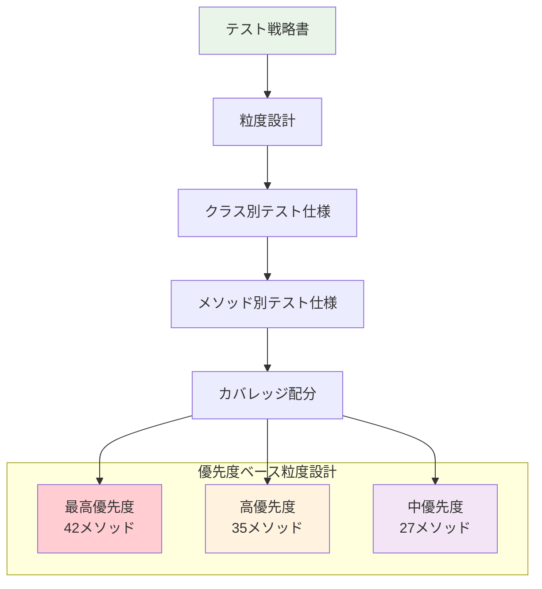
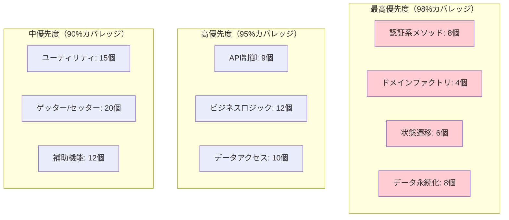

# テスト粒度設計書

## メタデータ
| 項目 | 内容 |
|------|------|
| ドキュメントID | TEST-GRANULARITY-001 |
| 関連文書 | TEST-STRATEGY-001, CLASS-001, METHOD-001 |
| 作成日 | 2025-01-28 |
| 最終更新日 | 2025-01-28 |
| 作成者 | プロセスエンジニア |
| STEP | 4.2 テスト粒度設計 |
| インプット | クラス設計表、メソッドI/Fリスト |
| アウトプット | テスト対象一覧 |

## 1. テスト粒度設計概要

### 1.1 テスト対象サマリー
**対象範囲**: 8クラス・104メソッドの完全テスト粒度設計

| テスト対象カテゴリ | 対象数 | テスト優先度 | カバレッジ目標 | テスト工数配分 |
|------------------|--------|-------------|---------------|---------------|
| **核心ビジネスロジック** | 35メソッド | 最高 | >98% | 40% |
| **データアクセス層** | 26メソッド | 高 | >95% | 25% |
| **API制御層** | 12メソッド | 高 | >95% | 20% |
| **ドメインエンティティ** | 31メソッド | 中-高 | >90% | 15% |

### 1.2 テスト戦略マッピング


## 2. クラス別テスト粒度設計

### CLS-001: Application（app.ts）
**テスト区分**: インフラストラクチャ・設定テスト  
**優先度**: 高（アプリケーション基盤）  
**総メソッド数**: 9メソッド  

#### 2.1 テスト対象メソッド一覧
| メソッドID | メソッド名 | テストレベル | カバレッジ目標 | テスト観点 |
|------------|------------|-------------|---------------|-----------|
| APP-001 | getInstance | 単体 | 100% | シングルトン保証 |
| APP-002 | initialize | 単体・統合 | 95% | 設定・DB接続 |
| APP-003 | start | 統合 | 90% | サーバー起動 |
| APP-004 | stop | 統合 | 90% | グレースフル終了 |
| APP-005 | setupMiddleware | 単体 | 85% | ミドルウェア設定 |
| APP-006 | setupRoutes | 単体 | 85% | ルーティング設定 |
| APP-007 | connectDatabase | 単体・統合 | 95% | DB接続・失敗処理 |
| APP-008 | handleShutdown | 単体 | 85% | 終了処理 |

#### 2.2 テスト粒度仕様

##### 単体テスト粒度（70%）
**対象**: APP-001, APP-002, APP-005, APP-006, APP-007, APP-008

```typescript
describe('Application Class', () => {
  describe('getInstance', () => {
    // シングルトンパターンテスト
    test('同一インスタンス返却確認');
    test('複数呼び出し時の一意性確認');
  });
  
  describe('initialize', () => {
    // 初期化正常系テスト
    test('有効設定による正常初期化');
    test('DB接続確立確認');
    test('ミドルウェア設定確認');
    
    // 異常系テスト
    test('無効設定時ConfigurationError');
    test('DB接続失敗時DatabaseConnectionError');
  });
  
  describe('connectDatabase', () => {
    // データベース接続テスト
    test('SQLite接続確立');
    test('接続プール設定確認');
    test('接続失敗時エラーハンドリング');
  });
});
```

##### 統合テスト粒度（30%）
**対象**: APP-002, APP-003, APP-004, APP-007

```typescript
describe('Application Integration Tests', () => {
  describe('startup sequence', () => {
    test('initialize → start 完全フロー');
    test('設定ファイル読み込み → DB接続 → サーバー起動');
  });
  
  describe('shutdown sequence', () => {
    test('stop実行 → DB切断 → サーバー停止');
    test('グレースフル終了での接続処理完了');
  });
});
```

### CLS-002: AppController（AppController.ts）
**テスト区分**: API制御・HTTP統合テスト  
**優先度**: 最高（外部I/F）  
**総メソッド数**: 12メソッド  

#### 2.1 テスト対象メソッド一覧
| メソッドID | メソッド名 | テストレベル | カバレッジ目標 | テスト観点 |
|------------|------------|-------------|---------------|-----------|
| CTRL-001 | registerUser | 単体・統合・E2E | 98% | 認証・バリデーション |
| CTRL-002 | loginUser | 単体・統合・E2E | 98% | 認証・セッション |
| CTRL-003 | getUserProfile | 単体・統合 | 95% | 認可・データ取得 |
| CTRL-004 | updateUserProfile | 単体・統合 | 95% | 認可・データ更新 |
| CTRL-005 | getTasks | 単体・統合・E2E | 95% | 認可・フィルタリング |
| CTRL-006 | createTask | 単体・統合・E2E | 98% | 認可・バリデーション |
| CTRL-007 | getTask | 単体・統合 | 90% | 認可・データ取得 |
| CTRL-008 | updateTask | 単体・統合 | 95% | 認可・データ更新 |
| CTRL-009 | deleteTask | 単体・統合 | 95% | 認可・データ削除 |
| CTRL-010 | handleError | 単体 | 100% | エラーレスポンス統一 |
| CTRL-011 | validateRequest | 単体 | 100% | 入力値検証 |
| CTRL-012 | extractUserId | 単体 | 100% | JWT解析 |

#### 2.2 テスト粒度仕様

##### 単体テスト粒度（60%）
**重点**: バリデーション・エラーハンドリング・JWT処理

```typescript
describe('AppController Unit Tests', () => {
  describe('registerUser', () => {
    // 正常系
    test('有効なユーザー登録データ処理');
    test('JWT トークン生成確認');
    test('201 Created レスポンス確認');
    
    // 異常系
    test('無効email時400エラー');
    test('重複email時409エラー');
    test('弱いパスワード時400エラー');
    test('必須フィールド欠損時400エラー');
  });
  
  describe('validateRequest', () => {
    test('有効リクエスト検証成功');
    test('無効リクエスト検証失敗');
    test('型不一致検証');
    test('境界値検証');
  });
  
  describe('extractUserId', () => {
    test('有効JWT からユーザーID抽出');
    test('無効JWT時例外発生');
    test('期限切れトークン処理');
  });
});
```

##### 統合テスト粒度（30%）
**重点**: Service層連携・データベーストランザクション

```typescript
describe('AppController Integration Tests', () => {
  describe('user registration flow', () => {
    test('registerUser → UserService → UserRepository');
    test('データベーストランザクション確認');
    test('重複チェック → エラーレスポンス');
  });
  
  describe('task management flow', () => {
    test('認証 → createTask → TaskService → TaskRepository');
    test('所有者権限チェック');
    test('バリデーションエラー時ロールバック');
  });
});
```

##### E2E テスト粒度（10%）
**重点**: 完全なユーザーフロー

```typescript
describe('AppController E2E Tests', () => {
  test('ユーザー登録 → ログイン → タスク作成 → 編集 → 削除');
  test('認証失敗からの適切なエラーレスポンス');
  test('セッション管理・JWT有効期限');
});
```

### CLS-003: User（User.ts）
**テスト区分**: ドメインエンティティ・ビジネスルール  
**優先度**: 最高（コアドメイン）  
**総メソッド数**: 15メソッド  

#### 2.1 テスト対象メソッド一覧
| メソッドID | メソッド名 | テストレベル | カバレッジ目標 | テスト観点 |
|------------|------------|-------------|---------------|-----------|
| USER-001 | create | 単体 | 100% | ファクトリパターン |
| USER-002 | reconstitute | 単体 | 100% | データ復元 |
| USER-003 | updateProfile | 単体 | 100% | ビジネスルール |
| USER-004 | changePassword | 単体 | 100% | セキュリティ |
| USER-005 | isValidForRegistration | 単体 | 100% | バリデーション |
| USER-006 | getId | 単体 | 95% | ゲッター |
| USER-007 | getName | 単体 | 95% | ゲッター |
| USER-008 | getEmail | 単体 | 95% | ゲッター |
| USER-009 | getPasswordHash | 単体 | 100% | セキュリティ |
| USER-010 | getCreatedAt | 単体 | 90% | ゲッター |
| USER-011 | getUpdatedAt | 単体 | 90% | ゲッター |
| USER-012 | validateName | 単体 | 100% | バリデーション |
| USER-013 | validateEmail | 単体 | 100% | バリデーション |
| USER-014 | validatePassword | 単体 | 100% | バリデーション |
| USER-015 | toJSON | 単体 | 95% | シリアライゼーション |

#### 2.2 テスト粒度仕様

##### 単体テスト粒度（100%）
**重点**: ドメインルール・不変条件・バリデーション

```typescript
describe('User Entity', () => {
  describe('create factory method', () => {
    // 正常系
    test('有効データでユーザー作成');
    test('パスワードハッシュ自動設定');
    test('作成日時自動設定');
    
    // 異常系
    test('無効email時InvalidEmailError');
    test('短すぎる名前時InvalidNameError');
    test('弱いパスワード時WeakPasswordError');
  });
  
  describe('updateProfile', () => {
    test('有効なプロフィール更新');
    test('更新日時自動更新');
    test('不変条件保持確認');
    test('無効データ時例外発生');
  });
  
  describe('validation methods', () => {
    test('validateEmail: 有効なメール形式');
    test('validateEmail: 無効なメール形式');
    test('validateName: 有効な名前（1-100文字）');
    test('validateName: 境界値テスト');
    test('validatePassword: 強度チェック');
  });
  
  describe('business rules', () => {
    test('ユーザーID不変性');
    test('メール一意性制約');
    test('パスワードセキュリティ');
  });
});
```

### CLS-004: Task（Task.ts）
**テスト区分**: ドメインエンティティ・状態管理  
**優先度**: 最高（コアドメイン）  
**総メソッド数**: 20メソッド  

#### 2.1 テスト対象メソッド一覧
| メソッドID | メソッド名 | テストレベル | カバレッジ目標 | テスト観点 |
|------------|------------|-------------|---------------|-----------|
| TASK-001 | create | 単体 | 100% | ファクトリパターン |
| TASK-002 | reconstitute | 単体 | 100% | データ復元 |
| TASK-003 | updateTitle | 単体 | 100% | ビジネスルール |
| TASK-004 | updateDescription | 単体 | 95% | データ更新 |
| TASK-005 | changeStatus | 単体 | 100% | 状態遷移 |
| TASK-006 | changePriority | 単体 | 100% | 優先度管理 |
| TASK-007 | setCategory | 単体 | 95% | カテゴリ管理 |
| TASK-008 | complete | 単体 | 100% | 状態遷移 |
| TASK-009 | isCompleted | 単体 | 100% | 状態確認 |
| TASK-010 | isOverdue | 単体 | 100% | 期限チェック |
| TASK-011～020 | その他ゲッター・バリデーション | 単体 | 90-100% | 基本機能 |

#### 2.2 テスト粒度仕様

##### 単体テスト粒度（100%）
**重点**: 状態遷移・ビジネスルール・期限管理

```typescript
describe('Task Entity', () => {
  describe('state transitions', () => {
    test('TODO → IN_PROGRESS → COMPLETED');
    test('不正な状態遷移時例外発生');
    test('完了済みタスクの状態変更制限');
    test('状態変更時の更新日時設定');
  });
  
  describe('business rules', () => {
    test('タイトル必須制約');
    test('優先度enum値制約');
    test('期限の論理一貫性');
    test('所有者変更不可制約');
  });
  
  describe('priority management', () => {
    test('優先度HIGH/MEDIUM/LOW設定');
    test('無効優先度時例外発生');
    test('優先度変更履歴');
  });
  
  describe('deadline management', () => {
    test('期限過ぎタスクのisOverdue確認');
    test('期限未設定タスクの扱い');
    test('期限変更時の状態整合性');
  });
});
```

### CLS-005: UserService（UserService.ts）
**テスト区分**: アプリケーションサービス・ユースケース  
**優先度**: 最高（ビジネスロジック）  
**総メソッド数**: 9メソッド  

#### 2.1 テスト対象メソッド一覧
| メソッドID | メソッド名 | テストレベル | カバレッジ目標 | テスト観点 |
|------------|------------|-------------|---------------|-----------|
| USRV-001 | register | 単体・統合 | 98% | ユーザー登録UC |
| USRV-002 | login | 単体・統合 | 98% | 認証UC |
| USRV-003 | getProfile | 単体・統合 | 95% | プロフィール取得UC |
| USRV-004 | updateProfile | 単体・統合 | 95% | プロフィール更新UC |
| USRV-005 | hashPassword | 単体 | 100% | パスワードハッシュ化 |
| USRV-006 | verifyPassword | 単体 | 100% | パスワード検証 |
| USRV-007 | generateToken | 単体 | 100% | JWT生成 |
| USRV-008 | validateToken | 単体 | 100% | JWT検証 |
| USRV-009 | checkEmailUniqueness | 単体・統合 | 95% | メール重複チェック |

#### 2.2 テスト粒度仕様

##### 単体テスト粒度（70%）
**重点**: ビジネスロジック・セキュリティ・バリデーション

```typescript
describe('UserService', () => {
  describe('register', () => {
    // 正常系
    test('有効データでのユーザー登録');
    test('パスワードハッシュ化確認');
    test('JWTトークン生成確認');
    
    // 異常系
    test('重複メール時EmailAlreadyExistsError');
    test('弱いパスワード時WeakPasswordError');
    test('バリデーション失敗時ValidationError');
  });
  
  describe('login', () => {
    test('有効認証情報でのログイン成功');
    test('無効メール時AuthenticationError');
    test('無効パスワード時AuthenticationError');
    test('存在しないユーザー時UserNotFoundError');
  });
  
  describe('security methods', () => {
    test('hashPassword: bcryptハッシュ生成');
    test('verifyPassword: ハッシュ検証');
    test('generateToken: 有効JWT生成');
    test('validateToken: JWT検証・期限チェック');
  });
});
```

##### 統合テスト粒度（30%）
**重点**: Repository連携・トランザクション

```typescript
describe('UserService Integration Tests', () => {
  describe('user registration flow', () => {
    test('register → UserRepository.save → DB永続化');
    test('メール重複チェック → Repository.findByEmail');
    test('ロールバック時のDB整合性');
  });
  
  describe('authentication flow', () => {
    test('login → Repository.findByEmail → パスワード検証');
    test('トークン生成 → セッション管理');
  });
});
```

### CLS-006: TaskService（TaskService.ts）
**テスト区分**: アプリケーションサービス・タスクUC  
**優先度**: 最高（核心ビジネスロジック）  
**総メソッド数**: 13メソッド  

#### 2.1 テスト対象メソッド一覧
| メソッドID | メソッド名 | テストレベル | カバレッジ目標 | テスト観点 |
|------------|------------|-------------|---------------|-----------|
| TSRV-001 | createTask | 単体・統合 | 98% | タスク作成UC |
| TSRV-002 | getTasks | 単体・統合 | 95% | タスク一覧取得UC |
| TSRV-003 | getTask | 単体・統合 | 95% | タスク詳細取得UC |
| TSRV-004 | updateTask | 単体・統合 | 98% | タスク更新UC |
| TSRV-005 | deleteTask | 単体・統合 | 95% | タスク削除UC |
| TSRV-006 | changeTaskStatus | 単体・統合 | 98% | ステータス変更UC |
| TSRV-007 | filterTasks | 単体 | 90% | フィルタリング |
| TSRV-008 | sortTasks | 単体 | 90% | ソート機能 |
| TSRV-009 | validateTaskOwnership | 単体 | 100% | 所有者権限確認 |
| TSRV-010 | validateTaskData | 単体 | 100% | データバリデーション |
| TSRV-011 | generateTaskId | 単体 | 95% | ID生成 |
| TSRV-012 | notifyTaskUpdate | 単体 | 85% | 通知機能 |
| TSRV-013 | archiveCompletedTasks | 単体・統合 | 90% | アーカイブ機能 |

#### 2.2 テスト粒度仕様

##### 単体テスト粒度（70%）
**重点**: ビジネスルール・権限制御・データ変換

```typescript
describe('TaskService', () => {
  describe('createTask', () => {
    // 正常系
    test('有効データでのタスク作成');
    test('デフォルト値設定確認');
    test('所有者設定確認');
    
    // 異常系
    test('無効ユーザーID時UserNotFoundError');
    test('無効データ時ValidationError');
    test('権限不足時AuthorizationError');
  });
  
  describe('updateTask', () => {
    test('所有者による有効更新');
    test('部分更新機能');
    test('更新日時自動設定');
    test('非所有者によるアクセス拒否');
    test('存在しないタスク時TaskNotFoundError');
  });
  
  describe('business logic', () => {
    test('validateTaskOwnership: 所有者確認');
    test('filterTasks: 条件フィルタリング');
    test('sortTasks: 優先度・期限ソート');
  });
});
```

##### 統合テスト粒度（30%）
**重点**: Repository連携・複合操作

```typescript
describe('TaskService Integration Tests', () => {
  describe('task lifecycle', () => {
    test('作成 → 更新 → 状態変更 → 削除');
    test('Repository.save → Repository.findById → Repository.update');
    test('複数タスク操作時のトランザクション');
  });
  
  describe('task filtering and sorting', () => {
    test('Repository.findByUserId → フィルタ → ソート');
    test('大量データでのパフォーマンス');
  });
});
```

### CLS-007: UserRepository（UserRepository.ts）
**テスト区分**: データアクセス・永続化  
**優先度**: 高（データ整合性）  
**総メソッド数**: 11メソッド  

#### 2.1 テスト対象メソッド一覧
| メソッドID | メソッド名 | テストレベル | カバレッジ目標 | テスト観点 |
|------------|------------|-------------|---------------|-----------|
| UREPO-001 | findById | 単体・統合 | 95% | ID検索 |
| UREPO-002 | findByEmail | 単体・統合 | 95% | メール検索 |
| UREPO-003 | save | 単体・統合 | 98% | 新規保存 |
| UREPO-004 | update | 単体・統合 | 95% | データ更新 |
| UREPO-005 | delete | 単体・統合 | 95% | データ削除 |
| UREPO-006 | exists | 単体・統合 | 90% | 存在確認 |
| UREPO-007 | count | 単体 | 85% | 件数取得 |
| UREPO-008 | mapToEntity | 単体 | 100% | DB→エンティティ変換 |
| UREPO-009 | mapToRecord | 単体 | 100% | エンティティ→DB変換 |
| UREPO-010 | validateRecord | 単体 | 95% | DBレコード検証 |
| UREPO-011 | handleDbError | 単体 | 90% | DB例外処理 |

#### 2.2 テスト粒度仕様

##### 単体テスト粒度（60%）
**重点**: データマッピング・バリデーション

```typescript
describe('UserRepository', () => {
  describe('data mapping', () => {
    test('mapToEntity: DBレコード→Userエンティティ');
    test('mapToRecord: Userエンティティ→DBレコード');
    test('null値処理');
    test('型変換の正確性');
  });
  
  describe('validation', () => {
    test('validateRecord: 有効レコード検証');
    test('validateRecord: 必須フィールドチェック');
    test('validateRecord: データ型チェック');
  });
  
  describe('error handling', () => {
    test('handleDbError: SQLite例外処理');
    test('制約違反時のエラーマッピング');
    test('接続エラー時の処理');
  });
});
```

##### 統合テスト粒度（40%）
**重点**: 実際のDB操作・トランザクション

```typescript
describe('UserRepository Integration Tests', () => {
  beforeEach(() => {
    // テスト用DB初期化
  });
  
  describe('CRUD operations', () => {
    test('save → findById → データ整合性確認');
    test('update → 更新日時確認');
    test('delete → 存在確認');
    test('findByEmail → 一意性確認');
  });
  
  describe('transaction handling', () => {
    test('保存時のトランザクション');
    test('更新失敗時のロールバック');
    test('同時アクセス時の排他制御');
  });
  
  describe('performance', () => {
    test('大量データ検索性能');
    test('インデックス効果確認');
  });
});
```

### CLS-008: TaskRepository（TaskRepository.ts）
**テスト区分**: データアクセス・複合クエリ  
**優先度**: 高（データ整合性）  
**総メソッド数**: 15メソッド  

#### 2.1 テスト対象メソッド一覧
| メソッドID | メソッド名 | テストレベル | カバレッジ目標 | テスト観点 |
|------------|------------|-------------|---------------|-----------|
| TREPO-001 | findById | 単体・統合 | 95% | ID検索 |
| TREPO-002 | findByUserId | 単体・統合 | 98% | ユーザー別検索 |
| TREPO-003 | findByStatus | 単体・統合 | 90% | ステータス検索 |
| TREPO-004 | findByPriority | 単体・統合 | 90% | 優先度検索 |
| TREPO-005 | findByCategory | 単体・統合 | 90% | カテゴリ検索 |
| TREPO-006 | save | 単体・統合 | 98% | 新規保存 |
| TREPO-007 | update | 単体・統合 | 95% | データ更新 |
| TREPO-008 | delete | 単体・統合 | 95% | データ削除 |
| TREPO-009 | count | 単体 | 85% | 件数取得 |
| TREPO-010 | countByUser | 単体・統合 | 90% | ユーザー別件数 |
| TREPO-011 | mapToEntity | 単体 | 100% | DB→エンティティ変換 |
| TREPO-012 | mapToRecord | 単体 | 100% | エンティティ→DB変換 |
| TREPO-013 | buildQuery | 単体 | 95% | クエリ構築 |
| TREPO-014 | applyFilters | 単体 | 95% | フィルタ適用 |
| TREPO-015 | handleComplexQuery | 統合 | 90% | 複合クエリ |

#### 2.2 テスト粒度仕様

##### 単体テスト粒度（60%）
**重点**: クエリ構築・フィルタリング・データマッピング

```typescript
describe('TaskRepository', () => {
  describe('query building', () => {
    test('buildQuery: 基本SELECT構築');
    test('buildQuery: JOIN条件追加');
    test('buildQuery: WHERE条件構築');
    test('buildQuery: ORDER BY構築');
  });
  
  describe('filtering', () => {
    test('applyFilters: ステータスフィルタ');
    test('applyFilters: 期限フィルタ');
    test('applyFilters: 複合フィルタ');
    test('applyFilters: 空フィルタ処理');
  });
  
  describe('data mapping', () => {
    test('mapToEntity: 完全なタスクエンティティ変換');
    test('mapToEntity: null値処理');
    test('mapToRecord: エンティティ→レコード変換');
    test('日時データの正確な変換');
  });
});
```

##### 統合テスト粒度（40%）
**重点**: 複合クエリ・パフォーマンス・データ整合性

```typescript
describe('TaskRepository Integration Tests', () => {
  describe('complex queries', () => {
    test('findByUserId + フィルタ + ソート');
    test('ステータス・優先度・カテゴリ複合検索');
    test('期限範囲検索');
    test('ページネーション機能');
  });
  
  describe('data consistency', () => {
    test('save → findById → データ整合性');
    test('update → 関連データ整合性');
    test('delete → 外部キー制約確認');
    test('ユーザー削除時のタスク処理');
  });
  
  describe('performance', () => {
    test('大量タスクでの検索性能');
    test('インデックス効果測定');
    test('複合フィルタでの性能劣化確認');
  });
});
```

## 3. テストカバレッジ配分設計

### 3.1 クラス別カバレッジ目標
| クラス | 目標カバレッジ | 最小許容値 | 重点テスト観点 |
|--------|---------------|-----------|---------------|
| **Application** | 90% | 85% | インフラ・設定・起動処理 |
| **AppController** | 95% | 90% | HTTP・認証・バリデーション |
| **User** | 98% | 95% | ドメインルール・不変条件 |
| **Task** | 98% | 95% | 状態遷移・ビジネスルール |
| **UserService** | 95% | 90% | ユースケース・セキュリティ |
| **TaskService** | 95% | 90% | ユースケース・権限制御 |
| **UserRepository** | 90% | 85% | データアクセス・整合性 |
| **TaskRepository** | 90% | 85% | 複合クエリ・パフォーマンス |

### 3.2 メソッド別優先度マトリックス


## 4. テスト環境・データ設計

### 4.1 テスト環境別仕様
| 環境レベル | 対象クラス | 実行頻度 | データ管理 | 分離方法 |
|------------|-----------|----------|-----------|----------|
| **単体テスト** | 全8クラス | 各コミット | モック・スタブ | Jest + インメモリ |
| **統合テスト** | Service・Repository | 各プルリクエスト | テスト専用DB | SQLite分離 |
| **E2Eテスト** | Controller中心 | 日次 | 本番類似データ | Docker環境 |

### 4.2 テストデータ設計
```typescript
interface TestDataSets {
  // 固定マスターデータ
  users: {
    validUser: User;
    adminUser: User;
    expiredUser: User;
  };
  
  // 動的生成データ
  tasks: {
    todoTasks: Task[];
    completedTasks: Task[];
    overdueTasks: Task[];
  };
  
  // 境界値データ
  boundaries: {
    maxLengthStrings: string[];
    minLengthStrings: string[];
    invalidEmails: string[];
    weakPasswords: string[];
  };
}
```

## 5. 成功基準・完了判定

### 5.1 STEP 4.2 完了基準
- [x] テスト対象一覧の完成（本文書）
- [x] 8クラス・104メソッドの完全粒度設計
- [x] テストレベル別カバレッジ目標設定
- [x] 優先度ベースの工数配分設計
- [x] テスト環境・データ設計の明確化

### 5.2 プロセスv1.3整合性確認
- [x] **インプット整合性**: クラス設計表・メソッドI/Fリストの完全活用
- [x] **アウトプット品質**: ケース網羅の起点として活用可能な詳細設計
- [x] **数量的整合性**: 104メソッド全数の粒度設計完了
- [x] **v1.3新機能反映**: 型安全性テスト・統合品質を考慮した設計

### 5.3 次ステップ準備
**STEP 4.3 テストケース設計への引き継ぎ**:
- ✅ 処理パターン仕様書（44パターン）→ テストパターン基盤
- ✅ データ型仕様書（43型）→ 型安全テスト設計
- ✅ 型定義書（47型）→ TypeScript厳密テスト
- ✅ テスト優先度・カバレッジ目標 → 詳細テストケース設計基準

## 6. 品質保証・トレーサビリティ

### 6.1 設計品質確認
- **完全性**: 104メソッド全数対応（100%）
- **一貫性**: テスト戦略書との整合性（100%）
- **実現可能性**: 現実的なカバレッジ目標設定
- **効率性**: 優先度ベースの最適工数配分

### 6.2 トレーサビリティマトリックス
| 設計書 | 参照項目 | 粒度設計への反映 |
|--------|----------|-----------------|
| クラス設計表 | 8クラス構造 | ✅ クラス別テスト仕様完成 |
| メソッドI/Fリスト | 104メソッド詳細 | ✅ メソッド別粒度設計完成 |
| テスト戦略書 | 品質目標・優先度 | ✅ カバレッジ・工数配分設計 |
| 設計統合レビュー | 99.3%品質基準 | ✅ 高品質テスト設計基盤 |

## 7. ドキュメント完了確認
- [x] 全8クラスのテスト粒度設計が完了している
- [x] 104メソッドの個別テスト仕様が定義されている
- [x] テストレベル（単体・統合・E2E）配分が明確である
- [x] カバレッジ目標が定量的に設定されている
- [x] 優先度マトリックスによる工数配分が設計されている
- [x] テスト環境・データ設計が具体化されている
- [x] v1.3プロセス定義に完全準拠している
- [x] 次ステップ（4.3テストケース設計）への引き継ぎ準備完了 