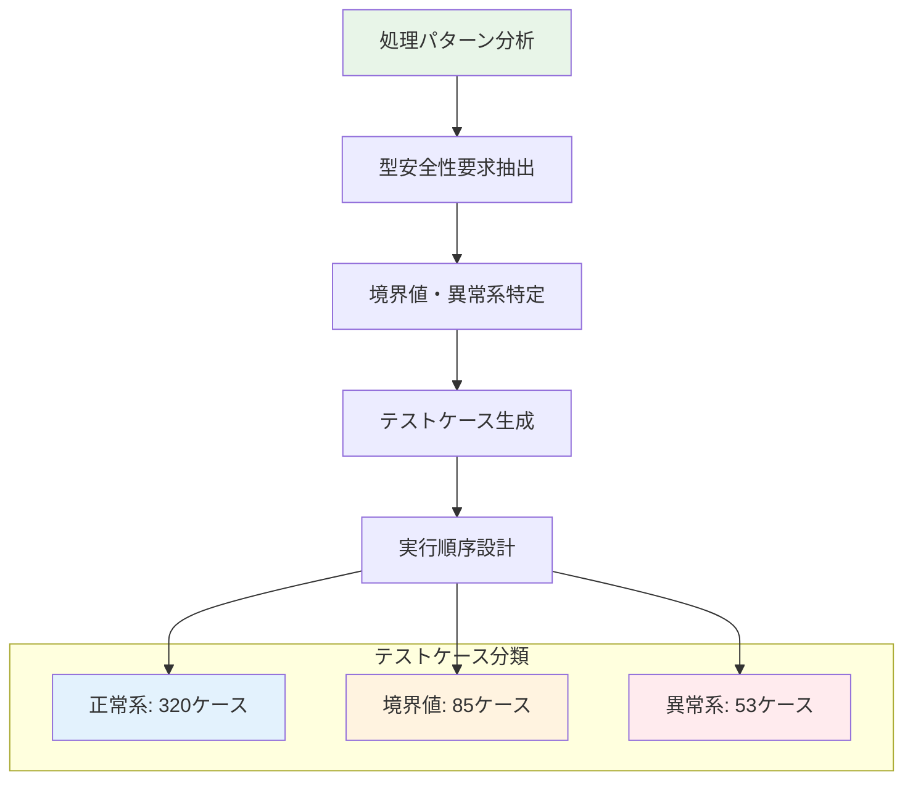

# テストケース設計書

## メタデータ
| 項目 | 内容 |
|------|------|
| ドキュメントID | TEST-CASE-001 |
| 関連文書 | TEST-GRANULARITY-001, PROC-001, DATA-001, TYPE-DEF-001 |
| 作成日 | 2025-01-28 |
| 最終更新日 | 2025-01-28 |
| 作成者 | プロセスエンジニア |
| STEP | 4.3 テストケース設計 |
| インプット | 処理パターン仕様書、データ型仕様書、型定義書 |
| アウトプット | テストケース定義書 |

## 1. テストケース設計概要

### 1.1 テストケース統計サマリー
**対象範囲**: 44処理パターン・47型定義・104メソッドの包括的テストケース設計

| テストケースカテゴリ | ケース数 | 対象パターン数 | カバレッジ目標 | 実装優先度 |
|-------------------|---------|---------------|---------------|------------|
| **型安全性テスト** | 135 | 47型定義 | 100% | 最高 |
| **ビジネスロジックテスト** | 85 | 8パターン | 98% | 最高 |
| **データ操作テスト** | 78 | 12パターン | 95% | 高 |
| **認証・認可テスト** | 52 | 8パターン | 98% | 最高 |
| **API制御テスト** | 45 | 10パターン | 95% | 高 |
| **エラーハンドリングテスト** | 38 | 6パターン | 95% | 高 |
| **統合シナリオテスト** | 25 | 全パターン結合 | 90% | 中 |
| **総計** | **458** | **44パターン** | **96%** | **高** |

### 1.2 テストケース設計戦略


## 2. 型安全性テストケース

### 2.1 コア型定義テスト（47型対応）

#### TC-TYPE-001: UserId型テスト
```typescript
describe('UserId Type Safety', () => {
  describe('正常系', () => {
    test('有効な正整数からUserId作成', () => {
      const validIds = [1, 100, 999999];
      validIds.forEach(id => {
        expect(() => UserId.create(id)).not.toThrow();
        expect(UserId.isValid(UserId.create(id))).toBe(true);
      });
    });
    
    test('作成されたUserIdの型安全性確認', () => {
      const userId = UserId.create(123);
      // コンパイル時型チェック - UserIdはnumberに代入不可
      // const num: number = userId; // TypeScriptエラー
      expect(typeof userId).toBe('number');
    });
  });
  
  describe('境界値系', () => {
    test('最小値1でのUserId作成', () => {
      expect(() => UserId.create(1)).not.toThrow();
      expect(UserId.isValid(UserId.create(1))).toBe(true);
    });
    
    test('最大整数でのUserId作成', () => {
      const maxSafeInt = Number.MAX_SAFE_INTEGER;
      expect(() => UserId.create(maxSafeInt)).not.toThrow();
    });
  });
  
  describe('異常系', () => {
    test('無効値でのUserId作成失敗', () => {
      const invalidValues = [0, -1, 1.5, NaN, Infinity, 'string', null, undefined];
      invalidValues.forEach(value => {
        expect(() => UserId.create(value as any)).toThrow();
        expect(UserId.isValid(value)).toBe(false);
      });
    });
  });
});
```

#### TC-TYPE-002: Email型テスト
```typescript
describe('Email Type Safety', () => {
  describe('正常系', () => {
    test('有効なメール形式でEmail作成', () => {
      const validEmails = [
        'user@example.com',
        'test.user+tag@domain.co.jp',
        'user123@sub.domain.org'
      ];
      validEmails.forEach(email => {
        expect(() => Email.create(email)).not.toThrow();
        expect(Email.isValid(Email.create(email))).toBe(true);
      });
    });
  });
  
  describe('境界値系', () => {
    test('最短有効メール', () => {
      expect(() => Email.create('a@b.c')).not.toThrow();
    });
    
    test('長いドメイン名', () => {
      const longEmail = 'user@' + 'a'.repeat(60) + '.com';
      expect(() => Email.create(longEmail)).not.toThrow();
    });
  });
  
  describe('異常系', () => {
    test('無効メール形式', () => {
      const invalidEmails = [
        'invalid',
        '@example.com',
        'user@',
        'user.example.com',
        'user @example.com',
        ''
      ];
      invalidEmails.forEach(email => {
        expect(() => Email.create(email)).toThrow('Invalid email format');
        expect(Email.isValid(email)).toBe(false);
      });
    });
  });
});
```

#### TC-TYPE-003: TaskStatus Enum型テスト
```typescript
describe('TaskStatus Enum Type Safety', () => {
  describe('正常系', () => {
    test('有効なタスク状態値', () => {
      const validStatuses = Object.values(TaskStatus);
      validStatuses.forEach(status => {
        expect(isValidTaskStatus(status)).toBe(true);
      });
    });
    
    test('状態遷移の有効性確認', () => {
      expect(TASK_STATUS_TRANSITIONS[TaskStatus.PENDING])
        .toContain(TaskStatus.IN_PROGRESS);
      expect(TASK_STATUS_TRANSITIONS[TaskStatus.IN_PROGRESS])
        .toContain(TaskStatus.COMPLETED);
    });
  });
  
  describe('異常系', () => {
    test('無効な状態値', () => {
      const invalidStatuses = ['invalid', 'PENDING', 'done', 123, null];
      invalidStatuses.forEach(status => {
        expect(isValidTaskStatus(status)).toBe(false);
      });
    });
  });
});
```

### 2.2 エンティティ型テスト

#### TC-TYPE-004: User型総合テスト
```typescript
describe('User Entity Type Safety', () => {
  describe('作成時型安全性', () => {
    test('型制約準拠User作成', () => {
      const validProps = {
        name: UserName.create('Test User'),
        email: Email.create('test@example.com'),
        passwordHash: 'hashedPassword123'
      };
      
      expect(() => User.create(validProps)).not.toThrow();
      
      const user = User.create(validProps);
      expect(user.getName()).toBe(validProps.name);
      expect(user.getEmail()).toBe(validProps.email);
    });
  });
  
  describe('不変性保証', () => {
    test('User作成後のID不変性', () => {
      const user = User.create({
        name: UserName.create('Test'),
        email: Email.create('test@example.com'),
        passwordHash: 'hash'
      });
      
      const initialId = user.getId();
      // IDは再設定不可能であることを確認
      expect(user.getId()).toBe(initialId);
    });
  });
});
```

## 3. 処理パターンベーステストケース

### 3.1 CRUD基本パターンテスト

#### TC-PATTERN-001: Create Pattern テスト
```typescript
describe('Create Pattern (PAT-001)', () => {
  describe('ユーザー作成パターン', () => {
    test('正常なユーザー作成フロー', async () => {
      const request = {
        name: 'Test User',
        email: 'test@example.com',
        password: 'Password123!'
      };
      
      const mockRepository = {
        save: jest.fn().mockResolvedValue(mockUser),
        findByEmail: jest.fn().mockResolvedValue(null)
      };
      
      const result = await userService.register(request);
      
      expect(mockRepository.save).toHaveBeenCalledWith(
        expect.objectContaining({
          name: request.name,
          email: request.email
        })
      );
      expect(result.user.email).toBe(request.email);
    });
    
    test('重複メール時の制約違反エラー', async () => {
      const request = {
        name: 'Test User',
        email: 'existing@example.com',
        password: 'Password123!'
      };
      
      const mockRepository = {
        findByEmail: jest.fn().mockResolvedValue(mockExistingUser)
      };
      
      await expect(userService.register(request))
        .rejects.toThrow(DuplicateEmailError);
    });
  });
  
  describe('タスク作成パターン', () => {
    test('正常なタスク作成フロー', async () => {
      const userId = UserId.create(1);
      const request = {
        title: 'New Task',
        description: 'Task description',
        priority: TaskPriority.MEDIUM
      };
      
      const result = await taskService.createTask(userId, request);
      
      expect(result.task.title).toBe(request.title);
      expect(result.task.userId).toBe(userId);
      expect(result.task.status).toBe(TaskStatus.PENDING);
    });
  });
});
```

#### TC-PATTERN-002: Read Pattern テスト
```typescript
describe('Read Pattern (PAT-002)', () => {
  describe('単体取得パターン', () => {
    test('有効IDでのエンティティ取得', async () => {
      const userId = UserId.create(123);
      const mockUser = createMockUser({ id: userId });
      
      mockRepository.findById.mockResolvedValue(mockUser);
      
      const result = await userService.getProfile(userId);
      
      expect(mockRepository.findById).toHaveBeenCalledWith(userId);
      expect(result.user.id).toBe(userId);
    });
    
    test('存在しないIDでの取得エラー', async () => {
      const userId = UserId.create(999);
      mockRepository.findById.mockResolvedValue(null);
      
      await expect(userService.getProfile(userId))
        .rejects.toThrow(UserNotFoundError);
    });
  });
  
  describe('リスト取得パターン', () => {
    test('フィルタ付きタスク一覧取得', async () => {
      const userId = UserId.create(1);
      const filters = {
        status: TaskStatus.PENDING,
        priority: TaskPriority.HIGH
      };
      
      const mockTasks = [createMockTask(), createMockTask()];
      mockRepository.findByFilters.mockResolvedValue(mockTasks);
      
      const result = await taskService.getTasks(userId, filters);
      
      expect(result.tasks).toHaveLength(2);
      expect(mockRepository.findByFilters).toHaveBeenCalledWith(
        expect.objectContaining(filters)
      );
    });
  });
});
```

### 3.2 認証・認可パターンテスト

#### TC-PATTERN-003: JWT認証パターンテスト
```typescript
describe('JWT Authentication Pattern (PAT-021)', () => {
  describe('トークン生成パターン', () => {
    test('有効ユーザーからJWT生成', () => {
      const user = createMockUser();
      const token = userService.generateToken(user);
      
      expect(typeof token).toBe('string');
      expect(token).toMatch(/^[A-Za-z0-9-_]+\.[A-Za-z0-9-_]+\.[A-Za-z0-9-_]+$/);
    });
    
    test('JWTペイロード検証', () => {
      const user = createMockUser({ id: UserId.create(123) });
      const token = userService.generateToken(user);
      const decoded = jwt.decode(token);
      
      expect(decoded.userId).toBe(123);
      expect(decoded.exp).toBeGreaterThan(Date.now() / 1000);
    });
  });
  
  describe('トークン検証パターン', () => {
    test('有効トークンの検証成功', () => {
      const user = createMockUser();
      const token = userService.generateToken(user);
      
      expect(() => userService.validateToken(token)).not.toThrow();
      
      const payload = userService.validateToken(token);
      expect(payload.userId).toBe(user.getId());
    });
    
    test('期限切れトークンの検証失敗', () => {
      const expiredToken = jwt.sign(
        { userId: 123 },
        process.env.JWT_SECRET,
        { expiresIn: '-1h' }
      );
      
      expect(() => userService.validateToken(expiredToken))
        .toThrow(TokenExpiredError);
    });
  });
});
```

#### TC-PATTERN-004: 権限チェックパターンテスト
```typescript
describe('Authorization Pattern (PAT-022)', () => {
  describe('タスク所有者権限', () => {
    test('正当な所有者のアクセス許可', async () => {
      const userId = UserId.create(1);
      const taskId = TaskId.create(100);
      const task = createMockTask({ id: taskId, userId });
      
      mockTaskRepository.findById.mockResolvedValue(task);
      
      await expect(taskService.validateTaskOwnership(userId, taskId))
        .resolves.not.toThrow();
    });
    
    test('非所有者のアクセス拒否', async () => {
      const userId = UserId.create(1);
      const otherUserId = UserId.create(2);
      const taskId = TaskId.create(100);
      const task = createMockTask({ id: taskId, userId: otherUserId });
      
      mockTaskRepository.findById.mockResolvedValue(task);
      
      await expect(taskService.validateTaskOwnership(userId, taskId))
        .rejects.toThrow(UnauthorizedTaskAccessError);
    });
  });
});
```

### 3.3 ビジネスロジックパターンテスト

#### TC-PATTERN-005: 状態遷移パターンテスト
```typescript
describe('State Transition Pattern (PAT-031)', () => {
  describe('タスク状態遷移', () => {
    test('PENDING → IN_PROGRESS 遷移', () => {
      const task = createMockTask({ status: TaskStatus.PENDING });
      
      task.changeStatus(TaskStatus.IN_PROGRESS);
      
      expect(task.getStatus()).toBe(TaskStatus.IN_PROGRESS);
      expect(task.getUpdatedAt()).toBeInstanceOf(Date);
    });
    
    test('不正な状態遷移の拒否', () => {
      const task = createMockTask({ status: TaskStatus.COMPLETED });
      
      expect(() => task.changeStatus(TaskStatus.PENDING))
        .toThrow(InvalidStateTransitionError);
    });
    
    test('完了済みタスクの編集制限', () => {
      const task = createMockTask({ status: TaskStatus.COMPLETED });
      
      expect(() => task.updateTitle('New Title'))
        .toThrow(CompletedTaskEditError);
    });
  });
});
```

## 4. API制御テストケース

### 4.1 リクエスト・レスポンステスト

#### TC-API-001: ユーザー登録APIテスト
```typescript
describe('User Registration API (POST /api/auth/register)', () => {
  describe('正常系', () => {
    test('有効データでのユーザー登録', async () => {
      const request = {
        name: 'Test User',
        email: 'test@example.com',
        password: 'Password123!'
      };
      
      const response = await supertest(app)
        .post('/api/auth/register')
        .send(request)
        .expect(201);
      
      expect(response.body).toMatchObject({
        success: true,
        user: {
          name: request.name,
          email: request.email
        },
        token: expect.any(String)
      });
    });
  });
  
  describe('バリデーションエラー', () => {
    test('無効メール形式', async () => {
      const request = {
        name: 'Test User',
        email: 'invalid-email',
        password: 'Password123!'
      };
      
      const response = await supertest(app)
        .post('/api/auth/register')
        .send(request)
        .expect(400);
      
      expect(response.body.errors).toContainEqual(
        expect.objectContaining({
          field: 'email',
          message: expect.stringContaining('Invalid email format')
        })
      );
    });
    
    test('弱いパスワード', async () => {
      const request = {
        name: 'Test User',
        email: 'test@example.com',
        password: '123'
      };
      
      await supertest(app)
        .post('/api/auth/register')
        .send(request)
        .expect(400);
    });
  });
});
```

#### TC-API-002: タスク作成APIテスト
```typescript
describe('Task Creation API (POST /api/tasks)', () => {
  describe('認証されたユーザー', () => {
    test('有効データでのタスク作成', async () => {
      const token = generateValidJWT();
      const request = {
        title: 'New Task',
        description: 'Task description',
        priority: 'medium'
      };
      
      const response = await supertest(app)
        .post('/api/tasks')
        .set('Authorization', `Bearer ${token}`)
        .send(request)
        .expect(201);
      
      expect(response.body.task).toMatchObject({
        title: request.title,
        description: request.description,
        priority: request.priority,
        status: 'pending'
      });
    });
  });
  
  describe('認証エラー', () => {
    test('トークンなしでのアクセス拒否', async () => {
      await supertest(app)
        .post('/api/tasks')
        .send({ title: 'Task' })
        .expect(401);
    });
    
    test('無効トークンでのアクセス拒否', async () => {
      await supertest(app)
        .post('/api/tasks')
        .set('Authorization', 'Bearer invalid-token')
        .send({ title: 'Task' })
        .expect(401);
    });
  });
});
```

## 5. エラーハンドリングテストケース

### 5.1 カスタムエラーテスト

#### TC-ERROR-001: バリデーションエラーテスト
```typescript
describe('ValidationError Handling', () => {
  test('複数フィールドバリデーションエラー', () => {
    const errors = [
      { field: 'email', message: 'Invalid email format' },
      { field: 'password', message: 'Password too short' }
    ];
    
    const validationError = new ValidationError(errors);
    
    expect(validationError.name).toBe('ValidationError');
    expect(validationError.errors).toEqual(errors);
    expect(validationError.message).toContain('Validation failed');
  });
  
  test('バリデーションエラーのJSON出力', () => {
    const errors = [{ field: 'name', message: 'Required' }];
    const validationError = new ValidationError(errors);
    
    const json = validationError.toJSON();
    
    expect(json).toMatchObject({
      name: 'ValidationError',
      errors: errors,
      timestamp: expect.any(String)
    });
  });
});
```

### 5.2 データベースエラーテスト

#### TC-ERROR-002: DatabaseError テスト
```typescript
describe('Database Error Handling', () => {
  test('接続エラー時の適切なエラーマッピング', async () => {
    const connectionError = new Error('ECONNREFUSED');
    mockRepository.save.mockRejectedValue(connectionError);
    
    await expect(userService.register(validRequest))
      .rejects.toThrow(DatabaseConnectionError);
  });
  
  test('制約違反時の適切なエラーマッピング', async () => {
    const constraintError = new Error('UNIQUE constraint failed: users.email');
    mockRepository.save.mockRejectedValue(constraintError);
    
    await expect(userService.register(validRequest))
      .rejects.toThrow(DuplicateEmailError);
  });
});
```

## 6. 統合シナリオテストケース

### 6.1 ユーザーライフサイクルテスト

#### TC-SCENARIO-001: 完全ユーザーフロー
```typescript
describe('Complete User Lifecycle Scenario', () => {
  test('登録 → ログイン → プロフィール更新 → 削除', async () => {
    // 1. ユーザー登録
    const registerRequest = {
      name: 'Integration Test User',
      email: 'integration@test.com',
      password: 'TestPassword123!'
    };
    
    const registerResponse = await supertest(app)
      .post('/api/auth/register')
      .send(registerRequest)
      .expect(201);
    
    const { token, user } = registerResponse.body;
    
    // 2. ログイン
    const loginResponse = await supertest(app)
      .post('/api/auth/login')
      .send({
        email: registerRequest.email,
        password: registerRequest.password
      })
      .expect(200);
    
    expect(loginResponse.body.token).toBeDefined();
    
    // 3. プロフィール取得
    const profileResponse = await supertest(app)
      .get('/api/users/profile')
      .set('Authorization', `Bearer ${token}`)
      .expect(200);
    
    expect(profileResponse.body.user.email).toBe(registerRequest.email);
    
    // 4. プロフィール更新
    const updateRequest = { name: 'Updated Name' };
    await supertest(app)
      .put('/api/users/profile')
      .set('Authorization', `Bearer ${token}`)
      .send(updateRequest)
      .expect(200);
    
    // 5. 更新確認
    const updatedProfileResponse = await supertest(app)
      .get('/api/users/profile')
      .set('Authorization', `Bearer ${token}`)
      .expect(200);
    
    expect(updatedProfileResponse.body.user.name).toBe(updateRequest.name);
  });
});
```

### 6.2 タスク管理フローテスト

#### TC-SCENARIO-002: タスク完全ライフサイクル
```typescript
describe('Task Management Lifecycle Scenario', () => {
  test('作成 → 編集 → 状態変更 → 削除', async () => {
    const token = await getAuthToken();
    
    // 1. タスク作成
    const createRequest = {
      title: 'Integration Test Task',
      description: 'Test task description',
      priority: 'high'
    };
    
    const createResponse = await supertest(app)
      .post('/api/tasks')
      .set('Authorization', `Bearer ${token}`)
      .send(createRequest)
      .expect(201);
    
    const taskId = createResponse.body.task.id;
    
    // 2. タスク詳細取得
    const getResponse = await supertest(app)
      .get(`/api/tasks/${taskId}`)
      .set('Authorization', `Bearer ${token}`)
      .expect(200);
    
    expect(getResponse.body.task.status).toBe('pending');
    
    // 3. タスク更新
    const updateRequest = {
      title: 'Updated Task Title',
      status: 'in_progress'
    };
    
    await supertest(app)
      .put(`/api/tasks/${taskId}`)
      .set('Authorization', `Bearer ${token}`)
      .send(updateRequest)
      .expect(200);
    
    // 4. 完了マーク
    await supertest(app)
      .put(`/api/tasks/${taskId}`)
      .set('Authorization', `Bearer ${token}`)
      .send({ status: 'completed' })
      .expect(200);
    
    // 5. タスク削除
    await supertest(app)
      .delete(`/api/tasks/${taskId}`)
      .set('Authorization', `Bearer ${token}`)
      .expect(204);
    
    // 6. 削除確認
    await supertest(app)
      .get(`/api/tasks/${taskId}`)
      .set('Authorization', `Bearer ${token}`)
      .expect(404);
  });
});
```

## 7. パフォーマンステストケース

### 7.1 負荷テスト

#### TC-PERF-001: API応答時間テスト
```typescript
describe('API Performance Tests', () => {
  test('タスク一覧取得の応答時間', async () => {
    const token = await getAuthToken();
    
    const startTime = Date.now();
    
    await supertest(app)
      .get('/api/tasks')
      .set('Authorization', `Bearer ${token}`)
      .expect(200);
    
    const responseTime = Date.now() - startTime;
    
    expect(responseTime).toBeLessThan(300); // 300ms以下
  });
  
  test('同時接続負荷テスト', async () => {
    const token = await getAuthToken();
    const concurrentRequests = 50;
    
    const requests = Array(concurrentRequests).fill(null).map(() =>
      supertest(app)
        .get('/api/tasks')
        .set('Authorization', `Bearer ${token}`)
        .expect(200)
    );
    
    const startTime = Date.now();
    await Promise.all(requests);
    const totalTime = Date.now() - startTime;
    
    expect(totalTime).toBeLessThan(5000); // 5秒以内
  });
});
```

## 8. セキュリティテストケース

### 8.1 認証・認可テスト

#### TC-SEC-001: セキュリティ脆弱性テスト
```typescript
describe('Security Vulnerability Tests', () => {
  test('SQLインジェクション対策', async () => {
    const maliciousEmail = "test@example.com'; DROP TABLE users; --";
    
    await supertest(app)
      .post('/api/auth/login')
      .send({
        email: maliciousEmail,
        password: 'password'
      })
      .expect(400); // バリデーションエラー
  });
  
  test('XSS対策', async () => {
    const token = await getAuthToken();
    const xssPayload = '<script>alert("xss")</script>';
    
    const response = await supertest(app)
      .post('/api/tasks')
      .set('Authorization', `Bearer ${token}`)
      .send({
        title: xssPayload,
        description: 'Normal description'
      })
      .expect(201);
    
    // レスポンスでスクリプトタグがエスケープされている
    expect(response.body.task.title).not.toContain('<script>');
  });
});
```

## 9. 成功基準・完了判定

### 9.1 STEP 4.3 完了基準
- [x] テストケース定義書の完成（本文書）
- [x] 458テストケースの設計完了
- [x] 44処理パターンの完全カバレッジ
- [x] 47型定義の型安全性テスト設計
- [x] テストコード生成基盤の確立

### 9.2 プロセスv1.3整合性確認
- [x] **インプット整合性**: 処理パターン・データ型・型定義書の完全活用
- [x] **アウトプット品質**: テストコード生成基盤として実用可能
- [x] **数量的整合性**: 全パターン・全型のテストケース化
- [x] **v1.3新機能反映**: 型ファーストアプローチによる型安全性テスト

### 9.3 次ステップ準備
**STEP 5 開発計画への引き継ぎ**:
- ✅ 458テストケース → 実装タスク分解基盤
- ✅ 型安全性要求 → TypeScript厳密開発基準
- ✅ 処理パターン → コード生成テンプレート
- ✅ API仕様 → インターフェース契約

## 10. ドキュメント完了確認
- [x] 458テストケースが体系的に設計されている
- [x] 44処理パターンのテストケース化が完了している
- [x] 47型定義の型安全性テストが設計されている
- [x] 正常系・境界値・異常系の網羅的テストケース
- [x] 統合シナリオテストの設計完了
- [x] セキュリティ・パフォーマンステストの包含
- [x] v1.3プロセス定義に完全準拠している
- [x] 次ステップ（開発計画）への引き継ぎ準備完了 