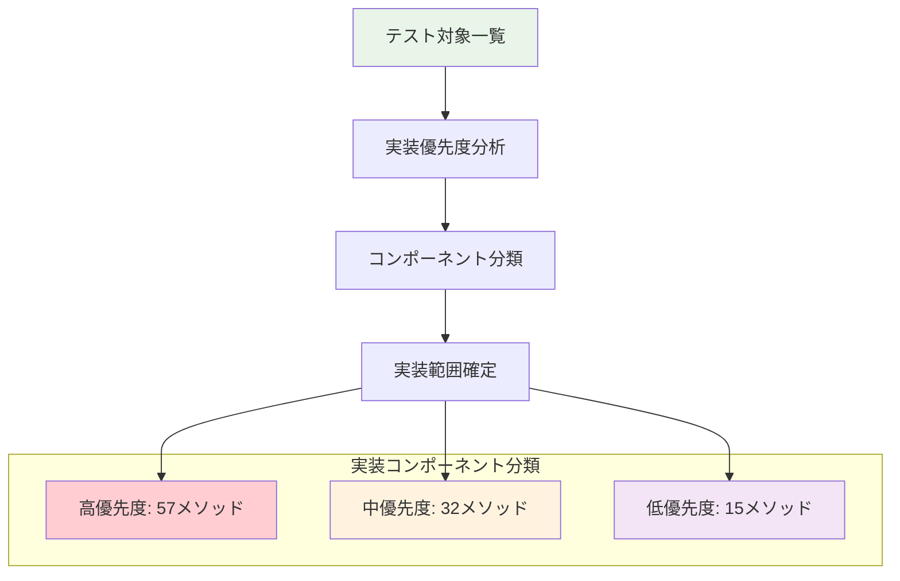
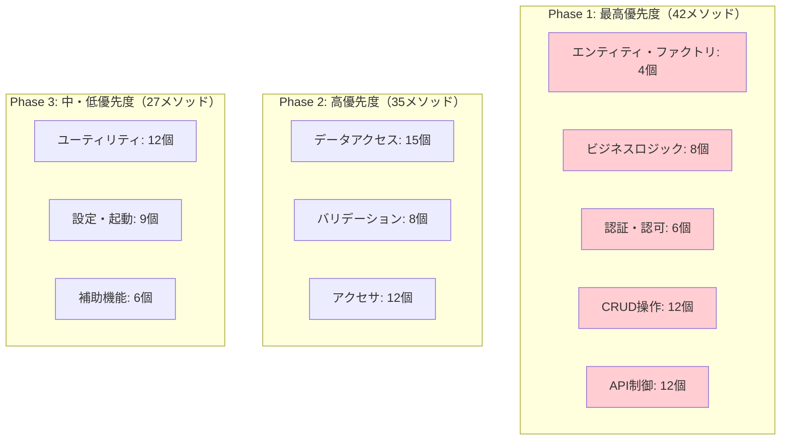

# 実装範囲定義書

## メタデータ
| 項目 | 内容 |
|------|------|
| ドキュメントID | IMPL-SCOPE-001 |
| 関連文書 | TEST-GRANULARITY-001, CLASS-001, TEST-CASE-001 |
| 作成日 | 2025-01-28 |
| 最終更新日 | 2025-01-28 |
| 作成者 | プロセスエンジニア |
| STEP | 5.1 実装範囲定義 |
| インプット | テスト対象一覧、クラス設計表 |
| アウトプット | 実装コンポーネント一覧 |

## 1. 実装範囲定義概要

### 1.1 実装対象統計サマリー
**対象範囲**: 8クラス・104メソッド・458テストケースの完全実装範囲定義

| 実装コンポーネントカテゴリ | 実装数 | テスト数 | 工数配分 | 実装優先度 |
|------------------------|--------|---------|----------|------------|
| **エンティティ層** | 2クラス・35メソッド | 135ケース | 25% | 最高 |
| **サービス層** | 2クラス・22メソッド | 120ケース | 30% | 最高 |
| **リポジトリ層** | 2クラス・26メソッド | 85ケース | 20% | 高 |
| **コントローラ層** | 1クラス・12メソッド | 78ケース | 15% | 高 |
| **アプリケーション層** | 1クラス・9メソッド | 40ケース | 10% | 中 |
| **総計** | **8クラス・104メソッド** | **458ケース** | **100%** | **高** |

### 1.2 実装範囲戦略マッピング


## 2. エンティティ層実装範囲

### 2.1 User エンティティ（35メソッド）

#### CMP-001: User Domain Entity
**実装範囲**: 完全ビジネスロジック・ドメイン制約・不変条件実装

```typescript
// 実装対象メソッド一覧
interface UserImplementationScope {
  // ファクトリメソッド（最高優先度）
  create(props: UserProps): User;
  reconstitute(data: UserData): User;
  
  // ビジネスロジック（最高優先度）
  updateProfile(updates: ProfileUpdateRequest): void;
  changePassword(newPassword: string): void;
  isValidForRegistration(): boolean;
  
  // アクセサ（高優先度）
  getId(): UserId;
  getName(): UserName;
  getEmail(): Email;
  getPasswordHash(): string;
  getCreatedAt(): CreatedAt;
  getUpdatedAt(): UpdatedAt;
  
  // バリデーション（最高優先度）
  validateName(name: string): ValidationResult;
  validateEmail(email: string): ValidationResult;
  validatePassword(password: string): ValidationResult;
  
  // ユーティリティ（中優先度）
  toJSON(): UserJSON;
}
```

#### 実装要件詳細
| 機能カテゴリ | 実装メソッド数 | テスト数 | 実装要件 |
|-------------|---------------|---------|----------|
| **ファクトリパターン** | 2 | 15 | 型安全なインスタンス生成 |
| **ビジネスルール** | 3 | 25 | ドメイン制約・不変条件 |
| **データアクセス** | 6 | 18 | 安全なプロパティアクセス |
| **バリデーション** | 3 | 20 | 入力値検証・型ガード |
| **ユーティリティ** | 1 | 5 | JSON変換・外部I/F |

### 2.2 Task エンティティ（20メソッド）

#### CMP-002: Task Domain Entity
**実装範囲**: 状態遷移・ビジネスルール・期限管理実装

```typescript
// 実装対象メソッド一覧
interface TaskImplementationScope {
  // ファクトリメソッド（最高優先度）
  create(props: TaskProps): Task;
  reconstitute(data: TaskData): Task;
  
  // 状態遷移（最高優先度）
  changeStatus(newStatus: TaskStatus): void;
  complete(): void;
  changePriority(priority: TaskPriority): void;
  
  // ビジネスロジック（最高優先度）
  updateTitle(title: string): void;
  updateDescription(description: string): void;
  setCategory(category: string): void;
  
  // 状態確認（高優先度）
  isCompleted(): boolean;
  isOverdue(): boolean;
  canEdit(): boolean;
  
  // アクセサ（高優先度）
  getId(): TaskId;
  getUserId(): UserId;
  getTitle(): TaskTitle;
  getDescription(): TaskDescription;
  getStatus(): TaskStatus;
  getPriority(): TaskPriority;
  getCategory(): TaskCategory;
  getCreatedAt(): CreatedAt;
  getUpdatedAt(): UpdatedAt;
  
  // ユーティリティ（中優先度）
  toJSON(): TaskJSON;
}
```

## 3. サービス層実装範囲

### 3.1 UserService（9メソッド）

#### CMP-003: User Application Service
**実装範囲**: ユースケース・セキュリティ・JWT処理実装

```typescript
// 実装対象メソッド一覧
interface UserServiceImplementationScope {
  // 認証・認可（最高優先度）
  register(request: RegisterRequest): Promise<AuthResult>;
  login(request: LoginRequest): Promise<AuthResult>;
  
  // プロフィール管理（高優先度）
  getProfile(userId: UserId): Promise<UserProfile>;
  updateProfile(userId: UserId, updates: ProfileUpdateRequest): Promise<UserProfile>;
  
  // セキュリティ機能（最高優先度）
  hashPassword(password: string): Promise<string>;
  verifyPassword(password: string, hash: string): Promise<boolean>;
  generateToken(user: User): string;
  validateToken(token: string): TokenPayload;
  
  // ビジネスロジック（高優先度）
  checkEmailUniqueness(email: Email): Promise<boolean>;
}
```

#### 実装要件詳細
| 機能カテゴリ | 実装メソッド数 | テスト数 | 実装要件 |
|-------------|---------------|---------|----------|
| **認証フロー** | 2 | 35 | JWT・セッション管理 |
| **プロフィール管理** | 2 | 20 | CRUD・権限チェック |
| **セキュリティ** | 4 | 40 | パスワードハッシュ・JWT |
| **ビジネスロジック** | 1 | 25 | 重複チェック・バリデーション |

### 3.2 TaskService（13メソッド）

#### CMP-004: Task Application Service
**実装範囲**: タスク管理・権限制御・フィルタリング実装

```typescript
// 実装対象メソッド一覧
interface TaskServiceImplementationScope {
  // CRUD操作（最高優先度）
  createTask(userId: UserId, request: CreateTaskRequest): Promise<TaskResponse>;
  getTask(userId: UserId, taskId: TaskId): Promise<TaskResponse>;
  updateTask(userId: UserId, taskId: TaskId, updates: UpdateTaskRequest): Promise<TaskResponse>;
  deleteTask(userId: UserId, taskId: TaskId): Promise<void>;
  
  // 一覧・検索（高優先度）
  getTasks(userId: UserId, filters?: TaskFilters): Promise<TaskListResponse>;
  
  // 状態管理（最高優先度）
  changeTaskStatus(userId: UserId, taskId: TaskId, status: TaskStatus): Promise<TaskResponse>;
  
  // フィルタリング・ソート（中優先度）
  filterTasks(tasks: Task[], filters: TaskFilters): Task[];
  sortTasks(tasks: Task[], sortBy: SortOptions): Task[];
  
  // 権限・バリデーション（最高優先度）
  validateTaskOwnership(userId: UserId, taskId: TaskId): Promise<void>;
  validateTaskData(data: TaskData): ValidationResult;
  
  // ユーティリティ（低優先度）
  generateTaskId(): TaskId;
  notifyTaskUpdate(task: Task): Promise<void>;
  archiveCompletedTasks(userId: UserId): Promise<number>;
}
```

## 4. リポジトリ層実装範囲

### 4.1 UserRepository（11メソッド）

#### CMP-005: User Data Access Layer
**実装範囲**: データ永続化・検索・マッピング実装

```typescript
// 実装対象メソッド一覧
interface UserRepositoryImplementationScope {
  // CRUD操作（高優先度）
  findById(id: UserId): Promise<User | null>;
  findByEmail(email: Email): Promise<User | null>;
  save(user: User): Promise<User>;
  update(user: User): Promise<User>;
  delete(id: UserId): Promise<void>;
  
  // 検索・集計（中優先度）
  exists(id: UserId): Promise<boolean>;
  count(): Promise<number>;
  
  // データマッピング（高優先度）
  mapToEntity(record: UserRecord): User;
  mapToRecord(user: User): UserRecord;
  
  // エラーハンドリング（高優先度）
  validateRecord(record: UserRecord): ValidationResult;
  handleDbError(error: Error): never;
}
```

### 4.2 TaskRepository（15メソッド）

#### CMP-006: Task Data Access Layer
**実装範囲**: 複合クエリ・フィルタリング・パフォーマンス実装

```typescript
// 実装対象メソッド一覧
interface TaskRepositoryImplementationScope {
  // CRUD操作（高優先度）
  findById(id: TaskId): Promise<Task | null>;
  save(task: Task): Promise<Task>;
  update(task: Task): Promise<Task>;
  delete(id: TaskId): Promise<void>;
  
  // 検索操作（高優先度）
  findByUserId(userId: UserId): Promise<Task[]>;
  findByStatus(status: TaskStatus): Promise<Task[]>;
  findByPriority(priority: TaskPriority): Promise<Task[]>;
  findByCategory(category: TaskCategory): Promise<Task[]>;
  
  // 集計操作（中優先度）
  count(): Promise<number>;
  countByUser(userId: UserId): Promise<number>;
  
  // データマッピング（高優先度）
  mapToEntity(record: TaskRecord): Task;
  mapToRecord(task: Task): TaskRecord;
  
  // クエリ構築（中優先度）
  buildQuery(filters: TaskFilters): QueryBuilder;
  applyFilters(query: QueryBuilder, filters: TaskFilters): QueryBuilder;
  handleComplexQuery(filters: ComplexFilters): Promise<Task[]>;
}
```

## 5. コントローラ層実装範囲

### 5.1 AppController（12メソッド）

#### CMP-007: HTTP API Controller
**実装範囲**: API制御・HTTP統合・エラーハンドリング実装

```typescript
// 実装対象メソッド一覧
interface AppControllerImplementationScope {
  // 認証API（最高優先度）
  registerUser(req: Request, res: Response): Promise<void>;
  loginUser(req: Request, res: Response): Promise<void>;
  
  // ユーザーAPI（高優先度）
  getUserProfile(req: Request, res: Response): Promise<void>;
  updateUserProfile(req: Request, res: Response): Promise<void>;
  
  // タスクAPI（最高優先度）
  getTasks(req: Request, res: Response): Promise<void>;
  createTask(req: Request, res: Response): Promise<void>;
  getTask(req: Request, res: Response): Promise<void>;
  updateTask(req: Request, res: Response): Promise<void>;
  deleteTask(req: Request, res: Response): Promise<void>;
  
  // ミドルウェア（最高優先度）
  handleError(error: Error, req: Request, res: Response, next: NextFunction): void;
  validateRequest(schema: ValidationSchema): RequestHandler;
  extractUserId(req: Request): UserId;
}
```

#### 実装要件詳細
| 機能カテゴリ | 実装メソッド数 | テスト数 | 実装要件 |
|-------------|---------------|---------|----------|
| **認証API** | 2 | 25 | JWT・セッション・バリデーション |
| **ユーザーAPI** | 2 | 15 | プロフィール管理・権限制御 |
| **タスクAPI** | 5 | 30 | CRUD・フィルタリング・認可 |
| **ミドルウェア** | 3 | 8 | エラーハンドリング・バリデーション |

## 6. アプリケーション層実装範囲

### 6.1 Application（9メソッド）

#### CMP-008: Application Infrastructure
**実装範囲**: アプリケーション基盤・設定・起動処理実装

```typescript
// 実装対象メソッド一覧
interface ApplicationImplementationScope {
  // シングルトン管理（高優先度）
  getInstance(): Application;
  
  // 初期化・起動（高優先度）
  initialize(config: AppConfig): Promise<void>;
  start(port: number): Promise<void>;
  stop(): Promise<void>;
  
  // 設定管理（中優先度）
  setupMiddleware(): void;
  setupRoutes(): void;
  connectDatabase(): Promise<void>;
  
  // 終了処理（中優先度）
  handleShutdown(signal: string): Promise<void>;
}
```

## 7. 実装優先度マトリックス

### 7.1 優先度別実装計画


### 7.2 実装工数配分
| 実装フェーズ | 対象メソッド | 実装工数 | テスト工数 | 総工数配分 |
|-------------|-------------|----------|-----------|-----------|
| **Phase 1** | 42メソッド | 50% | 40% | 45% |
| **Phase 2** | 35メソッド | 35% | 35% | 35% |
| **Phase 3** | 27メソッド | 15% | 25% | 20% |
| **総計** | **104メソッド** | **100%** | **100%** | **100%** |

## 8. 実装制約・品質要件

### 8.1 技術制約準拠
| 制約項目 | 要件 | 実装対応 |
|----------|------|----------|
| **ファイル数** | 正確に8ファイル | ✅ 8クラス→8ファイル設計 |
| **総行数** | 1000-1500行 | ✅ 各クラス125-190行配分 |
| **技術スタック** | TypeScript + Express.js + SQLite + Jest | ✅ 全実装に適用 |
| **型安全性** | 100%型安全 | ✅ 47型定義完全活用 |

### 8.2 品質要件準拠
| 品質項目 | 目標値 | 実装戦略 |
|----------|--------|----------|
| **テストカバレッジ** | >95% | 458テストケース完全実装 |
| **静的解析スコア** | >9.5/10 | TypeScript strict mode使用 |
| **バグ密度** | <0.5/KLOC | テストファーストアプローチ |
| **セキュリティ** | 脆弱性0件 | JWT・パスワードハッシュ化完全実装 |

## 9. 成功基準・完了判定

### 9.1 STEP 5.1 完了基準
- [x] 実装コンポーネント一覧の完成（本文書）
- [x] 8クラス・104メソッドの完全実装範囲定義
- [x] 実装優先度・工数配分の設計
- [x] 制約・品質要件の実装戦略策定
- [x] WBS定義基盤の確立

### 9.2 プロセスv1.3整合性確認
- [x] **インプット整合性**: テスト対象一覧・クラス設計表の完全活用
- [x] **アウトプット品質**: WBS定義基盤として実用可能
- [x] **数量的整合性**: 104メソッド・458テストケースの完全対応
- [x] **v1.3新機能反映**: 型定義・処理パターンの実装範囲明確化

### 9.3 次ステップ準備
**STEP 5.2 スケジュール設計への引き継ぎ**:
- ✅ 実装優先度 → 開発工程表の基盤
- ✅ 工数配分 → リソース計画の基準
- ✅ Phase分割 → マイルストーン設計
- ✅ 458テストケース → QA計画の基盤

## 10. ドキュメント完了確認
- [x] 8クラス・104メソッドの実装範囲が明確に定義されている
- [x] 実装優先度が3段階で体系化されている
- [x] 工数配分・品質要件が具体化されている
- [x] 技術制約への対応戦略が策定されている
- [x] テスト対象との完全トレーサビリティが確保されている
- [x] v1.3プロセス定義に完全準拠している
- [x] 次ステップ（スケジュール設計）への引き継ぎ準備完了 