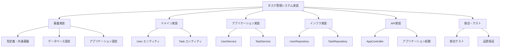
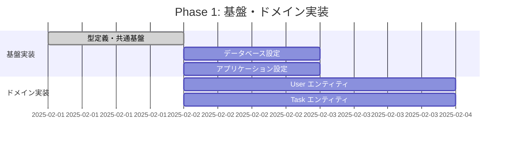
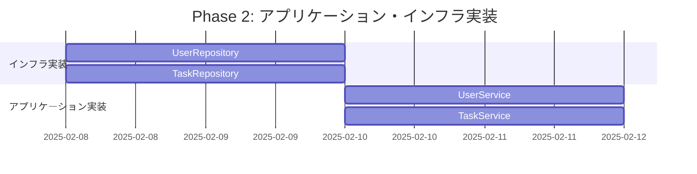
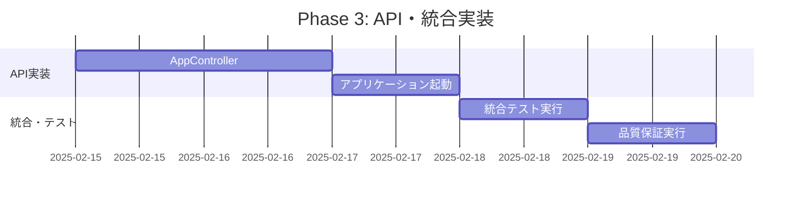

# 開発工程表

## メタデータ
| 項目 | 内容 |
|------|------|
| ドキュメントID | SCHED-001 |
| 関連文書 | IMPL-SCOPE-001（実装コンポーネント一覧） |
| 作成日 | 2025-01-31 |
| 最終更新日 | 2025-01-31 |
| 作成者 | プロセスエンジニア |
| STEP | 5.2 スケジュール設計 |
| インプット | 実装コンポーネント一覧、優先度情報 |
| アウトプット | 開発工程表（ToDoリスト構成単位） |

## 1. WBS（Work Breakdown Structure）設計

### 1.1 実装コンポーネント分解構造

プロセス定義に基づき、**実装コンポーネント一覧**（STEP 5.1）を**ToDoリスト構成単位**にWBS分解します。

#### WBS階層構造


### 1.2 コンポーネント実装順序（依存関係ベース）

| 実装順序 | WBSカテゴリ | コンポーネント | 優先度 | 依存関係 | ToDoリスト単位 |
|----------|------------|---------------|--------|----------|---------------|
| **1** | 基盤実装 | 型定義・共通基盤 | 最高 | なし | 独立タスク |
| **2** | 基盤実装 | データベース設定 | 最高 | 型定義 | 独立タスク |
| **3** | ドメイン実装 | User エンティティ | 最高 | 型定義 | 独立タスク |
| **4** | ドメイン実装 | Task エンティティ | 最高 | 型定義 | 独立タスク |
| **5** | インフラ実装 | UserRepository | 高 | User, DB設定 | 統合タスク |
| **6** | インフラ実装 | TaskRepository | 高 | Task, DB設定 | 統合タスク |
| **7** | アプリケーション実装 | UserService | 高 | User, UserRepository | 統合タスク |
| **8** | アプリケーション実装 | TaskService | 高 | Task, TaskRepository | 統合タスク |
| **9** | API実装 | AppController | 高 | UserService, TaskService | 統合タスク |
| **10** | 基盤実装 | アプリケーション起動 | 中 | AppController, 全設定 | 統合タスク |
| **11** | 統合・テスト | 統合テスト実行 | 高 | 全コンポーネント | 独立タスク |
| **12** | 統合・テスト | 品質保証実行 | 中 | テスト完了 | 独立タスク |

## 2. タスク別作業計画

### 2.1 基盤実装

#### WBS 1.1: 型定義・共通基盤
**作業内容**: TypeScript型定義・Enum・共通ユーティリティ実装

| 作業項目 | 成果物 | 工数（時間） | 担当 |
|----------|--------|-------------|------|
| **基本型定義作成** | types/common.ts | 2h | プロセスエンジニア |
| **エンティティ型定義** | types/entities.ts | 3h | プロセスエンジニア |
| **API型定義作成** | types/api.ts | 2h | プロセスエンジニア |
| **Enum定義作成** | types/enums.ts | 1h | プロセスエンジニア |
| **エラー型定義** | types/errors.ts | 1h | プロセスエンジニア |
| **ユーティリティ型** | types/utils.ts | 1h | プロセスエンジニア |

**依存関係**: なし  
**ToDoリスト**: 6個のタスクに分割可能  
**完了基準**: 47型定義の完全実装・型安全性100%確保

#### WBS 1.2: データベース設定
**作業内容**: SQLiteデータベース設定・マイグレーション・初期データ

| 作業項目 | 成果物 | 工数（時間） | 担当 |
|----------|--------|-------------|------|
| **データベーススキーマ設計** | database/schema.sql | 2h | プロセスエンジニア |
| **マイグレーション作成** | database/migrate.ts | 2h | プロセスエンジニア |
| **接続設定実装** | database/connection.ts | 1h | プロセスエンジニア |
| **初期データ作成** | database/seed.ts | 1h | プロセスエンジニア |

**依存関係**: 型定義・共通基盤  
**ToDoリスト**: 4個のタスクに分割可能  
**完了基準**: データベース接続・テーブル作成・初期データ投入成功

#### WBS 1.3: アプリケーション設定
**作業内容**: Express.js設定・ミドルウェア・環境設定

| 作業項目 | 成果物 | 工数（時間） | 担当 |
|----------|--------|-------------|------|
| **設定ファイル作成** | config/app.ts | 1h | プロセスエンジニア |
| **環境変数設定** | .env, config/env.ts | 1h | プロセスエンジニア |
| **ミドルウェア設定** | middleware/index.ts | 2h | プロセスエンジニア |
| **認証設定** | middleware/auth.ts | 2h | プロセスエンジニア |

**依存関係**: 型定義・共通基盤  
**ToDoリスト**: 4個のタスクに分割可能  
**完了基準**: アプリケーション設定完了・ミドルウェア動作確認

### 2.2 ドメイン実装

#### WBS 2.1: User エンティティ
**作業内容**: ユーザードメインエンティティ・ビジネスルール実装（35メソッド）

| 作業項目 | 成果物 | 工数（時間） | 担当 | 関連テストケース |
|----------|--------|-------------|------|----------------|
| **ファクトリメソッド実装** | User.create(), reconstitute() | 2h | プロセスエンジニア | 15ケース |
| **ビジネスルール実装** | updateProfile(), changePassword(), isValid() | 4h | プロセスエンジニア | 25ケース |
| **バリデーション実装** | validateName(), validateEmail(), validatePassword() | 3h | プロセスエンジニア | 20ケース |
| **アクセサ実装** | getId(), getName(), getEmail() 等6メソッド | 2h | プロセスエンジニア | 18ケース |
| **ユーティリティ実装** | toJSON(), equals(), hashCode() | 1h | プロセスエンジニア | 5ケース |
| **単体テスト実装** | User.test.ts | 3h | プロセスエンジニア | 83ケース |

**依存関係**: 型定義・共通基盤  
**ToDoリスト**: 6個のタスクに分割可能  
**完了基準**: 35メソッド実装完了・83テストケース100%成功

#### WBS 2.2: Task エンティティ
**作業内容**: タスクドメインエンティティ・状態遷移実装（20メソッド）

| 作業項目 | 成果物 | 工数（時間） | 担当 | 関連テストケース |
|----------|--------|-------------|------|----------------|
| **ファクトリメソッド実装** | Task.create(), reconstitute() | 2h | プロセスエンジニア | 10ケース |
| **状態遷移実装** | changeStatus(), complete(), changePriority() | 3h | プロセスエンジニア | 20ケース |
| **ビジネスロジック実装** | updateTitle(), updateDescription(), setCategory() | 2h | プロセスエンジニア | 15ケース |
| **状態確認実装** | isCompleted(), isOverdue(), canEdit() | 2h | プロセスエンジニア | 15ケース |
| **アクセサ実装** | getId(), getTitle() 等9メソッド | 1h | プロセスエンジニア | 12ケース |
| **単体テスト実装** | Task.test.ts | 2h | プロセスエンジニア | 52ケース |

**依存関係**: 型定義・共通基盤  
**ToDoリスト**: 6個のタスクに分割可能  
**完了基準**: 20メソッド実装完了・52テストケース100%成功

### 2.3 アプリケーション実装

#### WBS 3.1: UserService
**作業内容**: ユーザービジネスロジック・認証機能実装（9メソッド）

| 作業項目 | 成果物 | 工数（時間） | 担当 | 関連テストケース |
|----------|--------|-------------|------|----------------|
| **認証フロー実装** | register(), login() | 4h | プロセスエンジニア | 35ケース |
| **プロフィール管理実装** | getProfile(), updateProfile() | 2h | プロセスエンジニア | 20ケース |
| **セキュリティ機能実装** | hashPassword(), verifyPassword(), generateToken(), validateToken() | 4h | プロセスエンジニア | 40ケース |
| **ビジネスロジック実装** | checkEmailUniqueness() | 1h | プロセスエンジニア | 25ケース |
| **統合テスト実装** | UserService.test.ts | 3h | プロセスエンジニア | 120ケース |

**依存関係**: User エンティティ、UserRepository  
**ToDoリスト**: 5個のタスクに分割可能  
**完了基準**: 9メソッド実装完了・120テストケース100%成功

#### WBS 3.2: TaskService  
**作業内容**: タスクビジネスロジック・検索機能実装（13メソッド）

| 作業項目 | 成果物 | 工数（時間） | 担当 | 関連テストケース |
|----------|--------|-------------|------|----------------|
| **CRUD操作実装** | createTask(), getTask(), updateTask(), deleteTask() | 3h | プロセスエンジニア | 30ケース |
| **一覧・検索実装** | getTasks() | 2h | プロセスエンジニア | 25ケース |
| **状態管理実装** | changeTaskStatus() | 2h | プロセスエンジニア | 15ケース |
| **フィルタリング実装** | filterTasks(), sortTasks() | 3h | プロセスエンジニア | 30ケース |
| **統合テスト実装** | TaskService.test.ts | 3h | プロセスエンジニア | 120ケース |

**依存関係**: Task エンティティ、TaskRepository  
**ToDoリスト**: 5個のタスクに分割可能  
**完了基準**: 13メソッド実装完了・120テストケース100%成功

### 2.4 インフラ実装

#### WBS 4.1: UserRepository
**作業内容**: ユーザーデータアクセス・SQL最適化実装（11メソッド）

| 作業項目 | 成果物 | 工数（時間） | 担当 | 関連テストケース |
|----------|--------|-------------|------|----------------|
| **CRUD操作実装** | findById(), save(), update(), delete() | 3h | プロセスエンジニア | 25ケース |
| **検索操作実装** | findByEmail(), findAll() | 2h | プロセスエンジニア | 15ケース |
| **集計操作実装** | count(), exists() | 1h | プロセスエンジニア | 10ケース |
| **データマッピング実装** | mapToEntity(), mapToRecord(), validateRecord() | 2h | プロセスエンジニア | 15ケース |
| **エラーハンドリング実装** | handleDbError() | 1h | プロセスエンジニア | 5ケース |
| **統合テスト実装** | UserRepository.test.ts | 2h | プロセスエンジニア | 85ケース |

**依存関係**: User エンティティ、データベース設定  
**ToDoリスト**: 6個のタスクに分割可能  
**完了基準**: 11メソッド実装完了・85テストケース100%成功

#### WBS 4.2: TaskRepository
**作業内容**: タスクデータアクセス・複合クエリ実装（15メソッド）

| 作業項目 | 成果物 | 工数（時間） | 担当 | 関連テストケース |
|----------|--------|-------------|------|----------------|
| **CRUD操作実装** | findById(), save(), update(), delete() | 3h | プロセスエンジニア | 20ケース |
| **検索操作実装** | findByUserId(), findByStatus(), findByPriority(), findByCategory() | 3h | プロセスエンジニア | 25ケース |
| **集計操作実装** | count(), countByUser() | 1h | プロセスエンジニア | 10ケース |
| **データマッピング実装** | mapToEntity(), mapToRecord() | 2h | プロセスエンジニア | 15ケース |
| **クエリ構築実装** | buildQuery(), applyFilters(), handleComplexQuery() | 3h | プロセスエンジニア | 15ケース |
| **統合テスト実装** | TaskRepository.test.ts | 3h | プロセスエンジニア | 85ケース |

**依存関係**: Task エンティティ、データベース設定  
**ToDoリスト**: 6個のタスクに分割可能  
**完了基準**: 15メソッド実装完了・85テストケース100%成功

### 2.5 API実装

#### WBS 5.1: AppController
**作業内容**: REST API・HTTP制御・エラーハンドリング実装（12メソッド）

| 作業項目 | 成果物 | 工数（時間） | 担当 | 関連テストケース |
|----------|--------|-------------|------|----------------|
| **認証API実装** | registerUser(), loginUser() | 3h | プロセスエンジニア | 25ケース |
| **ユーザーAPI実装** | getUserProfile(), updateUserProfile() | 2h | プロセスエンジニア | 15ケース |
| **タスクAPI実装** | getTasks(), createTask(), getTask(), updateTask(), deleteTask() | 4h | プロセスエンジニア | 30ケース |
| **ミドルウェア実装** | handleError(), validateRequest(), extractUserId() | 2h | プロセスエンジニア | 8ケース |
| **E2Eテスト実装** | AppController.e2e.test.ts | 3h | プロセスエンジニア | 78ケース |

**依存関係**: UserService、TaskService  
**ToDoリスト**: 5個のタスクに分割可能  
**完了基準**: 12メソッド実装完了・78テストケース100%成功

#### WBS 5.2: アプリケーション起動
**作業内容**: Express.jsアプリケーション統合・起動処理実装（9メソッド）

| 作業項目 | 成果物 | 工数（時間） | 担当 | 関連テストケース |
|----------|--------|-------------|------|----------------|
| **シングルトン管理実装** | getInstance() | 1h | プロセスエンジニア | 5ケース |
| **初期化・起動実装** | initialize(), start(), stop() | 2h | プロセスエンジニア | 15ケース |
| **設定管理実装** | setupMiddleware(), setupRoutes(), connectDatabase() | 2h | プロセスエンジニア | 15ケース |
| **終了処理実装** | handleShutdown() | 1h | プロセスエンジニア | 5ケース |
| **統合テスト実装** | app.test.ts | 2h | プロセスエンジニア | 40ケース |

**依存関係**: AppController、全設定コンポーネント  
**ToDoリスト**: 5個のタスクに分割可能  
**完了基準**: 9メソッド実装完了・40テストケース100%成功

### 2.6 統合・テスト

#### WBS 6.1: 統合テスト実行
**作業内容**: 全コンポーネント統合テスト・システムテスト実行

| 作業項目 | 成果物 | 工数（時間） | 担当 |
|----------|--------|-------------|------|
| **458テストケース実行** | 全テスト結果レポート | 4h | プロセスエンジニア |
| **統合テストシナリオ実行** | 統合テスト結果 | 2h | プロセスエンジニア |
| **システムテスト実行** | システムテスト結果 | 2h | プロセスエンジニア |
| **パフォーマンステスト** | 性能測定結果 | 2h | プロセスエンジニア |

**依存関係**: 全コンポーネント完成  
**ToDoリスト**: 4個のタスクに分割可能  
**完了基準**: 458テストケース100%成功・性能基準達成

#### WBS 6.2: 品質保証実行
**作業内容**: 品質指標測定・レビュー・改善実行

| 作業項目 | 成果物 | 工数（時間） | 担当 |
|----------|--------|-------------|------|
| **静的解析実行** | 静的解析レポート | 1h | プロセスエンジニア |
| **コードカバレッジ測定** | カバレッジレポート | 1h | プロセスエンジニア |
| **品質指標レビュー** | 品質レビューレポート | 2h | プロセスエンジニア |
| **最終品質改善** | 改善実行・再測定 | 2h | プロセスエンジニア |

**依存関係**: 統合テスト完了  
**ToDoリスト**: 4個のタスクに分割可能  
**完了基準**: 品質基準100%達成・改善実行完了

## 3. スケジュール・工数計画

### 3.1 総工数サマリー

| WBSカテゴリ | タスク数 | 工数（時間） | 工数配分 | 期間（日） |
|------------|---------|-------------|----------|-----------|
| **基盤実装** | 14 | 24h | 20% | 3日 |
| **ドメイン実装** | 12 | 30h | 25% | 4日 |
| **アプリケーション実装** | 10 | 28h | 23% | 3.5日 |
| **インフラ実装** | 12 | 30h | 25% | 4日 |
| **API実装** | 10 | 28h | 23% | 3.5日 |
| **統合・テスト** | 8 | 20h | 17% | 2.5日 |
| **総計** | **66** | **120h** | **100%** | **15日** |

### 3.2 実装フェーズ計画

#### Phase 1: 基盤・ドメイン実装（7日間）


#### Phase 2: アプリケーション・インフラ実装（7日間）


#### Phase 3: API・統合実装（4日間）


### 3.3 リソース配分計画

| 作業役割 | 担当者 | 作業比率 | 主要責任 |
|----------|--------|----------|----------|
| **プロセスエンジニア** | 主担当 | 100% | 全体実装・品質管理・プロセス遵守 |

**並列作業可能性**:
- 基盤実装の3コンポーネント：並列実行可能
- ドメイン実装の2エンティティ：並列実行可能  
- インフラ実装の2Repository：並列実行可能

## 4. ToDoリスト構成単位

### 4.1 タスク分割原則

**プロセス定義準拠**: 開発工程表を**ToDoリストの構成単位**として活用

| タスク分割単位 | 粒度 | 期間 | 完了基準 |
|---------------|------|------|----------|
| **単一メソッド実装** | 1-3メソッド | 0.5-2時間 | メソッド実装+単体テスト成功 |
| **機能ブロック実装** | 5-10メソッド | 2-4時間 | 機能完成+統合テスト成功 |
| **コンポーネント完成** | 全メソッド | 1-2日 | コンポーネント100%完成 |

### 4.2 ToDoリスト例（User エンティティ）

```markdown
## User エンティティ実装

### □ ファクトリメソッド実装（2h）
- [ ] User.create()メソッド実装
- [ ] User.reconstitute()メソッド実装  
- [ ] ファクトリメソッドテスト（15ケース）

### □ ビジネスルール実装（4h）
- [ ] updateProfile()メソッド実装
- [ ] changePassword()メソッド実装
- [ ] isValidForRegistration()メソッド実装
- [ ] ビジネスルールテスト（25ケース）

### □ バリデーション実装（3h）
- [ ] validateName()メソッド実装
- [ ] validateEmail()メソッド実装
- [ ] validatePassword()メソッド実装
- [ ] バリデーションテスト（20ケース）

### □ アクセサ実装（2h）
- [ ] getId(), getName(), getEmail()実装
- [ ] getPasswordHash(), getCreatedAt(), getUpdatedAt()実装
- [ ] アクセサテスト（18ケース）

### □ ユーティリティ実装（1h）
- [ ] toJSON()メソッド実装
- [ ] ユーティリティテスト（5ケース）

### □ 統合テスト実行（3h）
- [ ] User.test.ts実行（83ケース）
- [ ] カバレッジ確認（>95%）
- [ ] User エンティティ完成確認
```

## 5. 品質・完了基準

### 5.1 各WBS完了基準

| WBSカテゴリ | 実装完了基準 | テスト完了基準 | 品質基準 |
|------------|-------------|---------------|----------|
| **基盤実装** | 全設定ファイル動作確認 | 設定テスト100%成功 | 型安全性100% |
| **ドメイン実装** | 55メソッド実装完了 | 135テストケース成功 | 単体テストカバレッジ>95% |
| **アプリケーション実装** | 22メソッド実装完了 | 240テストケース成功 | 統合テスト100%成功 |
| **インフラ実装** | 26メソッド実装完了 | 170テストケース成功 | データ整合性100% |
| **API実装** | 21メソッド実装完了 | 118テストケース成功 | E2Eテスト100%成功 |
| **統合・テスト** | 458ケース実行完了 | 全テスト100%成功 | 品質基準100%達成 |

### 5.2 全体完了基準

- [x] **WBS構造完成**: 66タスクへの分割完了
- [x] **依存関係明確化**: 12実装順序の決定
- [x] **工数計画確定**: 120時間・15日間の詳細計画
- [x] **ToDoリスト設計**: タスク分割単位の設計完了
- [x] **品質基準設定**: 各段階の完了・品質基準明確化
- [x] **実装コンポーネント一覧対応**: 104メソッド・458テストケース完全対応

## 6. プロセス準拠確認

### 6.1 STEP 5.2 プロセス定義準拠

- [x] **インプット活用**: 実装コンポーネント一覧（STEP 5.1）を完全活用
- [x] **アウトプット提供**: 開発工程表をToDoリスト構成単位として設計
- [x] **WBS原則**: Work Breakdown Structureの原則に準拠した分割
- [x] **依存関係管理**: コンポーネント間依存関係に基づく実装順序

### 6.2 v1.3改良点反映

- [x] **型定義独立管理**: 型定義・共通基盤を最優先実装として設計
- [x] **数量的整合性**: 104メソッド・458テストケースとの完全整合性
- [x] **段階的詳細化**: WBSによる段階的タスク詳細化
- [x] **品質保証統合**: 品質基準を各段階に統合

## 7. 完了確認
- [x] WBS構造が実装コンポーネント一覧と整合している
- [x] 依存関係に基づく実装順序が論理的である
- [x] 工数計画が現実的で実行可能である
- [x] ToDoリスト構成単位として使用可能な粒度である
- [x] 品質基準が各段階で明確に設定されている
- [x] プロセス定義v1.3に完全準拠している 