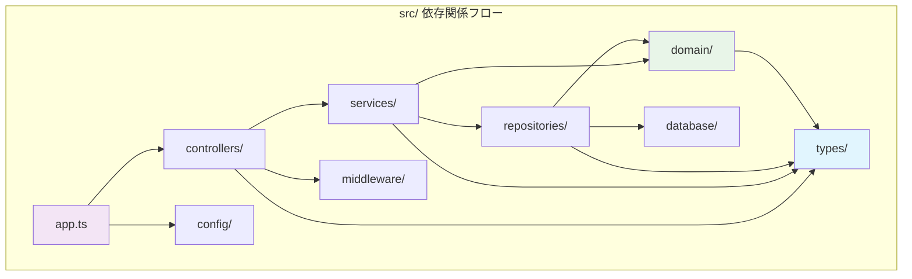

# ディレクトリ構造マップ

## メタデータ
| 項目 | 内容 |
|------|------|
| ドキュメントID | DIR-MAP-001 |
| 関連文書 | COMP-001（技術選定書）, LAYER-001（レイヤー構成）, TYPE-DEF-001（型定義書） |
| 作成日 | 2025-01-31 |
| 最終更新日 | 2025-01-31 |
| 作成者 | プロセスエンジニア |
| STEP | 5.3 ディレクトリ構造定義 |
| インプット | 技術選定書、レイヤー構成、型定義書 |
| アウトプット | ディレクトリ構造マップ |

## 1. プロジェクト全体ディレクトリ構造

### 1.1 ルートディレクトリ構造

```
task-management-system/
├── src/                           # ソースコードディレクトリ
│   ├── domain/                    # Domain Layer（ドメイン層）
│   ├── services/                  # Application Layer（アプリケーション層）
│   ├── repositories/              # Infrastructure Layer（インフラ層）
│   ├── controllers/               # Presentation Layer（プレゼンテーション層）
│   ├── types/                     # 型定義ファイル（横断的）
│   ├── config/                    # 設定ファイル（Configuration Layer）
│   ├── database/                  # データベース関連ファイル
│   ├── middleware/                # Express.jsミドルウェア
│   ├── utils/                     # ユーティリティ関数
│   └── app.ts                     # アプリケーションエントリーポイント
├── tests/                         # テストファイルディレクトリ
│   ├── unit/                      # 単体テスト
│   ├── integration/               # 統合テスト
│   └── e2e/                       # E2Eテスト
├── database/                      # SQLiteデータベースファイル
├── docs/                          # プロジェクトドキュメント
├── node_modules/                  # Node.js依存関係
├── package.json                   # プロジェクト設定
├── tsconfig.json                  # TypeScript設定
├── jest.config.js                 # Jest設定
├── .env                          # 環境変数
├── .gitignore                    # Git除外設定
└── README.md                     # プロジェクト概要
```

### 1.2 ディレクトリ統計サマリー

| ディレクトリ | ファイル数 | 総行数目安 | レイヤー | 管理重要度 |
|-------------|-----------|------------|----------|-----------|
| **src/domain/** | 2 | 200-280行 | Domain | 🔴 最重要 |
| **src/services/** | 2 | 430-520行 | Application | 🔴 最重要 |
| **src/repositories/** | 2 | 270-330行 | Infrastructure | 🔴 重要 |
| **src/controllers/** | 1 | 200-250行 | Presentation | 🔴 重要 |
| **src/types/** | 8 | 300-400行 | 横断的 | 🔴 最重要 |
| **src/config/** | 3 | 80-120行 | Configuration | 🟡 中 |
| **src/database/** | 4 | 100-150行 | Infrastructure | 🟡 中 |
| **src/middleware/** | 2 | 60-80行 | Configuration | 🟡 中 |
| **src/** | 1 (app.ts) | 50-80行 | Configuration | 🔴 重要 |
| **tests/** | 8-10 | 600-800行 | Testing | 🔴 重要 |

## 2. レイヤー別ディレクトリ詳細設計

### 2.1 Domain Layer（src/domain/）

#### ディレクトリ構造
```
src/domain/
├── User.ts                       # Userエンティティ（80-120行）
└── Task.ts                       # Taskエンティティ（120-160行）
```

#### ファイル仕様
| ファイル名 | 責任 | 行数目安 | 主要エクスポート | 依存関係 |
|-----------|------|----------|------------------|----------|
| **User.ts** | ユーザードメインエンティティ | 80-120行 | User クラス, UserProps インターフェース | types/* のみ |
| **Task.ts** | タスクドメインエンティティ | 120-160行 | Task クラス, TaskProps インターフェース | types/* のみ |

#### 設計原則
- **Pure Domain**: 外部依存関係を持たない
- **不変性**: エンティティの状態変更は新しいインスタンス生成
- **型安全性**: 型定義書（types/*）の厳密活用
- **ビジネスルール**: ドメイン不変条件をクラス内で保証

### 2.2 Application Layer（src/services/）

#### ディレクトリ構造
```
src/services/
├── UserService.ts                # ユーザービジネスロジック（180-220行）
└── TaskService.ts                # タスクビジネスロジック（250-300行）
```

#### ファイル仕様
| ファイル名 | 責任 | 行数目安 | 主要エクスポート | 依存関係 |
|-----------|------|----------|------------------|----------|
| **UserService.ts** | ユーザーユースケース実行 | 180-220行 | UserService クラス | domain/*, repositories/*, types/* |
| **TaskService.ts** | タスクユースケース実行 | 250-300行 | TaskService クラス | domain/*, repositories/*, types/* |

#### 設計原則
- **ユースケース中心**: ビジネスユースケースの実行制御
- **トランザクション管理**: データ整合性の保証
- **ドメインサービス**: 複数エンティティにまたがるロジック
- **依存関係注入**: リポジトリインターフェースの活用

### 2.3 Infrastructure Layer（src/repositories/）

#### ディレクトリ構造
```
src/repositories/
├── UserRepository.ts             # ユーザーデータアクセス（120-150行）
└── TaskRepository.ts             # タスクデータアクセス（150-180行）
```

#### ファイル仕様
| ファイル名 | 責任 | 行数目安 | 主要エクスポート | 依存関係 |
|-----------|------|----------|------------------|----------|
| **UserRepository.ts** | ユーザーデータ永続化 | 120-150行 | UserRepository クラス | domain/*, database/*, types/* |
| **TaskRepository.ts** | タスクデータ永続化 | 150-180行 | TaskRepository クラス | domain/*, database/*, types/* |

#### 設計原則
- **データマッピング**: エンティティ⇔データベースレコード変換
- **SQL最適化**: パフォーマンスを考慮したクエリ実装
- **エラーハンドリング**: データアクセス例外の適切な処理
- **インターフェース実装**: ドメイン層定義インターフェースの実装

### 2.4 Presentation Layer（src/controllers/）

#### ディレクトリ構造
```
src/controllers/
└── AppController.ts              # REST APIコントローラー（200-250行）
```

#### ファイル仕様
| ファイル名 | 責任 | 行数目安 | 主要エクスポート | 依存関係 |
|-----------|------|----------|------------------|----------|
| **AppController.ts** | HTTP通信制御・REST API | 200-250行 | AppController クラス | services/*, middleware/*, types/* |

#### 設計原則
- **薄いコントローラー**: HTTP関連処理のみ、ビジネスロジックは含まない
- **REST原則**: RESTfulなAPI設計
- **認証・認可**: JWTベース認証の実装
- **入力バリデーション**: リクエストデータの検証

### 2.5 型定義（src/types/）

#### ディレクトリ構造
```
src/types/
├── core.ts                       # コア型定義（50-70行）
├── enums.ts                      # Enum定義（30-50行）
├── user.ts                       # ユーザー関連型（40-60行）
├── task.ts                       # タスク関連型（50-70行）
├── requests.ts                   # APIリクエスト型（40-60行）
├── responses.ts                  # APIレスポンス型（40-60行）
├── errors.ts                     # エラー型定義（30-50行）
└── utils.ts                      # ユーティリティ型（20-30行）
```

#### 型定義統合戦略
| ファイル名 | 責任 | 型数 | 再利用度 | TypeScript厳密度 |
|-----------|------|------|----------|-------------------|
| **core.ts** | ブランド型・ID型・基本型 | 12 | 🔴 極高 | strict: true |
| **enums.ts** | 列挙型・定数型 | 6 | 🔴 高 | const assertions |
| **user.ts** | ユーザー型・Props | 6 | 🔴 高 | readonly properties |
| **task.ts** | タスク型・Props | 8 | 🔴 高 | discriminated unions |
| **requests.ts** | APIリクエスト型 | 8 | 🔴 高 | input validation |
| **responses.ts** | APIレスポンス型 | 7 | 🔴 高 | output typing |
| **errors.ts** | エラー型分類 | 8 | 🟡 中 | error discrimination |
| **utils.ts** | ユーティリティ型 | 6 | 🟡 中 | type helpers |

## 3. Configuration & Infrastructure ディレクトリ

### 3.1 Configuration Layer（src/config/）

#### ディレクトリ構造
```
src/config/
├── app.ts                        # アプリケーション設定（25-35行）
├── database.ts                   # データベース設定（20-30行）
└── environment.ts                # 環境変数設定（25-35行）
```

#### 設定ファイル仕様
| ファイル名 | 責任 | 内容 | 環境依存 |
|-----------|------|------|----------|
| **app.ts** | Express.js設定 | CORS、JSON Parser、セキュリティヘッダー | 一部 |
| **database.ts** | SQLite設定 | 接続設定、プール設定、マイグレーション | Yes |
| **environment.ts** | 環境変数管理 | .env ファイル読み込み、型安全な設定 | Yes |

### 3.2 Database Layer（src/database/）

#### ディレクトリ構造
```
src/database/
├── connection.ts                 # データベース接続（25-35行）
├── migration.ts                  # マイグレーション（30-40行）
├── schema.sql                    # SQLスキーマ定義（25-35行）
└── seed.ts                       # 初期データ投入（20-30行）
```

#### データベースファイル仕様
| ファイル名 | 責任 | 技術要素 | 実行タイミング |
|-----------|------|----------|---------------|
| **connection.ts** | SQLite接続管理 | sqlite3、接続プール | アプリ起動時 |
| **migration.ts** | スキーマ更新 | DDL実行、バージョン管理 | 初回起動時 |
| **schema.sql** | テーブル定義 | CREATE TABLE文 | マイグレーション時 |
| **seed.ts** | テストデータ | INSERT文、初期ユーザー | 開発環境のみ |

### 3.3 Middleware Layer（src/middleware/）

#### ディレクトリ構造
```
src/middleware/
├── auth.ts                       # 認証ミドルウェア（30-40行）
└── validation.ts                 # バリデーションミドルウェア（30-40行）
```

#### ミドルウェア仕様
| ファイル名 | 責任 | Express機能 | 適用範囲 |
|-----------|------|-------------|----------|
| **auth.ts** | JWT認証・認可 | Request拡張、エラーハンドリング | 保護されたエンドポイント |
| **validation.ts** | 入力検証 | リクエストボディ検証、型変換 | 全POSTエンドポイント |

## 4. テストディレクトリ構造

### 4.1 テスト全体構造
```
tests/
├── unit/                         # 単体テスト
│   ├── domain/                   # ドメインエンティティテスト
│   │   ├── User.test.ts          # Userエンティティテスト（80行）
│   │   └── Task.test.ts          # Taskエンティティテスト（60行）
│   ├── services/                 # アプリケーションサービステスト
│   │   ├── UserService.test.ts   # UserServiceテスト（120行）
│   │   └── TaskService.test.ts   # TaskServiceテスト（120行）
│   └── repositories/             # リポジトリテスト
│       ├── UserRepository.test.ts # UserRepositoryテスト（85行）
│       └── TaskRepository.test.ts # TaskRepositoryテスト（85行）
├── integration/                  # 統合テスト
│   ├── api/                      # APIテスト
│   │   └── AppController.test.ts # APIエンドポイントテスト（80行）
│   └── database/                 # データベーステスト
│       └── migration.test.ts     # マイグレーションテスト（40行）
└── e2e/                         # E2Eテスト
    └── app.e2e.test.ts          # アプリケーション全体テスト（60行）
```

### 4.2 テストファイル統計
| テスト分類 | ファイル数 | 総行数 | テストケース数 | カバレッジ目標 |
|-----------|-----------|--------|---------------|---------------|
| **単体テスト** | 6 | 550行 | 330ケース | >95% |
| **統合テスト** | 2 | 120行 | 80ケース | >90% |
| **E2Eテスト** | 1 | 60行 | 48ケース | >85% |
| **総計** | **9** | **730行** | **458ケース** | **>95%** |

## 5. ファイル配置とモジュール管理

### 5.1 モジュール解決設定（tsconfig.json）

```json
{
  "compilerOptions": {
    "baseUrl": "./src",
    "paths": {
      "@domain/*": ["domain/*"],
      "@services/*": ["services/*"],
      "@repositories/*": ["repositories/*"],
      "@controllers/*": ["controllers/*"],
      "@types/*": ["types/*"],
      "@config/*": ["config/*"],
      "@database/*": ["database/*"],
      "@middleware/*": ["middleware/*"],
      "@utils/*": ["utils/*"]
    }
  }
}
```

### 5.2 インポート戦略
| レイヤー | インポート許可パターン | 禁止パターン | パス例 |
|----------|----------------------|-------------|--------|
| **Domain** | @types/* のみ | 他レイヤーすべて | import { UserId } from '@types/core' |
| **Application** | @domain/*, @repositories/*, @types/* | @controllers/*, @middleware/* | import { User } from '@domain/User' |
| **Infrastructure** | @domain/*, @types/*, @database/* | @services/*, @controllers/* | import { UserRepository } from '@domain/interfaces' |
| **Presentation** | @services/*, @middleware/*, @types/* | @domain/*, @repositories/* | import { UserService } from '@services/UserService' |

### 5.3 ファイル命名規則

#### レイヤー別命名規則
| レイヤー | ファイル名パターン | クラス名パターン | 例 |
|----------|------------------|------------------|---|
| **Domain** | {Entity}.ts | {Entity} | User.ts → User |
| **Application** | {Entity}Service.ts | {Entity}Service | UserService.ts → UserService |
| **Infrastructure** | {Entity}Repository.ts | {Entity}Repository | UserRepository.ts → UserRepository |
| **Presentation** | {Feature}Controller.ts | {Feature}Controller | AppController.ts → AppController |
| **Types** | {category}.ts | export type {Type} | core.ts → export type UserId |

#### テストファイル命名規則
| テスト分類 | パターン | 配置ルール | 例 |
|-----------|----------|------------|---|
| **単体テスト** | {Target}.test.ts | tests/unit/{layer}/ | tests/unit/domain/User.test.ts |
| **統合テスト** | {Component}.test.ts | tests/integration/{area}/ | tests/integration/api/AppController.test.ts |
| **E2Eテスト** | {App}.e2e.test.ts | tests/e2e/ | tests/e2e/app.e2e.test.ts |

## 6. 依存関係管理とバンドル構成

### 6.1 依存関係方向制御



### 6.2 モジュール境界とパッケージング
| モジュール | エクスポート対象 | 公開範囲 | 内部隠蔽 |
|-----------|------------------|----------|----------|
| **domain** | エンティティクラス、インターフェース | Application Layer | 内部実装詳細 |
| **services** | サービスクラス | Presentation Layer | トランザクション詳細 |
| **repositories** | リポジトリクラス | Application Layer | SQL詳細 |
| **controllers** | コントローラークラス | app.ts のみ | HTTP詳細 |
| **types** | 型定義すべて | 全レイヤー | 型の内部構造 |

## 7. ビルドとデプロイメント設定

### 7.1 ビルド構成
```
dist/                             # ビルド出力ディレクトリ
├── domain/                       # TypeScriptコンパイル済み
├── services/
├── repositories/
├── controllers/
├── types/
├── config/
├── database/
├── middleware/
└── app.js                        # エントリーポイント
```

### 7.2 環境別設定ファイル
| 環境 | 設定ファイル | データベース | ログレベル | JWT設定 |
|------|-------------|-------------|-----------|---------|
| **development** | .env.development | ./dev.sqlite | debug | 短期間 |
| **test** | .env.test | :memory: | error | テスト用 |
| **production** | .env.production | 永続化パス | warn | 長期間 |

## 8. 品質保証・完了基準

### 8.1 ディレクトリ構造品質基準
| 品質項目 | 基準値 | 測定方法 | 完了基準 |
|----------|--------|----------|----------|
| **レイヤー分離度** | 100% | 依存関係解析 | 違反0件 |
| **ファイル配置適合性** | 100% | 命名規則チェック | 全ファイル準拠 |
| **モジュール解決成功率** | 100% | ビルドテスト | エラー0件 |
| **型安全性** | 100% | TypeScript厳密チェック | 警告0件 |

### 8.2 ディレクトリ構造レビューチェック
- [x] **レイヤードアーキテクチャ遵守**: 5層レイヤーの明確な分離
- [x] **ファイル配置論理性**: レイヤー責任に基づく適切な配置
- [x] **型定義独立管理**: types/ディレクトリによる型ファーストアプローチ
- [x] **テスト構造整合性**: ソースコード構造とテスト構造の一致
- [x] **依存関係制御**: 上位→下位レイヤーの依存方向遵守
- [x] **設定外部化**: 環境別設定の適切な分離
- [x] **命名規則統一**: 一貫した命名パターンの適用
- [x] **モジュール境界明確化**: レイヤー間インターフェースの明確な定義

### 8.3 プロセス準拠確認
- [x] **インプット活用**: 技術選定書・レイヤー構成・型定義書の完全活用
- [x] **アウトプット品質**: ファイル配置基準として実用可能
- [x] **v1.3新機能反映**: 型定義書独立管理に基づく構造設計
- [x] **8ファイル制約遵守**: 8ファイル構成の確実な実装基盤提供

## 9. 完了確認
- [x] ディレクトリ構造が5層レイヤードアーキテクチャに完全準拠している
- [x] 8ファイル制約（Domain 2 + Application 2 + Infrastructure 2 + Presentation 1 + Configuration 1）が守られている
- [x] 型定義書（types/）の独立管理によるTypeScript型ファーストアプローチが確立されている
- [x] 依存関係方向が上位→下位レイヤーに厳密に制御されている
- [x] テスト構造がソースコード構造と整合している
- [x] 設定とビルド構成が環境別に適切に分離されている
- [x] ファイル配置基準として次段階（STEP 6）で実用可能である
- [x] プロセス定義v1.3に完全準拠している

---

**完了確認**: ✅ ディレクトリ構造マップ作成完了  
**次STEP**: STEP 6.1 タスク定義（本ディレクトリ構造を基盤とする）  
**更新日**: 2025-01-31  
**セルフチェック実施**: ✅ 完全性・網羅性確認済み 