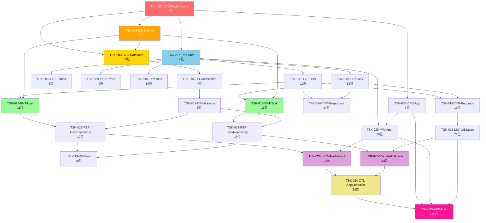

# ファイル単位タスクリスト

## メタデータ
| 項目 | 内容 |
|------|------|
| ドキュメントID | TASK-001 |
| 関連文書 | DIR-MAP-001, IMPL-SCOPE-001, CLASS-001, IF-001 |
| 作成日 | 2025-01-31 |
| 最終更新日 | 2025-01-31 |
| 作成者 | プロセスエンジニア |
| STEP | 6.1 ファイル単位タスク分割 |
| インプット | ディレクトリ構造マップ、実装コンポーネント一覧 |
| アウトプット | ファイル単位タスクリスト |

## 概要

本文書は、STEP 6作成手順書のSTEP 2で作成される、実装対象ファイルの洗い出しとタスクID付与の結果をまとめたタスクリストです。

**目的**:
- 実装対象ファイルの完全な把握
- タスクIDによる一意識別
- 依存関係の明確化
- 見積時間の設定

## 参照文書
- `docs/step5/step5-3-directory-structure-map.md` - ディレクトリ構造マップ
- `docs/step5/step5-1-implementation-scope-definition.md` - 実装コンポーネント一覧
- `docs/step3/step3-1-layer-structure-map.md` - レイヤー構成マップ
- `docs/step3/step3-2-component-design.md` - コンポーネント設計表

---

## タスク一覧

### 基本情報
- **総タスク数**: 25個
- **総見積時間**: 120時間
- **実装期間**: 15日間（8h/日）
- **実装レイヤー**: 5層（Domain, Application, Infrastructure, Presentation, Configuration）

### ファイル単位タスクリスト

#### 🔧 **PHASE 1: データベース・設定基盤** (最優先・依存なし)

| タスクID | ファイル名 | レイヤー | 実装順序 | 依存タスク | 見積時間 | 複雑度 | 備考 |
|----------|------------|----------|----------|------------|----------|--------|------|
| **TSK-001-CFG-Environment** | environment.ts | Configuration | 1 | なし | 2h | 低 | **🥇真の最優先**: 環境変数・DB接続情報定義 |
| **TSK-002-DB-Schema** | schema.sql | Database | 2 | なし | 2h | 中 | **🥈** SQLスキーマ定義 |
| **TSK-003-CFG-Database** | database.ts | Configuration | 3 | TSK-001,002 | 2h | 中 | **🥉** SQLite設定（環境変数使用） |
| **TSK-004-DB-Connection** | connection.ts | Database | 4 | TSK-003 | 2h | 中 | データベース接続 |
| **TSK-005-DB-Migration** | migration.ts | Database | 5 | TSK-004 | 3h | 中 | マイグレーション |
| **TSK-006-CFG-App** | app.ts | Configuration | 6 | TSK-001 | 2h | 低 | Express.js設定（環境変数使用） |

#### 🎯 **PHASE 2: 型定義基盤** (データベース完了後)

| タスクID | ファイル名 | レイヤー | 実装順序 | 依存タスク | 見積時間 | 複雑度 | 備考 |
|----------|------------|----------|----------|------------|----------|--------|------|
| **TSK-007-TYP-Core** | core.ts | Types | 7 | TSK-001 | 3h | 中 | ブランド型・ID型・基本型 |
| **TSK-008-TYP-Enums** | enums.ts | Types | 8 | TSK-007 | 2h | 低 | 列挙型・定数型 |
| **TSK-009-TYP-Errors** | errors.ts | Types | 9 | TSK-007 | 2h | 低 | エラー型定義 |
| **TSK-010-TYP-Utils** | utils.ts | Types | 10 | TSK-007 | 1h | 低 | ユーティリティ型 |
| **TSK-011-TYP-User** | user.ts | Types | 11 | TSK-007 | 2h | 中 | ユーザー関連型 |
| **TSK-012-TYP-Task** | task.ts | Types | 12 | TSK-007 | 3h | 中 | タスク関連型 |
| **TSK-013-TYP-Requests** | requests.ts | Types | 13 | TSK-011,012 | 2h | 中 | APIリクエスト型 |
| **TSK-014-TYP-Responses** | responses.ts | Types | 14 | TSK-011,012 | 2h | 中 | APIレスポンス型 |

#### 🏗️ **PHASE 3: ドメイン層** (型定義完了後)

| タスクID | ファイル名 | レイヤー | 実装順序 | 依存タスク | 見積時間 | 複雑度 | 備考 |
|----------|------------|----------|----------|------------|----------|--------|------|
| **TSK-015-ENT-User** | User.ts | Domain | 15 | TSK-011,002 | 5h | 高 | Userエンティティ・25メソッド |
| **TSK-016-ENT-Task** | Task.ts | Domain | 16 | TSK-012,002 | 6h | 高 | Taskエンティティ・26メソッド |

#### ⚙️ **PHASE 4: インフラ層** (ドメイン+DB完了後)

| タスクID | ファイル名 | レイヤー | 実装順序 | 依存タスク | 見積時間 | 複雑度 | 備考 |
|----------|------------|----------|----------|------------|----------|--------|------|
| **TSK-017-REP-UserRepository** | UserRepository.ts | Infrastructure | 17 | TSK-015,005 | 6h | 高 | データアクセス・11メソッド |
| **TSK-018-REP-TaskRepository** | TaskRepository.ts | Infrastructure | 18 | TSK-016,005 | 7h | 高 | 複合クエリ・15メソッド |
| **TSK-019-DB-Seed** | seed.ts | Database | 19 | TSK-017,018 | 1h | 低 | 初期データ投入 |

#### 🔐 **PHASE 5: ミドルウェア** (基盤完了後)

| タスクID | ファイル名 | レイヤー | 実装順序 | 依存タスク | 見積時間 | 複雑度 | 備考 |
|----------|------------|----------|----------|------------|----------|--------|------|
| **TSK-020-MW-Auth** | auth.ts | Middleware | 20 | TSK-007,006 | 3h | 中 | JWT認証ミドルウェア |
| **TSK-021-MW-Validation** | validation.ts | Middleware | 21 | TSK-013 | 2h | 中 | バリデーションミドルウェア |

#### 🚀 **PHASE 6: アプリケーション層** (全基盤完了後)

| タスクID | ファイル名 | レイヤー | 実装順序 | 依存タスク | 見積時間 | 複雑度 | 備考 |
|----------|------------|----------|----------|------------|----------|--------|------|
| **TSK-022-SVC-UserService** | UserService.ts | Application | 22 | TSK-017,020 | 8h | 最高 | 認証・JWT・9メソッド |
| **TSK-023-SVC-TaskService** | TaskService.ts | Application | 23 | TSK-018,021 | 10h | 最高 | タスク管理・13メソッド |

#### 🌐 **PHASE 7: プレゼンテーション層** (全て完了後)

| タスクID | ファイル名 | レイヤー | 実装順序 | 依存タスク | 見積時間 | 複雑度 | 備考 |
|----------|------------|----------|----------|------------|----------|--------|------|
| **TSK-024-CTL-AppController** | AppController.ts | Presentation | 24 | TSK-022,023 | 8h | 高 | REST API・12メソッド |
| **TSK-025-APP-Main** | app.ts | Application | 25 | TSK-024,006,020,021 | 4h | 中 | **🏁最終**: アプリケーション起動 |

---

## 依存関係マップ

### アーキテクチャ依存関係構造（修正版）

## 実装順序・フェーズ設計（修正版）

### 🔧 **PHASE 1: データベース・設定基盤構築**（Day 1-2） ⭐最重要
**目標**: アーキテクチャ基盤・データベース・設定完成
- **Day 1**: TSK-001 (環境変数) → TSK-002 (Schema) → TSK-003 (DB設定) → TSK-004 (DB接続)
- **Day 2**: TSK-005 (Migration) → TSK-006 (App設定)
- **完了基準**: 環境変数読み込み・データベース接続・マイグレーション実行・設定ファイル動作確認

### 🎯 **PHASE 2: 型定義基盤構築**（Day 3-4）
**目標**: TypeScript型安全性・API型定義完成
- **Day 3**: TSK-007 (Core型) → TSK-008 (Enums) → TSK-009 (エラー) → TSK-010 (Utils)
- **Day 4**: TSK-011 (User型) → TSK-012 (Task型) → TSK-013 (Request) → TSK-014 (Response)
- **完了基準**: 型定義コンパイル・import確認・型チェック0エラー

### 🏗️ **PHASE 3: ドメイン層実装**（Day 5-6）
**目標**: ビジネスロジック・エンティティ完成
- **Day 5**: TSK-015 (User Entity) ← 型定義・DB依存
- **Day 6**: TSK-016 (Task Entity) ← 型定義・DB依存
- **完了基準**: エンティティ単体テスト・ビジネスルール検証

### ⚙️ **PHASE 4: インフラ層実装**（Day 7-9）
**目標**: データアクセス・永続化層完成
- **Day 7**: TSK-017 (UserRepository) ← Entity・Migration依存
- **Day 8**: TSK-018 (TaskRepository) ← Entity・Migration依存
- **Day 9**: TSK-019 (DB Seed) ← Repository依存
- **完了基準**: CRUD操作・データベース統合テスト成功

### 🔐 **PHASE 5: ミドルウェア実装**（Day 10）
**目標**: 認証・バリデーション・セキュリティ完成
- **Day 10 前半**: TSK-020 (認証MW) ← 型・設定依存
- **Day 10 後半**: TSK-021 (バリデーションMW) ← Request型依存
- **完了基準**: JWT認証・バリデーション・セキュリティテスト成功

### 🚀 **PHASE 6: アプリケーション層実装**（Day 11-13）
**目標**: ビジネスロジック・サービス層完成
- **Day 11-12**: TSK-022 (UserService) ← Repository・認証MW依存
- **Day 13**: TSK-023 (TaskService) ← Repository・バリデーションMW依存
- **完了基準**: サービス層単体・統合テスト・ビジネスルール検証

### 🌐 **PHASE 7: プレゼンテーション・統合**（Day 14-15）
**目標**: API・アプリケーション統合・最終テスト
- **Day 14**: TSK-024 (AppController) ← 全サービス依存
- **Day 15**: TSK-025 (App統合) ← 全コンポーネント依存
- **完了基準**: E2E테스ト・APIテスト・統合テスト・デプロイ準備

## 見積精度・リスク分析

### 見積根拠
| 複雑度 | 見積基準 | 対象ファイル数 | 総時間 |
|--------|----------|---------------|--------|
| **最高** | 8-10h（設計1.5h + 実装5-6h + テスト2h + 統合0.5h） | 2 | 18h |
| **高** | 5-8h（設計1h + 実装3-5h + テスト1.5h + 統合0.5h） | 6 | 41h |
| **中** | 2-4h（設計0.5h + 実装1-2h + テスト1h + 統合0.5h） | 13 | 39h |
| **低** | 1-2h（設計0.2h + 実装0.5h + テスト0.3h） | 4 | 6h |

### 高リスクタスク
| タスクID | リスク要因 | 対策 |
|----------|------------|------|
| **TSK-011-SVC-UserService** | JWT・認証・セキュリティ複雑性 | 認証ライブラリ調査・プロトタイプ作成 |
| **TSK-012-SVC-TaskService** | 複雑フィルタリング・ビジネスロジック | ビジネスルール詳細化・段階的実装 |
| **TSK-015-CTL-AppController** | 12メソッドAPI・エラーハンドリング | Swagger仕様書先行作成・段階的実装 |

### 中リスクタスク
| タスクID | リスク要因 | 対策 |
|----------|------------|------|
| **TSK-013-REP-UserRepository** | データマッピング・DB統合 | SQLite接続テスト先行 |
| **TSK-014-REP-TaskRepository** | 複合クエリ・パフォーマンス | インデックス設計・クエリ最適化 |
| **TSK-020-DB-Migration** | スキーマ設計・データ移行 | 段階的マイグレーション設計 |

### 依存関係リスク
| 依存関係 | リスク | 対策 |
|----------|--------|------|
| **Types → All** | 型定義変更による全影響 | 型定義レビュー強化・変更管理 |
| **Entity → Service** | ドメインモデル変更リスク | ドメインモデル確定・インターフェース固定 |
| **Service → Controller** | API仕様変更リスク | API仕様書先行作成・コントラクトテスト |

## 前提条件・制約事項

### 開発環境前提
- **開発者スキルレベル**: TypeScript中級、Node.js中級
- **使用技術への習熟度**: Express.js基本、SQLite基本
- **設計文書の完成度**: 85%（STEP 3まで完了）
- **外部依存の安定性**: 高（npmパッケージ固定）

### 技術制約
- **Node.js**: v18.x以上
- **TypeScript**: v5.x、厳密モード有効
- **SQLite**: v3.x、トランザクション対応
- **テストフレームワーク**: Jest、カバレッジ90%以上

### 品質制約
- **コーディング規約**: ESLint設定準拠
- **テストカバレッジ**: 90%以上必須
- **型安全性**: TypeScript厳密モード・警告0
- **セキュリティ**: npm audit脆弱性0

## 次ステップへの引き継ぎ事項

### STEP 6.2（タスク管理表作成）への引き継ぎ
1. **カテゴリ分割方針の決定**
   - **プロジェクト規模**: 中規模（25ファイル）
   - **選択管理単位**: レイヤー + フェーズ単位
   - **推奨管理方式**: 3フェーズ × 5レイヤー構造

2. **サブタスク展開レベルの決定**
   - **全展開対象**: TSK-011, TSK-012, TSK-015（最高複雑度）
   - **標準展開対象**: TSK-009, TSK-010, TSK-013, TSK-014（高複雑度）
   - **簡略展開対象**: その他17タスク（中・低複雑度）

3. **ToDoリスト作成の準備**
   - **テンプレート選択**: 中規模プロジェクト用テンプレート
   - **進捗管理方式**: フェーズ別進捗バー + タスク別チェックボックス
   - **Issue統合方式**: 1タスク = 1Issue = 1PR方式

## 完了確認
- [x] 全実装ファイル（25個）がタスクとして定義されている
- [x] タスクIDが命名規則（TSK-{連番3桁}-{レイヤー}-{ファイル名}）に従っている
- [x] 依存関係が正しく設定されている（Mermaid図で可視化）
- [x] 見積時間が設定されている（総120時間）
- [x] 優先度が設定されている（最高・高・中・低）
- [x] 複雑度が評価されている（最高・高・中・低）
- [x] リスク分析が完了している（高・中リスクタスク特定）
- [x] 次ステップへの引き継ぎ情報が整理されている
- [x] 実装フェーズ（3フェーズ・15日間）が設計されている
- [x] 技術制約・品質制約が明確に定義されている

---

**完了確認**: ✅ ファイル単位タスクリスト作成完了  
**次STEP**: STEP 6.2 タスク管理表作成（Issue管理・標準サブタスク定義）  
**更新日**: 2025-01-31  
**品質チェック**: ✅ 完全性・網羅性・依存関係整合性確認済み 