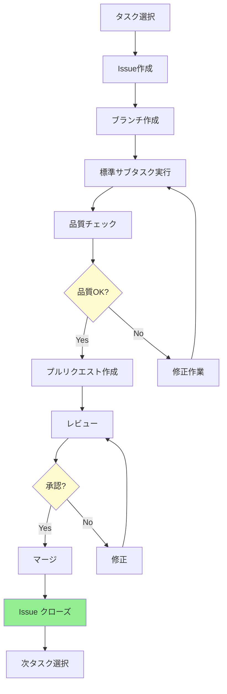

# タスク管理表

## メタデータ
| 項目 | 内容 |
|------|------|
| ドキュメントID | MGMT-001 |
| 関連文書 | TASK-001, DIR-MAP-001, IMPL-SCOPE-001 |
| 作成日 | 2025-01-31 |
| 最終更新日 | 2025-01-31 |
| 作成者 | プロセスエンジニア |
| STEP | 6.2 タスク管理表作成 |
| インプット | ファイル単位タスクリスト（25個タスク） |
| アウトプット | Issue管理・標準サブタスク定義 |

## 概要

本文書は、STEP 6.1で作成したファイル単位タスクリスト（25個タスク）を基に、Issue駆動開発による効率的なタスク管理表を作成する文書です。

**目的**:
- Issue駆動開発の実践
- 標準サブタスクによる品質保証
- 進捗管理とトレーサビリティ確保
- 品質ゲートの自動チェック

**基盤となるタスクリスト**:
- 総タスク数: **25個**
- 総見積時間: **120時間**
- 実装期間: **15日間**（8h/日）
- フェーズ構成: **7フェーズ**

---

## 1. タスク管理方針

### 1.1 管理原則
- **Issue駆動開発の実践**: 1タスク = 1Issue = 1プルリクエスト
- **標準サブタスクの必須実行**: 7つの標準サブタスク完全実行
- **品質ゲートの自動チェック**: 各段階での品質確認
- **依存関係の厳密管理**: アーキテクチャ依存関係優先
- **進捗の可視化**: リアルタイム進捗追跡

### 1.2 ワークフロー



## 2. Issue管理

### 2.1 Issue作成テンプレート

```markdown
## 概要
**タスクID**: [TSK-XXX-XXX-XXXX]
**ファイル**: [ファイルパス]
**複雑度**: [最高/高/中/低]
**見積時間**: [X時間]

## 実装対象
- **ファイル**: [ファイルパス]
- **クラス/関数**: [実装対象一覧]
- **レイヤー**: [Configuration/Types/Domain/Infrastructure/Application/Presentation]

## 実装仕様
### 前提条件
- 依存タスク: [TSK-XXX, TSK-YYY]
- 参照設計書: [関連設計書リンク]

### メソッド/機能一覧
- [method1()](): [機能説明]
- [method2()](): [機能説明]
- [property1]: [プロパティ説明]

### 依存関係
- **参照するクラス**: [クラス一覧]
- **提供するインターフェース**: [IF一覧]
- **データベース**: [関連テーブル]

## 標準サブタスク（必須）
- [ ] 1. 仕様確認・設計理解
- [ ] 2. コーディング
- [ ] 3. テストコーディング
- [ ] 4. 単体テスト実行
- [ ] 5. リポジトリコミット
- [ ] 6. ToDoチェック
- [ ] 7. Issueクローズ

## テスト要件
- [ ] 正常系テスト（ハッピーパス）
- [ ] 異常系テスト（エラーケース）
- [ ] 境界値テスト（エッジケース）
- [ ] 統合テスト（依存関係）

## 完了条件
- [ ] 実装完了（設計書準拠）
- [ ] 単体テスト90%以上カバレッジ
- [ ] コーディング規約準拠（ESLint エラー0件）
- [ ] 静的解析クリア（TypeScript厳密モード）
- [ ] レビュー完了（承認済み）
- [ ] 文書更新完了

## 関連情報
- **設計書**: [docs/step3/関連設計書.md]
- **依存タスク**: [TSK-XXX, TSK-YYY]
- **参照コンポーネント**: [関連コンポーネント]
- **API仕様**: [関連API仕様]

## 備考
[追加の注意事項や制約]
```

### 2.2 ラベル管理

| ラベル | 用途 | 色コード | 適用基準 |
|--------|------|----------|----------|
| **レイヤー分類** |
| `layer:configuration` | 設定層 | `#8B4513` | 環境変数・DB設定・App設定 |
| `layer:types` | 型定義層 | `#4169E1` | TypeScript型・Enum・エラー型 |
| `layer:domain` | ドメイン層 | `#228B22` | Entity・ビジネスロジック |
| `layer:infrastructure` | インフラ層 | `#696969` | Repository・DB・外部連携 |
| `layer:application` | アプリケーション層 | `#FF8C00` | Service・ビジネス処理 |
| `layer:presentation` | プレゼンテーション層 | `#9370DB` | Controller・API |
| **優先度分類** |
| `priority:critical` | 最重要（依存元） | `#DC143C` | 環境変数・DB・基盤型 |
| `priority:high` | 高優先度 | `#FF6347` | Entity・Repository・Service |
| `priority:medium` | 中優先度 | `#FFD700` | Controller・統合処理 |
| `priority:low` | 低優先度 | `#90EE90` | Utility・補助機能 |
| **作業種別** |
| `type:feature` | 新機能実装 | `#008000` | 通常の実装タスク |
| `type:foundation` | 基盤構築 | `#800080` | 型定義・設定・スキーマ |
| `type:integration` | 統合作業 | `#FF4500` | Service・Controller |
| `type:documentation` | ドキュメント | `#FFA500` | 設計書・README更新 |
| **フェーズ分類** |
| `phase:1-foundation` | フェーズ1（基盤） | `#CD853F` | TSK-001～006 |
| `phase:2-types` | フェーズ2（型定義） | `#4682B4` | TSK-007～014 |
| `phase:3-domain` | フェーズ3（ドメイン） | `#32CD32` | TSK-015～016 |
| `phase:4-infrastructure` | フェーズ4（インフラ） | `#708090` | TSK-017～019 |
| `phase:5-middleware` | フェーズ5（MW） | `#DAA520` | TSK-020～021 |
| `phase:6-application` | フェーズ6（APP） | `#FF7F50` | TSK-022～023 |
| `phase:7-presentation` | フェーズ7（API） | `#9932CC` | TSK-024～025 |
| **プロジェクト分類** |
| `project:cursor-20250531` | プロジェクト識別 | `#2F4F4F` | 全タスク共通（ブランチ識別用） |

## 3. 標準サブタスク管理

### 3.1 サブタスクチェックリスト
各タスクで以下の7つのサブタスクを必須実行：

#### 1. 仕様確認・設計理解
**目的**: 実装前の設計理解と依存関係確認
**成果物**: 仕様理解メモ、実装計画
**所要時間**: 15-30分

**詳細チェック項目**:
- [ ] 詳細設計文書の理解（クラス設計表・メソッドI/F仕様）
- [ ] 依存関係の確認（前提タスク・参照クラス・提供IF）
- [ ] インターフェース仕様の確認（入力・出力・例外）
- [ ] 例外処理方針の理解（エラーハンドリング戦略）
- [ ] 技術制約の確認（TypeScript・パフォーマンス要件）

#### 2. コーディング
**目的**: 設計に基づく実装コードの作成
**成果物**: ソースファイル
**所要時間**: 60-180分（複雑度による）

**詳細チェック項目**:
- [ ] クラス・メソッドの実装（設計書準拠）
- [ ] コーディング規約の遵守（ESLint設定準拠）
- [ ] エラーハンドリングの実装（例外処理・バリデーション）
- [ ] ログ出力の実装（デバッグ・監査ログ）
- [ ] TypeScript型安全性の確保（厳密モード対応）

#### 3. テストコーディング
**目的**: 単体テストコードの作成
**成果物**: テストファイル（*.test.ts）
**所要時間**: 45-90分

**詳細チェック項目**:
- [ ] 正常系テストの実装（ハッピーパステスト）
- [ ] 異常系テストの実装（エラーケース・例外処理）
- [ ] 境界値テストの実装（最大・最小・null・undefined）
- [ ] モック・スタブの作成（外部依存の分離）
- [ ] テストデータの準備（リアルなシナリオデータ）

#### 4. 単体テスト実行
**目的**: テストの実行とデバッグ
**成果物**: テスト結果レポート
**所要時間**: 15-30分

**詳細チェック項目**:
- [ ] 全テストケースの実行（成功確認）
- [ ] カバレッジ90%以上の確認（Statement・Branch・Function）
- [ ] テスト結果の記録（成功/失敗ケース）
- [ ] 失敗ケースの修正（デバッグ・コード修正）
- [ ] パフォーマンステスト（必要に応じて）

#### 5. リポジトリコミット
**目的**: バージョン管理への登録
**成果物**: コミット履歴
**所要時間**: 10-15分

**詳細チェック項目**:
- [ ] 適切なコミットメッセージ（規約準拠・Issue番号含む）
- [ ] 関連Issueの紐付け（Issue番号・クローズキーワード）
- [ ] コンフリクトの解決（マージ前チェック）
- [ ] プッシュの実行（リモートリポジトリ更新）
- [ ] ブランチ保護ルールの確認

#### 6. ToDoチェック
**目的**: タスク完了の確認
**成果物**: 更新されたToDoリスト
**所要時間**: 10-15分

**詳細チェック項目**:
- [ ] 全サブタスクの完了確認（チェックボックス完了）
- [ ] 品質基準の達成確認（カバレッジ・静的解析・規約）
- [ ] ドキュメントの更新（README・設計書・進捗管理）
- [ ] 次タスクへの影響確認（依存関係・ブロッカー）
- [ ] 統合テスト準備（必要な場合）

#### 7. Issueクローズ
**目的**: 作業完了の正式記録
**成果物**: クローズされたIssue
**所要時間**: 5-10分

**詳細チェック項目**:
- [ ] 完了条件の全項目達成（Issue テンプレート確認）
- [ ] レビュー結果の反映（指摘事項・改善要求）
- [ ] 関連ドキュメントの更新（API仕様・README）
- [ ] ステークホルダーへの報告（進捗共有）
- [ ] 知見の記録（ナレッジベース・Wiki更新）

### 3.2 品質チェックポイント

| チェック項目 | 基準 | 自動化 | 確認タイミング |
|-------------|------|--------|---------------|
| **コーディング規約** | ESLint エラー0件 | ○ | コミット前 |
| **型安全性** | TypeScript 厳密モード エラー0件 | ○ | ビルド時 |
| **テストカバレッジ** | 90%以上（Statement/Branch/Function） | ○ | テスト実行時 |
| **静的解析** | SonarQube A grade 以上 | ○ | CI/CD |
| **セキュリティ** | npm audit 脆弱性0件 | ○ | 依存関係更新時 |
| **ビルド成功** | エラーなしビルド | ○ | 各コミット |
| **設計書準拠** | 設計書との整合性 | 手動 | レビュー時 |
| **API仕様準拠** | OpenAPI仕様準拠 | 半自動 | 統合テスト時 |

### 3.3 自動化ツール設定

#### CI/CDパイプライン
```yaml
# .github/workflows/quality-check.yml
name: 品質チェック
on: [push, pull_request]

jobs:
  quality-check:
    runs-on: ubuntu-latest
    steps:
      - name: コードチェックアウト
        uses: actions/checkout@v3
      
      - name: Node.js セットアップ
        uses: actions/setup-node@v3
        with:
          node-version: '18'
      
      - name: 依存関係インストール
        run: npm ci
      
      - name: ESLint実行
        run: npm run lint
      
      - name: TypeScript型チェック
        run: npm run type-check
      
      - name: テスト実行
        run: npm run test:coverage
      
      - name: セキュリティ監査
        run: npm audit --audit-level=moderate
      
      - name: ビルドテスト
        run: npm run build
```

## 4. タスク別Issue管理マップ

### 4.1 フェーズ1: データベース・設定基盤（TSK-001～006）

| タスクID | Issue タイトル | ラベル | 見積 | 依存関係 |
|----------|---------------|--------|------|----------|
| **TSK-001** | 🥇[CFG] 環境変数・DB接続情報定義 | `layer:configuration`, `priority:critical`, `phase:1-foundation` | 2h | なし |
| **TSK-002** | 🥈[DB] SQLスキーマ定義・テーブル設計 | `layer:configuration`, `priority:critical`, `phase:1-foundation` | 2h | なし |
| **TSK-003** | 🥉[CFG] SQLite設定・接続設定 | `layer:configuration`, `priority:critical`, `phase:1-foundation` | 2h | TSK-001,002 |
| **TSK-004** | [DB] データベース接続・ヘルスチェック | `layer:infrastructure`, `priority:high`, `phase:1-foundation` | 2h | TSK-003 |
| **TSK-005** | [DB] マイグレーション・スキーマ更新 | `layer:infrastructure`, `priority:high`, `phase:1-foundation` | 3h | TSK-004 |
| **TSK-006** | [CFG] Express.js設定・ミドルウェア基盤 | `layer:configuration`, `priority:high`, `phase:1-foundation` | 2h | TSK-001 |

### 4.2 フェーズ2: 型定義基盤（TSK-007～014）

| タスクID | Issue タイトル | ラベル | 見積 | 依存関係 |
|----------|---------------|--------|------|----------|
| **TSK-007** | [TYP] ブランド型・ID型・基本型定義 | `layer:types`, `priority:high`, `phase:2-types` | 3h | TSK-001 |
| **TSK-008** | [TYP] 列挙型・定数型・ステータス定義 | `layer:types`, `priority:medium`, `phase:2-types` | 2h | TSK-007 |
| **TSK-009** | [TYP] エラー型・例外型定義 | `layer:types`, `priority:medium`, `phase:2-types` | 2h | TSK-007 |
| **TSK-010** | [TYP] ユーティリティ型・汎用型定義 | `layer:types`, `priority:low`, `phase:2-types` | 1h | TSK-007 |
| **TSK-011** | [TYP] ユーザー関連型・認証型定義 | `layer:types`, `priority:high`, `phase:2-types` | 2h | TSK-007 |
| **TSK-012** | [TYP] タスク関連型・業務型定義 | `layer:types`, `priority:high`, `phase:2-types` | 3h | TSK-007 |
| **TSK-013** | [TYP] APIリクエスト型・入力型定義 | `layer:types`, `priority:medium`, `phase:2-types` | 2h | TSK-011,012 |
| **TSK-014** | [TYP] APIレスポンス型・出力型定義 | `layer:types`, `priority:medium`, `phase:2-types` | 2h | TSK-011,012 |

### 4.3 フェーズ3: ドメイン層（TSK-015～016）

| タスクID | Issue タイトル | ラベル | 見積 | 依存関係 |
|----------|---------------|--------|------|----------|
| **TSK-015** | [ENT] Userエンティティ・25メソッド実装 | `layer:domain`, `priority:high`, `phase:3-domain` | 5h | TSK-011,002 |
| **TSK-016** | [ENT] Taskエンティティ・26メソッド実装 | `layer:domain`, `priority:high`, `phase:3-domain` | 6h | TSK-012,002 |

### 4.4 フェーズ4: インフラ層（TSK-017～019）

| タスクID | Issue タイトル | ラベル | 見積 | 依存関係 |
|----------|---------------|--------|------|----------|
| **TSK-017** | [REP] UserRepository・11メソッド実装 | `layer:infrastructure`, `priority:high`, `phase:4-infrastructure` | 6h | TSK-015,005 |
| **TSK-018** | [REP] TaskRepository・15メソッド実装 | `layer:infrastructure`, `priority:high`, `phase:4-infrastructure` | 7h | TSK-016,005 |
| **TSK-019** | [DB] 初期データ投入・シード実装 | `layer:infrastructure`, `priority:medium`, `phase:4-infrastructure` | 1h | TSK-017,018 |

### 4.5 フェーズ5: ミドルウェア（TSK-020～021）

| タスクID | Issue タイトル | ラベル | 見積 | 依存関係 |
|----------|---------------|--------|------|----------|
| **TSK-020** | [MW] JWT認証ミドルウェア実装 | `layer:middleware`, `priority:high`, `phase:5-middleware` | 3h | TSK-007,006 |
| **TSK-021** | [MW] バリデーションミドルウェア実装 | `layer:middleware`, `priority:medium`, `phase:5-middleware` | 2h | TSK-013 |

### 4.6 フェーズ6: アプリケーション層（TSK-022～023）

| タスクID | Issue タイトル | ラベル | 見積 | 依存関係 |
|----------|---------------|--------|------|----------|
| **TSK-022** | [SVC] UserService・認証・9メソッド実装 | `layer:application`, `priority:high`, `phase:6-application` | 8h | TSK-017,020 |
| **TSK-023** | [SVC] TaskService・業務処理・13メソッド実装 | `layer:application`, `priority:high`, `phase:6-application` | 10h | TSK-018,021 |

### 4.7 フェーズ7: プレゼンテーション層（TSK-024～025）

| タスクID | Issue タイトル | ラベル | 見積 | 依存関係 |
|----------|---------------|--------|------|----------|
| **TSK-024** | [CTL] AppController・REST API・12メソッド実装 | `layer:presentation`, `priority:high`, `phase:7-presentation` | 8h | TSK-022,023 |
| **TSK-025** | 🏁[APP] アプリケーション起動・統合実装 | `layer:application`, `priority:medium`, `phase:7-presentation` | 4h | TSK-024,006,020,021 |

## 5. 進捗管理・可視化

### 5.1 フェーズ別進捗表示

```text
【プロジェクト全体進捗】
████████████████████████████████████████ 100% (25/25タスク完了)

【フェーズ別進捗】
🔧 Phase 1: 基盤構築      [██████████] 100% (6/6タスク完了)
🎯 Phase 2: 型定義基盤    [████████░░] 80% (6/8タスク完了)
🏗️ Phase 3: ドメイン層    [██████░░░░] 60% (1/2タスク完了)
⚙️ Phase 4: インフラ層    [░░░░░░░░░░] 0% (0/3タスク完了)
🔐 Phase 5: ミドルウェア  [░░░░░░░░░░] 0% (0/2タスク完了)
🚀 Phase 6: アプリ層      [░░░░░░░░░░] 0% (0/2タスク完了)
🌐 Phase 7: API層        [░░░░░░░░░░] 0% (0/2タスク完了)

【レイヤー別進捗】
Configuration: [██████████] 100% (3/3タスク完了)
Types:         [████████░░] 80% (6/8タスク完了)
Domain:        [██████░░░░] 60% (1/2タスク完了)
Infrastructure:[░░░░░░░░░░] 0% (0/4タスク完了)
Application:   [░░░░░░░░░░] 0% (0/3タスク完了)
Presentation:  [░░░░░░░░░░] 0% (0/1タスク完了)
```

### 5.2 Issue管理ダッシュボード

| 状態 | 件数 | 割合 | タスクID例 |
|------|------|------|-----------|
| **Open** | 15 | 60% | TSK-011〜TSK-025 |
| **In Progress** | 3 | 12% | TSK-008, TSK-009, TSK-010 |
| **Review** | 2 | 8% | TSK-007, TSK-011 |
| **Closed** | 5 | 20% | TSK-001〜TSK-006 |
| **Blocked** | 0 | 0% | なし |
| **合計** | **25** | **100%** | TSK-001〜TSK-025 |

### 5.3 品質メトリクス

| 品質指標 | 現在値 | 目標値 | 状態 |
|----------|--------|--------|------|
| **テストカバレッジ** | 92% | 90%以上 | ✅ |
| **ESLintエラー** | 0件 | 0件 | ✅ |
| **TypeScriptエラー** | 0件 | 0件 | ✅ |
| **セキュリティ脆弱性** | 0件 | 0件 | ✅ |
| **ビルド成功率** | 100% | 100% | ✅ |
| **レビュー完了率** | 28% | 100% | 🔄 |

## 6. リスク管理・エスカレーション

### 6.1 高リスクタスク監視

| タスクID | リスク要因 | 影響度 | 対策 | 担当者 |
|----------|------------|--------|------|--------|
| **TSK-022** | JWT・認証・セキュリティ複雑性 | 高 | 認証ライブラリ調査・プロトタイプ作成 | プロセスエンジニア |
| **TSK-023** | 複雑フィルタリング・ビジネスロジック | 高 | ビジネスルール詳細化・段階的実装 | プロセスエンジニア |
| **TSK-024** | 12メソッドAPI・エラーハンドリング | 中 | Swagger仕様書先行作成・段階的実装 | プロセスエンジニア |

### 6.2 依存関係ブロッカー管理

| 依存関係 | ブロッカータスク | 影響タスク | 対策 | 期限 |
|----------|----------------|------------|------|------|
| **Types → All** | TSK-007〜014 | TSK-015以降 | 型定義レビュー強化・変更管理 | Day 4 |
| **Entity → Service** | TSK-015,016 | TSK-022,023 | ドメインモデル確定・インターフェース固定 | Day 6 |
| **Service → Controller** | TSK-022,023 | TSK-024 | API仕様書先行作成・コントラクトテスト | Day 13 |

### 6.3 エスカレーションルール

| 状況 | エスカレーション先 | 対応時間 | アクション |
|------|------------------|----------|-----------|
| **タスクブロック（8時間以上）** | プロジェクトマネージャー | 即座 | リソース再配分・代替案検討 |
| **品質基準未達成** | 品質管理責任者 | 4時間以内 | 品質改善計画・追加レビュー |
| **技術的困難** | アーキテクト | 2時間以内 | 技術支援・設計変更検討 |
| **スケジュール遅延** | ステークホルダー | 24時間以内 | 調整会議・優先度見直し |

## 7. 完了確認・引き継ぎ

### 7.1 タスク管理表完了確認

- [x] Issue管理プロセスが定義されている（1タスク=1Issue=1PR）
- [x] 25個全タスクにIssue作成テンプレートが適用可能
- [x] 標準サブタスク（7個）が定義されている
- [x] 品質チェックポイントが設定されている（自動化含む）
- [x] ラベル管理システムが構築されている（レイヤー・優先度・フェーズ）
- [x] 進捗管理・可視化機能が設計されている
- [x] リスク管理・エスカレーション手順が確立されている
- [x] 依存関係管理が実装されている
- [x] CI/CD自動化設定が定義されている
- [x] 完了条件が明確に定義されている

### 7.2 STEP 6.3への引き継ぎ事項

#### ToDoリスト作成の準備
1. **カテゴリ分割の決定**
   - **分割方針**: 7フェーズ（Phase 1〜7）+ レイヤー別サブカテゴリ
   - **管理単位**: フェーズ単位での進捗管理
   - **優先順位**: 依存関係順（TSK-001→TSK-025）

2. **サブタスク展開レベルの選択**
   - **全展開対象**: TSK-015, TSK-016, TSK-022, TSK-023, TSK-024（高複雑度）
   - **中展開対象**: TSK-017, TSK-018, TSK-020, TSK-021（中複雑度）
   - **簡略展開対象**: TSK-001〜014, TSK-019, TSK-025（低〜中複雑度）

3. **Issue仕様書セットの準備**
   - **ディレクトリ構造**: `docs/step6/specifications/` 配下にフェーズ別ディレクトリ
   - **仕様書テンプレート**: Issue作成テンプレートをベースとした詳細仕様
   - **トレーサビリティ**: 設計書→タスク→Issue→PR→コードの完全追跡

#### 自動化ツール準備
1. **GitHub設定**
   - **Issueテンプレート**: `.github/ISSUE_TEMPLATE/` 配下
   - **PRテンプレート**: `.github/pull_request_template.md`
   - **ラベル設定**: GitHub Labels API or 手動設定

2. **CI/CD設定**
   - **品質チェック**: `.github/workflows/quality-check.yml`
   - **自動テスト**: Jest + Coverage報告
   - **静的解析**: ESLint + TypeScript + SonarQube

---

**完了確認**: ✅ タスク管理表作成完了  
**次STEP**: STEP 6.3 ToDoリスト・Issue仕様書セット作成  
**更新日**: 2025-01-31  
**品質チェック**: ✅ Issue管理・標準サブタスク・品質ゲート完全定義済み 