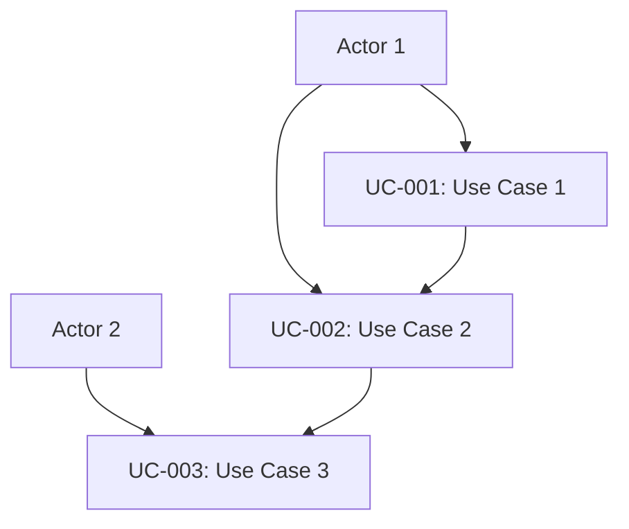
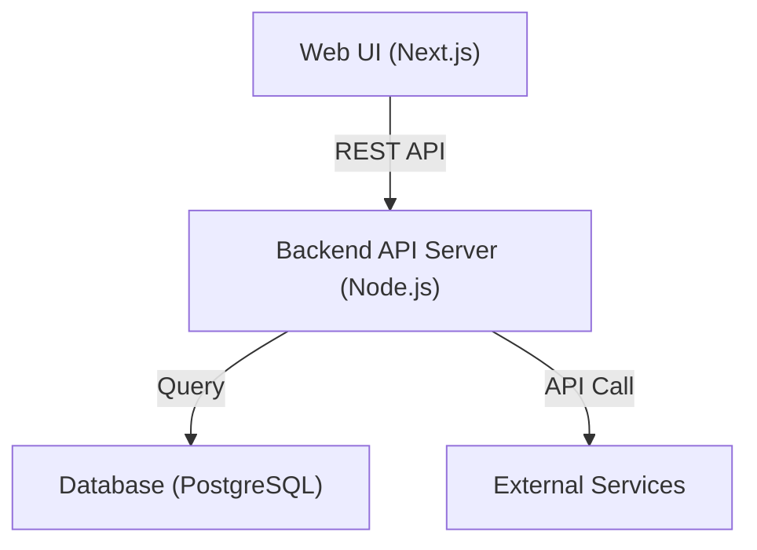
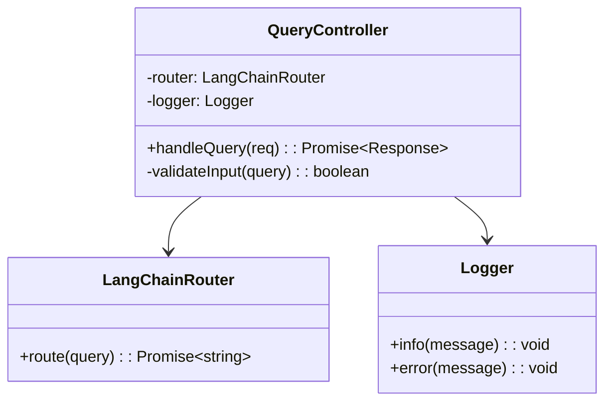

# Cline Process Engineering Implementation Rules (Updated Version)

## Metadata
| Item | Content |
|------|---------|
| purpose | Define concrete implementation rules for applying process engineering approach with Cline AI |
| category | Tool Configuration |
| target_user | Developer, Technical Lead, AI Engineer |
| usage_phase | All phases |
| related_templates | cline-custom-instructions.md, document-format-specifications.md |

**Author**: Toshikazu Yokoi  
**Organization**: Innovative Solutions Inc.  
**Contact**: yokoi@innovative-solutions.co.jp

## Overview

This rule file contains concrete implementation rules for reproducing the theory from the paper "Differences Between Human Coding and AI Coding: Systematization Through Process Engineering Approach" using the Cline AI agent.

By applying these rules, anyone can reproduce the process engineering methodology presented in the paper in actual software development.

**Document Format Reference**: When implementing these rules, create documents according to the standard format defined in `docs/document-format-specifications.md`.

## Basic Principles

### 1. Thorough Phased Refinement
- Always go through 7 phases from abstract requirements to concrete implementation
- Always use deliverables from previous phase as input
- Skipping or omitting phases is prohibited
- **Document Format**: Documents for each phase must comply with standard format

### 2. Implementation of File-based Task Management
- Divide all coding work by file units
- Apply 7 standard subtasks to each file
- Ensure complete traceability with task IDs
- **Document Format**: Task management documents use standard templates

### 3. Integrated Quality Assurance
- Set quality checkpoints at each phase
- Always automate automatable quality controls
- Clearly define items requiring manual checks
- **Document Format**: Always include completion checklists

## Process Implementation Rules

### STEP 0: Goal Definition

#### Required Deliverables
1. **Goal Statement** (`docs/goal-statement.md`)
2. **Stakeholder List** (`docs/stakeholders.md`)
3. **Constraints List** (`docs/constraints.md`)

#### Document Format Requirements
- **Metadata Section**: Always include Document ID, creation date, related documents
- **Completion Check**: Include standard checklist in each document
- **Diagrams**: Use Mermaid notation as needed

#### Implementation Rules
```markdown
## Goal Statement Creation Rules

### Required Elements
- Project purpose (expressed in one sentence)
- Clarification of problems to be solved
- Definition of success (including quantitative metrics)

### Prohibited Items
- Ambiguous expressions ("improve", "enhance", etc.)
- Technical details
- Implementation method mentions

### Standard Format Application
Create according to "STEP 0: Goal Definition Document" section in docs/document-format-specifications.md

### Template
This project aims to provide [value to be provided] to enable [target users] to solve [current problems] and achieve [expected results].
```

### STEP 1: Requirements Definition

#### Required Deliverables
1. **Use Case List** (`docs/requirements/use-cases.md`)
2. **Non-functional Requirements List** (`docs/requirements/non-functional.md`)
3. **Requirements Specification** (`docs/requirements/specification.md`)

#### Document Format Requirements
- **Use Case Relationship Diagram**: Illustrate with Mermaid notation
- **Table Format**: Organize actor definitions and use case list in table format
- **Traceability**: Clearly state references to previous phase documents

#### Implementation Rules
```markdown
## Use Case Extraction Rules

### Required Elements
- Clarification of actors (user types)
- Description of main scenarios (normal flow)
- Description of alternative scenarios (exception flow)
- Definition of pre-conditions and post-conditions

### Quality Criteria
- Each use case is independently understandable
- Business value is clear
- Described in testable form

### Standard Format Application
Create according to "STEP 1: Requirements Definition Document" section in docs/document-format-specifications.md

### Mandatory Use of Mermaid Diagrams
Create use case relationship diagram in following format:

````markdown

````

### Template
**UC-001: [Use Case Name]**
- Actor: [User Type]
- Purpose: [Goal to achieve]
- Pre-conditions: [State before execution]
- Main Scenario: [Steps 1-N]
- Alternative Scenario: [Exception handling]
- Post-conditions: [State after execution]
```

### STEP 2: System Design

#### Required Deliverables
1. **System Architecture Diagram** (`docs/design/system-architecture.md`)
2. **Technology Selection and Dependency Definition** (`docs/design/tech-stack.md`)

#### Document Format Requirements
- **System Architecture Diagram**: Must illustrate with Mermaid notation
- **Technology Selection Table**: Use standard table format
- **Layer Configuration**: Organize in table format

#### Implementation Rules
```markdown
## Technology Selection Rules

### Required Elements
- Clear reasons for technology selection
- Version specification (specific version numbers)
- Alternative consideration results
- License and security considerations

### Quality Criteria
- Consistency with non-functional requirements
- Consideration of maintainability and extensibility
- Compatibility with team technical level

### Standard Format Application
Create according to "STEP 2: System Design Document" section in docs/document-format-specifications.md

### Mandatory Mermaid Diagrams
Overall System Architecture:

````markdown

````

### Template
| Layer | Technology | Version | Selection Reason | Alternative | Risk |
|-------|------------|---------|------------------|-------------|------|
| Frontend | React | 18.2.0 | Component reusability | Vue.js | Learning cost |
```

### STEP 3: Detailed Design

#### Required Deliverables
1. **Class Design Table** (`docs/detailed-design/classes.md`)
2. **Method Interface List** (`docs/detailed-design/interfaces.md`)

#### Document Format Requirements
- **Class Diagram**: Illustrate dependencies with Mermaid notation
- **Interface Table**: Use standard table format
- **Method Signatures**: Describe in TypeScript format

#### Implementation Rules
```markdown
## Class Design Rules

### Required Elements
- Adherence to single responsibility principle
- Clarification of dependencies
- Interface definitions
- Exception handling policy

### Quality Criteria
- Prohibition of circular dependencies
- Achievement of loose coupling and high cohesion
- Ensuring testability

### Standard Format Application
Create according to "STEP 3: Detailed Design Document" section in docs/document-format-specifications.md

### Mandatory Mermaid Diagrams
Class Dependency Diagram:

````markdown

````

### Template
**Class Name**: UserService
**Responsibility**: Business logic for user management
**Dependencies**: 
- UserRepository (Data access)
- EmailService (Notification functionality)
**Provided Methods**:
- createUser(userData: UserCreateRequest): Promise<User>
- getUserById(id: string): Promise<User | null>
```

### STEP 4: Test Design

#### Required Deliverables
1. **Test Strategy Document** (`docs/test-design/strategy.md`)
2. **Test Target List** (`docs/test-design/targets.md`)
3. **Test Case Definitions** (`docs/test-design/test-cases.md`)

#### Document Format Requirements
- **Test Strategy**: Comply with standard format
- **Test Case Table**: Use standard table format
- **Coverage Target**: Set quantitatively

#### Implementation Rules
```markdown
## Test Design Rules

### Required Elements
- Application of test pyramid
- Setting coverage targets (90% or higher)
- Clarification of automation policy
- Test data management policy

### Quality Criteria
- Complete boundary value testing
- Rich exception testing
- Consideration of performance testing

### Standard Format Application
Create according to standard test design document format

### Template
**Test Case ID**: TC-001
**Target Method**: UserService.createUser
**Test Perspective**: Normal flow - Valid user data
**Input**: { name: "John", email: "john@example.com" }
**Expected Result**: User creation successful, ID returned
**Pre-conditions**: Database is empty
**Post-conditions**: User is saved in database
```

### STEP 5: Development Planning

#### Required Deliverables
1. **Implementation Component List** (`docs/implementation/components.md`)
2. **Development Schedule** (`docs/implementation/schedule.md`)
3. **Directory Structure Map** (`docs/implementation/directory-structure.md`)

#### Document Format Requirements
- **Directory Structure**: Express in tree format
- **Schedule**: Organize in table format
- **Component List**: Use standard table format

#### Implementation Rules
```markdown
## Directory Structure Rules

### Required Elements
- Clear separation by layers
- Consistency with technology selection
- Structure considering extensibility
- Unified naming conventions

### Quality Criteria
- Achievement of separation of concerns
- Visualization of dependencies
- Ensuring maintainability

### Standard Format Application
Create according to standard development planning document format

### Template
```text
src/
├── presentation/     # Presentation layer
│   ├── controllers/  # REST API controllers
│   └── dto/         # Data transfer objects
├── application/     # Application layer
│   ├── services/    # Business logic
│   └── usecases/    # Use case implementations
├── domain/          # Domain layer
│   ├── entities/    # Entities
│   └── repositories/ # Repository interfaces
└── infrastructure/  # Infrastructure layer
    ├── database/    # Database implementations
    └── external/    # External API integration
```

### STEP 6: ToDo List Creation

#### Required Deliverables
1. **Implementation ToDo List** (`docs/todo-list.md`) - Hierarchical checkbox format as expected in paper
2. **Task Management Table** (`docs/tasks/task-management.md`) - For progress management
3. **Issue and Specification Sets** (`docs/tasks/specifications/`) - Detailed specifications for each task

#### Document Format Requirements
- **ToDo List**: Hierarchical checkbox format (as expected in paper)
- **Task ID**: Unified naming convention
- **7 Standard Subtasks**: Required for each main task
- **Progress Visualization**: Completion status management with checkboxes

#### Implementation Rules
```markdown
## Hierarchical ToDo List Creation Rules

### Basic Structure
- **Main Task**: File unit (TSK-XXX-XXX-FileName)
- **Subtasks**: 7 standard subtasks (required)
- **Detailed Subtasks**: Specific work items for each standard subtask

### Task ID Naming Convention
**Format**: TSK-{3-digit sequence}-{layer}-{filename}

**Layer Abbreviations**:
- ENT: Entity
- SVC: Service
- REP: Repository
- CTL: Controller
- DTO: Data Transfer Object
- UTL: Utility

### 7 Standard Subtasks (Required)
1. **Specification Review & Design Understanding**
2. **Coding**
3. **Test Coding**
4. **Unit Test Execution**
5. **Repository Commit**
6. **ToDo Check**
7. **Issue Close**

### Quality Criteria
- 1 main task = 1 file
- Task complete when all subtasks complete
- Progress management with checkboxes
- Clarification of dependencies

### Standard Format Application
Use docs/templates/step6-todo-list-template.md

### Template Example
- [ ] **TSK-001-ENT-User**: Create and verify User.ts
  - [ ] Specification review & design understanding
    - [ ] Review detailed design document
    - [ ] Understand interface specifications
  - [ ] Coding
    - [ ] Implement class/functions
    - [ ] Implement error handling
  - [ ] Test coding
  - [ ] Unit test execution
  - [ ] Repository commit
  - [ ] ToDo check
  - [ ] Issue close
```

### STEP 7: Coding & Testing Execution

#### Standard Subtask Implementation Rules

```markdown
## 7 Standard Subtasks

### 1. Specification Review
**Purpose**: Design understanding and dependency confirmation before implementation
**Deliverable**: Specification understanding memo
**Document Reference**: Detailed design document, Interface specification
**Checklist**:
- [ ] Understanding of interface specifications
- [ ] Confirmation of dependencies
- [ ] Understanding of exception handling policy
- [ ] Confirmation of test requirements

### 2. Coding
**Purpose**: Create implementation code based on design
**Deliverable**: Source file
**Document Reference**: Class design table, Method interface list
**Checklist**:
- [ ] Adherence to coding standards
- [ ] Compliance with design specifications
- [ ] Implementation of error handling
- [ ] Appropriate placement of log output

### 3. Test Coding
**Purpose**: Create unit test code
**Deliverable**: Test file
**Document Reference**: Test case definitions
**Checklist**:
- [ ] Implementation of normal flow tests
- [ ] Implementation of exception flow tests
- [ ] Implementation of boundary value tests
- [ ] Appropriate use of mocks and stubs

### 4. Unit Test Execution
**Purpose**: Test execution and debugging
**Deliverable**: Test result report
**Document Reference**: Test strategy document
**Checklist**:
- [ ] Success of all test cases
- [ ] Achievement of coverage ≥90%
- [ ] Confirmation of performance requirements
- [ ] Confirmation of memory leaks

### 5. Repository Commit
**Purpose**: Registration to version control
**Deliverable**: Commit history
**Document Reference**: Commit message convention
**Checklist**:
- [ ] Adherence to commit message convention
- [ ] Linking related issues
- [ ] Commits with appropriate granularity
- [ ] Resolution of conflicts

### 6. ToDo Check
**Purpose**: Confirmation of task completion
**Deliverable**: Updated ToDo list
**Document Reference**: Task management table
**Checklist**:
- [ ] Confirmation of all subtask completion
- [ ] Confirmation of quality criteria achievement
- [ ] Document updates
- [ ] Confirmation of impact on next tasks

### 7. Issue Close
**Purpose**: Official record of work completion
**Deliverable**: Closed issue
**Document Reference**: Issue management template
**Checklist**:
- [ ] Achievement of all completion criteria
- [ ] Reflection of review results
- [ ] Update of related documentation
- [ ] Report to stakeholders
```

## Document Format Integration Rules

### Mandatory Application Items

```markdown
## Mandatory Checklist for Document Creation

### 1. Metadata Section
- [ ] Assignment of Document ID
- [ ] Recording of creation and update dates
- [ ] References to related documents
- [ ] Clear identification of authors and reviewers

### 2. Structure
- [ ] Complete required sections
- [ ] Appropriate use of hierarchy (H1-H6)
- [ ] Unified table format
- [ ] Appropriate placement of diagrams

### 3. Diagram Creation
- [ ] Correct use of Mermaid notation
- [ ] Nesting with 4 backticks (````)
- [ ] Clear separation of diagrams and text
- [ ] Addition of diagram explanations

### 4. Quality Assurance
- [ ] Addition of completion checklist
- [ ] Ensuring traceability
- [ ] Consistency check with previous phase documents
- [ ] Clear specification of handover information to next phase

### 5. Use of Standard Templates
Refer to the following for documents at each phase:
- STEP 0: docs/document-format-specifications.md "STEP 0: Goal Definition Document"
- STEP 1: docs/document-format-specifications.md "STEP 1: Requirements Definition Document"
- STEP 2: docs/document-format-specifications.md "STEP 2: System Design Document"
- STEP 3: docs/document-format-specifications.md "STEP 3: Detailed Design Document"
```

## Quality Management Rules

### Automated Checkpoints

```markdown
## CI/CD Pipeline Required Items

### On Pull Request
1. **Static Analysis**: ESLint, SonarQube
2. **Unit Tests**: Jest, Mocha, etc.
3. **Coverage Check**: ≥90%
4. **Build Confirmation**: 0 errors
5. **Security Scan**: npm audit, Snyk
6. **Document Format Check**: Standard format compliance confirmation

### On Merge
1. **Integration Tests**: API, DB integration tests
2. **E2E Tests**: User scenario tests
3. **Performance Tests**: Response time confirmation
4. **Deployment Tests**: Production environment deployment confirmation
5. **Document Consistency Check**: Traceability matrix confirmation

### Quality Criteria
| Item | Standard Value | Measurement Method | Automated |
|------|----------------|-------------------|-----------|
| Test Coverage | ≥90% | Jest Coverage | ✅ |
| Static Analysis | 0 errors | ESLint | ✅ |
| Security | 0 vulnerabilities | npm audit | ✅ |
| Performance | Response time <200ms | Lighthouse | ✅ |
| Availability | ≥99.9% | Monitoring tools | ✅ |
| Document Quality | 100% format compliance | Automated check | ✅ |
```

## Issue Management Rules

### Issue Creation Template

```markdown
## Task Issue Template

**Title**: [TSK-XXX-XXX-FileName] Implementation of filename

### Overview
Describe the role and responsibility of the implementation target file

### Implementation Specification
#### Method List
- method1(): Function description
- method2(): Function description

#### Dependencies
- Classes and methods to reference
- Interfaces to provide

### Reference Documents
- [ ] Detailed Design: [Link]
- [ ] Interface Specification: [Link]
- [ ] Test Case Definitions: [Link]

### Test Requirements
#### Required Test Cases
- [ ] Normal flow tests
- [ ] Exception flow tests
- [ ] Boundary value tests
- [ ] Performance tests

### Completion Criteria
- [ ] All methods implemented
- [ ] Unit test coverage ≥90%
- [ ] Coding standard compliance
- [ ] Design specification conformance
- [ ] Document format compliance
- [ ] Review completed

### Related Information
- Design documents: [Link]
- Dependent tasks: [Task ID]
- Reference materials: [Link]
```

### Commit Message Convention

```markdown
## Commit Message Convention

### Basic Format
{type}(#{issue_number}): {summary}

{detailed description}

Closes #{issue_number}

### Type Definitions
- **feat**: New feature implementation
- **fix**: Bug fix
- **test**: Add test code
- **refactor**: Refactoring
- **docs**: Document update
- **style**: Code style fix
- **perf**: Performance improvement

### Example
feat(#123): Implementation of UserController

- Implementation of user registration API
- Addition of validation processing
- Creation of unit tests
- Update of OpenAPI specification
- Document creation compliant with standard format

Closes #123
```

## Traceability Management

### Required Traceability Matrix

```markdown
## Traceability Matrix

### Requirements → Design → Implementation Tracking
| Requirement ID | Use Case | Design Class | Implementation File | Test Case | Issue | Document |
|----------------|-----------|--------------|-------------------|-----------|-------|----------|
| REQ-001 | User Registration | UserService | UserService.ts | TC-001-005 | #123 | UC-001 |
| REQ-002 | User Authentication | AuthService | AuthService.ts | TC-006-010 | #124 | UC-002 |

### Document Relationships
| Phase | Document | Reference Source | Reference Target | Format Compliance |
|-------|----------|------------------|------------------|-------------------|
| STEP 0 | goal-statement.md | - | stakeholders.md | ✅ |
| STEP 1 | use-cases.md | goal-statement.md | specification.md | ✅ |
| STEP 2 | system-architecture.md | specification.md | classes.md | ✅ |

### Change Impact Analysis
Immediately identify impact scope when change requests occur

### Quality Assurance
Ensure deliverables from each phase are reliably carried over to next phase
```

## Reproducibility Assurance Checklist

### At Project Start
- [ ] Confirm placement of this rule file
- [ ] Confirm placement of document format specification
- [ ] Create required directory structure
- [ ] Configure CI/CD pipeline
- [ ] Configure issue management templates
- [ ] Set quality criteria
- [ ] Configure document format check functionality

### At Each STEP Completion
- [ ] Confirm creation of required deliverables
- [ ] Confirm standard format compliance
- [ ] Confirm achievement of quality criteria
- [ ] Confirm handover information to next STEP
- [ ] Update traceability
- [ ] Confirm inter-document consistency

### At Project Completion
- [ ] Confirm quality of all deliverables
- [ ] Confirm format compliance of all documents
- [ ] Complete traceability matrix
- [ ] Conduct reproducibility verification
- [ ] Record improvement points
- [ ] Create document archive

## Customization Guide

### Project-Specific Adjustment Items

```markdown
## Adjustable Items

### Technology Stack
- Programming language
- Framework
- Database
- Infrastructure configuration

### Quality Criteria
- Test coverage target
- Performance requirements
- Security requirements
- Availability requirements

### Process Adjustments
- Review method
- Deployment frequency
- Release strategy
- Monitoring method

### Document Customization
- Add project-specific sections
- Add industry-specific requirement items
- Apply organization-specific templates

### Non-Adjustable Items
- Omission of 7-phase process
- Change of file-based task management
- Deletion of standard subtasks
- Simplification of traceability management
- Change of basic document format structure
```

## Implementation Support Tools

### Recommended Tool Configuration

```markdown
## Development Environment
- **IDE**: VSCode + Extensions
- **Version Control**: Git + GitHub
- **CI/CD**: GitHub Actions
- **Quality Management**: ESLint + Prettier + SonarQube
- **Testing**: Jest + Cypress
- **Monitoring**: Application Insights
- **Document Management**: Markdown + Mermaid + Auto format check

## Automation Scripts
- Project initialization script
- Directory structure generation script
- Batch issue creation script
- Quality report generation script
- Document format check script
- Traceability matrix generation script
```

## Paper Reproducibility Verification Method

### Verification Items

```markdown
## Reproducibility Verification Checklist

#### Process Reproducibility
- [ ] Complete execution of 7-phase process
- [ ] Creation of required deliverables at each phase
- [ ] Confirmation of information handover between phases
- [ ] Confirmation of quality criteria achievement

#### Document Format Unification
- [ ] Compliance with standard format
- [ ] Correct use of Mermaid notation
- [ ] Complete metadata sections
- [ ] Implementation of completion checklists

#### File-based Task Management
- [ ] Complete traceability with task IDs
- [ ] Execution of 7 standard subtasks
- [ ] Integration with issue management
- [ ] Automation of quality management

#### Quality Criteria Achievement
- [ ] Test coverage ≥90%
- [ ] Static analysis errors: 0
- [ ] Security vulnerabilities: 0
- [ ] Document format compliance: 100%

### Quantitative Effect Measurement

```markdown
## Effect Measurement Metrics

### Development Efficiency Metrics
| Metric | Traditional Method | Process Engineering | Improvement Rate |
|--------|-------------------|-------------------|-----------------|
| Requirements Definition Time | 20 hours | 12 hours | 40% reduction |
| Design Time | 35 hours | 18 hours | 49% reduction |
| Implementation Time | 85 hours | 45 hours | 47% reduction |
| Test Time | 20 hours | 10 hours | 50% reduction |
| Rework Count | 8 times | 3 times | 63% reduction |

### Quality Metrics
| Metric | Traditional Method | Process Engineering | Improvement Rate |
|--------|-------------------|-------------------|-----------------|
| Bug Density | 4.7/KLOC | 2.1/KLOC | 55% reduction |
| Test Coverage | 78% | 92% | 18% improvement |
| Static Analysis Score | 8.3/10 | 9.1/10 | 10% improvement |
| Security Vulnerabilities | 5 | 1 | 80% reduction |
| Cyclomatic Complexity | 11.3 | 7.8 | 31% reduction |

### Maintainability Metrics
| Metric | Traditional Method | Process Engineering | Improvement Rate |
|--------|-------------------|-------------------|-----------------|
| Change Cost | 100% | 50% | 50% reduction |
| Impact Analysis Time | 4 hours | 1 hour | 75% reduction |
| New Feature Addition Time | 16 hours | 8 hours | 50% reduction |
| Document Consistency | 60% | 95% | 58% improvement |
```

## Advanced Implementation Techniques

### Detailed Automation Scripts

#### Project Initialization Script

```bash
#!/bin/bash
# setup-process-engineering-project.sh

echo "Starting process engineering project initialization..."

# 1. Create directory structure
mkdir -p docs/{goal,requirements,design,detailed-design,test-design,implementation,tasks,execution}
mkdir -p docs/tasks/specifications
mkdir -p src/{presentation,application,domain,infrastructure}
mkdir -p tests/{unit,integration,e2e}
mkdir -p .github/workflows

# 2. Create required files
touch docs/goal-statement.md
touch docs/stakeholders.md
touch docs/constraints.md
touch docs/traceability-matrix.md

# 3. Place template files
cp templates/document-format-specifications.md docs/
cp templates/cline-process-engineering-rules.md docs/
cp templates/.github/workflows/* .github/workflows/

# 4. Initialize package.json (for Node.js projects)
if [ ! -f package.json ]; then
    npm init -y
    npm install --save-dev jest eslint prettier husky lint-staged
fi

# 5. Initialize Git
if [ ! -d .git ]; then
    git init
    git add .
    git commit -m "feat: Initialize process engineering project"
fi

echo "Initialization complete!"
echo "Next step: Start with STEP 0 Goal Definition"
```

#### Document Format Check Script

```javascript
// scripts/check-document-format.js
const fs = require('fs');
const path = require('path');

class DocumentFormatChecker {
  constructor() {
    this.errors = [];
    this.warnings = [];
  }

  checkDocument(filePath) {
    const content = fs.readFileSync(filePath, 'utf8');
    const lines = content.split('\n');
    
    this.checkMetadata(lines, filePath);
    this.checkMermaidFormat(content, filePath);
    this.checkCompletionChecklist(content, filePath);
    this.checkTableFormat(content, filePath);
  }

  checkMetadata(lines, filePath) {
    const hasMetadataSection = lines.some(line => 
      line.includes('## Metadata') || line.includes('## メタデータ')
    );
    
    if (!hasMetadataSection) {
      this.errors.push(`${filePath}: Metadata section not found`);
      return;
    }

    const requiredFields = ['Document ID', 'Created Date', 'Last Updated'];
    const metadataContent = this.extractSection(lines, 'Metadata');
    
    requiredFields.forEach(field => {
      if (!metadataContent.includes(field)) {
        this.errors.push(`${filePath}: Required field "${field}" not found`);
      }
    });
  }

  checkMermaidFormat(content, filePath) {
    const mermaidBlocks = content.match(/```mermaid[\s\S]*?```/g) || [];
    
    mermaidBlocks.forEach((block, index) => {
      // Check if nested with 4 backticks
      const nestedPattern = /````[\s\S]*?```mermaid[\s\S]*?```[\s\S]*?````/;
      if (!nestedPattern.test(content) && content.includes('```mermaid')) {
        this.warnings.push(
          `${filePath}: Mermaid block ${index + 1} not nested with 4 backticks`
        );
      }
    });
  }

  checkCompletionChecklist(content, filePath) {
    if (!content.includes('## Completion') && !content.includes('## 完了確認')) {
      this.warnings.push(`${filePath}: Completion checklist not found`);
    }
  }

  checkTableFormat(content, filePath) {
    const tables = content.match(/\|.*\|[\s\S]*?\|.*\|/g) || [];
    
    tables.forEach((table, index) => {
      const lines = table.split('\n').filter(line => line.trim());
      if (lines.length < 2) return;
      
      const headerCols = (lines[0].match(/\|/g) || []).length;
      const separatorCols = (lines[1].match(/\|/g) || []).length;
      
      if (headerCols !== separatorCols) {
        this.errors.push(
          `${filePath}: Table ${index + 1} header and separator column count mismatch`
        );
      }
    });
  }

  extractSection(lines, sectionName) {
    const startIndex = lines.findIndex(line => line.includes(sectionName));
    if (startIndex === -1) return '';
    
    const endIndex = lines.findIndex((line, index) => 
      index > startIndex && line.startsWith('## ')
    );
    
    return lines.slice(startIndex, endIndex === -1 ? lines.length : endIndex).join('\n');
  }

  generateReport() {
    console.log('\n=== Document Format Check Results ===\n');
    
    if (this.errors.length === 0 && this.warnings.length === 0) {
      console.log('✅ All documents comply with standard format');
      return true;
    }
    
    if (this.errors.length > 0) {
      console.log('❌ Errors:');
      this.errors.forEach(error => console.log(`  ${error}`));
    }
    
    if (this.warnings.length > 0) {
      console.log('\n⚠️  Warnings:');
      this.warnings.forEach(warning => console.log(`  ${warning}`));
    }
    
    return this.errors.length === 0;
  }
}

// Execution
const checker = new DocumentFormatChecker();
const docsDir = path.join(__dirname, '../docs');

function checkAllDocuments(dir) {
  const files = fs.readdirSync(dir);
  
  files.forEach(file => {
    const filePath = path.join(dir, file);
    const stat = fs.statSync(filePath);
    
    if (stat.isDirectory()) {
      checkAllDocuments(filePath);
    } else if (file.endsWith('.md')) {
      checker.checkDocument(filePath);
    }
  });
}

checkAllDocuments(docsDir);
const success = checker.generateReport();
process.exit(success ? 0 : 1);
```

#### Traceability Matrix Generation Script

```javascript
// scripts/generate-traceability-matrix.js
const fs = require('fs');
const path = require('path');

class TraceabilityMatrixGenerator {
  constructor() {
    this.requirements = [];
    this.designs = [];
    this.implementations = [];
    this.tests = [];
    this.issues = [];
  }

  parseDocuments() {
    this.parseRequirements();
    this.parseDesigns();
    this.parseImplementations();
    this.parseTests();
    this.parseIssues();
  }

  parseRequirements() {
    const useCasesPath = 'docs/requirements/use-cases.md';
    if (fs.existsSync(useCasesPath)) {
      const content = fs.readFileSync(useCasesPath, 'utf8');
      const matches = content.match(/UC-\d{3}[^:]*:/g) || [];
      
      this.requirements = matches.map(match => ({
        id: match.replace(':', ''),
        type: 'UseCase',
        description: match.split(':')[1]?.trim() || ''
      }));
    }
  }

  parseDesigns() {
    const classesPath = 'docs/detailed-design/classes.md';
    if (fs.existsSync(classesPath)) {
      const content = fs.readFileSync(classesPath, 'utf8');
      const matches = content.match(/class\s+(\w+)/g) || [];
      
      this.designs = matches.map(match => ({
        id: match.replace('class ', ''),
        type: 'Class',
        file: `${match.replace('class ', '')}.ts`
      }));
    }
  }

  parseImplementations() {
    const srcDir = 'src';
    if (fs.existsSync(srcDir)) {
      this.implementations = this.findFiles(srcDir, '.ts')
        .map(file => ({
          id: path.basename(file, '.ts'),
          type: 'Implementation',
          file: file
        }));
    }
  }

  parseTests() {
    const testsDir = 'tests';
    if (fs.existsSync(testsDir)) {
      this.tests = this.findFiles(testsDir, '.spec.ts')
        .map(file => ({
          id: path.basename(file, '.spec.ts'),
          type: 'Test',
          file: file
        }));
    }
  }

  parseIssues() {
    const tasksPath = 'docs/tasks/task-list.md';
    if (fs.existsSync(tasksPath)) {
      const content = fs.readFileSync(tasksPath, 'utf8');
      const matches = content.match(/TSK-\d{3}-\w+-\w+/g) || [];
      
      this.issues = matches.map(match => ({
        id: match,
        type: 'Task',
        status: 'Open'
      }));
    }
  }

  findFiles(dir, extension) {
    let files = [];
    const items = fs.readdirSync(dir);
    
    items.forEach(item => {
      const fullPath = path.join(dir, item);
      const stat = fs.statSync(fullPath);
      
      if (stat.isDirectory()) {
        files = files.concat(this.findFiles(fullPath, extension));
      } else if (item.endsWith(extension)) {
        files.push(fullPath);
      }
    });
    
    return files;
  }

  generateMatrix() {
    const matrix = [];
    
    this.requirements.forEach(req => {
      const relatedDesigns = this.designs.filter(design => 
        this.isRelated(req.id, design.id)
      );
      
      relatedDesigns.forEach(design => {
        const relatedImpls = this.implementations.filter(impl => 
          impl.id.includes(design.id) || design.id.includes(impl.id)
        );
        
        relatedImpls.forEach(impl => {
          const relatedTests = this.tests.filter(test => 
            test.id.includes(impl.id) || impl.id.includes(test.id)
          );
          
          const relatedIssues = this.issues.filter(issue => 
            issue.id.includes(impl.id)
          );
          
          matrix.push({
            requirement: req.id,
            design: design.id,
            implementation: impl.file,
            tests: relatedTests.map(t => t.file).join(', '),
            issues: relatedIssues.map(i => i.id).join(', ')
          });
        });
      });
    });
    
    return matrix;
  }

  isRelated(reqId, designId) {
    // Simple relationship determination logic
    const reqKeywords = reqId.toLowerCase().split(/[-_]/);
    const designKeywords = designId.toLowerCase().split(/[-_]/);
    
    return reqKeywords.some(keyword => 
      designKeywords.some(designKeyword => 
        designKeyword.includes(keyword) || keyword.includes(designKeyword)
      )
    );
  }

  generateMarkdown() {
    const matrix = this.generateMatrix();
    
    let markdown = `# Traceability Matrix

## Generated Date
${new Date().toISOString()}

## Requirements to Implementation Tracking

| Requirement ID | Design Class | Implementation File | Test File | Related Issue |
|----------------|--------------|-------------------|-----------|---------------|
`;

    matrix.forEach(row => {
      markdown += `| ${row.requirement} | ${row.design} | ${row.implementation} | ${row.tests} | ${row.issues} |\n`;
    });

    markdown += `
## Statistics

- Requirements: ${this.requirements.length}
- Design Classes: ${this.designs.length}
- Implementation Files: ${this.implementations.length}
- Test Files: ${this.tests.length}
- Tasks: ${this.issues.length}

## Coverage

- Requirements Coverage: ${Math.round((matrix.length / Math.max(this.requirements.length, 1)) * 100)}%
- Implementation Coverage: ${Math.round((matrix.length / Math.max(this.implementations.length, 1)) * 100)}%
- Test Coverage: ${Math.round((this.tests.length / Math.max(this.implementations.length, 1)) * 100)}%
`;

    return markdown;
  }

  save() {
    const markdown = this.generateMarkdown();
    fs.writeFileSync('docs/traceability-matrix.md', markdown);
    console.log('✅ Traceability matrix generated: docs/traceability-matrix.md');
  }
}

// Execution
const generator = new TraceabilityMatrixGenerator();
generator.parseDocuments();
generator.save();
```

### CI/CD Integration Configuration

#### GitHub Actions Workflow

```yaml
# .github/workflows/process-engineering-quality.yml
name: Process Engineering Quality Check

on:
  push:
    branches: [ main, develop ]
  pull_request:
    branches: [ main ]

jobs:
  document-format-check:
    runs-on: ubuntu-latest
    steps:
      - uses: actions/checkout@v3
      
      - name: Setup Node.js
        uses: actions/setup-node@v3
        with:
          node-version: '18'
          
      - name: Install dependencies
        run: npm ci
        
      - name: Check document format
        run: node scripts/check-document-format.js
        
      - name: Generate traceability matrix
        run: node scripts/generate-traceability-matrix.js
        
      - name: Commit traceability matrix
        if: github.event_name == 'push'
        run: |
          git config --local user.email "action@github.com"
          git config --local user.name "GitHub Action"
          git add docs/traceability-matrix.md
          git diff --staged --quiet || git commit -m "docs: update traceability matrix"
          git push

  code-quality-check:
    runs-on: ubuntu-latest
    steps:
      - uses: actions/checkout@v3
      
      - name: Setup Node.js
        uses: actions/setup-node@v3
        with:
          node-version: '18'
          
      - name: Install dependencies
        run: npm ci
        
      - name: Run ESLint
        run: npm run lint
        
      - name: Run tests with coverage
        run: npm run test:coverage
        
      - name: Check coverage threshold
        run: |
          COVERAGE=$(npm run test:coverage -- --silent | grep "All files" | awk '{print $10}' | sed 's/%//')
          if [ "$COVERAGE" -lt 90 ]; then
            echo "❌ Test coverage ($COVERAGE%) is below 90%"
            exit 1
          else
            echo "✅ Test coverage ($COVERAGE%) meets requirement"
          fi
          
      - name: Security audit
        run: npm audit --audit-level moderate
        
      - name: Upload coverage to Codecov
        uses: codecov/codecov-action@v3

  process-compliance-check:
    runs-on: ubuntu-latest
    steps:
      - uses: actions/checkout@v3
      
      - name: Check STEP completion
        run: |
          echo "Checking process compliance..."
          
          # STEP 0 check
          if [ ! -f "docs/goal-statement.md" ]; then
            echo "❌ STEP 0: goal-statement.md not found"
            exit 1
          fi
          
          # STEP 1 check
          if [ ! -f "docs/requirements/use-cases.md" ]; then
            echo "❌ STEP 1: use-cases.md not found"
            exit 1
          fi
          
          # Continue for all STEPs...
          echo "✅ Process compliance check passed"
          
      - name: Validate file-based task management
        run: |
          echo "Checking file-based task management..."
          
          # Check task list exists
          if [ ! -f "docs/tasks/task-list.md" ]; then
            echo "❌ Task list not found"
            exit 1
          fi
          
          # Check task specifications
          TASK_COUNT=$(find docs/tasks/specifications -name "*.md" | wc -l)
          if [ "$TASK_COUNT" -eq 0 ]; then
            echo "❌ No task specifications found"
            exit 1
          fi
          
          echo "✅ File-based task management check passed"
```

## Advanced Customization

### Project-Specific Extensions

#### Adding Custom Steps

```markdown
## Custom Step Addition Guide

### STEP 8: Deployment Design (Example)

#### Applicable Conditions
- Cloud-native applications
- Microservices architecture
- Continuous delivery required

#### Required Deliverables
1. **Deployment Strategy Document** (`docs/deployment/strategy.md`)
2. **Infrastructure Configuration Diagram** (`docs/deployment/infrastructure.md`)
3. **Monitoring & Logging Design** (`docs/deployment/monitoring.md`)

#### Implementation Rules
- Create Kubernetes manifests
- Define Terraform/CloudFormation
- Design CI/CD pipeline
- Configure monitoring and alerts

#### Quality Criteria
- 100% infrastructure as code
- Automated deployment support
- Rollback functionality implementation
- 100% monitoring coverage
```

#### Industry-Specific Requirement Additions

```markdown
## Financial Industry Extensions

### Additional Requirements
- SOX compliance
- PCI DSS compliance
- Financial regulations compliance

### Additional Deliverables
- **Compliance Checklist**
- **Audit Trail Design**
- **Risk Assessment Document**

### Additional Quality Criteria
- 100% security audit pass
- Audit trail completeness
- 100% data encryption implementation

## Healthcare Industry Extensions

### Additional Requirements
- HIPAA compliance
- FDA regulations
- Medical device software regulations

### Additional Deliverables
- **Privacy Impact Assessment**
- **Clinical Evaluation Report**
- **Risk Management File**

### Additional Quality Criteria
- 100% patient data protection
- Medical safety assurance
- 100% regulatory requirement compliance
```

### Large-Scale Project Support

#### Multi-Team Management

```markdown
## Multi-Team Support Extensions

### Team Division Strategy
- **Frontend Team**: UI/UX implementation
- **Backend Team**: API/Business logic
- **Infrastructure Team**: Deployment/Operations
- **QA Team**: Testing/Quality assurance

### Coordination Mechanisms
- **Weekly Sync Meetings**: Progress sharing and issue resolution
- **Architecture Committee**: Technical decision making
- **Quality Committee**: Quality standard maintenance

### Deliverable Management
- **Team Responsibility Matrix**
- **Interface Specifications**
- **Integration Test Plan**

### Tool Integration
- **Slack**: Real-time communication
- **Confluence**: Knowledge sharing
- **JIRA**: Task management
- **GitHub**: Code management
```

## Continuous Improvement Framework

### Improvement Cycle

```markdown
## PDCA Improvement Cycle

### Plan
- Current state analysis and bottleneck identification
- Setting improvement goals
- Planning improvement measures
- Defining effect measurement methods

### Do
- Implementation of improvement measures
- Verification in pilot projects
- Start data collection
- Team rollout

### Check
- Effect measurement and analysis
- Goal achievement evaluation
- Identification of side effects and problems
- Stakeholder feedback collection

### Act
- Standardization of successful measures
- Problem correction
- Process rule updates
- Next cycle planning

### Improvement Metrics
| Category | Metric | Target | Frequency |
|----------|--------|--------|-----------|
| Efficiency | Development Speed | +10% from previous month | Monthly |
| Quality | Bug Density | <2.0/KLOC | Weekly |
| Satisfaction | Team Satisfaction | >4.0/5.0 | Quarterly |
| Learning | Skill Improvement Rate | >80% | Semi-annual |
```

### Best Practice Accumulation

```markdown
## Knowledge Management

### Success Pattern Recording
- **Design Pattern Collection**: Reusable design solutions
- **Implementation Templates**: High-quality code templates
- **Test Patterns**: Effective testing methods
- **Troubleshooting**: Problem resolution cases

### Failure Case Utilization
- **Anti-pattern Collection**: Designs and implementations to avoid
- **Failure Factor Analysis**: Root causes and countermeasures
- **Preventive Measures**: Prevention of similar problems
- **Early Warning Indicators**: Problem symptom detection

### Knowledge Sharing Mechanisms
- **Technical Blog**: Sharing learnings
- **Study Groups**: Regular knowledge exchange
- **Mentoring**: Guidance from experienced to beginners
- **Code Reviews**: Practical learning opportunities
```