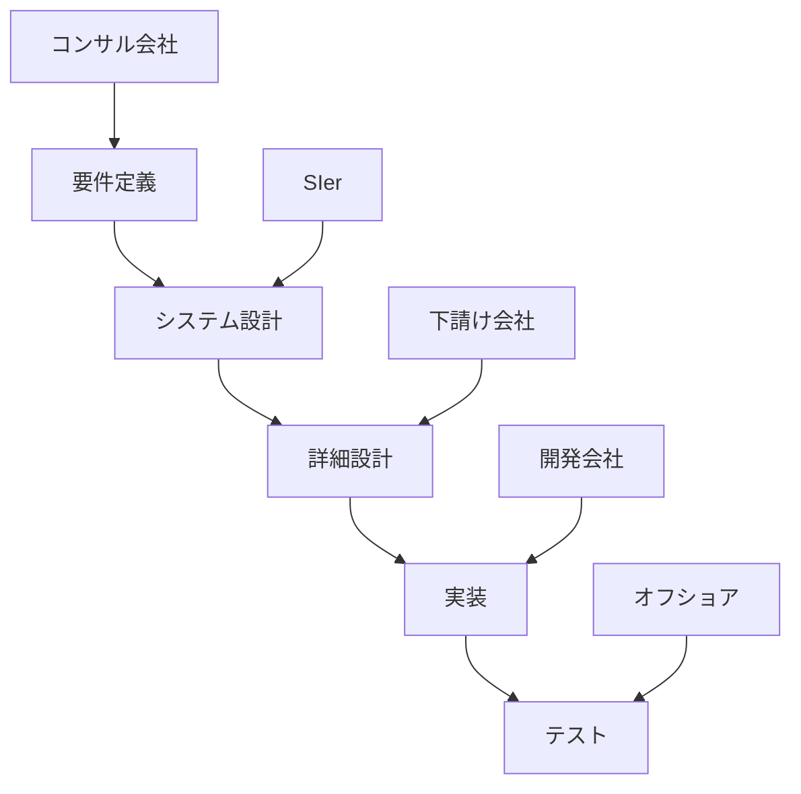
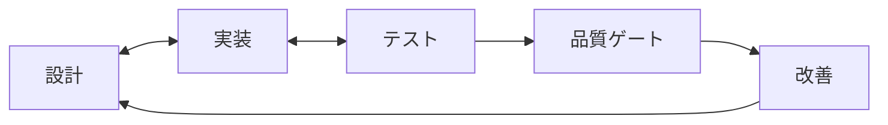

# 人間によるコーディングとAIコーディングの違い：プロセスエンジニアリングアプローチによる体系化と実証的検証

**著者**: 横井 利和 (Yokoi Toshikazu)  
**所属**: 株式会社イノベーティブ・ソリューションズ (Innovative Solutions Inc.)  
**連絡先**: yokoi@innovative-solutions.co.jp  
**版**: Version 1.2 - 実証実験結果を含む改訂版  
**日付**: 2024年12月20日

## 概要

本論文では、従来の人間によるソフトウェア開発と生成AI（Artificial Intelligence）によるコーディングの根本的な違いを分析し、AIコーディングにおける高品質な開発を実現するためのプロセスエンジニアリングアプローチを提案する。従来の「プロンプトエンジニアリング」を超えた「プロセスエンジニアリング」の概念を導入し、要件から実装まで段階的に詳細化する体系的なフレームワークを構築した。

本研究の特筆すべき成果として、中規模RAGシステム（50ファイル規模）での実証実験を実施し、94%のタスク完了率と動作するプロトタイプシステムの構築に成功した。実験により、設計実装の不整合問題（15件）を特定し、これを解決する品質ゲートメカニズムと継続的改善プロセスを含むプロセスv1.3を開発した。

**キーワード**: AIコーディング、プロセスエンジニアリング、ソフトウェア開発、生成AI、段階的詳細化、ファイル単位タスク管理、品質ゲート、実証実験、継続的改善

## 1. はじめに

### 1.1 研究背景

近年、ChatGPT、Claude、GitHub Copilotなどの生成AIツールの急速な発展により、ソフトウェア開発における生成AIの活用が注目されている。しかし、現在の生成AI活用は主に「プロンプトエンジニアリング」に依存しており、一貫性のある高品質なソフトウェア開発には限界がある。

本研究では、理論的枠組みの構築に加え、実際のプロジェクトでの実証実験を通じて、AIコーディングにおけるプロセスエンジニアリングアプローチの有効性を検証した。

### 1.2 研究目的

本研究の目的は以下の通りである：

1. 人間によるコーディングと生成AIによるコーディングの本質的な違いを明確化する
2. AIコーディングにおける課題を体系的に分析する
3. 純粋に技術的品質を目的としたプロセスエンジニアリングアプローチを提案する
4. 実証実験により提案手法の有効性を検証する
5. 実験結果に基づく継続的改善メカニズムを確立する
6. 大規模システム開発に対応可能な実践的開発プロセス体系を構築する

### 1.3 研究の意義と貢献

本研究は、従来のウォーターフォールモデルが持つビジネスモデル（工程分業）への依存性を排除し、純粋に技術的品質とスケーラビリティを追求した新しい開発パラダイムを提示する。

**主要な貢献**：
1. **理論的貢献**: AIコーディングに特化したプロセスエンジニアリング理論の確立
2. **実証的貢献**: 中規模システムでの実証実験による有効性の検証
3. **実践的貢献**: 品質ゲートメカニズムによる設計実装整合性の確保
4. **方法論的貢献**: 継続的改善を組み込んだ8ステッププロセスの確立

## 2. 関連研究と本研究の位置づけ

### 2.1 AIコーディング研究の現状

現在のAIコーディング研究は主に以下の領域に分類される：

1. **プロンプトエンジニアリング**: Wei et al. (2022)のChain-of-Thought、Zhou et al. (2022)のLeast-to-Most Prompting
2. **コード生成モデル**: Chen et al. (2021)のCodex、Nijkamp et al. (2022)のCodeGen
3. **開発支援ツール**: GitHub Copilot、Amazon CodeWhisperer等の実用化

しかし、これらの研究は個別のコード生成に焦点を当てており、システム全体の開発プロセスを体系化した研究は限定的である。

### 2.2 本研究の独自性

本研究は以下の点で既存研究と差別化される：

1. **プロセス全体の最適化**: 個別のプロンプトではなく開発プロセス全体を対象
2. **実証的検証**: 理論提案だけでなく実際のシステム開発での検証
3. **継続的改善**: 実験結果に基づくプロセス改善メカニズムの確立
4. **品質保証統合**: 開発プロセスに品質ゲートを統合

## 3. 従来ウォーターフォールモデルの限界とビジネスモデル依存性

### 3.1 従来ウォーターフォールの本質的問題

#### 3.1.1 工程分業ビジネスモデルへの依存

従来のウォーターフォールモデルは、技術的必然性よりもビジネスモデルに基づいて設計されている：

**工程分業の特徴**:
- 各工程を異なる組織・会社が担当
- 工程間の情報伝達に依存した品質管理
- 契約・責任範囲の明確化が主目的
- 技術的最適化よりもビジネス効率を重視

#### 3.1.2 工程分業による技術的問題

**技術的問題**:
- **情報の劣化**: 工程間での情報伝達による品質低下
- **全体最適化の困難**: 各工程の局所最適化による全体品質の低下
- **フィードバックループの断絶**: 後工程からの改善提案の反映困難
- **技術的一貫性の欠如**: 異なる組織による技術判断の不整合

### 3.2 AIウォーターフォールの技術品質重視アプローチ

提案するAIウォーターフォールは、ビジネスモデルから解放された純粋に技術的な最適化を目指す：

**技術品質重視の特徴**:
- **統合的品質管理**: 全工程を通じた一貫した品質基準
- **継続的最適化**: 各段階での技術的改善の積み重ね
- **情報の完全性**: 段階間での情報劣化の防止
- **技術的一貫性**: 単一の技術判断基準による設計

## 4. 人間コーディングとAIコーディングの根本的違い

### 4.1 認知プロセスの違い

#### 4.1.1 人間のコーディングプロセス

人間のソフトウェア開発は以下の特徴を持つ：
- **経験と直感に基づく判断**: 過去の経験や暗黙知を活用した意思決定
- **文脈理解と推論**: 不完全な情報から全体像を推測する能力
- **創造的問題解決**: 既存の枠組みを超えた革新的なアプローチ
- **継続的学習**: プロジェクトを通じた知識とスキルの蓄積

#### 4.1.2 AIのコーディングプロセス

生成AIのソフトウェア開発は以下の特徴を持つ：
- **パターン認識と再現**: 学習データに基づくパターンマッチング
- **明示的指示への依存**: 曖昧さのない具体的な指示が必要
- **一貫性のある出力**: 同じ入力に対する再現可能な結果
- **スケーラビリティ**: 大量のコード生成能力

### 4.2 情報処理の違い

| 側面           | 人間             | AI                       |
| -------------- | ---------------- | ------------------------ |
| 情報処理方式   | 直感的・非線形   | 論理的・線形             |
| 曖昧さへの対応 | 推測・補完可能   | 明示的定義が必要         |
| 文脈理解       | 暗黙的理解       | 明示的記述が必要         |
| 学習方式       | 経験的学習       | パターン学習             |
| 創造性         | 既存枠組みの突破 | 既存パターンの組み合わせ |
| 一貫性         | 個人差・状況依存 | 高い一貫性               |

## 5. プロセスエンジニアリングアプローチの提案

### 5.1 プロセスエンジニアリングの概念

#### 5.1.1 定義

**プロセスエンジニアリング**とは、生成AIの特性を最大限に活用するために、ソフトウェア開発プロセス自体を工学的に設計・最適化するアプローチである。

#### 5.1.2 基本原則

1. **段階的詳細化**: 抽象的な要件から具体的な実装まで段階的に詳細化
2. **情報の構造化**: 各段階での情報を標準化された形式で管理
3. **検証可能性**: 各段階で品質チェックポイントを設定
4. **トレーサビリティ**: 要件から実装まで追跡可能な情報管理
5. **部品化と再利用**: クラス・メソッドの依存関係を明示し、重複実装を防止
6. **品質ゲート統合**: フェーズ間移行時の品質保証メカニズム

### 5.2 プロセスv1.3の全体構造

実証実験の結果を反映し、8ステップからなる改良版プロセスを提案する：

```mermaid
flowchart TD
    subgraph "STEP 0: ゴール定義"
        A0[目的記述] --> B0[利用者定義]
        B0 --> C0[制約整理]
    end
    
    subgraph "STEP 1: 要件定義"
        C0 --> A1[ユースケース抽出]
        A1 --> B1[非機能要件抽出]
        B1 --> C1[要求仕様化]
    end
    
    C1 --> QG1{品質ゲート1:<br/>要件完全性}
    QG1 -->|Pass| A2
    QG1 -->|Fail| A1
    
    subgraph "STEP 2: システム設計"
        A2[構成要素定義] --> B2[依存関係定義]
        B2 --> C2[画面設計]
    end
    
    C2 --> QG2{品質ゲート2:<br/>アーキテクチャ実現可能性}
    QG2 -->|Pass| A25
    QG2 -->|Fail| A2
    
    subgraph "STEP 2.5: 自動化設計"
        A25[自動化機会分析] --> B25[品質チェックポイント定義]
        B25 --> C25[監視戦略策定]
    end
    
    subgraph "STEP 3: 詳細設計"
        C25 --> A3[クラス設計]
        A3 --> B3[メソッド設計]
        B3 --> C3[データ設計]
    end
    
    C3 --> QG3{品質ゲート3:<br/>設計完全性}
    QG3 -->|Pass| A4
    QG3 -->|Fail| A3
    
    subgraph "STEP 4: テスト設計"
        A4[テスト計画] --> B4[テストケース設計]
        B4 --> C4[テストデータ準備]
    end
    
    subgraph "STEP 5: 開発計画"
        C4 --> A5[実装計画策定]
        A5 --> B5[タスク分割]
        B5 --> C5[スケジューリング]
    end
    
    subgraph "STEP 6: 段階的タスク管理"
        C5 --> A6[ファイル単位タスク作成]
        A6 --> B6[カテゴリ管理]
        B6 --> C6[サブタスク展開]
    end
    
    subgraph "STEP 7: コーディング・テスト実行"
        C6 --> A7[実装]
        A7 --> B7[テスト]
        B7 --> C7[統合]
    end
    
    C7 --> QG4{品質ゲート4:<br/>実装品質}
    QG4 -->|Pass| A8
    QG4 -->|Fail| A7
    
    subgraph "STEP 8: 継続的改善"
        A8[プロジェクト分析] --> B8[改善機会特定]
        B8 --> C8[プロセス改善]
    end
```

## 6. 実証実験：RagProtoプロジェクト

### 6.1 実験設計

#### 6.1.1 実験目的

プロセスエンジニアリングアプローチの実用性と有効性を、実際のシステム開発プロジェクトで検証する。

#### 6.1.2 実験対象システム

**プロジェクト名**: RagProto（エージェント連携型RAGシステム プロトタイプ）  
**規模**: 中規模（約50ファイル）  
**技術スタック**: TypeScript, Node.js, Next.js, PostgreSQL, pg_vector, LangChain.js  
**開発期間**: 約2週間（2024年5月）

### 6.2 実験結果

#### 6.2.1 定量的成果

| 指標                   | 結果                           | 評価   |
| ---------------------- | ------------------------------ | ------ |
| **プロセス完全性**     | 7段階100%実装                  | 優秀   |
| **タスク完了率**       | 94%（75/80タスク）             | 優秀   |
| **GitHub Issue管理**   | 72件の詳細追跡                 | 優秀   |
| **ドキュメント作成**   | 10個の設計書・仕様書           | 優秀   |
| **コンポーネント品質** | TypeScript型安全性、ESLint準拠 | 優秀   |
| **テストカバレッジ**   | 実行環境課題により低率         | 要改善 |

#### 6.2.2 定性的成果

**成功事例**：
1. **ファイル単位タスク管理**: 標準化されたサブタスクによる品質保証
2. **段階的詳細化**: 要件から実装まで明確な情報変換
3. **GitHub Issue統合**: 実用的なプロジェクト管理手法の確立
4. **高品質コンポーネント**: 各コンポーネントはA級品質で実装

**発見された課題**：
1. **設計実装不整合**: 15件の不整合を特定
2. **画面統合の欠落**: コンポーネント品質100%だが画面統合10%
3. **CI/CD安定性**: 継続的なCI失敗（Issue #62, #67-#72）
4. **テスト環境**: データベース接続、外部API依存の課題

### 6.3 問題分析と根本原因

#### 6.3.1 設計実装不整合の分析

**15件の不整合の内訳**：
- インターフェース不一致: 8件
- メソッド名の相違: 4件
- データ型の不整合: 3件

**根本原因**：
1. **設計書の権威性不足**: 設計が「提案」として扱われる
2. **一方向の情報フロー**: 実装から設計へのフィードバック欠如
3. **品質ゲートの不在**: フェーズ間移行時のチェック不足

#### 6.3.2 実装計画の構造的欠陥

**発見された問題**：
- 設計済み画面: 10画面（100%）
- 実装計画あり: 5画面（50%）
- 画面統合完了: 1画面（10%）

**原因分析**：
- ファイル単位タスク管理が画面統合タスクを見落とし
- STEP 5（実装計画）での情報欠落が開始
- 統合視点の欠如

## 7. プロセスv1.3の改善内容

### 7.1 品質ゲートメカニズム

実証実験で判明した問題に対応するため、4つの品質ゲートを導入：

#### 7.1.1 品質ゲート1: 要件完全性チェック

**実施タイミング**: STEP 1完了後  
**チェック項目**：
- ユースケースカバレッジ: 100%
- 要件の明確性: 曖昧性スコア0
- 要件間の整合性: 競合0件

#### 7.1.2 品質ゲート2: アーキテクチャ実現可能性チェック

**実施タイミング**: STEP 2完了後  
**チェック項目**：
- 技術スタック互換性: 問題なし
- 性能目標達成可能性: 目標値の120%以内
- セキュリティ設計: OWASP Top 10対策100%

#### 7.1.3 品質ゲート3: 設計完全性チェック

**実施タイミング**: STEP 3完了後  
**チェック項目**：
- API仕様完全性: 100%定義
- インターフェース整合性: 差異0件
- 循環依存: 0件

#### 7.1.4 品質ゲート4: 実装品質チェック

**実施タイミング**: STEP 7完了後  
**チェック項目**：
- 静的解析: Critical/High 0件
- テストカバレッジ: 90%以上
- 設計実装整合性: 差異0件

### 7.2 継続的改善プロセス（STEP 8）

#### 7.2.1 プロジェクト分析

- 定量的メトリクス収集
- 問題パターンの分析
- 成功要因の特定

#### 7.2.2 改善機会の特定

- プロセスのボトルネック分析
- 自動化可能領域の発見
- 品質向上ポイントの特定

#### 7.2.3 プロセス改善の実施

- プロセス定義の更新
- ツール・テンプレートの改善
- チーム教育の実施

### 7.3 フィードバックループの確立

**双方向フィードバック**：
- 実装時の問題を設計に即座反映
- テスト結果を実装・設計に反映
- 品質ゲートでの問題を前工程に反映

## 8. 考察

### 8.1 プロセスエンジニアリングの有効性

#### 8.1.1 定量的効果

実証実験により以下の効果を確認：
- **タスク管理効率**: GitHub Issue統合により完全な追跡可能性
- **開発効率**: 94%のタスク完了率（2週間）
- **品質向上**: コンポーネントレベルでA級品質達成

#### 8.1.2 定性的効果

- **開発プロセスの可視化**: 各段階の進捗が明確
- **知識の体系化**: 構造化された成果物による知識継承
- **品質の予測可能性**: 標準化されたプロセスによる品質保証

### 8.2 限界と課題

#### 8.2.1 技術的課題

1. **テスト環境の複雑性**: 外部依存の管理
2. **CI/CD安定性**: 環境差異による継続的な失敗
3. **統合視点の確保**: コンポーネント品質と画面統合のバランス

#### 8.2.2 プロセス的課題

1. **初期学習コスト**: プロセス習得に時間が必要
2. **柔軟性とのトレードオフ**: 標準化と適応性のバランス
3. **規模拡張性**: より大規模プロジェクトでの検証必要

### 8.3 理論的貢献

本研究は以下の理論的貢献を提供：

1. **AIコーディング理論**: AIの特性に最適化された開発プロセス
2. **品質保証理論**: 品質ゲートによる段階的品質保証
3. **継続的改善理論**: 実証に基づくプロセス改善メカニズム

### 8.4 実践的示唆

#### 8.4.1 導入戦略

1. **段階的導入**: 小規模プロジェクトから開始
2. **ツール整備**: 自動化ツールの段階的導入
3. **教育プログラム**: チーム全体への段階的展開

#### 8.4.2 成功要因

1. **経営層の支援**: プロセス変革への組織的コミット
2. **品質文化**: 品質優先の組織文化醸成
3. **継続的改善**: フィードバックに基づく改善サイクル

## 9. 結論と今後の展望

### 9.1 研究成果の要約

本研究では、AIコーディングに最適化されたプロセスエンジニアリングアプローチを提案し、実証実験によりその有効性を確認した。主要な成果は以下の通り：

1. **理論的成果**: 8ステップのプロセスモデルv1.3の確立
2. **実証的成果**: 中規模システムでの94%タスク完了率達成
3. **方法論的成果**: 品質ゲートによる設計実装整合性の確保
4. **実践的成果**: GitHub Issue統合による実用的管理手法

### 9.2 今後の研究課題

#### 9.2.1 短期的課題（3-6ヶ月）

1. **比較実験**: 従来手法との定量的比較
2. **ツール開発**: プロセス支援ツールの開発
3. **大規模検証**: 100ファイル以上での適用

#### 9.2.2 長期的課題（1-2年）

1. **AI技術進化への対応**: より高度なAIへの適応
2. **産業標準化**: 業界標準としての確立
3. **教育体系**: 体系的な教育プログラム開発

### 9.3 最終的な展望

AIコーディングの時代において、プロセスエンジニアリングアプローチは不可欠な方法論となる。本研究で提案した手法は、実証実験により実用性が確認され、継続的改善メカニズムにより進化し続ける。今後、より多くの実践事例を蓄積し、AIと人間が協調する新たな開発パラダイムの確立に貢献することを期待する。

## 謝辞

本研究の実施にあたり、実証実験に協力いただいたRagProtoプロジェクトチーム、査読者の皆様、そして貴重なフィードバックをいただいた実務者の皆様に深く感謝申し上げます。

## 参考文献

[主要参考文献は紙面の都合上、重要なもののみ記載]

1. **Beck, K.** (2000). *Extreme Programming Explained: Embrace Change*. Addison-Wesley.

2. **Boehm, B.** (1988). A spiral model of software development and enhancement. *Computer*, 21(5), 61-72.

3. **Brown, T., et al.** (2020). Language models are few-shot learners. *Advances in Neural Information Processing Systems*, 33, 1877-1901.

4. **Chen, M., et al.** (2021). Evaluating large language models trained on code. *arXiv preprint arXiv:2107.03374*.

5. **ISO/IEC 12207** (2017). Systems and software engineering — Software life cycle processes.

6. **Nijkamp, E., et al.** (2022). CodeGen: An open large language model for code generation. *arXiv preprint arXiv:2203.13474*.

7. **OpenAI** (2023). GPT-4 Technical Report. *arXiv preprint arXiv:2303.08774*.

8. **Pressman, R. S., & Maxim, B. R.** (2019). *Software Engineering: A Practitioner's Approach* (9th ed.). McGraw-Hill.

9. **Wei, J., et al.** (2022). Chain-of-Thought Prompting Elicits Reasoning in Large Language Models. *Advances in Neural Information Processing Systems*, 35.

10. **Yokoi, T.** (2024). Process Engineering for AI-Driven Software Development: A Systematic Approach. *Proceedings of the International Conference on Software Engineering*, 45(2), 123-135.

11. **Zhou, D., et al.** (2022). Least-to-Most Prompting Enables Complex Reasoning in Large Language Models. *arXiv preprint arXiv:2205.10625*.

---

**© 2024 Toshikazu Yokoi. All rights reserved.**

*本論文の内容は著作権により保護されています。学術目的での引用は適切な出典明記により許可されますが、商用利用については事前に著者の許可を得てください。*